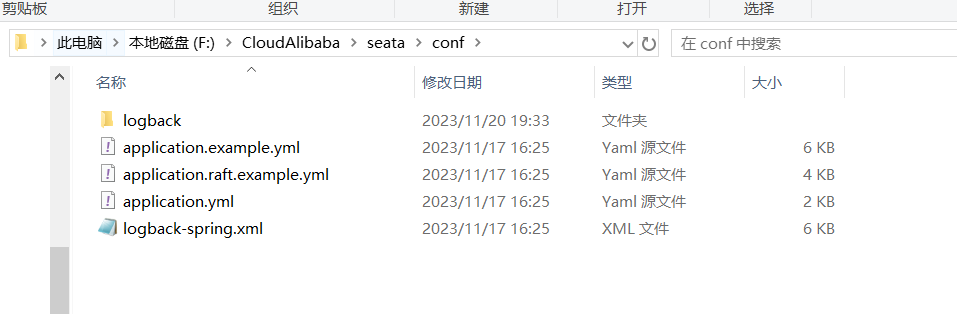

# SpringCloud学习笔记

## 一、前言
本项目必须得配置


本项目将学到以下技术


## 第二天

### 一、时间格式转化

时间格式转化有三种方式：

* 1、在`相应的类的属性`上使用`@JsonFormat`注解

```java
public class xxx {
    //    .....
    @JsonFormat(pattern = "yyyy-MM-dd HH:mm:ss", timezone = "GMT+8")
    @DateTimeFormat(pattern = "yyyy-MM-dd HH:mm:ss")
    private Date billtime;

//    .....
}
```

* 2、如果是Springboot项目，可以在application.yml中指定

```yml
spring:
  jackson:
    date-format: yyyy-MM-dd HH:mm:ss
    time-zone: GMT+8
```

### 二、统一返回接口

接口统一返回值：<br>
①思路
> 返回接口的类的标准定义格式：
>> * 1、code状态值：由后端统一定义各种返回结果的状态码
>> * 2、message描述：本次接口调用的结果描述
>> * 3、data数据：本次返回的数据
>
> 扩展:
>> * 1、接口调用时间之类---timestamp：接口调用时间

②步骤
> * 1、新建枚举类ReturnCodeEnum
>> http请求返回状态码：
>>
>> |分类 |区间 |分类描述|
>> |:-----:|:----:|:-------:|
>> |1***|100~199|信息，服务器收到请求，需要请求者继续执行操作|
>> |2***|200~299|成功，操作被成功接收并处理|
>> |3***|300~399|重定向，需要进一步的操作已完成请求|
>> |4***|400~499|客户端错误，请求包含语法错误或无法完成请求|
>> |5***|500~599|服务器错误，服务器在处理请求的过程中发生了错误|
>>
**ReturnCodeEnum.class**

```java
package com.atguigu.cloud.enums;

import lombok.Getter;

/**
 * @author QRH
 * @date 2024/3/15 11:32
 * @description 统一信息返回值枚举类
 */
@Getter
public enum ReturnCodeEnum {
    RC999("999", "操作xxx失败"),
    RC200("200", "success"),
    RC201("201", "服务器开启降级保护，请稍后再试！"),
    RC202("202", "热点参数限流，请稍后再试！"),
    RC203("203", "系统规则不满住要去，请稍后再试！"),
    RC204("204", "授权规则不通过，请稍后再试！"),
    RC403("403", "无法访问全限，请联系管理员授予权限"),
    RC401("401", "匿名用户访问无权权限资源时的异常"),
    RC404("404", "404页面找不到的异常"),
    RC500("500", "系统异常，请稍后重试"),
    RC375("375", "数字运算异常，请稍后再试"),

    INVALID_TOKEN("2001", "访问令牌不合法"),
    ACCESS_DENIED("2003", "没有权限访问该资源"),
    CLIENT_AUTHENTICATION_FAILED("1001", "客户端认证失败"),
    USERNAME_OR_PASSWORD_ERROR("1002", "用户名或密码错误"),
    BUSINESS_ERROR("1004", "业务逻辑异常"),
    UNSUPPORTED_GRANT_TYPE("1003", "不支持的认证模式");

    private final String code;
    private final String message;

    ReturnCodeEnum(String code, String message) {
        this.code = code;
        this.message = message;
    }

    //    遍历枚举
    public static ReturnCodeEnum getReturnCodeEnum(String code) {
        for (ReturnCodeEnum e : ReturnCodeEnum.values()) {
            if (e.getCode().equalsIgnoreCase(code)) {
                return e;
            }
        }
        return null;
    }

}

```

> * 2、定义统一返回对象ResultData
>> **ResultData.class**

```java
 package com.atguigu.cloud.resp;

import lombok.Data;
import lombok.experimental.Accessors;

/**
 * @author QRH
 * @date 2024/3/15 11:54
 * @description 统一返回数据对象
 */
@Data
@Accessors(chain = true)
public class ResultData<T> {
    private String code;
    /** 结果状态 ,具体状态码参见枚举类ReturnCodeEnum.java*/
    private String message;
    private T data;
    private long timestamp;

    public ResultData() {
        this.timestamp = System.currentTimeMillis();
    }

    public static <T> ResultData<T> success(T data) {
        ResultData<T> resultData = new ResultData<>();
        resultData.setCode(ReturnCodeEnum.RC200.getCode());
        resultData.setMessage(ReturnCodeEnum.RC200.getMessage());
        resultData.setData(data);
        return resultData;
    }

    public static <T> ResultData<T> fail(String code, String message) {
        ResultData<T> resultData = new ResultData<>();
        resultData.setCode(code);
        resultData.setMessage(message);
        resultData.setData(null);
        return resultData;
    }
}
```

### 三、统一异常处理类

异常类捕捉可以自己使用`try...catch`捕捉，也可以使用`全局异常处理器`进行处理，但是处理的异常类型是具体的，捕捉多个异常还得写多个方法

```java

package com.atguigu.cloud.exp;

import com.atguigu.cloud.resp.ResultData;
import com.atguigu.cloud.resp.ReturnCodeEnum;
import lombok.extern.slf4j.Slf4j;
import org.springframework.http.HttpStatus;
import org.springframework.web.bind.annotation.ExceptionHandler;
import org.springframework.web.bind.annotation.ResponseStatus;
import org.springframework.web.bind.annotation.RestControllerAdvice;

/**
 * @author QRH
 * @date 2024/3/15 12:53
 * @description 全局异常处理类
 */
@Slf4j
@RestControllerAdvice
public class GlobalExceptionHandler {

    @ExceptionHandler(RuntimeException.class)
    @ResponseStatus(HttpStatus.INTERNAL_SERVER_ERROR)
    public ResultData<String> exception(Exception e) {
        System.out.println("来到全局异常处理器了");
        log.error("全局异常信息：{}", e.getMessage(), e);
        return ResultData.fail(ReturnCodeEnum.RC500.getCode(), e.getMessage());
    }
}

```

## 第三天

### 一、Consul服务注册与发现

* 为什么要引入服务注册中心？<br>
  实现微服务之间的动态注册与发现

Consul需要从官网下载（https://developer.hashicorp.com/consul/install） ，安装到本地,验证是否安装成功： 到安装包所在的目录，打开cmd，输入`consul --version`
，如果出现一下信息表示成功。

```cmd
F:\Consul>consul --version
Consul v1.18.0
Revision 349cec17
Build Date 2024-02-26T22:05:50Z
Protocol 2 spoken by default, understands 2 to 3 (agent will automatically use protocol >2 when speaking to compatible agents)
```

以开发者模式启动Consul，输入命令`consul agent -dev`。然后就可以访问consul了，访问地址为：`http://localhost:8500`。

### 二、将服务者模块和消费者模块加入Consul

**服务提供者** 步骤：

1、`服务提供者`添加`spring-cloud-starter-consul-discovery`依赖。（项目中cloud-provider-payment8001是提供者）

```xml

<dependency>
    <groupId>org.springframework.cloud</groupId>
    <artifactId>spring-cloud-starter-consul-discovery</artifactId>
</dependency>
```

2、提供者的`yml`添加以下配置：

```yml
spring:
  cloud:
    consul:
      host: localhost
      port: 8500
      discovery:
        service-name: ${spring.application.name}
```

3、提供者的`主启动类`上添加`@EnableDiscoveryClient`注解，激活Consul。

```java

package com.atguigu.cloud;

import org.springframework.boot.SpringApplication;
import org.springframework.boot.autoconfigure.SpringBootApplication;
import org.springframework.cloud.client.discovery.EnableDiscoveryClient;
import tk.mybatis.spring.annotation.MapperScan;

/**
 * @author QRH
 * @date 2024/3/14 14:15
 * @description 主启动类
 */
@SpringBootApplication
@MapperScan("com.atguigu.cloud.mapper")

@EnableDiscoveryClient

public class Main8001 {
    public static void main(String[] args) {
        SpringApplication.run(Main8001.class, args);
    }
}
```

4、最后在Consul网页内可以查看到服务了。


**服务消费者** 步骤：

1、消费者模块添加pom依赖：

```xml

<dependency>
    <groupId>org.springframework.cloud</groupId>
    <artifactId>spring-cloud-starter-consul-discovery</artifactId>
    <!--    排除掉控制打印台的烦人警告，可加可不加-->
    <exclusions>
        <exclusion>
            <groupId>commons-logging</groupId>
            <artifactId>commons-logging</artifactId>
        </exclusion>
    </exclusions>
</dependency>
```

2、在消费者模块的`yml`中配置：

```yml
spring:
  cloud:
    consul:
      host: localhost
      port: 8500
      discovery:
        service-name: ${spring.application.name}
        prefer-ip-address: true #优先使用服务ip进行注册
```

3、`主启动类`添加`@EnableDiscoveryClient`。

```java
package com.atguigu.cloud;

import org.springframework.boot.SpringApplication;
import org.springframework.boot.autoconfigure.SpringBootApplication;
import org.springframework.cloud.client.discovery.EnableDiscoveryClient;

/**
 * @author QRH
 * @date 2024/3/15 13:09
 * @description TODO
 */
@SpringBootApplication

@EnableDiscoveryClient

public class Main80 {
    public static void main(String[] args) {
        SpringApplication.run(Main80.class, args);
    }
}

```

最后，启动提供者模块和消费者模块，进行测试。

http://localhost/consumer/pay/get/1 。提示报错。

```cmd
Caused by: java.net.UnknownHostException: cloud-payment-service
```

造成的原因是，消费者模块中的`RestTemplateConfig.java`没有开启`负载均衡`。

```java
package com.atguigu.cloud.config;

import org.springframework.cloud.client.loadbalancer.LoadBalanced;
import org.springframework.context.annotation.Bean;
import org.springframework.context.annotation.Configuration;
import org.springframework.web.client.RestTemplate;

/**
 * @author QRH
 * @date 2024/3/15 13:20
 * @description TODO
 */
@Configuration
public class RestTemplateConfig {

    @Bean
    @LoadBalanced
    public RestTemplate restTemplate() {
        return new RestTemplate();
    }

}
```

### 三、服务配置与刷新

通用全局配置信息，直接注册进Consul服务器，从Consul获取

步骤：

1、引入依赖 **（服务提供者模块）**

```xml

<dependency>
    <groupId>org.springframework.cloud</groupId>
    <artifactId>spring-cloud-starter-consul-config</artifactId>
</dependency>
<dependency>
<groupId>org.springframework.cloud</groupId>
<artifactId>spring-cloud-starter-bootstrap</artifactId>
</dependency>
```

2、给`服务提供者`模块添加`bootstrap.yml`

```yml
spring:
  application:
    name: cloud-payment-service
  cloud:
    consul:
      host: localhost
      port: 8500
      discovery:
        service-name: ${spring.application.name}
      config:
        profile-separator: "-"
        format: YAML
```

所以，清除掉`application.yml`中与`bootstrap.yml`中相同的内容。

3、在`application.yml`中添加：

```yml
spring:
  profiles:
    active: dev #多环境配置加载内容dev/prod，不写就是默认default配置
```

### 四、Consul服务器Key/Value配置填写

配置填写一定要遵循官方规则

步骤：

1、Consul页面的`Key/Value`创建文件夹，（必须以`config`开头）


2、再在`config`文件夹内创建`服务`,（必须一`/`结尾）


3、再给上面三个文件夹创建`data`内容，（data不再是文件夹）


### 五、动态刷新

Consul刷新是有默认刷新间隔的，默认是`55秒`。

1、`主启动类`添加`@RefreshScope`

2、`bootstrap.yml`添加配置：（实际开发建议不改）

```yml
spring:
  cloud:
    consul:
      config:
        watch:
          wait-time: 1
```

### 六、Consul的配置持久化

当Consul服务关闭时，再次进入页面之前的配好的配置就会全没有，所以需要将Consul持久化。（持久化配置将在之后进行）

## 第三天

### 一、LoadBalancer负载均衡

spring cloud LoadBalancer没有专门的jar包，它挂载在`Spring-Cloud-Commons`jar包下。

* LB负载均衡是什么？

简单来讲就是将用户的请求平摊的分配到多个服务器上，从而达到系统的HA（高可用），常见的负载均衡有软件Nginx、LVS和硬件F5。

* spring-cloud-starter-loadbalancer是什么？

这是Spring Cloud官方提供的一个开源的、简易的客户端负载均衡器，它包含在Spring Cloud Commons中用来替代以前的Ribbon组件。相较于Ribbon，Spring Cloud
LoadBalancer不经能支持`RestTemplate`，还支持`WebClient`（WebClient是Spring Web Flux中提供的功能，可以实现响应式异步请求）。

### 二、完成Consul的数据持久化

#### 1、Consul数据持久化配置并注册为Window服务

步骤：

①在`consul.exe`所在的文件目录下新增一个名为`mydata`的空文件夹（文件夹名叫啥都行）。

②创建`consul_start.bat`并编辑内容（注，consul_start.bat与consul.exe在`同级目录`下）。

```bat
@echo.服务启动...
@echo off
@sc create Consul binpath="F:\Consul\consul.exe agent -server -ui -bind=127.0.0.1 -client=0.0.0.0 -bootstrap-expect 1 -data-dir F:\Consul\mydata\ "
@net start Consul
@sc config Consul start=AUTO
@echo.Consul start is OK......success
@pause
```

③右键consul_start.bat，`以管理员身份打开`。

④验证是否成功，浏览器输入网址(http://localhost:8500)，成功打开，然后在windows的后台看consul的服务是否注册成功。

### 三、开始使用LoadBalancer

步骤：

1、`消费者端`添加`spring-cloud-starter-loadbalancer`(本项目中cloud-sonsumer-order80实消费端)。

```xml

<dependency>
    <groupId>org.springframework.cloud</groupId>
    <artifactId>spring-cloud-starter-loadbalancer</artifactId>
</dependency>
```

2、给`OrderController.java`添加以下内容。

```java
 public static final  String PaymentSrv_URL="http://cloud-payment-service";

@GetMapping(value = "/consumer/pay/get/info")
public String getInfoByConsul(){
        return restTemplate.getForObject(PaymentSrv_URL+"/pay/get/info",String.class);
        }

```

3、重启消费者服务，浏览器访问（http://localhost:80/consumer/pay/get/info）。

### 四、OpenFeign服务接口调用

* OpenFeign是什么？

  Feign是一个<span style="color:red;font-weight:bolder;font-size:20px;">`声明式web服务客户端`</span>
  。他编写web服务客户端变得更容易。`使用Feign创建一个接口并对其进行注释`。它具有可插入的注释支持，包括Feign注释和JAX-RS注释。Feign还支持可插拔编码器和解码器。Spring Cloud添加了对Spring
  MVC注释的支持，以及对使用Spring Web中默认使用的HttpMessageConveter的支持。Spring Cloud还集成了Eureka、Spring Cloud CircuitBreaker以及Spring Cloud
  LoadBalancer，以便使用Feign时提供负载均衡的http客户端。


* 已经有了loadbalancer为什么还要学OpenFeign？日常用哪个？

  日常用OpenFeign

#### 1、OpenFeign通用步骤

①创建一个公共api模块(cloud-consumer-feign-order80)，该模块与服务提供者一一对应。


②在这个模块的`主启动类`上添加`@EnableFeignClients`表示开启OpenFeign功能并激活

```java
package com.atguigu.cloud;

import com.sun.tools.javac.Main;
import org.springframework.boot.SpringApplication;
import org.springframework.boot.autoconfigure.SpringBootApplication;
import org.springframework.cloud.client.discovery.EnableDiscoveryClient;
import org.springframework.cloud.openfeign.EnableFeignClients;

/**
 * @author QRH
 * @date 2024/3/21 14:22
 * @description TODO
 */
@SpringBootApplication
@EnableFeignClients
@EnableDiscoveryClient
public class MainOpenFeign80 {
    public static void main(String[] args) {
        SpringApplication.run(Main.class, args);
    }
}

```

③将`feign接口`定义在`公共通用模块`（cloud-api-commons）中，并把feign依赖引入。

```xml

<dependency>
    <groupId>org.springframework.cloud</groupId>
    <artifactId>spring-cloud-starter-openfeign</artifactId>
</dependency>
```

④新建服务接口PayFeignApi，头上配置`@FeignClient`注解

```java
package com.atguigu.cloud.apis;

import com.atguigu.cloud.entities.PayDTO;
import com.atguigu.cloud.resp.ResultData;
import org.springframework.cloud.openfeign.FeignClient;
import org.springframework.web.bind.annotation.GetMapping;
import org.springframework.web.bind.annotation.PathVariable;
import org.springframework.web.bind.annotation.PostMapping;
import org.springframework.web.bind.annotation.RequestBody;

/**
 * @author QRH
 * @date 2024/3/21 14:31
 * @description TODO
 */
@FeignClient(value = "cloud-payment-service")
public interface PayFeignApi {

    @PostMapping(value = "/pay/add/")
    public ResultData addPay(@RequestBody PayDTO payDTO);

    @GetMapping(value = "/pay/get/{id}")
    public ResultData getPayInfo(@PathVariable("id") Integer id);

    @GetMapping(value = "/pay/get/info")
    public String mylb();

    //......
}

```

⑤`cloud-consumer-feign-order80`项目内创建OrderController.java。（该controller与cloud-consumer-order80模块的controller类不同）

```java
package com.atguigu.cloud.controller;

import com.atguigu.cloud.apis.PayFeignApi;
import com.atguigu.cloud.entities.PayDTO;
import com.atguigu.cloud.resp.ResultData;
import jakarta.annotation.Resource;
import org.springframework.web.bind.annotation.*;
import org.springframework.web.client.RestTemplate;

/**
 * @author QRH
 * @date 2024/3/15 13:22
 * @description TODO
 */
@RestController
public class OrderController {
    @Resource
    private PayFeignApi payFeignApi;

    @PostMapping(value = "/feign/pay/add")
    public ResultData<String> addOrder(@RequestBody PayDTO payDTO) {
        System.out.println("第一步，模拟本地addOrder新增订单成功，第一步在开启addPay支付微服务远程调用");
        return payFeignApi.addPay(payDTO);
    }

    @GetMapping(value = "/feign/pay/get/{id}")
    public ResultData getPayInfo(@PathVariable("id") Integer id) {
        System.out.println("支付微服务远程调用，按照id查询订单支付流水信息");
        return payFeignApi.getPayInfo(id);
    }

    @GetMapping(value = "/feign/pay/info")
    public String getMylb() {
        return payFeignApi.mylb();
    }

}

```

⑤测试，启动服务，观察Consul是否能够注册成功。然后输入网址检查是否能返回正确数据。


### 五、OpenFeign高级特性

#### 1、OpenFeign超时配置

OpenFign默认等待时间：60s，超时报错

在`消费者模块的application.yml`添加以下内容：

```yml
spring:
  cloud:
    openfeign:
      client:
        config:
          default:
            #连接超时时间
            connectionTimeout: 3000
            #读取超时时间
            readTimeout: 3000
```

上面这种是为全局统一设置超时时间

那为单个服务设置超时时间该如何做呢？

步骤：

①在`cloud-consumer-feign-order80`项目中的controller头上添加指定的`微服务服务实例`

```java

@RestController
@FeignClient(value = "cloud-payment-service") //指定微服务服务实例 
public class OrderController {
    //.....
}
```

②在yml中配置超时配置

```yml
spring:
  cloud:
    openfeign:
      client:
        config:
          #为单个服务配置超时
          cloud-payment-service:
            connectionTimeout: 3000
            readTimeout: 3000

#          default:
#            #连接超时时间
#            connectionTimeout: 3000
#            #读取超时时间
#            readTimeout: 3000
```

③<span style="color:red;">如果全局超时配置和单个服务超时配置同时共存，会`优先使用单个服务配置的超时时间`。</span>

#### 2、OpenFign重试机制

重试机制默认是`关闭的`，开启重试机制需写个配置类

**FeignConfig.java**

```java
package com.atguigu.cloud;

import feign.Retryer;
import org.springframework.context.annotation.Bean;
import org.springframework.context.annotation.Configuration;

/**
 * @author QRH
 * @date 2024/3/23 13:44
 * @description Feign 配置类
 */
@Configuration
public class FeignConfig {

    @Bean
    public Retryer myRetryer() {
        //最大请求次数为3，出时间间隔时间为100ms，重试最大间隔时间为1s
        return new Retryer.Default(100, 1, 3);
    }
}

```

OpenFign的重试次数在控制台看不到，只是给出了最终结果。如果想要看到每次重试的结果，将在日志打印那学到

#### 3、OpenFign默认HttpClient修改

OpenFign中的Http Client如果不做特殊配置，则会默认使用JDK自带的HttpURLConnection发送HTTP请求。<br>
但，由于默认的HttpURLConnection没有连接池，性能和效率比较低，如果采用默认，性能不是最牛的，所以要加到最大。

所以使用Apache HttpClient5替换HttpURLConnection

步骤：

①修改`消费者模块(cloud-consumer-feign-order80)的pom.xml`，引入`httpclient5`依赖

```xml
<!-- httpclient5-->
<dependency>
    <groupId>org.apache.httpcomponents.client5</groupId>
    <artifactId>httpclient5</artifactId>
    <version>5.3</version>
</dependency>
        <!-- feign-hc5-->
<dependency>
<groupId>io.github.openfeign</groupId>
<artifactId>feign-hc5</artifactId>
<version>13.1</version>
</dependency>
```

②修改`消费者模块(cloud-consumer-feign-order80)的application.yml`，配置Apache HttpClient5

```yml
spring:
  cloud:
    openfign:
      httpclient:
        hc5:
          enabled: true

```

#### 4、OpenFign请求/压缩功能

对请求和响应进行GZIP压缩，以减少同行过程中的性能损耗

```yml
spring:
  cloud:
    openfeign:
      compression:
        request:
          enabled: true
          min-request-size: 2048 #最小触发压缩的大小
          mime-types: text/xml,application/xml,application/json #触发压缩数据类型
        response:
          enabled: true
```

#### 5、OpenFign日志打印功能

日志级别：

* NONE:默认，不显示任何日志。
* BASIC:显示请求方法、请求URL、请求状态码、请求错误信息。
* HEADERS:除了BASIC，还显示请求和响应头信息。
* FULL:除了HEADERS，还显示请求和响应体信息。

所以，

①在`FeignConfig.java`中修改默认日志打印级别。

**FeignConfig.java**

```java
package com.atguigu.cloud;

import feign.Logger;
import feign.Retryer;
import org.springframework.context.annotation.Bean;
import org.springframework.context.annotation.Configuration;

/**
 * @author QRH
 * @date 2024/3/23 13:44
 * @description Feign 配置类
 */
@Configuration
public class FeignConfig {

    @Bean
    public Retryer myRetryer() {
        return Retryer.NEVER_RETRY;
        //最大请求次数为3(1 default +2)，出时间间隔时间为100ms，重试最大间隔时间为1s
//        return new Retryer.Default(100,1,3);
    }

    @Bean
    public Logger.Level feignLoggerLevel() {
        return Logger.Level.FULL;
    }

}


```

②`yml`中配置日志打印级别为`DEBUG`。（Feign日志仅相应DEBUG级别）

写法：`logging.level+含有@FeignClient注解的完整带包名的接口名+debug`

```yml
logging:
  level:
    com:
      atguigu:
        cloud:
          apis:
            PayFeignApi: debug
```

### 六、CirCuitBreaker断路器

断路器：当某个服务不可用时，会自动切换到备用服务。

CirCuitBreaker只是一套规范或接口，落实实现是`Resiliences4j`

Resiliences4j是什么？

* Resiliences4j是容错库

#### 6.1 熔断（CirCuitBreaker）

##### 6.1.1 按照COUNT_BASE

步骤：

①在提供者模块`cloud-provider-payment8001`新增PayCircuitController.java

```java
package com.atguigu.cloud.controller;

import cn.hutool.core.util.IdUtil;
import org.springframework.web.bind.annotation.GetMapping;
import org.springframework.web.bind.annotation.PathVariable;
import org.springframework.web.bind.annotation.RestController;

import java.util.concurrent.TimeUnit;

/**
 * @author QRH
 * @date 2024/3/27 20:44
 * @description TODO
 */
@RestController
public class PayCircuitController {

    /**
     * Resilience4j circuitBreaker的例子
     * @param id
     * @return
     */
    @GetMapping(value = "/pay/circuit/{id}")
    public String myCircuit(@PathVariable("id") Integer id) {
        if (id == -4) throw new RuntimeException("---circuit id不能为负数");
        if (id == 9999) try {
            TimeUnit.SECONDS.sleep(5);
        } catch (InterruptedException e) {
            e.printStackTrace();
        }
        return "Hello ,Circuit inputId: " + id + " \t" + IdUtil.simpleUUID();
    }
}

```

②修改`PayFeignApi.java`的接口（cloud-api-commons）。

**PayFeignApi.java**

```java

@FeignClient(value = "cloud-payment-service")
public interface PayFeignApi {
    /**
     * 测试熔断 Resilience4j CircuitBreak断路器
     * @param id
     * @return 提示信息
     */
    @GetMapping(value = "/pay/circuit/{id}")
    public String myCircuit(@PathVariable("id") Integer id);
}
```

③消费者模块`cloud-consumer-feign-order80`添加Resilience4j的依赖

```xml

<dependency>
    <groupId>org.springframework.cloud</groupId>
    <artifactId>spring-cloud-starter-circuitbreaker-resilience4j</artifactId>
</dependency>
        <!--        由于断路保护需要aop实现，所以必须导入aop包-->
<dependency>
<groupId>org.springframework.boot</groupId>
<artifactId>spring-boot-starter-aop</artifactId>
</dependency>

```

④编写yml

```yml
spring:
  cloud:
    openfeign:
      #开启断路器和分组激活spring.cloud.openfeign.circuitbreaker.enabled
      circuitbreaker:
        enabled: true
        group:
          enabled: true #没开分组永远不用开分组配置。精确优先，分组次之，默认最后

resilience4j:
  circuitbreaker:
    configs:
      default:
        failureRateThreshold: 50 #设置50%的调用失败时打开断路器，超过失败请求百分比CirCuitBreaker变为OPEN状态
        slidingWindowType: COUNT_BASED #滑动窗口的类型
        slidingWindowSize: 6 #滑动窗口的大小配置COUNT_BASED表示6个请求，配置TIME_BASED表示6秒
        minimumNumberOfCalls: 6 #断路器计算失败率或慢调用率之前所需的最小样本（每个滑动周期）。默认为10，
        automaticTransitionFromOpenToHalfOpenEnabled: true #是否启用自动从开启状态过渡到半开状态，默认值为true，如果启用，circuitbreaker
        permittedNumberOfCallsInHalfOpenState: 2 #半开状态允许的最大请求数，默认为10
        recordExceptions:
          - java.lang.Exception
    instances:
      cloud-payment-service:
        baseConfig: default #使用默认配置
```

⑤新建OrderCircuitController.java

```java
package com.atguigu.cloud.controller;

import com.atguigu.cloud.apis.PayFeignApi;
import io.github.resilience4j.circuitbreaker.annotation.CircuitBreaker;
import jakarta.annotation.Resource;
import org.springframework.web.bind.annotation.GetMapping;
import org.springframework.web.bind.annotation.PathVariable;
import org.springframework.web.bind.annotation.RestController;

/**
 * @author QRH
 * @date 2024/3/27 21:17
 * @description TODO
 */
@RestController
public class OrderCircuitController {
    @Resource
    private PayFeignApi payFeignApi;

    @GetMapping(value = "/feign/pay/circuit/{id}")
    @CircuitBreaker(name = "cloud-payment-service", fallbackMethod = "myCircuitFallback")
    public String myCircuitBreaker(@PathVariable("id") Integer id) {
        return payFeignApi.myCircuit(id);
    }

    //myCircuitFallback就是服务熔断降级后的兜底处理方法
    public String myCircuitFallback(Integer id, Throwable t) {
        return "myCircuitFallback，系统繁忙，请稍后重试----~~~~";
    }
}

```

⑥测试

##### 6.1.2 按照TIME_BASED

步骤： ①修改yml

```yml
resilience4j:
  timelimiter:
    configs:
      default:
        timeout-duration: 10s #默认限制远程1s，超过1s就超时异常，配置了降级，就走降级逻辑
  circuitbreaker:
    configs:
      default:
        #TIME_BASED
        failureRateThreshold: 50 #设置50%的调用失败时打开断路器，超过失败请求百分⽐CircuitBreaker变为OPEN状态。
        slowCallDurationThreshold: 2s #慢调用时间阈值，高于这个阈值的视为慢调用并增加慢调用比例。
        slowCallRateThreshold: 30 #慢调用百分比峰值，断路器把调用时间⼤于slowCallDurationThreshold，视为慢调用，当慢调用比例高于阈值，断路器打开，并开启服务降级
        slidingWindowType: TIME_BASED # 滑动窗口的类型
        slidingWindowSize: 2 #滑动窗口的大小配置，配置TIME_BASED表示2秒
        minimumNumberOfCalls: 2 #断路器计算失败率或慢调用率之前所需的最小样本(每个滑动窗口周期)。
        permittedNumberOfCallsInHalfOpenState: 2 #半开状态允许的最大请求数，默认值为10。
        waitDurationInOpenState: 5s #从OPEN到HALF_OPEN状态需要等待的时间

        recordExceptions:
          - java.lang.Exception
    instances:
      cloud-payment-service:
        baseConfig: default #使用默认配置
```

##### 6.1.3 COUNT_BASED和TIME_BASED用哪个？

建议使用COUNT_BASED

#### 6.2 隔离（BuldHead）

隔离是什么？

* 限制并发

隔离能干什么？

* 用来限制对于下游服务的并发请求数

Resilience4j提供了两种隔离的实现：

##### 6.2.1 Semahore信号量

使用Semahore需要导入舱壁的包

```xml

<dependency>
    <groupId>io.github.resilience4j</groupId>
    <artifactId>resilience4j-bulkhead</artifactId>
</dependency>
```

然后配置

```yml
resilience4j:
  bulkhead:
    configs:
      default:
        maxConcurrentCalls: 2
        maxWaitDuration: 1s
      instances:
        cloud-payment-service:
          baseConfig: default
  timelimiter:
    configs:
      default:
        timeout-duration: 10s #默认限制远程1s，超过1s就超时异常，配置了降级，就走降级逻辑
```

再在提供者模块`cloud-provider-hystrix-payment8001`中添加方法
**PayCircuitController.java**

```java

/**
 * Resilience4j bulkHead的例子
 * @param id
 * @return
 */
@GetMapping(value = "/pay/bulkhead/{id}")
public String myBulkHead(@PathVariable("id") Integer id){
        if(id==-4)throw new RuntimeException("----bulkHead id 不能为空");
        if(id==999)try{TimeUnit.SECONDS.sleep(5);}catch(InterruptedException e){e.printStackTrace();}
        return"Hello bulkHead inputId : "+id+"\t"+IdUtil.simpleUUID();
        }

```

PayFeignApi.java添加myBulkHead方法，供外部调用

```java
/**
 * 测试熔断 Resilience4j BulkHead
 * @param id
 * @return 提示信息
 */
@GetMapping(value = "/pay/bulkhead/{id}")
public String myBulkHead(@PathVariable("id") Integer id);
```

消费者模块`cloud-consumer-feign-order80`中添加方法访问
**OrderCircuitController.java**

```java
   /**
 * 舱壁
 * @param id
 * @return
 */
@GetMapping(value = "/feign/pay/bulkhead/{id}")
@Bulkhead(name = "cloud-payment-service", fallbackMethod = "myBulkheadFallback", type = Bulkhead.Type.SEMAPHORE)
public String myBulkHead(@PathVariable("id") Integer id){
        return payFeignApi.myBulkHead(id);
        }

public String myBulkheadFallback(Integer id,Throwable t){
        return"myBulkheadFallback ，舱壁超出最大数量限制， 系统繁忙，请稍后重试----~~~~";
        }

```

最后启动项目，测试结果。

##### 6.2.2 固定线程池FixedThreadPoolBulkhead舱壁

使用Semahore需要导入舱壁的包

```xml

<dependency>
    <groupId>io.github.resilience4j</groupId>
    <artifactId>resilience4j-bulkhead</artifactId>
</dependency>
```

然后配置

```yml
resilience4j:
  thread-pool-bulkhead:
    configs:
      default:
        core-thread-pool-size: 1
        max-thread-pool-size: 1
        queue-capacity: 1
    instances:
      cloud-payment-service:
        base-config: default
  timelimiter:
    configs:
      default:
        timeout-duration: 10s #默认限制远程1s，超过1s就超时异常，配置了降级，就走降级逻辑

#使用固定线程需要将spring.cloud.openfeign.circuitbreaker.group.enabled设置为false
```

再在提供者模块`cloud-provider-hystrix-payment8001`中添加方法
**PayCircuitController.java**

```java

/**
 * Resilience4j bulkHead的例子
 * @param id
 * @return
 */
@GetMapping(value = "/pay/bulkhead/{id}")
public String myBulkHead(@PathVariable("id") Integer id){
        if(id==-4)throw new RuntimeException("----bulkHead id 不能为空");
        if(id==999)try{TimeUnit.SECONDS.sleep(5);}catch(InterruptedException e){e.printStackTrace();}
        return"Hello bulkHead inputId : "+id+"\t"+IdUtil.simpleUUID();
        }

```

PayFeignApi.java添加myBulkHead方法，供外部调用

```java
/**
 * 测试熔断 Resilience4j BulkHead
 * @param id
 * @return 提示信息
 */
@GetMapping(value = "/pay/bulkhead/{id}")
public String myBulkHead(@PathVariable("id") Integer id);
```

消费者模块`cloud-consumer-feign-order80`中添加方法访问
**OrderCircuitController.java**

```java
   /**
 * 舱壁
 * @param id
 * @return
 */
@GetMapping(value = "/feign/pay/bulkhead/{id}")
@Bulkhead(name = "cloud-payment-service", fallbackMethod = "myBulkheadFallback", type = Bulkhead.Type.SEMAPHORE)
public String myBulkHead(@PathVariable("id") Integer id){
        return payFeignApi.myBulkHead(id);
        }

public String myBulkheadFallback(Integer id,Throwable t){
        return"myBulkheadFallback ，舱壁超出最大数量限制， 系统繁忙，请稍后重试----~~~~";
        }

```

最后启动项目，测试结果。

#### 6.3 限流器（RateLimiter）

限流器是什么？

* 用来限制对某个资源（如：接口）的访问次数

```xml

<dependency>
    <groupId>io.github.resilience4j</groupId>
    <artifactId>resilience4j-ratelimiter</artifactId>
</dependency>
```

```yml
 #限流器
 resilience4j:
   ratelimiter:
     configs:
       default:
         limit-for-period: 2
         limit-refresh-period: 1s
         timeout-duration: 1
     instances:
       cloud-payment-service:
         base-config: default
```

### 七、分布式链路追踪

为什么要用分布式链路追踪？

* 在位服务框架中，一个由客户端发起的请求在后端系统中会经过多个不同的服务结点调用来协同产生最后的请求结果，每一个前段请求都会形成一条复杂的分布式服务调用链路，链路中的任何一环出现高延时或错误都会引起整个请求最后的失败

#### 7.1 Zipkin链路追踪负责数据展现

* Zipkin是一个开源的分布式追踪系统，用于收集和聚合跨服务调用的链路和操作数据，可用于构建和操作分布式系统间的延迟数据。

zipkin下载地址：https://zipkin.io/pages/quickstart.html

cmd窗口下执行：java -jar zipkin-server-3.1.1-exec.jar

访问地址：http://localhost:9411/，若能出现ui界面说明成功了

#### 7.2 Micrometer+Zipkin搭配使用

1、引入相关jar

**父工程pom**

```xml

<prperties>
    <micrometer-tracing.version>1.2.0</micrometer-tracing.version>
    <micrometer-observation.version>1.12.0</micrometer-observation.version>
    <feign-micrometer.version>12.5</feign-micrometer.version>
    <zipkin-reporter-brave.version>2.17.0</zipkin-reporter-brave.version>
</properties>

<dependencyManagement>
<dependencies>
    <!--micrometer-tracing-bom导入链路追踪版本中心-1-->
    <dependency>
        <groupId>io.micrometer</groupId>
        <artifactId>micrometer-tracing-bom</artifactId>
        <version>${micrometer-tracing.version}</version>
        <type>pom</type>
        <scope>import</scope>
    </dependency>
    <!--            micrometer-tracing指标追踪-2-->
    <dependency>
        <groupId>io.micrometer</groupId>
        <artifactId>micrometer-tracing</artifactId>
        <version>${micrometer-tracing.version}</version>
    </dependency>
    <!--micrometer-tracing-bridge-brave适配zipkin的桥接包 3-->
    <dependency>
        <groupId>io.micrometer</groupId>
        <artifactId>micrometer-tracing-bridge-brave</artifactId>
        <version>${micrometer-tracing.version}</version>
    </dependency>
    <!--micrometer-observation 4-->
    <dependency>
        <groupId>io.micrometer</groupId>
        <artifactId>micrometer-observation</artifactId>
        <version>${micrometer-observation.version}</version>
    </dependency>
    <!--feign-micrometer 5-->
    <dependency>
        <groupId>io.github.openfeign</groupId>
        <artifactId>feign-micrometer</artifactId>
        <version>${feign-micrometer.version}</version>
    </dependency>
    <!--zipkin-reporter-brave 6-->
    <dependency>
        <groupId>io.zipkin.reporter2</groupId>
        <artifactId>zipkin-reporter-brave</artifactId>
        <version>${zipkin-reporter-brave.version}</version>
    </dependency>
</dependencies>
</dependencyManagement>

```

2、`服务提供者8001(cloud-payment-service)`
**pom**

```xml
 <!--            micrometer-tracing指标追踪-2-->
<dependency>
    <groupId>io.micrometer</groupId>
    <artifactId>micrometer-tracing</artifactId>
    <version>${micrometer-tracing.version}</version>
</dependency>
        <!--micrometer-tracing-bridge-brave适配zipkin的桥接包 3-->
<dependency>
<groupId>io.micrometer</groupId>
<artifactId>micrometer-tracing-bridge-brave</artifactId>
<version>${micrometer-tracing.version}</version>
</dependency>
        <!--micrometer-observation 4-->
<dependency>
<groupId>io.micrometer</groupId>
<artifactId>micrometer-observation</artifactId>
<version>${micrometer-observation.version}</version>
</dependency>
        <!--feign-micrometer 5-->
<dependency>
<groupId>io.github.openfeign</groupId>
<artifactId>feign-micrometer</artifactId>
<version>${feign-micrometer.version}</version>
</dependency>
        <!--zipkin-reporter-brave 6-->
<dependency>
<groupId>io.zipkin.reporter2</groupId>
<artifactId>zipkin-reporter-brave</artifactId>
<version>${zipkin-reporter-brave.version}</version>
</dependency>
```

**application.yml**

```yml
management:
  zipkin:
    tracing:
      endpoint: http://localhost:9411/api/v2/spans
  tracing:
    sampling:
      probability: 1.0 #值越大手机越及时
```

3、新建业务类
**PayMicrometerController.java**

```java
import cn.hutool.core.util.IdUtil;
import org.springframework.web.bind.annotation.GetMapping;
import org.springframework.web.bind.annotation.PathVariable;
import org.springframework.web.bind.annotation.RestController;

/**
 * @author QRH
 * @date 2024/4/1 17:46
 * @description 测试Micrometer
 */
@RestController
public class PayMicrometerController {
    @GetMapping(value = "/pay/micrometer/{id}")
    public String myMicrometer(@PathVariable("id") Integer id) {
        return "欢迎来到myMicrometer inputId ： " + id + "\t 服务返回：" + IdUtil.simpleUUID();
    }
}
```

**PayFeignApi.java**

```java

/**
 * Micrometer链路追踪
 *
 * @param id
 * @return
 */
@GetMapping(value = "/pay/micrometer/{id}")
public String myMicrometer(@PathVariable("id") Integer id);
```

3、`服务消费者80(cloud-consumer-feign-feign-order80)`
操作步骤如前所示

### 八、网关

#### 8.1 配置

1、新建cloud-gateway-gateway9527

2、pom.xml

```xml

<dependencies>
    <dependency>
        <groupId>org.springframework.cloud</groupId>
        <artifactId>spring-cloud-starter-gateway</artifactId>
    </dependency>

    <dependency>
        <groupId>org.springframework.cloud</groupId>
        <artifactId>spring-cloud-starter-consul-discovery</artifactId>
    </dependency>
    <dependency>
        <groupId>org.springframework.boot</groupId>
        <artifactId>spring-boot-starter-actuator</artifactId>
    </dependency>


</dependencies>

<build>
<plugins>
    <plugin>
        <groupId>org.springframework.boot</groupId>
        <artifactId>spring-boot-maven-plugin</artifactId>
    </plugin>
</plugins>
</build>

```

3、application.yml

```yml

server:
  port: 9527

spring:
  application:
    name: cloud-gateway
  cloud:
    consul:
      host: localhost
      port: 8500
      discovery:
        prefer-ip-address: true
        service-name: ${spring.application.name}

```

4、主启动

```java
package com.atguigu.cloud;

import org.springframework.boot.SpringApplication;
import org.springframework.boot.autoconfigure.SpringBootApplication;
import org.springframework.cloud.client.discovery.EnableDiscoveryClient;

/**
 * @author QRH
 * @date 2024/4/1 18:25
 * @description TODO
 */
@SpringBootApplication
@EnableDiscoveryClient
public class Main9527 {
    public static void main(String[] args) {
        SpringApplication.run(Main9527.class, args);
    }
}


```

5、关联路由

```yml
spring:
  cloud:
    gateway:
      routes:
        - id: pay_routh1 #pay_routh1                #路由的ID(类似mysql主键ID)，没有固定规则但要求唯一，建议配合服务名
          uri: http://localhost:8001                #匹配后提供服务的路由地址
          predicates:
            - Path=/pay/gateway/get/**              # 断言，路径相匹配的进行路由


        - id: pay_routh2 #pay_routh2                #路由的ID(类似mysql主键ID)，没有固定规则但要求唯一，建议配合服务名
          uri: http://localhost:8001                #匹配后提供服务的路由地址
          predicates:
            - Path=/pay/gateway/info/**              # 断言，路径相匹配的进行路由
```

6、启动使用9527端口访问链接

7、FeignApi.java添加两个接口

```java

@GetMapping(value = "/pay/gateway/get/{id}")
public ResultData getGateWayById(@PathVariable("id") Integer id);

@GetMapping(value = "/pay/gateway/get/info")
public ResultData<String> getGateWayInfo();
```

8、PayGateWayController.java添加两个接口

```java
package com.atguigu.cloud.controller;

import cn.hutool.core.util.IdUtil;
import com.atguigu.cloud.entities.Pay;
import com.atguigu.cloud.resp.ResultData;
import com.atguigu.cloud.service.PayService;
import jakarta.annotation.Resource;
import org.springframework.web.bind.annotation.GetMapping;
import org.springframework.web.bind.annotation.PathVariable;
import org.springframework.web.bind.annotation.RestController;

/**
 * @author QRH
 * @date 2024/4/1 22:16
 * @description TODO
 */
@RestController
public class PayGateWayController {

    @Resource
    private PayService payService;

    @GetMapping(value = "/pay/gateway/get/{id}")
    public ResultData<Pay> getGateWayById(@PathVariable("id") Integer id) {
        return ResultData.success(payService.getById(id));
    }

    @GetMapping(value = "/pay/gateway/get/info")
    public ResultData<String> getGateWayInfo() {
        return ResultData.success("gateway info test: " + IdUtil.simpleUUID());
    }

}


```

9、OrderGateWayController.java添加两个接口

```java
package com.atguigu.cloud.controller;

import cn.hutool.core.util.IdUtil;
import com.atguigu.cloud.apis.PayFeignApi;
import com.atguigu.cloud.resp.ResultData;
import jakarta.annotation.Resource;
import org.springframework.web.bind.annotation.GetMapping;
import org.springframework.web.bind.annotation.PathVariable;
import org.springframework.web.bind.annotation.RestController;

/**
 * @author QRH
 * @date 2024/4/1 22:31
 * @description TODO
 */
@RestController
public class OrderGateWayController {

    @Resource
    private PayFeignApi payFeignApi;

    @GetMapping(value = "/feign/pay/gateway/get/{id}")
    public ResultData getGateWayById(@PathVariable("id") Integer id) {
        return payFeignApi.getGateWayById(id);
    }

    @GetMapping(value = "/feign/pay/gateway/get/info")
    public ResultData<String> getGateWayInfo() {
        return payFeignApi.getGateWayInfo();
    }

}

```

```java

//@FeignClient(value = "cloud-payment-service")
@FeignClient(value = "cloud-gateway")
public interface PayFeignApi {
}
```

#### 8.2 Predicate常用api

##### 8.2.1 After Route Predicate

在`什么时间之后`能访问这个链接

```yml
spring:
  cloud:
    gateway:
      routes:
        - id: pay_routh1 #pay_routh1                #路由的ID(类似mysql主键ID)，没有固定规则但要求唯一，建议配合服务名
          uri: lb://cloud-payment-service               #匹配后提供服务的路由地址
          predicates:
            - Path=/pay/gateway/get/**
            - After=2024-04-01T00:00:00.000+08:00[Asia/Shanghai]
```

##### 8.2.2 Before Route Predicate

在`什么时间之前`能访问这个链接

```yml
spring:
  cloud:
    gateway:
      routes:
        - id: pay_routh1 #pay_routh1                #路由的ID(类似mysql主键ID)，没有固定规则但要求唯一，建议配合服务名
          uri: lb://cloud-payment-service               #匹配后提供服务的路由地址
          predicates:
            - Path=/pay/gateway/get/**
            - Before=2024-04-03T00:00:00.000+08:00[Asia/Shanghai]
```

##### 8.2.3 Between Route Predicate

在`什么时间之前`能访问这个链接

```yml
spring:
  cloud:
    gateway:
      routes:
        - id: pay_routh1 #pay_routh1                #路由的ID(类似mysql主键ID)，没有固定规则但要求唯一，建议配合服务名
          uri: lb://cloud-payment-service               #匹配后提供服务的路由地址
          predicates:
            - Path=/pay/gateway/get/**
            - Between=2024-04-02T00:00:00.000+08:00[Asia/Shanghai],2024-04-03T00:00:00.000+08:00[Asia/Shanghai]
```

##### 8.2.4 Cookie Route Predicate

Cookie断言，需要两个参数`Cookie`和`正则表达式`

```yml
spring:
  cloud:
    gateway:
      routes:
        - id: pay_routh1 #pay_routh1                #路由的ID(类似mysql主键ID)，没有固定规则但要求唯一，建议配合服务名
          uri: lb://cloud-payment-service               #匹配后提供服务的路由地址
          predicates:
            - Path=/pay/gateway/get/**
            - After=2024-04-01T00:00:00.000+08:00[Asia/Shanghai]
            - Cookie=username,qrh
```

结果，使用cmd测试

```cmd
C:\Users\qrh19>curl http://localhost:9527/pay/gateway/get/1 --cookie "username=qrh"

{"code":"200","message":"success","data":{"id":1,"payNo":"pay17203699","orderNo":"6544bafb424a","userId":1,"amount":19.99,"deleted":0,"createTime":"2024-03-14 12:56:24","updateTime":"2024-03-14 15:18:14"},"timestamp":1712069458399}
```

##### 8.2.5 Header Route Predicate

需要两个参数`header请求头`和`正则表达式`

```yml
spring:
  cloud:
    gateway:
      routes:
        - id: pay_routh1 #pay_routh1                #路由的ID(类似mysql主键ID)，没有固定规则但要求唯一，建议配合服务名
          uri: lb://cloud-payment-service               #匹配后提供服务的路由地址
          predicates:
            - Path=/pay/gateway/get/**
            - After=2024-04-01T00:00:00.000+08:00[Asia/Shanghai]
            - Header=X-Request-Id,123456 
```

结果，使用cmd测试

```cmd
C:\Users\qrh19>curl http://localhost:9527/pay/gateway/get/1 -H "X-Request-Id:123456"

{"code":"200","message":"success","data":{"id":1,"payNo":"pay17203699","orderNo":"6544bafb424a","userId":1,"amount":19.99,"deleted":0,"createTime":"2024-03-14 12:56:24","updateTime":"2024-03-14 15:18:14"},"timestamp":1712070083153}

```

##### 8.2.6 Host Route Predicate

需要两个参数`header请求头`和`正则表达式`

```yml
spring:
  cloud:
    gateway:
      routes:
        - id: pay_routh1 #pay_routh1                #路由的ID(类似mysql主键ID)，没有固定规则但要求唯一，建议配合服务名
          uri: lb://cloud-payment-service               #匹配后提供服务的路由地址
          predicates:
            - Path=/pay/gateway/get/**
            - Host=**.atguigu.com
```

结果，使用cmd测试

```cmd
C:\Users\qrh19>curl http://localhost:9527/pay/gateway/get/1 -H "Host:www.atguigu.com"

{"code":"200","message":"success","data":{"id":1,"payNo":"pay17203699","orderNo":"6544bafb424a","userId":1,"amount":19.99,"deleted":0,"createTime":"2024-03-14 12:56:24","updateTime":"2024-03-14 15:18:14"},"timestamp":1712070408884}

```

##### 8.2.7 Method Route Predicate

```yml
spring:
  cloud:
    gateway:
      routes:
        - id: pay_routh1 #pay_routh1                #路由的ID(类似mysql主键ID)，没有固定规则但要求唯一，建议配合服务名
          uri: lb://cloud-payment-service               #匹配后提供服务的路由地址
          predicates:
            - Path=/pay/gateway/get/**
            - Method=GET,POST #注意需要大写，小写不行
```

结果，使用cmd测试

```cmd
C:\Users\qrh19>curl -X GET  http://localhost:9527/pay/gateway/get/1

{"code":"200","message":"success","data":{"id":1,"payNo":"pay17203699","orderNo":"6544bafb424a","userId":1,"amount":19.99,"deleted":0,"createTime":"2024-03-14 12:56:24","updateTime":"2024-03-14 15:18:14"},"timestamp":1712070926046}
```

##### 8.2.8 Path Route Predicate

访问路径。

```yml
spring:
  cloud:
    gateway:
      routes:
        - id: pay_routh1 #pay_routh1                #路由的ID(类似mysql主键ID)，没有固定规则但要求唯一，建议配合服务名
          uri: lb://cloud-payment-service               #匹配后提供服务的路由地址
          predicates:
            - Path=/pay/gateway/get/**

```

##### 8.2.9 Query Route Predicate

查询请求参数

```yml
spring:
  cloud:
    gateway:
      routes:
        - id: pay_routh1 #pay_routh1                #路由的ID(类似mysql主键ID)，没有固定规则但要求唯一，建议配合服务名
          uri: lb://cloud-payment-service               #匹配后提供服务的路由地址
          predicates:
            - Path=/pay/gateway/get/**
            - Query=username,qrh
```

结果，使用cmd测试

```cmd
C:\Users\qrh19>curl http://localhost:9527/pay/gateway/get/1?username=qrh

{"code":"200","message":"success","data":{"id":1,"payNo":"pay17203699","orderNo":"6544bafb424a","userId":1,"amount":19.99,"deleted":0,"createTime":"2024-03-14 12:56:24","updateTime":"2024-03-14 15:18:14"},"timestamp":1712071157949}
C:\Users\qrh19>

```

##### 8.2.10 RemoteAddr  Route Predicate

远程地址请求访问，只有这个地址才能访问

```yml
spring:
  cloud:
    gateway:
      routes:
        - id: pay_routh1 #pay_routh1                #路由的ID(类似mysql主键ID)，没有固定规则但要求唯一，建议配合服务名
          uri: lb://cloud-payment-service               #匹配后提供服务的路由地址
          predicates:
            - Path=/pay/gateway/get/**
            - RemoteAddr=192.168.10.1/24
```

结果，使用cmd测试

```cmd
C:\Users\qrh19>curl http://192.168.10.12:9527/pay/gateway/get/1

{"code":"200","message":"success","data":{"id":1,"payNo":"pay17203699","orderNo":"6544bafb424a","userId":1,"amount":19.99,"deleted":0,"createTime":"2024-03-14 12:56:24","updateTime":"2024-03-14 15:18:14"},"timestamp":1712071431679}
C:\Users\qrh19>

```

##### 8.2.11 自定义断言

①新建自定义断言类，（注意：`必须以RoutePredicateFactory`结尾）

**MyRoutePredicateFactory.java**

```java
package com.atguigu.cloud.gateway;

import jakarta.validation.constraints.NotEmpty;
import lombok.Getter;
import lombok.Setter;
import org.springframework.cloud.gateway.handler.predicate.AbstractRoutePredicateFactory;
import org.springframework.stereotype.Component;
import org.springframework.validation.annotation.Validated;
import org.springframework.web.server.ServerWebExchange;

import java.util.Collections;
import java.util.List;
import java.util.function.Predicate;

/**
 * @author QRH
 * @date 2024/4/2 23:29
 * @description 自定义断言类
 * 按照会员等级进行判断（钻、金、银）三个等级
 */
@Component //必须加这个注解
public class MyRoutePredicateFactory extends AbstractRoutePredicateFactory<MyRoutePredicateFactory.Config> {

    public static final String USER_TYPE_KEY = "userType";

    public MyRoutePredicateFactory() {
        super(MyRoutePredicateFactory.Config.class);
    }

    //开启Shortcut配置，因为路由断言有两种配置方式：shortcut和fully expend
    public List<String> shortcutFieldOrder() {
        return Collections.singletonList("userType");
    }

    @Override
    public Predicate<ServerWebExchange> apply(MyRoutePredicateFactory.Config config) {
        return new Predicate<ServerWebExchange>() {
            public boolean test(ServerWebExchange serverWebExchange) {
                String userType = serverWebExchange.getRequest().getQueryParams().getFirst("userType");
                if (userType == null) return false;
                if (userType.equalsIgnoreCase(config.getUserType())) return true;

                return false;
            }

//            public Object getConfig() {
//                return config;
//            }

//            public String toString() {
//                return String.format("MyRoutePredicateFactory: %s", config.getUserType());
//            }

        };
    }


    @Validated
    public static class Config {
        @Setter
        @Getter
        @NotEmpty
        private String userType; //钻、金、银等用户等级
    }


}

```

②写yml

```yml
spring:
  cloud:
    gateway:
      routes:
        - id: pay_routh1 #pay_routh1                #路由的ID(类似mysql主键ID)，没有固定规则但要求唯一，建议配合服务名
          uri: lb://cloud-payment-service               #匹配后提供服务的路由地址
          predicates:
            - Path=/pay/gateway/get/**
            - My=diamod
```

③测试

```cmd

C:\Users\qrh19>curl http://localhost:9527/pay/gateway/get/1?userType=diamod

{"code":"200","message":"success","data":{"id":1,"payNo":"pay17203699","orderNo":"6544bafb424a","userId":1,"amount":19.99,"deleted":0,"createTime":"2024-03-14 12:56:24","updateTime":"2024-03-14 15:18:14"},"timestamp":1712073665745}
C:\Users\qrh19>
```

#### 8.3 Filter

相当于Spring MVC的拦截器，Serlvet的过滤器

##### 8.3.1 全局过滤器Global Filter

gateway默认自带的，直接用就可以

##### 8.3.2 单一过滤器

单一内置过滤器一共有38个

###### 8.3.2.1 请求头过滤器

1、AddRequestHeader GatewayFilter Factory

该过滤器包含一个`name`和`value`

步骤：

①提供者模块(cloud-provider-payment8001) PayGateWayController.java添加方法

```java
 @GetMapping(value = "/pay/gateway/filter")
public ResultData<String> getGateWayFilter(HttpServletRequest request){
        String result="";
        Enumeration<String> headers=request.getHeaderNames();
        while(headers.hasMoreElements()){
        String headerName=headers.nextElement();
        String headerValue=request.getHeader(headerName);
        System.out.println("请求头名： "+headerName+"\t\t\t请求头值： "+headerValue);
        if(headerName.equalsIgnoreCase("X-Request-atguigu1")||headerName.equalsIgnoreCase("X-Request-atguigu2")){
        result=result+headerName+"\t"+headerValue+" ";
        }

        }
        return ResultData.success("getGateWayFilter 过滤器 test： "+result+" \t"+DateUtil.now());
        }

```

②cloud-gateway9527 yml编写配置

```yml
spring:
  cloud:
    gateway:
      routes:

        - id: pay_routh3
          uri: lb://cloud-payment-service
          predicates:
            - Path=/pay/gateway/filter/**
          filters:
            - AddRequestHeader=X-Request-atguigu1,atguiguValue1
            - AddRequestHeader=X-Request-atguigu2,atguiguValue2

```

2 RemoveRequestHeader GatewayFilter Factory

```yml
spring:
  cloud:
    gateway:
      routes:

        - id: pay_routh3
          uri: lb://cloud-payment-service
          predicates:
            - Path=/pay/gateway/filter/**
          filters:
            - AddRequestHeader=X-Request-atguigu1,atguiguValue1
            - AddRequestHeader=X-Request-atguigu2,atguiguValue2
            - RemoveRequestHeader=X-Request-atguigu1
```

3、 SetRequestHeader GatewayFilter Factory

```yml
spring:
  cloud:
    gateway:
      routes:

        - id: pay_routh3
          uri: lb://cloud-payment-service
          predicates:
            - Path=/pay/gateway/filter/**
          filters:
            - AddRequestHeader=X-Request-atguigu1,atguiguValue1
            - AddRequestHeader=X-Request-atguigu2,atguiguValue2
            #设置或修改，如果有这个name那么就修改，否则是新增
            - SetRequestHeader=X-Request-atguigu2,HelloWorld
            - SetRequestHeader=X-request-atguigu3,guiguValue3
```

###### 8.3.2.2 请求参数过滤器

1、AddRequestParameter和RemoveRequestParameter

```java
@GetMapping(value = "/pay/gateway/filter")
public ResultData<String> getGateWayFilter(HttpServletRequest request){
        String result="";
        Enumeration<String> headers=request.getHeaderNames();
        while(headers.hasMoreElements()){
        String headerName=headers.nextElement();
        String headerValue=request.getHeader(headerName);
        System.out.println("请求头名： "+headerName+"\t\t\t请求头值： "+headerValue);
        if(headerName.equalsIgnoreCase("X-Request-atguigu1")||headerName.equalsIgnoreCase("X-Request-atguigu2")){
        result=result+headerName+"\t"+headerValue+" ";
        }

        }
        System.out.println("=============================");
        String customerId=request.getParameter("customerId");
        System.out.println("request parameter customId: "+customerId);

        String customerName=request.getParameter("customerName");
        System.out.println("request parameter customerName: "+customerName);
        System.out.println("=============================");
        return ResultData.success("getGateWayFilter 过滤器 test： "+result+" \t"+DateUtil.now());
        }

```

```yml
spring:
  cloud:
    gateway:
      routes:

        - id: pay_routh3
          uri: lb://cloud-payment-service
          predicates:
            - Path=/pay/gateway/filter/**
          filters:
            - AddRequestHeader=X-Request-atguigu1,atguiguValue1
            - AddRequestHeader=X-Request-atguigu2,atguiguValue2
            #设置或修改，如果有这个name那么就修改，否则是新增
            - AddRequestParameter=customerId,1234566
            - RemoveRequestParameter=customerName
```

访问http://localhost:9527/pay/gateway/filter?customerId=9999&customerName=h123，如果传了customerId，那就是用传过来的值，如果链接没有请求参数，那就使用配置内定义好的值


##### 8.3.3 自定义全局过滤器

步骤：

①新建一个MyGlobalFilter.java

```java
package com.atguigu.cloud.mygateway;

import lombok.extern.slf4j.Slf4j;
import org.springframework.cloud.gateway.filter.GatewayFilterChain;
import org.springframework.cloud.gateway.filter.GlobalFilter;
import org.springframework.core.Ordered;
import org.springframework.stereotype.Component;
import org.springframework.web.server.ServerWebExchange;
import reactor.core.publisher.Mono;

/**
 * @author QRH
 * @date 2024/4/3 17:35
 * @description 自定义全局过滤器
 */
@Component
@Slf4j
public class MyGlobalFilter implements GlobalFilter, Ordered {
    private static final String BEGIN_VISIT_TIME = "begin_visit_time";

    @Override
    public Mono<Void> filter(ServerWebExchange exchange, GatewayFilterChain chain) {
        //记录接口开始访问时间
        exchange.getAttributes().put(BEGIN_VISIT_TIME, System.currentTimeMillis());
        // 返回统计的各个接口给后台
        return chain.filter(exchange)
                .then(
                        Mono.fromRunnable(() -> {
                            Long beginVisitTime = exchange.getAttribute(BEGIN_VISIT_TIME);
                            if (beginVisitTime != null) {
                                log.info("访问接口主机： " + exchange.getRequest().getURI().getHost());
                                log.info("访问接口端口： " + exchange.getRequest().getURI().getPort());
                                log.info("访问接口URL： " + exchange.getRequest().getURI().getPath());
                                log.info("访问接口URL后面的参数： " + exchange.getRequest().getURI().getRawQuery());
                                log.info("访问接口时长： " + (System.currentTimeMillis() - beginVisitTime) + "毫秒");
                                log.info("=====================================");
                                System.out.println();
                            }
                        })
                );
    }

    /**
     * 数字越小，优先级越高
     *
     * @return
     */
    @Override
    public int getOrder() {
        return 0;
    }
}

```

##### 8.3.4 自定义条件过滤器

步骤：

①新建一个MyGatewayFilterFactory.java（必须以GatewayFilterFactory结尾），并继承AbstractGatewayFilterFactory

### 九、Spring Cloud Alibaba

* Spring Cloud Alibaba的版本不是最新的

#### 9.1 Spring Cloud Alibaba Nacos

Nacos是一个动态服务发现、配置管理、服务管理平台，Nacos 致力于解决微服务治理中的问题。Nacos 提供了服务注册、服务发现、配置管理、服务管理、服务网关等微服务治理功能，并支持基于 Spring Cloud 构建微服务应用。

* Nacos作为注册中心，可以替代Eureka，作为配置中心，可以替代Config

Nacos=Spring Cloud Consul

1、安装下载

https://nacos.io/zh-cn/docs/quick-start.html

2、启动Nacos

* Windows版本启动命令：startup.cmd -m standalone
* Linux版本启动命令：sh startup.sh -m standalone

启动后，访问http://localhost:8848/nacos/index.html，成功则配置没错


##### 9.1.1 服务注册中心

步骤：

①新建一个cloudalibaba-provider-payment9001模块(提供者模块)

②加pom

```xml
<?xml version="1.0" encoding="UTF-8"?>
<project xmlns="http://maven.apache.org/POM/4.0.0"
         xmlns:xsi="http://www.w3.org/2001/XMLSchema-instance"
         xsi:schemaLocation="http://maven.apache.org/POM/4.0.0 http://maven.apache.org/xsd/maven-4.0.0.xsd">
    <parent>
        <artifactId>cloud24</artifactId>
        <groupId>com.atguigu.cloud</groupId>
        <version>1.0-SNAPSHOT</version>
    </parent>
    <modelVersion>4.0.0</modelVersion>

    <artifactId>cloudalibaba-provider-payment9001</artifactId>

    <properties>
        <maven.compiler.source>17</maven.compiler.source>
        <maven.compiler.target>17</maven.compiler.target>
        <project-build-sourceEncoding>UTF-8</project-build-sourceEncoding>
    </properties>

    <dependencies>

        <dependency>
            <groupId>com.alibaba.cloud</groupId>
            <artifactId>spring-cloud-starter-alibaba-nacos-discovery</artifactId>
        </dependency>

        <dependency>
            <groupId>com.atguigu.cloud</groupId>
            <artifactId>cloud-api-commons</artifactId>
            <version>1.0-SNAPSHOT</version>
        </dependency>

        <dependency>
            <groupId>org.springframework.boot</groupId>
            <artifactId>spring-boot-starter-web</artifactId>
        </dependency>

        <dependency>
            <groupId>org.springframework.boot</groupId>
            <artifactId>spring-boot-starter-actuator</artifactId>
        </dependency>

        <dependency>
            <groupId>cn.hutool</groupId>
            <artifactId>hutool-all</artifactId>
        </dependency>

        <dependency>
            <groupId>org.projectlombok</groupId>
            <artifactId>lombok</artifactId>
        </dependency>

        <dependency>
            <groupId>org.springframework.boot</groupId>
            <artifactId>spring-boot-starter-test</artifactId>
            <scope>test</scope>
        </dependency>


    </dependencies>

</project>

```

③写yml

```yaml
server:
  port: 9001


spring:
  application:
    name: nacos-payment-provider
  cloud:
    nacos:
      discovery:
        server-addr: localhost:8848 #配置nacos地址
```

④主启动

```java
package com.atguigu.cloud;

import org.springframework.boot.SpringApplication;
import org.springframework.boot.autoconfigure.SpringBootApplication;
import org.springframework.cloud.client.discovery.EnableDiscoveryClient;

/**
 * @author QRH
 * @date 2024/4/4 0:06
 * @description TODO
 */
@SpringBootApplication
@EnableDiscoveryClient
public class Main9001 {
    public static void main(String[] args) {
        SpringApplication.run(Main9001.class, args);
    }
}

```

⑤controller

```java
package com.atguigu.cloud.controller;

import org.springframework.beans.factory.annotation.Value;
import org.springframework.web.bind.annotation.GetMapping;
import org.springframework.web.bind.annotation.PathVariable;
import org.springframework.web.bind.annotation.RestController;

/**
 * @author QRH
 * @date 2024/4/4 0:10
 * @description TODO
 */
@RestController
public class PayAlibabaController {

    @Value("${server.port}")
    private String serverPort;

    @GetMapping(value = "/pay/nacos/{id}")
    public String getPayInfo(@PathVariable("id") Integer id) {
        return "nacos registry, serverPort: " + serverPort + "\t id" + id;
    }

}

```

消费者模块的pom与提供者模块差不太多

消费者模块：

```xml

<dependency>
    <groupId>com.alibaba.cloud</groupId>
    <artifactId>spring-cloud-starter-alibaba-nacos-discovery</artifactId>
</dependency>

<dependency>
<groupId>org.springframework.cloud</groupId>
<artifactId>spring-cloud-starter-loadbalancer</artifactId>
</dependency>
```

```yml
server:
  port: 83

spring:
  cloud:
    nacos:
      discovery:
        server-addr: localhost:8848

#消费者将要访问的微服务名称（nacos微服务提供者叫什么就写什么）
service-url:
  nacos-user-service: http://nacos-payment-provider


```

配置RestTemplate

```java
package com.atguigu.cloud.config;

import org.springframework.cloud.client.loadbalancer.LoadBalanced;
import org.springframework.context.annotation.Bean;
import org.springframework.context.annotation.Configuration;
import org.springframework.web.client.RestTemplate;

/**
 * @author QRH
 * @date 2024/4/4 0:26
 * @description TODO
 */
@Configuration
public class RestTemplateConfig {
    @Bean
    @LoadBalanced
    public RestTemplate restTemplate() {
        return new RestTemplate();
    }

}

```

controller

```java
package com.atguigu.cloud.controller;

import jakarta.annotation.Resource;
import org.springframework.beans.factory.annotation.Value;
import org.springframework.web.bind.annotation.GetMapping;
import org.springframework.web.bind.annotation.PathVariable;
import org.springframework.web.bind.annotation.RestController;
import org.springframework.web.client.RestTemplate;

/**
 * @author QRH
 * @date 2024/4/4 0:34
 * @description TODO
 */
@RestController
public class OrderNacosController {
    @Resource
    private RestTemplate restTemplate;

    @Value("${service-url.nacos-user-service}")
    private String serverURL;

    @GetMapping(value = "/consumer/pay/nacos/{id}")
    public String paymentInfo(@PathVariable("id") Integer id) {
        String res = restTemplate.getForObject(serverURL + "/pay/nacos/" + id, String.class);

        return res + "\t我是OrderNacosController83调用者......";
    }
}


```

##### 9.1.2 服务配置中心

①新建模块(cloudalibaba-config-nacos-client3377)

②改pom

```xml
<?xml version="1.0" encoding="UTF-8"?>
<project xmlns="http://maven.apache.org/POM/4.0.0"
         xmlns:xsi="http://www.w3.org/2001/XMLSchema-instance"
         xsi:schemaLocation="http://maven.apache.org/POM/4.0.0 http://maven.apache.org/xsd/maven-4.0.0.xsd">
    <parent>
        <artifactId>cloud24</artifactId>
        <groupId>com.atguigu.cloud</groupId>
        <version>1.0-SNAPSHOT</version>
    </parent>
    <modelVersion>4.0.0</modelVersion>

    <artifactId>cloudalibaba-config-nacos-client3377</artifactId>

    <properties>
        <maven.compiler.source>17</maven.compiler.source>
        <maven.compiler.target>17</maven.compiler.target>
        <project.build.sourceEncoding>UTF-8</project.build.sourceEncoding>
    </properties>

    <dependencies>

        <dependency>
            <groupId>org.springframework.cloud</groupId>
            <artifactId>spring-cloud-starter-bootstrap</artifactId>
        </dependency>
        <!--nacos-config-->
        <dependency>
            <groupId>com.alibaba.cloud</groupId>
            <artifactId>spring-cloud-starter-alibaba-nacos-config</artifactId>
        </dependency>

        <dependency>
            <groupId>com.alibaba.cloud</groupId>
            <artifactId>spring-cloud-starter-alibaba-nacos-discovery</artifactId>
        </dependency>

        <dependency>
            <groupId>org.springframework.boot</groupId>
            <artifactId>spring-boot-starter-web</artifactId>
        </dependency>

        <dependency>
            <groupId>org.springframework.boot</groupId>
            <artifactId>spring-boot-starter-actuator</artifactId>
        </dependency>

        <dependency>
            <groupId>org.projectlombok</groupId>
            <artifactId>lombok</artifactId>
            <optional>true</optional>
        </dependency>


    </dependencies>
    <build>
        <plugins>
            <plugin>
                <groupId>org.springframework.boot</groupId>
                <artifactId>spring-boot-maven-plugin</artifactId>
            </plugin>
        </plugins>
    </build>

</project>
```

③写yml

**bootstrap.yml**

```yml
spring:
  application:
    name: nacos-config-client

  cloud:
    nacos:
      discovery:
        server-addr: localhost:8848 #nacos服务注册中心地址
      config:
        server-addr: localhost:8848 #nacos作为配置中心的地址
        file-extension: yaml #指定yml格式


```

**application.yml**

```yml
server:
  port: 3377

spring:
  profiles:
    active: dev

```

④主启动

```java
package com.atguigu.cloud;

import org.springframework.boot.SpringApplication;
import org.springframework.boot.autoconfigure.SpringBootApplication;
import org.springframework.cloud.client.discovery.EnableDiscoveryClient;


@SpringBootApplication
@EnableDiscoveryClient
public class Main3377 {
    public static void main(String[] args) {
        SpringApplication.run(Main3377.class, args);
    }
}

```

⑤业务类

**注意：@RefreshScope要加在controller类中才能实现动态更新，加载主启动类上不会实现动态更新，这与Consul的配置不同**

```java
package com.atguigu.cloud.controller;

import org.springframework.beans.factory.annotation.Value;
import org.springframework.cloud.context.config.annotation.RefreshScope;
import org.springframework.web.bind.annotation.GetMapping;
import org.springframework.web.bind.annotation.RestController;


@RestController
@RefreshScope
public class NacosConfigController {

    @Value("${config.info}")
    private String configInfo;

    @GetMapping(value = "/config/info")
    public String getConfigInfo() {
        return configInfo;
    }
}
```

### 十、Spring Cloud Sentinel

Sentinel下载：https://github.com/alibaba/Sentinel/releases

启动DashBoard命令：java -jar sentinel-dashboard-1.8.7.jar

访问sentinel启动界面：http://localhost:8080/ (登录账号、密码都是：sentinel);

步骤：

① 创建模块(cloudalibaba-provider-payment8401)

②改pom

```xml
<?xml version="1.0" encoding="UTF-8"?>
<project xmlns:xsi="http://www.w3.org/2001/XMLSchema-instance"
         xmlns="http://maven.apache.org/POM/4.0.0"
         xsi:schemaLocation="http://maven.apache.org/POM/4.0.0 http://maven.apache.org/xsd/maven-4.0.0.xsd">
    <parent>
        <artifactId>cloud24</artifactId>
        <groupId>com.atguigu.cloud</groupId>
        <version>1.0-SNAPSHOT</version>
    </parent>
    <modelVersion>4.0.0</modelVersion>

    <artifactId>cloudalibaba-sentinel-service8401</artifactId>

    <properties>
        <maven.compiler.source>17</maven.compiler.source>
        <maven.compiler.target>17</maven.compiler.target>
        <project.build.sourceEncoding>UTF-8</project.build.sourceEncoding>
    </properties>

    <dependencies>

        <dependency>
            <groupId>com.alibaba.cloud</groupId>
            <artifactId>spring-cloud-starter-alibaba-sentinel</artifactId>
        </dependency>

        <dependency>
            <groupId>com.alibaba.cloud</groupId>
            <artifactId>spring-cloud-starter-alibaba-nacos-discovery</artifactId>
        </dependency>

        <dependency>
            <groupId>com.atguigu.cloud</groupId>
            <artifactId>cloud-api-commons</artifactId>
            <version>1.0-SNAPSHOT</version>
        </dependency>

        <dependency>
            <groupId>org.springframework.boot</groupId>
            <artifactId>spring-boot-starter-web</artifactId>
        </dependency>
        <dependency>
            <groupId>org.springframework.boot</groupId>
            <artifactId>spring-boot-starter-actuator</artifactId>
        </dependency>
        <!--hutool-->
        <dependency>
            <groupId>cn.hutool</groupId>
            <artifactId>hutool-all</artifactId>
        </dependency>
        <!--lombok-->
        <dependency>
            <groupId>org.projectlombok</groupId>
            <artifactId>lombok</artifactId>
            <version>1.18.28</version>
            <scope>provided</scope>
        </dependency>
        <!--test-->
        <dependency>
            <groupId>org.springframework.boot</groupId>
            <artifactId>spring-boot-starter-test</artifactId>
            <scope>test</scope>
        </dependency>
    </dependencies>

    <build>
        <plugins>
            <plugin>
                <groupId>org.springframework.boot</groupId>
                <artifactId>spring-boot-maven-plugin</artifactId>
            </plugin>
        </plugins>
    </build>

</project>

```

③写yml

```yaml
server:
  port: 8401

spring:
  application:
    name: cloudalibaba-sentinel-service
  cloud:
    nacos:
      discovery:
        server-addr: localhost:8848
      sentinel:
        transport:
          dashboard: localhost:8080 #sentinel dashboard控制台服务地址
          port: 8719 #默认8179端口，假如被占会自动从8179开始一次+1扫描，直至找到未被占用的端口
```

④主启动

```java
package com.atguigu.cloud;

import org.springframework.boot.SpringApplication;
import org.springframework.boot.autoconfigure.SpringBootApplication;
import org.springframework.cloud.client.discovery.EnableDiscoveryClient;

/**
 * @author QRH
 * @date 2024/4/4 13:34
 * @description TODO
 */
@SpringBootApplication
@EnableDiscoveryClient
public class Main8401 {
    public static void main(String[] args) {
        SpringApplication.run(Main8401.class, args);
    }
}

```

⑤业务类

```java
package com.atguigu.cloud.controller;

import org.springframework.cloud.context.config.annotation.RefreshScope;
import org.springframework.web.bind.annotation.GetMapping;
import org.springframework.web.bind.annotation.RestController;


@RestController
public class FlowLimitController {

    @GetMapping(value = "/testA")
    public String testA() {
        return "----testA";
    }

    @GetMapping(value = "/testB")
    public String testB() {
        return "----testB";
    }


}

```

⑥启动

##### 10.1 流控规则

##### 10.2 @SentinelSource注解

该注解是写在`Service层的方法上`的

##### 10.3 热点规则

是什么？

* 经常访问的数据，很多时候我们希望监控，我们希望对经常访问的数据进行`热点参数`的监控，即对经常访问的数据进行`限流`。

```java
 @GetMapping(value = "/testHotKey")
@SentinelResource(value = "testHotKey", blockHandler = "dealHandlerTestHotKey")
public String testHotKey(@RequestParam(value = "p1", required = false)String p1,
@RequestParam(value = "p2", required = false)String p2){
        return"-------testHotKey";
        }

public String dealHandlerTestHotKey(String p1,String p2,BlockException e){
        return"------------dealHandlerTestHotKey 点击太快，限流了";
        }
```


##### 10.4 黑白名单控制

* 黑白名单控制，就是对请求的ip进行限制，比如只允许白名单的ip访问，或者只允许黑名单的ip访问。

需要重写RequestOriginParser.java，并设值参数名为serverName

```java
package com.atguigu.cloud.hander;

import com.alibaba.csp.sentinel.adapter.spring.webmvc.callback.RequestOriginParser;
import jakarta.servlet.http.HttpServletRequest;
import org.springframework.stereotype.Component;


@Component
public class MyRequestOriginParser implements RequestOriginParser {
    @Override
    public String parseOrigin(HttpServletRequest httpServletRequest) {
        return httpServletRequest.getParameter("serverName");
    }
}

```

业务类：

```java
package com.atguigu.cloud;

import lombok.extern.slf4j.Slf4j;
import org.springframework.web.bind.annotation.GetMapping;
import org.springframework.web.bind.annotation.RestController;


@RestController
@Slf4j
public class EmpowerController {

    @GetMapping(value = "/empower")
    public String requestSentinel() {
        log.info("测试Sentinel授权规则");
        return "Sentinel授权规则";
    }
}

```


localhost:8401/empower?serverName=test1或localhost:8401/empower?serverName=test2 的都不予通过，其他的可以访问。

##### 10.5 规则持久化

* 规则持久化，就是将规则持久化到数据库中，这样，当服务器重启的时候，这些规则就会自动加载到内存中。

步骤：

1. 引入依赖

```xml

<dependency>
    <groupId>com.alibaba.csp</groupId>
    <artifactId>sentinel-datasource-nacos</artifactId>
</dependency>

```

2、改yml

```yml

spring:
  cloud:
    sentinel:
      datasource:
        ds1:
          nacos:
            server-addr: localhost:8848
            dataId: ${spring.application.name}
            groupId: DEFAULT_GROUP
            data-type: json
            rule-type: flow #flow:流控规则  degrade:降级规则  param-flow:参数流控规则
```

##### 10.5 Openfeign和Sentinel整合

①提供者模块（cloudalibaba-provider-payment9001）引入依赖

```xml

<dependency>
    <groupId>com.alibaba.cloud</groupId>
    <artifactId>spring-cloud-starter-alibaba-sentinel</artifactId>
</dependency>

<dependency>
<groupId>org.springframework.cloud</groupId>
<artifactId>spring-cloud-starter-openfeign</artifactId>
</dependency>
```

②提供者模块（cloudalibaba-provider-payment9001）写yml

```yml
server:
  port: 9001


spring:
  application:
    name: nacos-payment-provider
  cloud:
    nacos:
      discovery:
        server-addr: localhost:8848 #配置nacos地址
  sentinel:
    trasport:
      dashboard: localhost:8080
      port: 8719

```

③业务类

**PayAlibabaController.java**

```java
@GetMapping(value = "/pay/nacos/get/{orderNo}")
@SentinelResource(value = "getPayByOrder", blockHandler = "handlerBlockHandler")
public ResultData getPayByOrder(@PathVariable("orderNo")String orderNo){
        PayDTO payDTO=new PayDTO();
        payDTO.setId(1024);
        payDTO.setOrderNo(orderNo);
        payDTO.setAmount(BigDecimal.valueOf(9.91));
        payDTO.setPayNo("pay: "+IdUtil.fastUUID());
        payDTO.setUserId(1);
        return ResultData.success("查询返回值： "+payDTO);
        }
public ResultData handlerBlockHandler(@PathVariable("orderNo")String orderNo,Throwable e){
        return ResultData.fail(ReturnCodeEnum.RC500.getCode(),"getPayByOrder服务不可用，触发sentinel流控配置规则");
        }
```

④公共模块（cloud-api-commons）引入依赖、

```xml

<dependency>
    <groupId>com.alibaba.cloud</groupId>
    <artifactId>spring-cloud-starter-alibaba-sentinel</artifactId>
</dependency>

<dependency>
<groupId>org.springframework.cloud</groupId>
<artifactId>spring-cloud-starter-openfeign</artifactId>
</dependency>
```

⑤公共模块（cloud-api-commons）新建PayFeignSentinelApi.java

```java
package com.atguigu.cloud.apis;

import com.alibaba.csp.sentinel.annotation.SentinelResource;
import com.atguigu.cloud.resp.ResultData;
import org.springframework.cloud.openfeign.FeignClient;
import org.springframework.web.bind.annotation.GetMapping;
import org.springframework.web.bind.annotation.PathVariable;

/**
 * @author QRH
 * @date 2024/4/5 12:41
 * @description 用OpenFeign和Sentinel的整合
 */
@FeignClient(value = "nacos-payment-provider", fallback = PayFeignSentinelApiFallback.class)
public interface PayFeignSentinelApi {

    @GetMapping(value = "/pay/nacos/get/{orderNo}")
    public ResultData getPayByOrder(@PathVariable("orderNo") String orderNo);
}

```

Sentinel回调类

```java
package com.atguigu.cloud.apis;

import com.atguigu.cloud.resp.ResultData;
import com.atguigu.cloud.resp.ReturnCodeEnum;
import org.springframework.stereotype.Component;
import org.springframework.web.bind.annotation.PathVariable;

/**
 * @author QRH
 * @date 2024/4/5 12:44
 * @description Sentinel调用失败的回调
 */
@Component
public class PayFeignSentinelApiFallback implements PayFeignSentinelApi {
    @Override
    public ResultData getPayByOrder(@PathVariable("orderNo") String orderNo) {
        return ResultData.fail(ReturnCodeEnum.RC500.getCode(), "getPayByOrder服务不可用，触发sentinel流控配置规则");
    }
}

```

⑥消费者模块（cloudalibaba-consumer-nacos-order83）引入以下依赖

```xml

<dependency>
    <groupId>com.atguigu.cloud</groupId>
    <artifactId>cloud-api-commons</artifactId>
    <version>1.0-SNAPSHOT</version>
</dependency>

<dependency>
<groupId>org.springframework.cloud</groupId>
<artifactId>spring-cloud-starter-openfeign</artifactId>
</dependency>

<dependency>
<groupId>com.alibaba.cloud</groupId>
<artifactId>spring-cloud-starter-alibaba-sentinel</artifactId>
</dependency>
```

改yml

```yml
#激活feign对sentinel的支持
feign:
  sentinel:
    enabled: true
```

主启动类添加@EnableFeignClients注解

业务类：

**OrderNacosController.java**

```java
    @Resource
private PayFeignSentinelApi payFeignSentinelApi;

@GetMapping(value = "/consumer/pay/nacos/get/{orderNo}")
public ResultData getPayByOrder(@PathVariable("orderNo") String orderNo){
        return payFeignSentinelApi.getPayByOrder(orderNo);
        }
```

测试：

启动83会报错：


导致原因：boot+cloud版本太高，alibab的sentinel版本与cloud版本不匹配，导致报错

解决方案： 降低父工程版本


##### 10.6 Sentinel整合Gateway

①新建模块(cloudalibaba-sentinel-gateway9528)

②改pom

```xml
<?xml version="1.0" encoding="UTF-8"?>
<project xmlns="http://maven.apache.org/POM/4.0.0"
         xmlns:xsi="http://www.w3.org/2001/XMLSchema-instance"
         xsi:schemaLocation="http://maven.apache.org/POM/4.0.0 http://maven.apache.org/xsd/maven-4.0.0.xsd">
    <parent>
        <artifactId>cloud24</artifactId>
        <groupId>com.atguigu.cloud</groupId>
        <version>1.0-SNAPSHOT</version>
    </parent>
    <modelVersion>4.0.0</modelVersion>

    <artifactId>cloudalibaba-sentinel-gateway9528</artifactId>

    <properties>
        <maven.compiler.source>17</maven.compiler.source>
        <maven.compiler.target>17</maven.compiler.target>
        <project.build.sourceEncoding>UTF-8</project.build.sourceEncoding>
    </properties>

    <dependencies>

        <dependency>
            <groupId>org.springframework.cloud</groupId>
            <artifactId>spring-cloud-starter-gateway</artifactId>
        </dependency>
        <dependency>
            <groupId>com.alibaba.csp</groupId>
            <artifactId>sentinel-transport-simple-http</artifactId>
            <version>1.8.6</version>
        </dependency>
        <dependency>
            <groupId>com.alibaba.csp</groupId>
            <artifactId>sentinel-spring-cloud-gateway-adapter</artifactId>
            <version>1.8.6</version>
        </dependency>
        <dependency>
            <groupId>javax.annotation</groupId>
            <artifactId>javax.annotation-api</artifactId>
            <version>1.3.2</version>
            <scope>compile</scope>
        </dependency>
    </dependencies>

    <build>
        <plugins>
            <plugin>
                <groupId>org.springframework.boot</groupId>
                <artifactId>spring-boot-maven-plugin</artifactId>
            </plugin>
        </plugins>
    </build>
</project>
```

③写yml

```yml
server:
  port: 9528


spring:
  application:
    name: cloudalibaba-sentinel-service
  cloud:
    nacos:
      discovery:
        server-addr: localhost:8848
    gateway:
      routes:
        - id: pay_routh1
          uri: http://localhost:9001
          predicates:
            - Path=/pay/**
```

④主启动

```java
package com.atguigu.cloud;

import org.springframework.boot.SpringApplication;
import org.springframework.boot.autoconfigure.SpringBootApplication;
import org.springframework.cloud.client.discovery.EnableDiscoveryClient;

/**
 * @author QRH
 * @date 2024/4/5 13:37
 * @description TODO
 */
@SpringBootApplication
@EnableDiscoveryClient
public class Main9528 {
    public static void main(String[] args) {
        SpringApplication.run(Main9528.class, args);
    }
}

```

⑤业务类
**GatewayConfiguration.java**

```java
package com.atguigu.cloud.config;

import com.alibaba.csp.sentinel.adapter.gateway.common.rule.GatewayFlowRule;
import com.alibaba.csp.sentinel.adapter.gateway.common.rule.GatewayRuleManager;
import com.alibaba.csp.sentinel.adapter.gateway.sc.SentinelGatewayFilter;
import com.alibaba.csp.sentinel.adapter.gateway.sc.callback.BlockRequestHandler;
import com.alibaba.csp.sentinel.adapter.gateway.sc.callback.GatewayCallbackManager;
import com.alibaba.csp.sentinel.adapter.gateway.sc.exception.SentinelGatewayBlockExceptionHandler;
import org.springframework.beans.factory.ObjectProvider;
import org.springframework.cloud.gateway.filter.GlobalFilter;
import org.springframework.context.annotation.Bean;
import org.springframework.context.annotation.Configuration;
import org.springframework.core.Ordered;
import org.springframework.core.annotation.Order;
import org.springframework.http.HttpStatus;
import org.springframework.http.MediaType;
import org.springframework.http.codec.ServerCodecConfigurer;
import org.springframework.web.reactive.function.BodyInserter;
import org.springframework.web.reactive.function.BodyInserters;
import org.springframework.web.reactive.function.server.ServerResponse;
import org.springframework.web.reactive.result.view.ViewResolver;
import org.springframework.web.server.ServerWebExchange;
import reactor.core.publisher.Mono;

import javax.annotation.PostConstruct;
import java.util.*;

/**
 * @author QRH
 * @date 2024/4/5 13:42
 * @description TODO
 */
@Configuration
public class GatewayConfiguration {
    private final List<ViewResolver> viewResolvers;

    private final ServerCodecConfigurer serverCodecConfigurer;

    public GatewayConfiguration(ObjectProvider<List<ViewResolver>> viewResolversProvider, ServerCodecConfigurer serverCodecConfigurer) {
        this.viewResolvers = viewResolversProvider.getIfAvailable(Collections::emptyList);
        this.serverCodecConfigurer = serverCodecConfigurer;
    }

    @Bean
    @Order(Ordered.HIGHEST_PRECEDENCE)
    public SentinelGatewayBlockExceptionHandler sentinelGatewayBlockExceptionHandler() {
        // Register the block exception handler for Spring Cloud Gateway.
        return new SentinelGatewayBlockExceptionHandler(viewResolvers, serverCodecConfigurer);
    }

    @Bean
    @Order(-1)
    public GlobalFilter sentinelGatewayFilter() {
        return new SentinelGatewayFilter();
    }

    @PostConstruct  //javax.annotation.PostConstruct
    public void doInit() {
        //自己写
        initBlockHandler();

    }

    //处理+自定义
    private void initBlockHandler() {
        Set<GatewayFlowRule> rules = new HashSet<>();
        rules.add(new GatewayFlowRule("pay_routh1").setCount(2).setIntervalSec(1));
        GatewayRuleManager.loadRules(rules);

        BlockRequestHandler handler = new BlockRequestHandler() {
            @Override
            public Mono<ServerResponse> handleRequest(ServerWebExchange serverWebExchange, Throwable throwable) {
                Map<String, String> map = new HashMap<String, String>();
                map.put("errorCode: ", HttpStatus.TOO_MANY_REQUESTS.getReasonPhrase());
                map.put("errorMsg: ", "请求太过频繁，系统忙不过来，出发限流（sentinel+gateway整合案例）");
                return ServerResponse.status(HttpStatus.TOO_MANY_REQUESTS)
                        .contentType(MediaType.APPLICATION_JSON)
                        .body(BodyInserters.fromValue(map)
                        );

            }
        };

        GatewayCallbackManager.setBlockHandler(handler);
    }

}

```

最后测试
http://localhost:9528/pay/nacos/765

### 十一、Seata分布式事务

1.Seata是什么？

* Seata是阿里巴巴开源的分布式事务解决方案，在微服务架构下，通过 Seata 提供分布式事务管理功能，使开发人员可以快速完成分布式事务的开发。

2.Seata分布式事务流程

* 1.创建全局事务
* 2.创建分支事务
* 3.提交或回滚全局事务
* 4.提交或回滚分支事务

3.Seata分布式事务流程图


下载路径：https://github.com/apache/incubator-seata/releases/tag/v2.0.0

更改seata的配置文件：(application.yml)



```yml
#  Copyright 1999-2019 Seata.io Group.

#

#  Licensed under the Apache License, Version 2.0 (the "License");

#  you may not use this file except in compliance with the License.

#  You may obtain a copy of the License at

#

#  http://www.apache.org/licenses/LICENSE-2.0

#

#  Unless required by applicable law or agreed to in writing, software

#  distributed under the License is distributed on an "AS IS" BASIS,

#  WITHOUT WARRANTIES OR CONDITIONS OF ANY KIND, either express or implied.

#  See the License for the specific language governing permissions and

#  limitations under the License.


server:
  port: 7091


spring:
  application:
    name: seata-server


logging:
  config: classpath:logback-spring.xml
  file:
    path: ${log.home:${user.home}/logs/seata}
  extend:
    logstash-appender:
      destination: 127.0.0.1:4560
    kafka-appender:
      bootstrap-servers: 127.0.0.1:9092
      topic: logback_to_logstash

console:
  user:
    username: seata
    password: seata

seata:
  config:
    type: nacos
    nacos:
      server-addr: 127.0.0.1:8848
      namespace:
      group: SEATA_GROUP #后续自己在nacos里面新建,不想新建SEATA_GROUP，就写DEFAULT_GROUP
      username: nacos
      password: nacos
  registry:
    type: nacos
    nacos:
      application: seata-server
      server-addr: 127.0.0.1:8848
      group: SEATA_GROUP #后续自己在nacos里面新建,不想新建SEATA_GROUP，就写DEFAULT_GROUP
      namespace:
      cluster: default
      username: nacos
      password: nacos
  store:
    mode: db
    db:
      datasource: druid
      db-type: mysql
      driver-class-name: com.mysql.cj.jdbc.Driver
      url: jdbc:mysql://localhost:3306/seata?characterEncoding=utf8&useSSL=false&serverTimezone=GMT%2B8&rewriteBatchedStatements=true&allowPublicKeyRetrieval=true
      user: root
      password: root
      min-conn: 10
      max-conn: 100
      global-table: global_table
      branch-table: branch_table
      lock-table: lock_table
      distributed-lock-table: distributed_lock
      query-limit: 1000
      max-wait: 5000

  #  server:
  #    service-port: 8091 #If not configured, the default is '${server.port} + 1000'
  security:
    secretKey: SeataSecretKey0c382ef121d778043159209298fd40bf3850a017
    tokenValidityInMilliseconds: 1800000
    ignore:
      urls: /,/**/*.css,/**/*.js,/**/*.html,/**/*.map,/**/*.svg,/**/*.png,/**/*.jpeg,/**/*.ico,/api/v1/auth/login,/metadata/v1/**
```

先启动nacos服务器，再启动seata服务,最后访问seata


#### 11.1 测试用例

步骤：

1、创建三个业务数据库

```sql
create database seata_order;
create database seata_storage;
create database seata_account;

```

2、按照上述三个库分别创建undo_log回滚日志表

```sql

-- use seata_account;
-- use  seata_order;
use seata_storage;
CREATE TABLE IF NOT EXISTS `undo_log`
(
    `branch_id`     BIGINT       NOT NULL COMMENT 'branch transaction id',
    `xid`           VARCHAR(128) NOT NULL COMMENT 'global transaction id',
    `context`       VARCHAR(128) NOT NULL COMMENT 'undo_log context,such as serialization',
    `rollback_info` LONGBLOB     NOT NULL COMMENT 'rollback info',
    `log_status`    INT(11)      NOT NULL COMMENT '0:normal status,1:defense status',
    `log_created`   DATETIME(6)  NOT NULL COMMENT 'create datetime',
    `log_modified`  DATETIME(6)  NOT NULL COMMENT 'modify datetime',
    UNIQUE KEY `ux_undo_log` (`xid`, `branch_id`)
) ENGINE = InnoDB
  AUTO_INCREMENT = 1
  DEFAULT CHARSET = utf8mb4 COMMENT ='AT transaction mode undo table';
ALTER TABLE `undo_log`
    ADD INDEX `ix_log_created` (`log_created`);
```

3、按照上述三个表分别创建对应的表

**seata_order库 t_order表**

```sql
CREATE TABLE t_order
(
    `id`         BIGINT(11) NOT NULL AUTO_INCREMENT PRIMARY KEY,
    `user_id`    BIGINT(11)     DEFAULT NULL COMMENT '用户id',
    `product_id` BIGINT(11)     DEFAULT NULL COMMENT '产品id',
    `count`      INT(11)        DEFAULT NULL COMMENT '数量',
    `money`      DECIMAL(11, 0) DEFAULT NULL COMMENT '金额',
    `status`     INT(1)         DEFAULT NULL COMMENT '订单状态: 0:创建中; 1:已完结'
) ENGINE = INNODB
  AUTO_INCREMENT = 1
  DEFAULT CHARSET = utf8;

SELECT *
FROM t_order;
```

** seata_account库t_account表**

```sql
CREATE TABLE t_account
(
    `id`      BIGINT(11) NOT NULL AUTO_INCREMENT PRIMARY KEY COMMENT 'id',
    `user_id` BIGINT(11)     DEFAULT NULL COMMENT '用户id',
    `total`   DECIMAL(10, 0) DEFAULT NULL COMMENT '总额度',
    `used`    DECIMAL(10, 0) DEFAULT NULL COMMENT '已用账户余额',
    `residue` DECIMAL(10, 0) DEFAULT '0' COMMENT '剩余可用额度'
) ENGINE = INNODB
  AUTO_INCREMENT = 2
  DEFAULT CHARSET = utf8;

INSERT INTO t_account(`id`, `user_id`, `total`, `used`, `residue`)
VALUES ('1', '1', '1000', '0', '1000');

SELECT *
FROM t_account;
```

** seata_storage库t_storage表**

```sql
CREATE TABLE t_storage
(
    `id`         BIGINT(11) NOT NULL AUTO_INCREMENT PRIMARY KEY,
    `product_id` BIGINT(11) DEFAULT NULL COMMENT '产品id',
    `total`      INT(11)    DEFAULT NULL COMMENT '总库存',
    `used`       INT(11)    DEFAULT NULL COMMENT '已用库存',
    `residue`    INT(11)    DEFAULT NULL COMMENT '剩余库存'
) ENGINE = INNODB
  AUTO_INCREMENT = 1
  DEFAULT CHARSET = utf8;

INSERT INTO t_storage(`id`, `product_id`, `total`, `used`, `residue`)
VALUES ('1', '1', '100', '0', '100');

SELECT *
FROM t_storage;
```


4、mybatis一键生成上述三个库

5、公共模块（cloud-api-common）创建AccountFeignApi.java和StorageFeignApi.java

6、新建订单Order微服务
 新建订单Storage微服务
 新建订单Account微服务

7、测试

http://localhost:2004/order/create?userId=1&productId=1&count=10&money=100

出现报错，原因是spring+cloud版本太高与seata版本不兼容。


解决方案，降低spring+cloud版本


#### 11.2 @GlobalTransation注解

@GlobalTransation注解，在微服务中，我们使用@GlobalTransation注解来开启全局事务，


