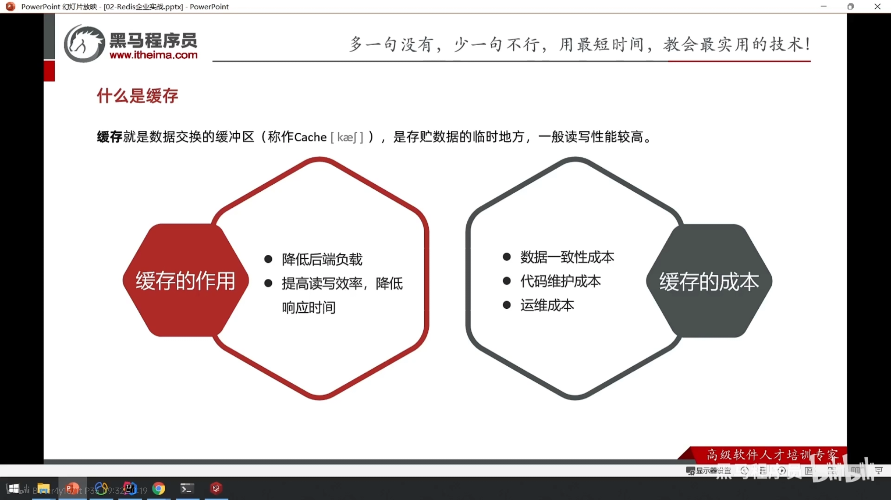
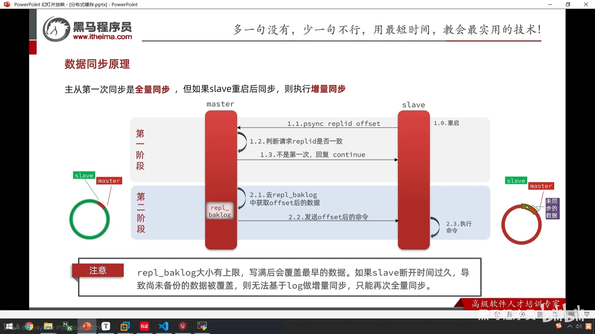
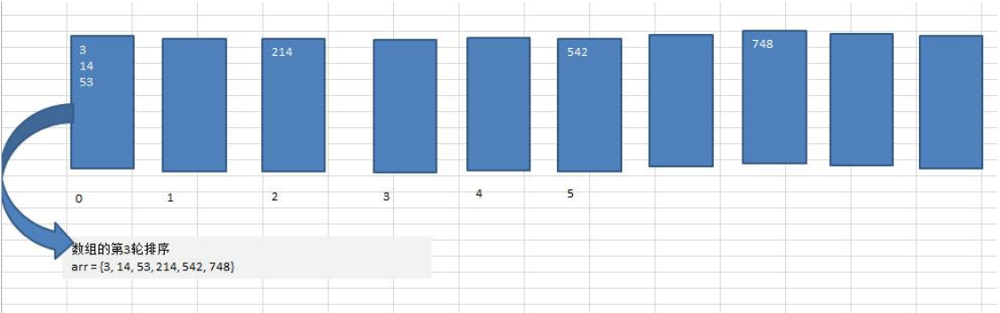
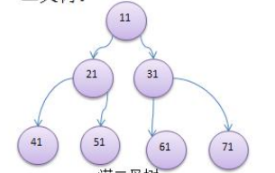

# SpringCloud学习笔记

## 一、前言

本项目配置要求：


本项目将学习以下技术：


## 二、基本知识

### 2.1 时间格式转化

时间格式转化有三种方式：

* 1、在`相应的类的属性`上使用`@JsonFormat`注解

```java
public class xxx {
    //    .....
    @JsonFormat(pattern = "yyyy-MM-dd HH:mm:ss", timezone = "GMT+8")
    @DateTimeFormat(pattern = "yyyy-MM-dd HH:mm:ss")
    private Date billtime;

//    .....
}
```

* 2、如果是Springboot项目，可以在application.yml中指定

```yml
spring:
  jackson:
    date-format: yyyy-MM-dd HH:mm:ss
    time-zone: GMT+8
```

### 2.2 统一返回接口

接口统一返回值：<br>
①思路
> 返回接口的类的标准定义格式：
> > * 2、message描述：本次接口调用的结果描述
> > * 3、data数据：本次返回的数据
>
> 扩展:
>
> > * 1、接口调用时间之类---timestamp：接口调用时间

②步骤
  1、新建枚举类ReturnCodeEnum
>  http请求返回状态码：
> 
>  |分类 |区间 |分类描述|
>  |:-----:|:----:|:-------:|
>  |1***|100~199|信息，服务器收到请求，需要请求者继续执行操作|
>  |2***|200~299|成功，操作被成功接收并处理|
>  |3***|300~399|重定向，需要进一步的操作已完成请求|
>  |4***|400~499|客户端错误，请求包含语法错误或无法完成请求|
>  |5***|500~599|服务器错误，服务器在处理请求的过程中发生了错误|
> 
>  

**ReturnCodeEnum.class**

```java
package com.atguigu.cloud.enums;

import lombok.Getter;

/**
 * @author QRH
 * @date 2024/3/15 11:32
 * @description 统一信息返回值枚举类
 */
@Getter
public enum ReturnCodeEnum {
    RC999("999", "操作xxx失败"),
    RC200("200", "success"),
    RC201("201", "服务器开启降级保护，请稍后再试！"),
    RC202("202", "热点参数限流，请稍后再试！"),
    RC203("203", "系统规则不满住要去，请稍后再试！"),
    RC204("204", "授权规则不通过，请稍后再试！"),
    RC403("403", "无法访问全限，请联系管理员授予权限"),
    RC401("401", "匿名用户访问无权权限资源时的异常"),
    RC404("404", "404页面找不到的异常"),
    RC500("500", "系统异常，请稍后重试"),
    RC375("375", "数字运算异常，请稍后再试"),

    INVALID_TOKEN("2001", "访问令牌不合法"),
    ACCESS_DENIED("2003", "没有权限访问该资源"),
    CLIENT_AUTHENTICATION_FAILED("1001", "客户端认证失败"),
    USERNAME_OR_PASSWORD_ERROR("1002", "用户名或密码错误"),
    BUSINESS_ERROR("1004", "业务逻辑异常"),
    UNSUPPORTED_GRANT_TYPE("1003", "不支持的认证模式");

    private final String code;
    private final String message;

    ReturnCodeEnum(String code, String message) {
        this.code = code;
        this.message = message;
    }

    //    遍历枚举
    public static ReturnCodeEnum getReturnCodeEnum(String code) {
        for (ReturnCodeEnum e : ReturnCodeEnum.values()) {
            if (e.getCode().equalsIgnoreCase(code)) {
                return e;
            }
        }
        return null;
    }

}

```

> * 2、定义统一返回对象ResultData

**ResultData.class**

```java
 package com.atguigu.cloud.resp;

import lombok.Data;
import lombok.experimental.Accessors;

/**
 * @author QRH
 * @date 2024/3/15 11:54
 * @description 统一返回数据对象
 */
@Data
@Accessors(chain = true)
public class ResultData<T> {
    private String code;
    /** 结果状态 ,具体状态码参见枚举类ReturnCodeEnum.java*/
    private String message;
    private T data;
    private long timestamp;

    public ResultData() {
        this.timestamp = System.currentTimeMillis();
    }

    public static <T> ResultData<T> success(T data) {
        ResultData<T> resultData = new ResultData<>();
        resultData.setCode(ReturnCodeEnum.RC200.getCode());
        resultData.setMessage(ReturnCodeEnum.RC200.getMessage());
        resultData.setData(data);
        return resultData;
    }

    public static <T> ResultData<T> fail(String code, String message) {
        ResultData<T> resultData = new ResultData<>();
        resultData.setCode(code);
        resultData.setMessage(message);
        resultData.setData(null);
        return resultData;
    }
}
```

### 2.3 统一异常处理类

异常类捕捉可以自己使用`try...catch`捕捉，也可以使用`全局异常处理器`进行处理，但是处理的异常类型是具体的，捕捉多个异常还得写多个方法。

```java

package com.atguigu.cloud.exp;

import com.atguigu.cloud.resp.ResultData;
import com.atguigu.cloud.resp.ReturnCodeEnum;
import lombok.extern.slf4j.Slf4j;
import org.springframework.http.HttpStatus;
import org.springframework.web.bind.annotation.ExceptionHandler;
import org.springframework.web.bind.annotation.ResponseStatus;
import org.springframework.web.bind.annotation.RestControllerAdvice;

/**
 * @author QRH
 * @date 2024/3/15 12:53
 * @description 全局异常处理类
 */
@Slf4j
@RestControllerAdvice
public class GlobalExceptionHandler {

    @ExceptionHandler(RuntimeException.class)
    @ResponseStatus(HttpStatus.INTERNAL_SERVER_ERROR)
    public ResultData<String> exception(Exception e) {
        System.out.println("来到全局异常处理器了");
        log.error("全局异常信息：{}", e.getMessage(), e);
        return ResultData.fail(ReturnCodeEnum.RC500.getCode(), e.getMessage());
    }
}

```

## 三、微服务内容

### 一、 Consul服务注册与发现

* 为什么要引入服务注册中心？<br>
  实现微服务之间的动态注册与发现

Consul需要从官网下载（https://developer.hashicorp.com/consul/install） ，安装到本地,验证是否安装成功： 到安装包所在的目录，打开cmd，输入`consul --version`，如果出现一下信息表示成功。

```cmd
F:\Consul>consul --version
Consul v1.18.0
Revision 349cec17
Build Date 2024-02-26T22:05:50Z
Protocol 2 spoken by default, understands 2 to 3 (agent will automatically use protocol >2 when speaking to compatible agents)
```

以开发者模式启动Consul，输入命令`consul agent -dev`。然后就可以访问consul了，访问地址为：`http://localhost:8500`。

#### 1.1 将服务者模块和消费者模块加入Consul

**服务提供者** 步骤：

1、`服务提供者`添加`spring-cloud-starter-consul-discovery`依赖。（项目中cloud-provider-payment8001是提供者）

```xml

<dependency>
    <groupId>org.springframework.cloud</groupId>
    <artifactId>spring-cloud-starter-consul-discovery</artifactId>
</dependency>
```

2、提供者的`yml`添加以下配置：

```yml
spring:
  cloud:
    consul:
      host: localhost
      port: 8500
      discovery:
        service-name: ${spring.application.name}
```

3、提供者的`主启动类`上添加`@EnableDiscoveryClient`注解，激活Consul。

```java

package com.atguigu.cloud;

import org.springframework.boot.SpringApplication;
import org.springframework.boot.autoconfigure.SpringBootApplication;
import org.springframework.cloud.client.discovery.EnableDiscoveryClient;
import tk.mybatis.spring.annotation.MapperScan;

/**
 * @author QRH
 * @date 2024/3/14 14:15
 * @description 主启动类
 */
@SpringBootApplication
@MapperScan("com.atguigu.cloud.mapper")

@EnableDiscoveryClient

public class Main8001 {
    public static void main(String[] args) {
        SpringApplication.run(Main8001.class, args);
    }
}
```

4、最后在Consul网页内可以查看到服务了。


**服务消费者** 步骤：

1、消费者模块添加pom依赖：

```xml

<dependency>
    <groupId>org.springframework.cloud</groupId>
    <artifactId>spring-cloud-starter-consul-discovery</artifactId>
    <!--    排除掉控制打印台的烦人警告，可加可不加-->
    <exclusions>
        <exclusion>
            <groupId>commons-logging</groupId>
            <artifactId>commons-logging</artifactId>
        </exclusion>
    </exclusions>
</dependency>
```

2、在消费者模块的`yml`中配置：

```yml
spring:
  cloud:
    consul:
      host: localhost
      port: 8500
      discovery:
        service-name: ${spring.application.name}
        prefer-ip-address: true #优先使用服务ip进行注册
```

3、`主启动类`添加`@EnableDiscoveryClient`。

```java
package com.atguigu.cloud;

import org.springframework.boot.SpringApplication;
import org.springframework.boot.autoconfigure.SpringBootApplication;
import org.springframework.cloud.client.discovery.EnableDiscoveryClient;

/**
 * @author QRH
 * @date 2024/3/15 13:09
 * @description TODO
 */
@SpringBootApplication

@EnableDiscoveryClient

public class Main80 {
    public static void main(String[] args) {
        SpringApplication.run(Main80.class, args);
    }
}

```

最后，启动提供者模块和消费者模块，进行测试。

http://localhost/consumer/pay/get/1 。提示报错。

```cmd
Caused by: java.net.UnknownHostException: cloud-payment-service
```

造成的原因是，消费者模块中的`RestTemplateConfig.java`没有开启`负载均衡`。

```java
package com.atguigu.cloud.config;

import org.springframework.cloud.client.loadbalancer.LoadBalanced;
import org.springframework.context.annotation.Bean;
import org.springframework.context.annotation.Configuration;
import org.springframework.web.client.RestTemplate;

/**
 * @author QRH
 * @date 2024/3/15 13:20
 * @description TODO
 */
@Configuration
public class RestTemplateConfig {

    @Bean
    @LoadBalanced
    public RestTemplate restTemplate() {
        return new RestTemplate();
    }

}
```

#### 1.2 服务配置与刷新

通用全局配置信息，直接注册进Consul服务器，从Consul获取

步骤：

1、引入依赖 **（服务提供者模块）**

```xml

<dependency>
    <groupId>org.springframework.cloud</groupId>
    <artifactId>spring-cloud-starter-consul-config</artifactId>
</dependency>

<dependency>
    <groupId>org.springframework.cloud</groupId>
    <artifactId>spring-cloud-starter-bootstrap</artifactId>
</dependency>
```

2、给`服务提供者`模块添加`bootstrap.yml`

```yml
spring:
  application:
    name: cloud-payment-service
  cloud:
    consul:
      host: localhost
      port: 8500
      discovery:
        service-name: ${spring.application.name}
      config:
        profile-separator: "-"
        format: YAML
```

所以，清除掉`application.yml`中与`bootstrap.yml`中相同的内容。

3、在`application.yml`中添加：

```yml
spring:
  profiles:
    active: dev #多环境配置加载内容dev/prod，不写就是默认default配置
```

#### 1.3 Consul服务器Key/Value配置填写

配置填写一定要遵循官方规则。

步骤：

1、Consul页面的`Key/Value`创建文件夹，（必须以`config`开头）


2、再在`config`文件夹内创建`服务`,（必须一`/`结尾）。


3、再给上面三个文件夹创建`data`内容，（data不再是文件夹）。


#### 1.4 动态刷新

Consul刷新是有默认刷新间隔的，默认是`55秒`。

1、`主启动类`添加`@RefreshScope`。

2、`bootstrap.yml`添加配置：（实际开发建议不改）

```yml
spring:
  cloud:
    consul:
      config:
        watch:
          wait-time: 1
```

#### 1.5 Consul的配置持久化

当Consul服务关闭时，再次进入页面之前的配好的配置就会全没有，所以需要将Consul持久化。（持久化配置将在之后进行）


### 二、LoadBalancer负载均衡

spring cloud LoadBalancer没有专门的jar包，它挂载在`Spring-Cloud-Commons`jar包下。

* LB负载均衡是什么？

简单来讲就是将用户的请求平摊的分配到多个服务器上，从而达到系统的HA（高可用），常见的负载均衡有软件Nginx、LVS和硬件F5。

* spring-cloud-starter-loadbalancer是什么？

这是Spring Cloud官方提供的一个开源的、简易的客户端负载均衡器，它包含在Spring Cloud Commons中用来替代以前的Ribbon组件。相较于Ribbon，Spring Cloud LoadBalancer不经能支持`RestTemplate`，还支持`WebClient`（WebClient是Spring Web Flux中提供的功能，可以实现响应式异步请求）。

#### 2.1 完成Consul的数据持久化

**Consul数据持久化配置并注册为Window服务**

步骤：

①在`consul.exe`所在的文件目录下新增一个名为`mydata`的空文件夹（文件夹名叫啥都行）。

②创建`consul_start.bat`并编辑内容（注，consul_start.bat与consul.exe在`同级目录`下）。

```bat
@echo.服务启动...
@echo off
@sc create Consul binpath="F:\Consul\consul.exe agent -server -ui -bind=127.0.0.1 -client=0.0.0.0 -bootstrap-expect 1 -data-dir F:\Consul\mydata\ "
@net start Consul
@sc config Consul start=AUTO
@echo.Consul start is OK......success
@pause
```

③右键consul_start.bat，`以管理员身份打开`。

④验证是否成功，浏览器输入网址(http://localhost:8500)，成功打开，然后在windows的后台看consul的服务是否注册成功。

#### 2.2 开始使用LoadBalancer

步骤：

1、`消费者端`添加`spring-cloud-starter-loadbalancer`(本项目中cloud-sonsumer-order80实消费端)。

```xml

<dependency>
    <groupId>org.springframework.cloud</groupId>
    <artifactId>spring-cloud-starter-loadbalancer</artifactId>
</dependency>
```

2、给`OrderController.java`添加以下内容。

```java
 public static final  String PaymentSrv_URL="http://cloud-payment-service";

@GetMapping(value = "/consumer/pay/get/info")
public String getInfoByConsul(){
    return restTemplate.getForObject(PaymentSrv_URL+"/pay/get/info",String.class);
}

```

3、重启消费者服务，浏览器访问（http://localhost:80/consumer/pay/get/info）。

### 三、OpenFeign服务接口调用

* OpenFeign是什么？

  Feign是一个<span style="color:red;font-weight:bolder;font-size:20px;">`声明式web服务客户端`</span>。他编写web服务客户端变得更容易。`使用Feign创建一个接口并对其进行注释`。它具有可插入的注释支持，包括Feign注释和JAX-RS注释。Feign还支持可插拔编码器和解码器。Spring Cloud添加了对Spring MVC注释的支持，以及对使用Spring Web中默认使用的HttpMessageConveter的支持。Spring Cloud还集成了Eureka、Spring Cloud CircuitBreaker以及Spring Cloud
  LoadBalancer，以便使用Feign时提供负载均衡的http客户端。


* 已经有了loadbalancer为什么还要学OpenFeign？日常用哪个？

  日常用OpenFeign

#### 3.1 OpenFeign通用步骤

①创建一个公共api模块(cloud-consumer-feign-order80)，该模块与服务提供者一一对应。


②在这个模块的`主启动类`上添加`@EnableFeignClients`表示开启OpenFeign功能并激活

```java
package com.atguigu.cloud;

import com.sun.tools.javac.Main;
import org.springframework.boot.SpringApplication;
import org.springframework.boot.autoconfigure.SpringBootApplication;
import org.springframework.cloud.client.discovery.EnableDiscoveryClient;
import org.springframework.cloud.openfeign.EnableFeignClients;

/**
 * @author QRH
 * @date 2024/3/21 14:22
 * @description TODO
 */
@SpringBootApplication
@EnableFeignClients
@EnableDiscoveryClient
public class MainOpenFeign80 {
    public static void main(String[] args) {
        SpringApplication.run(Main.class, args);
    }
}

```

③将`feign接口`定义在`公共通用模块`（cloud-api-commons）中，并把feign依赖引入。

```xml

<dependency>
    <groupId>org.springframework.cloud</groupId>
    <artifactId>spring-cloud-starter-openfeign</artifactId>
</dependency>
```

④新建服务接口PayFeignApi，头上配置`@FeignClient`注解

```java
package com.atguigu.cloud.apis;

import com.atguigu.cloud.entities.PayDTO;
import com.atguigu.cloud.resp.ResultData;
import org.springframework.cloud.openfeign.FeignClient;
import org.springframework.web.bind.annotation.GetMapping;
import org.springframework.web.bind.annotation.PathVariable;
import org.springframework.web.bind.annotation.PostMapping;
import org.springframework.web.bind.annotation.RequestBody;

/**
 * @author QRH
 * @date 2024/3/21 14:31
 * @description TODO
 */
@FeignClient(value = "cloud-payment-service")
public interface PayFeignApi {

    @PostMapping(value = "/pay/add/")
    public ResultData addPay(@RequestBody PayDTO payDTO);

    @GetMapping(value = "/pay/get/{id}")
    public ResultData getPayInfo(@PathVariable("id") Integer id);

    @GetMapping(value = "/pay/get/info")
    public String mylb();

    //......
}

```

⑤`cloud-consumer-feign-order80`项目内创建OrderController.java。（该controller与cloud-consumer-order80模块的controller类不同）

```java
package com.atguigu.cloud.controller;

import com.atguigu.cloud.apis.PayFeignApi;
import com.atguigu.cloud.entities.PayDTO;
import com.atguigu.cloud.resp.ResultData;
import jakarta.annotation.Resource;
import org.springframework.web.bind.annotation.*;
import org.springframework.web.client.RestTemplate;

/**
 * @author QRH
 * @date 2024/3/15 13:22
 * @description TODO
 */
@RestController
public class OrderController {
    @Resource
    private PayFeignApi payFeignApi;

    @PostMapping(value = "/feign/pay/add")
    public ResultData<String> addOrder(@RequestBody PayDTO payDTO) {
        System.out.println("第一步，模拟本地addOrder新增订单成功，第一步在开启addPay支付微服务远程调用");
        return payFeignApi.addPay(payDTO);
    }

    @GetMapping(value = "/feign/pay/get/{id}")
    public ResultData getPayInfo(@PathVariable("id") Integer id) {
        System.out.println("支付微服务远程调用，按照id查询订单支付流水信息");
        return payFeignApi.getPayInfo(id);
    }

    @GetMapping(value = "/feign/pay/info")
    public String getMylb() {
        return payFeignApi.mylb();
    }

}

```

⑤测试，启动服务，观察Consul是否能够注册成功。然后输入网址检查是否能返回正确数据。


#### 3.2 OpenFeign高级特性

##### 3.2.1 OpenFeign超时配置

OpenFign默认等待时间：60s，超时报错。

在`消费者模块的application.yml`添加以下内容：

```yml
spring:
  cloud:
    openfeign:
      client:
        config:
          default:
            #连接超时时间
            connectionTimeout: 3000
            #读取超时时间
            readTimeout: 3000
```

上面这种是为全局统一设置超时时间

那为单个服务设置超时时间该如何做呢？

步骤：

①在`cloud-consumer-feign-order80`项目中的controller头上添加指定的`微服务服务实例`。

```java

@RestController
@FeignClient(value = "cloud-payment-service") //指定微服务服务实例 
public class OrderController {
    //.....
}
```

②在yml中配置超时配置

```yml
spring:
  cloud:
    openfeign:
      client:
        config:
          #为单个服务配置超时
          cloud-payment-service:
            connectionTimeout: 3000
            readTimeout: 3000

#          default:
#            #连接超时时间
#            connectionTimeout: 3000
#            #读取超时时间
#            readTimeout: 3000
```

③<span style="color:red;">如果全局超时配置和单个服务超时配置同时共存，会`优先使用单个服务配置的超时时间`。</span>

##### 3.2.2 OpenFign重试机制

重试机制默认是`关闭的`，开启重试机制需写个配置类。

**FeignConfig.java**

```java
package com.atguigu.cloud;

import feign.Retryer;
import org.springframework.context.annotation.Bean;
import org.springframework.context.annotation.Configuration;

/**
 * @author QRH
 * @date 2024/3/23 13:44
 * @description Feign 配置类
 */
@Configuration
public class FeignConfig {

    @Bean
    public Retryer myRetryer() {
        //最大请求次数为3，重试时间间隔为100ms，重试最大间隔时间为1s
        return new Retryer.Default(100, 1, 3);
    }
}

```

OpenFign的重试次数在控制台看不到，只是给出了最终结果。如果想要看到每次重试的结果，将在日志打印那学到。

##### 3.2.3 OpenFign默认HttpClient修改

OpenFign中的Http Client如果不做特殊配置，则会默认使用JDK自带的HttpURLConnection发送HTTP请求。<br>
但，由于默认的HttpURLConnection没有连接池，性能和效率比较低，如果采用默认，性能不是最牛的，所以要加到最大。

所以使用Apache HttpClient5替换HttpURLConnection

步骤：

①修改`消费者模块(cloud-consumer-feign-order80)的pom.xml`，引入`httpclient5`依赖。

```xml
<!-- httpclient5-->
<dependency>
    <groupId>org.apache.httpcomponents.client5</groupId>
    <artifactId>httpclient5</artifactId>
    <version>5.3</version>
</dependency>

<!-- feign-hc5-->
<dependency>
    <groupId>io.github.openfeign</groupId>
    <artifactId>feign-hc5</artifactId>
    <version>13.1</version>
</dependency>
```

②修改`消费者模块(cloud-consumer-feign-order80)的application.yml`，配置Apache HttpClient5。

```yml
spring:
  cloud:
    openfign:
      httpclient:
        hc5:
          enabled: true

```

##### 3.2.4 OpenFign请求/压缩功能

对请求和响应进行GZIP压缩，以减少同行过程中的性能损耗。

```yml
spring:
  cloud:
    openfeign:
      compression:
        request:
          enabled: true
          min-request-size: 2048 #最小触发压缩的大小
          mime-types: text/xml,application/xml,application/json #触发压缩数据类型
        response:
          enabled: true
```

##### 3.2.5 OpenFign日志打印功能

日志级别：

* NONE:默认，不显示任何日志。
* BASIC:显示请求方法、请求URL、请求状态码、请求错误信息。
* HEADERS:除了BASIC，还显示请求和响应头信息。
* FULL:除了HEADERS，还显示请求和响应体信息。

所以，

①在`FeignConfig.java`中修改默认日志打印级别。

**FeignConfig.java**

```java
package com.atguigu.cloud;

import feign.Logger;
import feign.Retryer;
import org.springframework.context.annotation.Bean;
import org.springframework.context.annotation.Configuration;

/**
 * @author QRH
 * @date 2024/3/23 13:44
 * @description Feign 配置类
 */
@Configuration
public class FeignConfig {

    @Bean
    public Retryer myRetryer() {
        return Retryer.NEVER_RETRY;
        //最大请求次数为3(1 default +2)，出时间间隔时间为100ms，重试最大间隔时间为1s
//        return new Retryer.Default(100,1,3);
    }

    @Bean
    public Logger.Level feignLoggerLevel() {
        return Logger.Level.FULL;
    }

}


```

②`yml`中配置日志打印级别为`DEBUG`。（Feign日志仅相应DEBUG级别）

写法：`logging.level+含有@FeignClient注解的完整带包名的接口名+debug`

```yml
logging:
  level:
    com:
      atguigu:
        cloud:
          apis:
            PayFeignApi: debug
```

### 四、CirCuitBreaker断路器

断路器：当某个服务不可用时，会自动切换到备用服务。

CirCuitBreaker只是一套规范或接口，落实实现是`Resiliences4j`。

Resiliences4j是什么？

* Resiliences4j是容错库

#### 4.1 熔断（CirCuitBreaker）

##### 4.1.1 按照COUNT_BASE

步骤：

①在提供者模块`cloud-provider-payment8001`新增PayCircuitController.java。

```java
package com.atguigu.cloud.controller;

import cn.hutool.core.util.IdUtil;
import org.springframework.web.bind.annotation.GetMapping;
import org.springframework.web.bind.annotation.PathVariable;
import org.springframework.web.bind.annotation.RestController;

import java.util.concurrent.TimeUnit;

/**
 * @author QRH
 * @date 2024/3/27 20:44
 * @description TODO
 */
@RestController
public class PayCircuitController {

    /**
     * Resilience4j circuitBreaker的例子
     * @param id
     * @return
     */
    @GetMapping(value = "/pay/circuit/{id}")
    public String myCircuit(@PathVariable("id") Integer id) {
        if (id == -4) throw new RuntimeException("---circuit id不能为负数");
        if (id == 9999) try {
            TimeUnit.SECONDS.sleep(5);
        } catch (InterruptedException e) {
            e.printStackTrace();
        }
        return "Hello ,Circuit inputId: " + id + " \t" + IdUtil.simpleUUID();
    }
}

```

②修改`PayFeignApi.java`的接口（cloud-api-commons）。

**PayFeignApi.java**

```java

@FeignClient(value = "cloud-payment-service")
public interface PayFeignApi {
    /**
     * 测试熔断 Resilience4j CircuitBreak断路器
     * @param id
     * @return 提示信息
     */
    @GetMapping(value = "/pay/circuit/{id}")
    public String myCircuit(@PathVariable("id") Integer id);
}
```

③消费者模块`cloud-consumer-feign-order80`添加Resilience4j的依赖。

```xml

<dependency>
    <groupId>org.springframework.cloud</groupId>
    <artifactId>spring-cloud-starter-circuitbreaker-resilience4j</artifactId>
</dependency>

<!--        由于断路保护需要aop实现，所以必须导入aop包-->
<dependency>
    <groupId>org.springframework.boot</groupId>
	<artifactId>spring-boot-starter-aop</artifactId>
</dependency>

```

④编写yml。

```yml
spring:
  cloud:
    openfeign:
      #开启断路器和分组激活spring.cloud.openfeign.circuitbreaker.enabled
      circuitbreaker:
        enabled: true
        group:
          enabled: true #没开分组永远不用开分组配置。精确优先，分组次之，默认最后

resilience4j:
  circuitbreaker:
    configs:
      default:
        failureRateThreshold: 50 #设置50%的调用失败时打开断路器，超过失败请求百分比CirCuitBreaker变为OPEN状态
        slidingWindowType: COUNT_BASED #滑动窗口的类型
        slidingWindowSize: 6 #滑动窗口的大小配置COUNT_BASED表示6个请求，配置TIME_BASED表示6秒
        minimumNumberOfCalls: 6 #断路器计算失败率或慢调用率之前所需的最小样本（每个滑动周期）。默认为10，
        automaticTransitionFromOpenToHalfOpenEnabled: true #是否启用自动从开启状态过渡到半开状态，默认值为true
        permittedNumberOfCallsInHalfOpenState: 2 #半开状态允许的最大请求数，默认为10
        recordExceptions:
          - java.lang.Exception
    instances:
      cloud-payment-service:
        baseConfig: default #使用默认配置
```

⑤新建OrderCircuitController.java。

```java
package com.atguigu.cloud.controller;

import com.atguigu.cloud.apis.PayFeignApi;
import io.github.resilience4j.circuitbreaker.annotation.CircuitBreaker;
import jakarta.annotation.Resource;
import org.springframework.web.bind.annotation.GetMapping;
import org.springframework.web.bind.annotation.PathVariable;
import org.springframework.web.bind.annotation.RestController;

/**
 * @author QRH
 * @date 2024/3/27 21:17
 * @description TODO
 */
@RestController
public class OrderCircuitController {
    @Resource
    private PayFeignApi payFeignApi;

    @GetMapping(value = "/feign/pay/circuit/{id}")
    @CircuitBreaker(name = "cloud-payment-service", fallbackMethod = "myCircuitFallback")
    public String myCircuitBreaker(@PathVariable("id") Integer id) {
        return payFeignApi.myCircuit(id);
    }

    //myCircuitFallback就是服务熔断降级后的兜底处理方法
    public String myCircuitFallback(Integer id, Throwable t) {
        return "myCircuitFallback，系统繁忙，请稍后重试----~~~~";
    }
}

```

⑥测试

##### 4.1.2 按照TIME_BASED

步骤： ①修改yml。

```yml
resilience4j:
  timelimiter:
    configs:
      default:
        timeout-duration: 10s #默认限制远程1s，超过1s就超时异常，配置了降级，就走降级逻辑
  circuitbreaker:
    configs:
      default:
        #TIME_BASED
        failureRateThreshold: 50 #设置50%的调用失败时打开断路器，超过失败请求百分⽐CircuitBreaker变为OPEN状态。
        slowCallDurationThreshold: 2s #慢调用时间阈值，高于这个阈值的视为慢调用并增加慢调用比例。
        slowCallRateThreshold: 30 #慢调用百分比峰值，断路器把调用时间⼤于slowCallDurationThreshold，视为慢调用，当慢调用比例高于阈值，断路器打开，并开启服务降级
        slidingWindowType: TIME_BASED # 滑动窗口的类型
        slidingWindowSize: 2 #滑动窗口的大小配置，配置TIME_BASED表示2秒
        minimumNumberOfCalls: 2 #断路器计算失败率或慢调用率之前所需的最小样本(每个滑动窗口周期)。
        permittedNumberOfCallsInHalfOpenState: 2 #半开状态允许的最大请求数，默认值为10。
        waitDurationInOpenState: 5s #从OPEN到HALF_OPEN状态需要等待的时间

        recordExceptions:
          - java.lang.Exception
    instances:
      cloud-payment-service:
        baseConfig: default #使用默认配置
```

##### 4.1.3 COUNT_BASED和TIME_BASED用哪个？

建议使用COUNT_BASED。

#### 4.2 隔离（BuldHead）

隔离是什么？

* 限制并发。

隔离能干什么？

* 用来限制对于下游服务的并发请求数。

Resilience4j提供了两种隔离的实现：

##### 4.2.1 Semahore信号量

使用Semahore需要导入舱壁的包

```xml

<dependency>
    <groupId>io.github.resilience4j</groupId>
    <artifactId>resilience4j-bulkhead</artifactId>
</dependency>
```

然后配置

```yml
resilience4j:
  bulkhead:
    configs:
      default:
        maxConcurrentCalls: 2
        maxWaitDuration: 1s
      instances:
        cloud-payment-service:
          baseConfig: default
  timelimiter:
    configs:
      default:
        timeout-duration: 10s #默认限制远程1s，超过1s就超时异常，配置了降级，就走降级逻辑
```

再在提供者模块`cloud-provider-payment8001`中添加方法。
**PayCircuitController.java**

```java

/**
 * Resilience4j bulkHead的例子
 * @param id
 * @return
 */
@GetMapping(value = "/pay/bulkhead/{id}")
public String myBulkHead(@PathVariable("id") Integer id){
    if(id==-4)throw new RuntimeException("----bulkHead id 不能为空");
    if(id==999){
        try{
            TimeUnit.SECONDS.sleep(5);
        }catch(InterruptedException e){
            e.printStackTrace();
        }
    }
    return"Hello bulkHead inputId : "+id+"\t"+IdUtil.simpleUUID();
}

```

PayFeignApi.java添加myBulkHead方法，供外部调用。

```java
/**
 * 测试熔断 Resilience4j BulkHead
 * @param id
 * @return 提示信息
 */
@GetMapping(value = "/pay/bulkhead/{id}")
public String myBulkHead(@PathVariable("id") Integer id);
```

消费者模块`cloud-consumer-feign-order80`中添加方法访问。
**OrderCircuitController.java**

```java
   /**
 * 舱壁
 * @param id
 * @return
 */
@GetMapping(value = "/feign/pay/bulkhead/{id}")
@Bulkhead(name = "cloud-payment-service", fallbackMethod = "myBulkheadFallback", type = Bulkhead.Type.SEMAPHORE)
public String myBulkHead(@PathVariable("id") Integer id){
    return payFeignApi.myBulkHead(id);
}

public String myBulkheadFallback(Integer id,Throwable t){
    return"myBulkheadFallback ，舱壁超出最大数量限制， 系统繁忙，请稍后重试----~~~~";
}

```

最后启动项目，测试结果。

##### 4.2.2 固定线程池FixedThreadPoolBulkhead舱壁

使用Semahore需要导入舱壁的包。

```xml

<dependency>
    <groupId>io.github.resilience4j</groupId>
    <artifactId>resilience4j-bulkhead</artifactId>
</dependency>
```

然后配置

```yml
resilience4j:
  thread-pool-bulkhead:
    configs:
      default:
        core-thread-pool-size: 1
        max-thread-pool-size: 1
        queue-capacity: 1
    instances:
      cloud-payment-service:
        base-config: default
  timelimiter:
    configs:
      default:
        timeout-duration: 10s #默认限制远程1s，超过1s就超时异常，配置了降级，就走降级逻辑

#使用固定线程需要将spring.cloud.openfeign.circuitbreaker.group.enabled设置为false
```

再在提供者模块`cloud-provider-hystrix-payment8001`中添加方法。
**PayCircuitController.java**

```java

/**
 * Resilience4j bulkHead的例子
 * @param id
 * @return
 */
@GetMapping(value = "/pay/bulkhead/{id}")
public String myBulkHead(@PathVariable("id") Integer id){
    if(id==-4)throw new RuntimeException("----bulkHead id 不能为空");
    if(id==999)try{TimeUnit.SECONDS.sleep(5);}catch(InterruptedException e){e.printStackTrace();}
    return"Hello bulkHead inputId : "+id+"\t"+IdUtil.simpleUUID();
}

```

PayFeignApi.java添加myBulkHead方法，供外部调用。

```java
/**
 * 测试熔断 Resilience4j BulkHead
 * @param id
 * @return 提示信息
 */
@GetMapping(value = "/pay/bulkhead/{id}")
public String myBulkHead(@PathVariable("id") Integer id);
```

消费者模块`cloud-consumer-feign-order80`中添加方法访问。
**OrderCircuitController.java**

```java
   /**
 * 舱壁
 * @param id
 * @return
 */
@GetMapping(value = "/feign/pay/bulkhead/{id}")
@Bulkhead(name = "cloud-payment-service", fallbackMethod = "myBulkheadFallback", type = Bulkhead.Type.SEMAPHORE)
public String myBulkHead(@PathVariable("id") Integer id){
    return payFeignApi.myBulkHead(id);
}

public String myBulkheadFallback(Integer id,Throwable t){
    return"myBulkheadFallback ，舱壁超出最大数量限制， 系统繁忙，请稍后重试----~~~~";
}

```

最后启动项目，测试结果。

#### 4.3 限流器（RateLimiter）

限流器是什么？

* 用来限制对某个资源（如：接口）的访问次数。

```xml

<dependency>
    <groupId>io.github.resilience4j</groupId>
    <artifactId>resilience4j-ratelimiter</artifactId>
</dependency>
```

```yml
 #限流器
 resilience4j:
   ratelimiter:
     configs:
       default:
         limit-for-period: 2
         limit-refresh-period: 1s
         timeout-duration: 1
     instances:
       cloud-payment-service:
         base-config: default
```

### 五、分布式链路追踪

为什么要用分布式链路追踪？

* 在微服务框架中，一个由客户端发起的请求在后端系统中会经过多个不同的服务结点调用来协同产生最后的请求结果，每一个前段请求都会形成一条复杂的分布式服务调用链路，链路中的任何一环出现高延时或错误都会引起整个请求最后的失败。

#### 5.1 Zipkin链路追踪负责数据展现

* Zipkin是一个开源的分布式追踪系统，用于收集和聚合跨服务调用的链路和操作数据，可用于构建和操作分布式系统间的延迟数据。

zipkin下载地址：https://zipkin.io/pages/quickstart.html

cmd窗口下执行：`java -jar zipkin-server-3.1.1-exec.jar`

访问地址：http://localhost:9411/，若能出现ui界面说明成功了。

#### 5.2 Micrometer+Zipkin搭配使用

1、引入相关jar。

**父工程pom**

```xml

<prperties>
    <micrometer-tracing.version>1.2.0</micrometer-tracing.version>
    <micrometer-observation.version>1.12.0</micrometer-observation.version>
    <feign-micrometer.version>12.5</feign-micrometer.version>
    <zipkin-reporter-brave.version>2.17.0</zipkin-reporter-brave.version>
</properties>

<dependencyManagement>
<dependencies>
    <!--micrometer-tracing-bom导入链路追踪版本中心-1-->
    <dependency>
        <groupId>io.micrometer</groupId>
        <artifactId>micrometer-tracing-bom</artifactId>
        <version>${micrometer-tracing.version}</version>
        <type>pom</type>
        <scope>import</scope>
    </dependency>
    <!--            micrometer-tracing指标追踪-2-->
    <dependency>
        <groupId>io.micrometer</groupId>
        <artifactId>micrometer-tracing</artifactId>
        <version>${micrometer-tracing.version}</version>
    </dependency>
    <!--micrometer-tracing-bridge-brave适配zipkin的桥接包 3-->
    <dependency>
        <groupId>io.micrometer</groupId>
        <artifactId>micrometer-tracing-bridge-brave</artifactId>
        <version>${micrometer-tracing.version}</version>
    </dependency>
    <!--micrometer-observation 4-->
    <dependency>
        <groupId>io.micrometer</groupId>
        <artifactId>micrometer-observation</artifactId>
        <version>${micrometer-observation.version}</version>
    </dependency>
    <!--feign-micrometer 5-->
    <dependency>
        <groupId>io.github.openfeign</groupId>
        <artifactId>feign-micrometer</artifactId>
        <version>${feign-micrometer.version}</version>
    </dependency>
    <!--zipkin-reporter-brave 6-->
    <dependency>
        <groupId>io.zipkin.reporter2</groupId>
        <artifactId>zipkin-reporter-brave</artifactId>
        <version>${zipkin-reporter-brave.version}</version>
    </dependency>
</dependencies>
</dependencyManagement>

```

2、`服务提供者8001(cloud-payment-service)`。
**pom**

```xml
 <!--            micrometer-tracing指标追踪-2-->
<dependency>
    <groupId>io.micrometer</groupId>
    <artifactId>micrometer-tracing</artifactId>
    <version>${micrometer-tracing.version}</version>
</dependency>

        <!--micrometer-tracing-bridge-brave适配zipkin的桥接包 3-->
<dependency>
    <groupId>io.micrometer</groupId>
    <artifactId>micrometer-tracing-bridge-brave</artifactId>
    <version>${micrometer-tracing.version}</version>
</dependency>

        <!--micrometer-observation 4-->
<dependency>
    <groupId>io.micrometer</groupId>
    <artifactId>micrometer-observation</artifactId>
    <version>${micrometer-observation.version}</version>
</dependency>

        <!--feign-micrometer 5-->
<dependency>
    <groupId>io.github.openfeign</groupId>
    <artifactId>feign-micrometer</artifactId>
    <version>${feign-micrometer.version}</version>
</dependency>

        <!--zipkin-reporter-brave 6-->
<dependency>
    <groupId>io.zipkin.reporter2</groupId>
    <artifactId>zipkin-reporter-brave</artifactId>
    <version>${zipkin-reporter-brave.version}</version>
</dependency>
```

**application.yml**

```yml
management:
  zipkin:
    tracing:
      endpoint: http://localhost:9411/api/v2/spans
  tracing:
    sampling:
      probability: 1.0 #值越大手机越及时
```

3、新建业务类。
**PayMicrometerController.java**

```java
import cn.hutool.core.util.IdUtil;
import org.springframework.web.bind.annotation.GetMapping;
import org.springframework.web.bind.annotation.PathVariable;
import org.springframework.web.bind.annotation.RestController;

/**
 * @author QRH
 * @date 2024/4/1 17:46
 * @description 测试Micrometer
 */
@RestController
public class PayMicrometerController {
    @GetMapping(value = "/pay/micrometer/{id}")
    public String myMicrometer(@PathVariable("id") Integer id) {
        return "欢迎来到myMicrometer inputId ： " + id + "\t 服务返回：" + IdUtil.simpleUUID();
    }
}
```

**PayFeignApi.java**

```java

/**
 * Micrometer链路追踪
 *
 * @param id
 * @return
 */
@GetMapping(value = "/pay/micrometer/{id}")
public String myMicrometer(@PathVariable("id") Integer id);
```

3、`服务消费者80(cloud-consumer-feign-feign-order80)`
操作步骤如前所示。

### 六、网关

#### 6.1 配置

1、新建cloud-gateway-gateway9527。

2、pom.xml。

```xml

<dependencies>
    <dependency>
        <groupId>org.springframework.cloud</groupId>
        <artifactId>spring-cloud-starter-gateway</artifactId>
    </dependency>

    <dependency>
        <groupId>org.springframework.cloud</groupId>
        <artifactId>spring-cloud-starter-consul-discovery</artifactId>
    </dependency>
    <dependency>
        <groupId>org.springframework.boot</groupId>
        <artifactId>spring-boot-starter-actuator</artifactId>
    </dependency>


</dependencies>

<build>
<plugins>
    <plugin>
        <groupId>org.springframework.boot</groupId>
        <artifactId>spring-boot-maven-plugin</artifactId>
    </plugin>
</plugins>
</build>

```

3、application.yml。

```yml

server:
  port: 9527

spring:
  application:
    name: cloud-gateway
  cloud:
    consul:
      host: localhost
      port: 8500
      discovery:
        prefer-ip-address: true
        service-name: ${spring.application.name}

```

4、主启动。

```java
package com.atguigu.cloud;

import org.springframework.boot.SpringApplication;
import org.springframework.boot.autoconfigure.SpringBootApplication;
import org.springframework.cloud.client.discovery.EnableDiscoveryClient;

/**
 * @author QRH
 * @date 2024/4/1 18:25
 * @description TODO
 */
@SpringBootApplication
@EnableDiscoveryClient
public class Main9527 {
    public static void main(String[] args) {
        SpringApplication.run(Main9527.class, args);
    }
}


```

5、关联路由。

```yml
spring:
  cloud:
    gateway:
      routes:
        - id: pay_routh1 #pay_routh1                #路由的ID(类似mysql主键ID)，没有固定规则但要求唯一，建议配合服务名
          uri: http://localhost:8001                #匹配后提供服务的路由地址
          predicates:
            - Path=/pay/gateway/get/**              # 断言，路径相匹配的进行路由


        - id: pay_routh2 #pay_routh2                #路由的ID(类似mysql主键ID)，没有固定规则但要求唯一，建议配合服务名
          uri: http://localhost:8001                #匹配后提供服务的路由地址
          predicates:
            - Path=/pay/gateway/info/**              # 断言，路径相匹配的进行路由
```

6、启动使用9527端口访问链接。

7、FeignApi.java添加两个接口。

```java

@GetMapping(value = "/pay/gateway/get/{id}")
public ResultData getGateWayById(@PathVariable("id") Integer id);

@GetMapping(value = "/pay/gateway/get/info")
public ResultData<String> getGateWayInfo();
```

8、PayGateWayController.java添加两个接口

```java
package com.atguigu.cloud.controller;

import cn.hutool.core.util.IdUtil;
import com.atguigu.cloud.entities.Pay;
import com.atguigu.cloud.resp.ResultData;
import com.atguigu.cloud.service.PayService;
import jakarta.annotation.Resource;
import org.springframework.web.bind.annotation.GetMapping;
import org.springframework.web.bind.annotation.PathVariable;
import org.springframework.web.bind.annotation.RestController;

/**
 * @author QRH
 * @date 2024/4/1 22:16
 * @description TODO
 */
@RestController
public class PayGateWayController {

    @Resource
    private PayService payService;

    @GetMapping(value = "/pay/gateway/get/{id}")
    public ResultData<Pay> getGateWayById(@PathVariable("id") Integer id) {
        return ResultData.success(payService.getById(id));
    }

    @GetMapping(value = "/pay/gateway/get/info")
    public ResultData<String> getGateWayInfo() {
        return ResultData.success("gateway info test: " + IdUtil.simpleUUID());
    }

}


```

9、OrderGateWayController.java添加两个接口。

```java
package com.atguigu.cloud.controller;

import cn.hutool.core.util.IdUtil;
import com.atguigu.cloud.apis.PayFeignApi;
import com.atguigu.cloud.resp.ResultData;
import jakarta.annotation.Resource;
import org.springframework.web.bind.annotation.GetMapping;
import org.springframework.web.bind.annotation.PathVariable;
import org.springframework.web.bind.annotation.RestController;

/**
 * @author QRH
 * @date 2024/4/1 22:31
 * @description TODO
 */
@RestController
public class OrderGateWayController {

    @Resource
    private PayFeignApi payFeignApi;

    @GetMapping(value = "/feign/pay/gateway/get/{id}")
    public ResultData getGateWayById(@PathVariable("id") Integer id) {
        return payFeignApi.getGateWayById(id);
    }

    @GetMapping(value = "/feign/pay/gateway/get/info")
    public ResultData<String> getGateWayInfo() {
        return payFeignApi.getGateWayInfo();
    }

}

```

```java
/**
	这里不再是通过微服务实例名来远程调用提供者的相关方法了，而是使用网关来进行代理请求，只需要在配置文件中配置好断言就可实现远程调用
*/
//@FeignClient(value = "cloud-payment-service")
@FeignClient(value = "cloud-gateway")
public interface PayFeignApi {
}
```

#### 6.2 Predicate常用api

##### 6.2.1 After Route Predicate

在`什么时间之后`能访问这个链接。

```yml
spring:
  cloud:
    gateway:
      routes:
        - id: pay_routh1 #pay_routh1                #路由的ID(类似mysql主键ID)，没有固定规则但要求唯一，建议配合服务名
          uri: lb://cloud-payment-service               #匹配后提供服务的路由地址
          predicates:
            - Path=/pay/gateway/get/**
            - After=2024-04-01T00:00:00.000+08:00[Asia/Shanghai]
```

##### 6.2.2 Before Route Predicate

在`什么时间之前`能访问这个链接。

```yml
spring:
  cloud:
    gateway:
      routes:
        - id: pay_routh1 #pay_routh1                #路由的ID(类似mysql主键ID)，没有固定规则但要求唯一，建议配合服务名
          uri: lb://cloud-payment-service               #匹配后提供服务的路由地址
          predicates:
            - Path=/pay/gateway/get/**
            - Before=2024-04-03T00:00:00.000+08:00[Asia/Shanghai]
```

##### 6.2.3 Between Route Predicate

在`什么时间之前`能访问这个链接。

```yml
spring:
  cloud:
    gateway:
      routes:
        - id: pay_routh1 #pay_routh1                #路由的ID(类似mysql主键ID)，没有固定规则但要求唯一，建议配合服务名
          uri: lb://cloud-payment-service               #匹配后提供服务的路由地址
          predicates:
            - Path=/pay/gateway/get/**
            - Between=2024-04-02T00:00:00.000+08:00[Asia/Shanghai],2024-04-03T00:00:00.000+08:00[Asia/Shanghai]
```

##### 6.2.4 Cookie Route Predicate

Cookie断言，需要两个参数`Cookie`和`正则表达式`。

```yml
spring:
  cloud:
    gateway:
      routes:
        - id: pay_routh1 #pay_routh1                #路由的ID(类似mysql主键ID)，没有固定规则但要求唯一，建议配合服务名
          uri: lb://cloud-payment-service               #匹配后提供服务的路由地址
          predicates:
            - Path=/pay/gateway/get/**
            - After=2024-04-01T00:00:00.000+08:00[Asia/Shanghai]
            - Cookie=username,qrh
```

结果，使用cmd测试。

```cmd
C:\Users\qrh19>curl http://localhost:9527/pay/gateway/get/1 --cookie "username=qrh"

{"code":"200","message":"success","data":{"id":1,"payNo":"pay17203699","orderNo":"6544bafb424a","userId":1,"amount":19.99,"deleted":0,"createTime":"2024-03-14 12:56:24","updateTime":"2024-03-14 15:18:14"},"timestamp":1712069458399}
```

##### 6.2.5 Header Route Predicate

需要两个参数`header请求头`和`正则表达式`。

```yml
spring:
  cloud:
    gateway:
      routes:
        - id: pay_routh1 #pay_routh1                #路由的ID(类似mysql主键ID)，没有固定规则但要求唯一，建议配合服务名
          uri: lb://cloud-payment-service               #匹配后提供服务的路由地址
          predicates:
            - Path=/pay/gateway/get/**
            - After=2024-04-01T00:00:00.000+08:00[Asia/Shanghai]
            - Header=X-Request-Id,123456 
```

结果，使用cmd测试。

```cmd
C:\Users\qrh19>curl http://localhost:9527/pay/gateway/get/1 -H "X-Request-Id:123456"

{"code":"200","message":"success","data":{"id":1,"payNo":"pay17203699","orderNo":"6544bafb424a","userId":1,"amount":19.99,"deleted":0,"createTime":"2024-03-14 12:56:24","updateTime":"2024-03-14 15:18:14"},"timestamp":1712070083153}

```

##### 6.2.6 Host Route Predicate

需要两个参数`header请求头`和`正则表达式`。

```yml
spring:
  cloud:
    gateway:
      routes:
        - id: pay_routh1 #pay_routh1                #路由的ID(类似mysql主键ID)，没有固定规则但要求唯一，建议配合服务名
          uri: lb://cloud-payment-service               #匹配后提供服务的路由地址
          predicates:
            - Path=/pay/gateway/get/**
            - Host=**.atguigu.com
```

结果，使用cmd测试

```cmd
C:\Users\qrh19>curl http://localhost:9527/pay/gateway/get/1 -H "Host:www.atguigu.com"

{"code":"200","message":"success","data":{"id":1,"payNo":"pay17203699","orderNo":"6544bafb424a","userId":1,"amount":19.99,"deleted":0,"createTime":"2024-03-14 12:56:24","updateTime":"2024-03-14 15:18:14"},"timestamp":1712070408884}

```

##### 6.2.7 Method Route Predicate

```yml
spring:
  cloud:
    gateway:
      routes:
        - id: pay_routh1 #pay_routh1                #路由的ID(类似mysql主键ID)，没有固定规则但要求唯一，建议配合服务名
          uri: lb://cloud-payment-service               #匹配后提供服务的路由地址
          predicates:
            - Path=/pay/gateway/get/**
            - Method=GET,POST #注意需要大写，小写不行
```

结果，使用cmd测试。

```cmd
C:\Users\qrh19>curl -X GET  http://localhost:9527/pay/gateway/get/1

{"code":"200","message":"success","data":{"id":1,"payNo":"pay17203699","orderNo":"6544bafb424a","userId":1,"amount":19.99,"deleted":0,"createTime":"2024-03-14 12:56:24","updateTime":"2024-03-14 15:18:14"},"timestamp":1712070926046}
```

##### 6.2.8 Path Route Predicate

访问路径。

```yml
spring:
  cloud:
    gateway:
      routes:
        - id: pay_routh1 #pay_routh1                #路由的ID(类似mysql主键ID)，没有固定规则但要求唯一，建议配合服务名
          uri: lb://cloud-payment-service               #匹配后提供服务的路由地址
          predicates:
            - Path=/pay/gateway/get/**

```

##### 6.2.9 Query Route Predicate

查询请求参数。

```yml
spring:
  cloud:
    gateway:
      routes:
        - id: pay_routh1 #pay_routh1                #路由的ID(类似mysql主键ID)，没有固定规则但要求唯一，建议配合服务名
          uri: lb://cloud-payment-service               #匹配后提供服务的路由地址
          predicates:
            - Path=/pay/gateway/get/**
            - Query=username,qrh
```

结果，使用cmd测试

```cmd
C:\Users\qrh19>curl http://localhost:9527/pay/gateway/get/1?username=qrh

{"code":"200","message":"success","data":{"id":1,"payNo":"pay17203699","orderNo":"6544bafb424a","userId":1,"amount":19.99,"deleted":0,"createTime":"2024-03-14 12:56:24","updateTime":"2024-03-14 15:18:14"},"timestamp":1712071157949}
C:\Users\qrh19>

```

##### 6.2.10 RemoteAddr  Route Predicate

远程地址请求访问，只有这个地址才能访问。

```yml
spring:
  cloud:
    gateway:
      routes:
        - id: pay_routh1 #pay_routh1                #路由的ID(类似mysql主键ID)，没有固定规则但要求唯一，建议配合服务名
          uri: lb://cloud-payment-service               #匹配后提供服务的路由地址
          predicates:
            - Path=/pay/gateway/get/**
            - RemoteAddr=192.168.10.1/24
```

结果，使用cmd测试

```cmd
C:\Users\qrh19>curl http://192.168.10.12:9527/pay/gateway/get/1

{"code":"200","message":"success","data":{"id":1,"payNo":"pay17203699","orderNo":"6544bafb424a","userId":1,"amount":19.99,"deleted":0,"createTime":"2024-03-14 12:56:24","updateTime":"2024-03-14 15:18:14"},"timestamp":1712071431679}

```

##### 6.2.11 自定义断言

①新建自定义断言类，（注意：`必须以RoutePredicateFactory`结尾）。

**MyRoutePredicateFactory.java**

```java
package com.atguigu.cloud.gateway;

import jakarta.validation.constraints.NotEmpty;
import lombok.Getter;
import lombok.Setter;
import org.springframework.cloud.gateway.handler.predicate.AbstractRoutePredicateFactory;
import org.springframework.stereotype.Component;
import org.springframework.validation.annotation.Validated;
import org.springframework.web.server.ServerWebExchange;

import java.util.Collections;
import java.util.List;
import java.util.function.Predicate;

/**
 * @author QRH
 * @date 2024/4/2 23:29
 * @description 自定义断言类
 * 按照会员等级进行判断（钻、金、银）三个等级
 */
@Component //必须加这个注解
public class MyRoutePredicateFactory extends AbstractRoutePredicateFactory<MyRoutePredicateFactory.Config> {

    public static final String USER_TYPE_KEY = "userType";

    public MyRoutePredicateFactory() {
        super(MyRoutePredicateFactory.Config.class);
    }

    //开启Shortcut配置，因为路由断言有两种配置方式：shortcut和fully expend
    public List<String> shortcutFieldOrder() {
        return Collections.singletonList("userType");
    }

    @Override
    public Predicate<ServerWebExchange> apply(MyRoutePredicateFactory.Config config) {
        return new Predicate<ServerWebExchange>() {
            public boolean test(ServerWebExchange serverWebExchange) {
                String userType = serverWebExchange.getRequest().getQueryParams().getFirst("userType");
                if (userType == null) return false;
                if (userType.equalsIgnoreCase(config.getUserType())) return true;

                return false;
            }

//            public Object getConfig() {
//                return config;
//            }

//            public String toString() {
//                return String.format("MyRoutePredicateFactory: %s", config.getUserType());
//            }

        };
    }


    @Validated
    public static class Config {
        @Setter
        @Getter
        @NotEmpty
        private String userType; //钻、金、银等用户等级
    }


}

```

②写yml。

```yml
spring:
  cloud:
    gateway:
      routes:
        - id: pay_routh1 #pay_routh1                #路由的ID(类似mysql主键ID)，没有固定规则但要求唯一，建议配合服务名
          uri: lb://cloud-payment-service               #匹配后提供服务的路由地址
          predicates:
            - Path=/pay/gateway/get/**
            - My=diamod
```

③测试

```cmd

C:\Users\qrh19>curl http://localhost:9527/pay/gateway/get/1?userType=diamod

{"code":"200","message":"success","data":{"id":1,"payNo":"pay17203699","orderNo":"6544bafb424a","userId":1,"amount":19.99,"deleted":0,"createTime":"2024-03-14 12:56:24","updateTime":"2024-03-14 15:18:14"},"timestamp":1712073665745}

```

#### 6.3 Filter

相当于Spring MVC的拦截器，Serlvet的过滤器。

##### 6.3.1 全局过滤器Global Filter

gateway默认自带的，直接用就可以。

##### 6.3.2 单一过滤器

单一内置过滤器一共有38个。

###### 6.3.2.1 请求头过滤器

1、AddRequestHeader GatewayFilter Factory

该过滤器包含一个`name`和`value`。

步骤：

①提供者模块(cloud-provider-payment8001) PayGateWayController.java添加方法

```java
 @GetMapping(value = "/pay/gateway/filter")
public ResultData<String> getGateWayFilter(HttpServletRequest request){
    String result="";
    Enumeration<String> headers=request.getHeaderNames();
    while(headers.hasMoreElements()){
        String headerName=headers.nextElement();
        String headerValue=request.getHeader(headerName);
        System.out.println("请求头名： "+headerName+"\t\t\t请求头值： "+headerValue);
        if(headerName.equalsIgnoreCase("X-Request-atguigu1")||headerName.equalsIgnoreCase("X-Request-atguigu2")){
            result=result+headerName+"\t"+headerValue+" ";
        }

    }
    return ResultData.success("getGateWayFilter 过滤器 test： "+result+" \t"+DateUtil.now());
}

```

②cloud-gateway9527 yml编写配置。

```yml
spring:
  cloud:
    gateway:
      routes:

        - id: pay_routh3
          uri: lb://cloud-payment-service
          predicates:
            - Path=/pay/gateway/filter/**
          filters:
            - AddRequestHeader=X-Request-atguigu1,atguiguValue1
            - AddRequestHeader=X-Request-atguigu2,atguiguValue2

```

2 RemoveRequestHeader GatewayFilter Factory

```yml
spring:
  cloud:
    gateway:
      routes:

        - id: pay_routh3
          uri: lb://cloud-payment-service
          predicates:
            - Path=/pay/gateway/filter/**
          filters:
            - AddRequestHeader=X-Request-atguigu1,atguiguValue1
            - AddRequestHeader=X-Request-atguigu2,atguiguValue2
            - RemoveRequestHeader=X-Request-atguigu1
```

3、 SetRequestHeader GatewayFilter Factory

```yml
spring:
  cloud:
    gateway:
      routes:

        - id: pay_routh3
          uri: lb://cloud-payment-service
          predicates:
            - Path=/pay/gateway/filter/**
          filters:
            - AddRequestHeader=X-Request-atguigu1,atguiguValue1
            - AddRequestHeader=X-Request-atguigu2,atguiguValue2
            #设置或修改，如果有这个name那么就修改，否则是新增
            - SetRequestHeader=X-Request-atguigu2,HelloWorld
            - SetRequestHeader=X-request-atguigu3,guiguValue3
```

###### 6.3.2.2 请求参数过滤器

1、AddRequestParameter和RemoveRequestParameter。

```java
@GetMapping(value = "/pay/gateway/filter")
public ResultData<String> getGateWayFilter(HttpServletRequest request){
    String result="";
    Enumeration<String> headers=request.getHeaderNames();
    while(headers.hasMoreElements()){
        String headerName=headers.nextElement();
        String headerValue=request.getHeader(headerName);
        System.out.println("请求头名： "+headerName+"\t\t\t请求头值： "+headerValue);
        if(headerName.equalsIgnoreCase("X-Request-atguigu1")
           ||headerName.equalsIgnoreCase("X-Request-atguigu2")){
            result=result+headerName+"\t"+headerValue+" ";
        }

    }
    System.out.println("=============================");
    String customerId=request.getParameter("customerId");
    System.out.println("request parameter customId: "+customerId);

    String customerName=request.getParameter("customerName");
    System.out.println("request parameter customerName: "+customerName);
    System.out.println("=============================");
    return ResultData.success("getGateWayFilter 过滤器 test： "+result+" \t"+DateUtil.now());
}

```

```yml
spring:
  cloud:
    gateway:
      routes:

        - id: pay_routh3
          uri: lb://cloud-payment-service
          predicates:
            - Path=/pay/gateway/filter/**
          filters:
            - AddRequestHeader=X-Request-atguigu1,atguiguValue1
            - AddRequestHeader=X-Request-atguigu2,atguiguValue2
            #设置或修改，如果有这个name那么就修改，否则是新增
            - AddRequestParameter=customerId,1234566
            - RemoveRequestParameter=customerName
```

访问http://localhost:9527/pay/gateway/filter?customerId=9999&customerName=h123，如果传了customerId，那就是用传过来的值，如果链接没有请求参数，那就使用配置内定义好的值。


##### 6.3.3 自定义全局过滤器

步骤：

①新建一个MyGlobalFilter.java。

```java
package com.atguigu.cloud.mygateway;

import lombok.extern.slf4j.Slf4j;
import org.springframework.cloud.gateway.filter.GatewayFilterChain;
import org.springframework.cloud.gateway.filter.GlobalFilter;
import org.springframework.core.Ordered;
import org.springframework.stereotype.Component;
import org.springframework.web.server.ServerWebExchange;
import reactor.core.publisher.Mono;

/**
 * @author QRH
 * @date 2024/4/3 17:35
 * @description 自定义全局过滤器
 */
@Component
@Slf4j
public class MyGlobalFilter implements GlobalFilter, Ordered {
    private static final String BEGIN_VISIT_TIME = "begin_visit_time";

    @Override
    public Mono<Void> filter(ServerWebExchange exchange, GatewayFilterChain chain) {
        //记录接口开始访问时间
        exchange.getAttributes().put(BEGIN_VISIT_TIME, System.currentTimeMillis());
        // 返回统计的各个接口给后台
        return chain.filter(exchange)
                .then(
                        Mono.fromRunnable(() -> {
                            Long beginVisitTime = exchange.getAttribute(BEGIN_VISIT_TIME);
                            if (beginVisitTime != null) {
                                log.info("访问接口主机： " + exchange.getRequest().getURI().getHost());
                                log.info("访问接口端口： " + exchange.getRequest().getURI().getPort());
                                log.info("访问接口URL： " + exchange.getRequest().getURI().getPath());
                                log.info("访问接口URL后面的参数： " + exchange.getRequest().getURI().getRawQuery());
                                log.info("访问接口时长： " + (System.currentTimeMillis() - beginVisitTime) + "毫秒");
                                log.info("=====================================");
                                System.out.println();
                            }
                        })
                );
    }

    /**
     * 数字越小，优先级越高
     *
     * @return
     */
    @Override
    public int getOrder() {
        return 0;
    }
}

```

##### 6.3.4 自定义条件过滤器

步骤：

①新建一个MyGatewayFilterFactory.java（必须以GatewayFilterFactory结尾），并继承AbstractGatewayFilterFactory。

### 七、Spring Cloud Alibaba

* Spring Cloud Alibaba的版本不是最新的。


**SpringBoot和Spring Alibaba Cloud版本对应关系：**


**Spring Cloud Alibaba 集成的组件版本:**


#### 7.1 Spring Cloud Alibaba Nacos

Nacos是一个动态服务发现、配置管理、服务管理平台，Nacos 致力于解决微服务治理中的问题。Nacos 提供了服务注册、服务发现、配置管理、服务管理、服务网关等微服务治理功能，并支持基于 Spring Cloud 构建微服务应用。

* Nacos作为注册中心，可以替代Eureka，作为配置中心，可以替代Config

Nacos=Spring Cloud Consul

1、安装下载

https://nacos.io/zh-cn/docs/quick-start.html

2、启动Nacos

* Windows版本启动命令：startup.cmd -m standalone
* Linux版本启动命令：sh startup.sh -m standalone

启动后，访问http://localhost:8848/nacos/index.html，成功则配置没错


##### 7.1.1 服务注册中心

步骤：

①新建一个cloudalibaba-provider-payment9001模块(提供者模块)。

②加pom。

```xml
<?xml version="1.0" encoding="UTF-8"?>
<project xmlns="http://maven.apache.org/POM/4.0.0"
         xmlns:xsi="http://www.w3.org/2001/XMLSchema-instance"
         xsi:schemaLocation="http://maven.apache.org/POM/4.0.0 http://maven.apache.org/xsd/maven-4.0.0.xsd">
    <parent>
        <artifactId>cloud24</artifactId>
        <groupId>com.atguigu.cloud</groupId>
        <version>1.0-SNAPSHOT</version>
    </parent>
    <modelVersion>4.0.0</modelVersion>

    <artifactId>cloudalibaba-provider-payment9001</artifactId>

    <properties>
        <maven.compiler.source>17</maven.compiler.source>
        <maven.compiler.target>17</maven.compiler.target>
        <project-build-sourceEncoding>UTF-8</project-build-sourceEncoding>
    </properties>

    <dependencies>

        <dependency>
            <groupId>com.alibaba.cloud</groupId>
            <artifactId>spring-cloud-starter-alibaba-nacos-discovery</artifactId>
        </dependency>

        <dependency>
            <groupId>com.atguigu.cloud</groupId>
            <artifactId>cloud-api-commons</artifactId>
            <version>1.0-SNAPSHOT</version>
        </dependency>

        <dependency>
            <groupId>org.springframework.boot</groupId>
            <artifactId>spring-boot-starter-web</artifactId>
        </dependency>

        <dependency>
            <groupId>org.springframework.boot</groupId>
            <artifactId>spring-boot-starter-actuator</artifactId>
        </dependency>

        <dependency>
            <groupId>cn.hutool</groupId>
            <artifactId>hutool-all</artifactId>
        </dependency>

        <dependency>
            <groupId>org.projectlombok</groupId>
            <artifactId>lombok</artifactId>
        </dependency>

        <dependency>
            <groupId>org.springframework.boot</groupId>
            <artifactId>spring-boot-starter-test</artifactId>
            <scope>test</scope>
        </dependency>


    </dependencies>

</project>

```

③写yml。

```yaml
server:
  port: 9001


spring:
  application:
    name: nacos-payment-provider
  cloud:
    nacos:
      discovery:
        server-addr: localhost:8848 #配置nacos地址
```

④主启动。

```java
package com.atguigu.cloud;

import org.springframework.boot.SpringApplication;
import org.springframework.boot.autoconfigure.SpringBootApplication;
import org.springframework.cloud.client.discovery.EnableDiscoveryClient;

/**
 * @author QRH
 * @date 2024/4/4 0:06
 * @description TODO
 */
@SpringBootApplication
@EnableDiscoveryClient
public class Main9001 {
    public static void main(String[] args) {
        SpringApplication.run(Main9001.class, args);
    }
}

```

⑤controller。

```java
package com.atguigu.cloud.controller;

import org.springframework.beans.factory.annotation.Value;
import org.springframework.web.bind.annotation.GetMapping;
import org.springframework.web.bind.annotation.PathVariable;
import org.springframework.web.bind.annotation.RestController;

/**
 * @author QRH
 * @date 2024/4/4 0:10
 * @description TODO
 */
@RestController
public class PayAlibabaController {

    @Value("${server.port}")
    private String serverPort;

    @GetMapping(value = "/pay/nacos/{id}")
    public String getPayInfo(@PathVariable("id") Integer id) {
        return "nacos registry, serverPort: " + serverPort + "\t id" + id;
    }

}

```

消费者模块的pom与提供者模块差不太多。

消费者模块：

```xml
<dependecies>
    
    <dependency>
        <groupId>com.alibaba.cloud</groupId>
        <artifactId>spring-cloud-starter-alibaba-nacos-discovery</artifactId>
    </dependency>

    <dependency>
        <groupId>org.springframework.cloud</groupId>
        <artifactId>spring-cloud-starter-loadbalancer</artifactId>
    </dependency>
    
    
</dependecies>

```

```yml
server:
  port: 83

spring:
  cloud:
    nacos:
      discovery:
        server-addr: localhost:8848

#消费者将要访问的微服务名称（nacos微服务提供者叫什么就写什么）
service-url:
  nacos-user-service: http://nacos-payment-provider


```

配置RestTemplate。

```java
package com.atguigu.cloud.config;

import org.springframework.cloud.client.loadbalancer.LoadBalanced;
import org.springframework.context.annotation.Bean;
import org.springframework.context.annotation.Configuration;
import org.springframework.web.client.RestTemplate;

/**
 * @author QRH
 * @date 2024/4/4 0:26
 * @description TODO
 */
@Configuration
public class RestTemplateConfig {
    @Bean
    @LoadBalanced
    public RestTemplate restTemplate() {
        return new RestTemplate();
    }

}

```

controller。

```java
package com.atguigu.cloud.controller;

import jakarta.annotation.Resource;
import org.springframework.beans.factory.annotation.Value;
import org.springframework.web.bind.annotation.GetMapping;
import org.springframework.web.bind.annotation.PathVariable;
import org.springframework.web.bind.annotation.RestController;
import org.springframework.web.client.RestTemplate;

/**
 * @author QRH
 * @date 2024/4/4 0:34
 * @description TODO
 */
@RestController
public class OrderNacosController {
    @Resource
    private RestTemplate restTemplate;

    @Value("${service-url.nacos-user-service}")
    private String serverURL;

    @GetMapping(value = "/consumer/pay/nacos/{id}")
    public String paymentInfo(@PathVariable("id") Integer id) {
        String res = restTemplate.getForObject(serverURL + "/pay/nacos/" + id, String.class);

        return res + "\t我是OrderNacosController83调用者......";
    }
}


```

##### 7.1.2 服务配置中心

①新建模块(cloudalibaba-config-nacos-client3377)。

②改pom。

```xml
<?xml version="1.0" encoding="UTF-8"?>
<project xmlns="http://maven.apache.org/POM/4.0.0"
         xmlns:xsi="http://www.w3.org/2001/XMLSchema-instance"
         xsi:schemaLocation="http://maven.apache.org/POM/4.0.0 http://maven.apache.org/xsd/maven-4.0.0.xsd">
    <parent>
        <artifactId>cloud24</artifactId>
        <groupId>com.atguigu.cloud</groupId>
        <version>1.0-SNAPSHOT</version>
    </parent>
    <modelVersion>4.0.0</modelVersion>

    <artifactId>cloudalibaba-config-nacos-client3377</artifactId>

    <properties>
        <maven.compiler.source>17</maven.compiler.source>
        <maven.compiler.target>17</maven.compiler.target>
        <project.build.sourceEncoding>UTF-8</project.build.sourceEncoding>
    </properties>

    <dependencies>

        <dependency>
            <groupId>org.springframework.cloud</groupId>
            <artifactId>spring-cloud-starter-bootstrap</artifactId>
        </dependency>
        <!--nacos-config-->
        <dependency>
            <groupId>com.alibaba.cloud</groupId>
            <artifactId>spring-cloud-starter-alibaba-nacos-config</artifactId>
        </dependency>

        <dependency>
            <groupId>com.alibaba.cloud</groupId>
            <artifactId>spring-cloud-starter-alibaba-nacos-discovery</artifactId>
        </dependency>

        <dependency>
            <groupId>org.springframework.boot</groupId>
            <artifactId>spring-boot-starter-web</artifactId>
        </dependency>

        <dependency>
            <groupId>org.springframework.boot</groupId>
            <artifactId>spring-boot-starter-actuator</artifactId>
        </dependency>

        <dependency>
            <groupId>org.projectlombok</groupId>
            <artifactId>lombok</artifactId>
            <optional>true</optional>
        </dependency>


    </dependencies>
    <build>
        <plugins>
            <plugin>
                <groupId>org.springframework.boot</groupId>
                <artifactId>spring-boot-maven-plugin</artifactId>
            </plugin>
        </plugins>
    </build>

</project>
```

③写yml。

**bootstrap.yml**

```yml
spring:
  application:
    name: nacos-config-client

  cloud:
    nacos:
      discovery:
        server-addr: localhost:8848 #nacos服务注册中心地址
      config:
        server-addr: localhost:8848 #nacos作为配置中心的地址
        file-extension: yaml #指定yml格式


```

**application.yml**

```yml
server:
  port: 3377

spring:
  profiles:
    active: dev

```

④主启动。

```java
package com.atguigu.cloud;

import org.springframework.boot.SpringApplication;
import org.springframework.boot.autoconfigure.SpringBootApplication;
import org.springframework.cloud.client.discovery.EnableDiscoveryClient;


@SpringBootApplication
@EnableDiscoveryClient
public class Main3377 {
    public static void main(String[] args) {
        SpringApplication.run(Main3377.class, args);
    }
}

```

⑤业务类。

**注意：@RefreshScope要加在controller类中才能实现动态更新，加载主启动类上不会实现动态更新，这与Consul的配置不同**

```java
package com.atguigu.cloud.controller;

import org.springframework.beans.factory.annotation.Value;
import org.springframework.cloud.context.config.annotation.RefreshScope;
import org.springframework.web.bind.annotation.GetMapping;
import org.springframework.web.bind.annotation.RestController;


@RestController
@RefreshScope
public class NacosConfigController {

    @Value("${config.info}")
    private String configInfo;

    @GetMapping(value = "/config/info")
    public String getConfigInfo() {
        return configInfo;
    }
}
```

### 八、Spring Cloud Sentinel

 [Sentinel](https://github.com/alibaba/Sentinel) 以流量为切入点，从流量控制、熔断降级、系统负载保护等多个维度保护服务的稳定性。

Sentinel下载：https://github.com/alibaba/Sentinel/releases

启动DashBoard命令：`java -jar sentinel-dashboard-1.8.7.jar`

访问sentinel启动界面：http://localhost:8080/ (登录账号、密码都是：**sentinel**)。

步骤：

① 创建模块(cloudalibaba-provider-payment8401)。

②改pom。

```xml
<?xml version="1.0" encoding="UTF-8"?>
<project xmlns:xsi="http://www.w3.org/2001/XMLSchema-instance"
         xmlns="http://maven.apache.org/POM/4.0.0"
         xsi:schemaLocation="http://maven.apache.org/POM/4.0.0 http://maven.apache.org/xsd/maven-4.0.0.xsd">
    <parent>
        <artifactId>cloud24</artifactId>
        <groupId>com.atguigu.cloud</groupId>
        <version>1.0-SNAPSHOT</version>
    </parent>
    <modelVersion>4.0.0</modelVersion>

    <artifactId>cloudalibaba-sentinel-service8401</artifactId>

    <properties>
        <maven.compiler.source>17</maven.compiler.source>
        <maven.compiler.target>17</maven.compiler.target>
        <project.build.sourceEncoding>UTF-8</project.build.sourceEncoding>
    </properties>

    <dependencies>

        <dependency>
            <groupId>com.alibaba.cloud</groupId>
            <artifactId>spring-cloud-starter-alibaba-sentinel</artifactId>
        </dependency>

        <dependency>
            <groupId>com.alibaba.cloud</groupId>
            <artifactId>spring-cloud-starter-alibaba-nacos-discovery</artifactId>
        </dependency>

        <dependency>
            <groupId>com.atguigu.cloud</groupId>
            <artifactId>cloud-api-commons</artifactId>
            <version>1.0-SNAPSHOT</version>
        </dependency>

        <dependency>
            <groupId>org.springframework.boot</groupId>
            <artifactId>spring-boot-starter-web</artifactId>
        </dependency>
        <dependency>
            <groupId>org.springframework.boot</groupId>
            <artifactId>spring-boot-starter-actuator</artifactId>
        </dependency>
        <!--hutool-->
        <dependency>
            <groupId>cn.hutool</groupId>
            <artifactId>hutool-all</artifactId>
        </dependency>
        <!--lombok-->
        <dependency>
            <groupId>org.projectlombok</groupId>
            <artifactId>lombok</artifactId>
            <version>1.18.28</version>
            <scope>provided</scope>
        </dependency>
        <!--test-->
        <dependency>
            <groupId>org.springframework.boot</groupId>
            <artifactId>spring-boot-starter-test</artifactId>
            <scope>test</scope>
        </dependency>
    </dependencies>

    <build>
        <plugins>
            <plugin>
                <groupId>org.springframework.boot</groupId>
                <artifactId>spring-boot-maven-plugin</artifactId>
            </plugin>
        </plugins>
    </build>

</project>

```

③写yml。

```yaml
server:
  port: 8401

spring:
  application:
    name: cloudalibaba-sentinel-service
  cloud:
    nacos:
      discovery:
        server-addr: localhost:8848
      sentinel:
        transport:
          dashboard: localhost:8080 #sentinel dashboard控制台服务地址
          port: 8719 #默认8179端口，假如被占会自动从8179开始一次+1扫描，直至找到未被占用的端口
```

④主启动。

```java
package com.atguigu.cloud;

import org.springframework.boot.SpringApplication;
import org.springframework.boot.autoconfigure.SpringBootApplication;
import org.springframework.cloud.client.discovery.EnableDiscoveryClient;

/**
 * @author QRH
 * @date 2024/4/4 13:34
 * @description TODO
 */
@SpringBootApplication
@EnableDiscoveryClient
public class Main8401 {
    public static void main(String[] args) {
        SpringApplication.run(Main8401.class, args);
    }
}

```

⑤业务类。

```java
package com.atguigu.cloud.controller;

import org.springframework.cloud.context.config.annotation.RefreshScope;
import org.springframework.web.bind.annotation.GetMapping;
import org.springframework.web.bind.annotation.RestController;


@RestController
public class FlowLimitController {

    @GetMapping(value = "/testA")
    public String testA() {
        return "----testA";
    }

    @GetMapping(value = "/testB")
    public String testB() {
        return "----testB";
    }


}

```

⑥启动。

##### 8.1 流控规则

##### 8.2 @SentinelSource注解

@SentinelResource 注解用来标识资源是否被`限流`、`降级`。该注解是写在`Service层的方法上`的。

##### 8.3 热点规则

是什么？

* 经常访问的数据，很多时候我们希望监控，我们希望对经常访问的数据进行`热点参数`的监控，即对经常访问的数据进行`限流`。

```java
 @GetMapping(value = "/testHotKey")
@SentinelResource(value = "testHotKey", blockHandler = "dealHandlerTestHotKey")
public String testHotKey(@RequestParam(value = "p1", required = false)String p1,
@RequestParam(value = "p2", required = false)String p2){
        return"-------testHotKey";
        }

public String dealHandlerTestHotKey(String p1,String p2,BlockException e){
        return"------------dealHandlerTestHotKey 点击太快，限流了";
        }
```


##### 8.4 黑白名单控制

* 黑白名单控制，就是对请求的ip进行限制，比如只允许白名单的ip访问，或者只允许黑名单的ip访问。

需要重写RequestOriginParser.java，并设值参数名为serverName。

```java
package com.atguigu.cloud.hander;

import com.alibaba.csp.sentinel.adapter.spring.webmvc.callback.RequestOriginParser;
import jakarta.servlet.http.HttpServletRequest;
import org.springframework.stereotype.Component;


@Component
public class MyRequestOriginParser implements RequestOriginParser {
    @Override
    public String parseOrigin(HttpServletRequest httpServletRequest) {
        return httpServletRequest.getParameter("serverName");
    }
}

```

业务类：

```java
package com.atguigu.cloud;

import lombok.extern.slf4j.Slf4j;
import org.springframework.web.bind.annotation.GetMapping;
import org.springframework.web.bind.annotation.RestController;


@RestController
@Slf4j
public class EmpowerController {

    @GetMapping(value = "/empower")
    public String requestSentinel() {
        log.info("测试Sentinel授权规则");
        return "Sentinel授权规则";
    }
}

```


localhost:8401/empower?serverName=test1或localhost:8401/empower?serverName=test2 的都不予通过，其他的可以访问。

##### 8.5 规则持久化

* 规则持久化，就是将规则持久化到数据库中，这样，当服务器重启的时候，这些规则就会自动加载到内存中。

步骤：

1. 引入依赖。

```xml

<dependency>
    <groupId>com.alibaba.csp</groupId>
    <artifactId>sentinel-datasource-nacos</artifactId>
</dependency>

```

2、改yml

```yml

spring:
  cloud:
    sentinel:
      datasource:
        ds1:
          nacos:
            server-addr: localhost:8848
            dataId: ${spring.application.name}
            groupId: DEFAULT_GROUP
            data-type: json
            rule-type: flow #flow:流控规则  degrade:降级规则  param-flow:参数流控规则
```

##### 8.5 Openfeign和Sentinel整合

①提供者模块（cloudalibaba-provider-payment9001）引入依赖。

```xml

<dependency>
    <groupId>com.alibaba.cloud</groupId>
    <artifactId>spring-cloud-starter-alibaba-sentinel</artifactId>
</dependency>

<dependency>
    <groupId>org.springframework.cloud</groupId>
    <artifactId>spring-cloud-starter-openfeign</artifactId>
</dependency>
```

②提供者模块（cloudalibaba-provider-payment9001）写yml。

```yml
server:
  port: 9001


spring:
  application:
    name: nacos-payment-provider
  cloud:
    nacos:
      discovery:
        server-addr: localhost:8848 #配置nacos地址
  sentinel:
    trasport:
      dashboard: localhost:8080
      port: 8719

```

③业务类。

**PayAlibabaController.java**

```java
@GetMapping(value = "/pay/nacos/get/{orderNo}")
@SentinelResource(value = "getPayByOrder", blockHandler = "handlerBlockHandler")
public ResultData getPayByOrder(@PathVariable("orderNo")String orderNo){
    PayDTO payDTO=new PayDTO();
    payDTO.setId(1024);
    payDTO.setOrderNo(orderNo);
    payDTO.setAmount(BigDecimal.valueOf("9.91"));
    payDTO.setPayNo("pay: "+IdUtil.fastUUID());
    payDTO.setUserId(1);
    return ResultData.success("查询返回值： "+payDTO);
}

public ResultData handlerBlockHandler(@PathVariable("orderNo")String orderNo,Throwable e){
    return ResultData.fail(ReturnCodeEnum.RC500.getCode(),"getPayByOrder服务不可用，触发sentinel流控配置规则");
}
```

④公共模块（cloud-api-commons）引入依赖。

```xml

<dependency>
    <groupId>com.alibaba.cloud</groupId>
    <artifactId>spring-cloud-starter-alibaba-sentinel</artifactId>
</dependency>

<dependency>
    <groupId>org.springframework.cloud</groupId>
    <artifactId>spring-cloud-starter-openfeign</artifactId>
</dependency>
```

⑤公共模块（cloud-api-commons）新建PayFeignSentinelApi.java。

```java
package com.atguigu.cloud.apis;

import com.alibaba.csp.sentinel.annotation.SentinelResource;
import com.atguigu.cloud.resp.ResultData;
import org.springframework.cloud.openfeign.FeignClient;
import org.springframework.web.bind.annotation.GetMapping;
import org.springframework.web.bind.annotation.PathVariable;

/**
 * @author QRH
 * @date 2024/4/5 12:41
 * @description 用OpenFeign和Sentinel的整合
 */
@FeignClient(value = "nacos-payment-provider", fallback = PayFeignSentinelApiFallback.class)
public interface PayFeignSentinelApi {

    @GetMapping(value = "/pay/nacos/get/{orderNo}")
    public ResultData getPayByOrder(@PathVariable("orderNo") String orderNo);
}

```

Sentinel回调类。

```java
package com.atguigu.cloud.apis;

import com.atguigu.cloud.resp.ResultData;
import com.atguigu.cloud.resp.ReturnCodeEnum;
import org.springframework.stereotype.Component;
import org.springframework.web.bind.annotation.PathVariable;

/**
 * @author QRH
 * @date 2024/4/5 12:44
 * @description Sentinel调用失败的回调
 */
@Component
public class PayFeignSentinelApiFallback implements PayFeignSentinelApi {
    @Override
    public ResultData getPayByOrder(@PathVariable("orderNo") String orderNo) {
        return ResultData.fail(ReturnCodeEnum.RC500.getCode(), "getPayByOrder服务不可用，触发sentinel流控配置规则");
    }
}

```

⑥消费者模块（cloudalibaba-consumer-nacos-order83）引入以下依赖。

```xml

<dependency>
    <groupId>com.atguigu.cloud</groupId>
    <artifactId>cloud-api-commons</artifactId>
    <version>1.0-SNAPSHOT</version>
</dependency>

<dependency>
    <groupId>org.springframework.cloud</groupId>
    <artifactId>spring-cloud-starter-openfeign</artifactId>
</dependency>

<dependency>
    <groupId>com.alibaba.cloud</groupId>
    <artifactId>spring-cloud-starter-alibaba-sentinel</artifactId>
</dependency>
```

改yml。

```yml
#激活feign对sentinel的支持
feign:
  sentinel:
    enabled: true
```

主启动类添加@EnableFeignClients注解。

业务类：

**OrderNacosController.java**

```java
@Resource
private PayFeignSentinelApi payFeignSentinelApi;

@GetMapping(value = "/consumer/pay/nacos/get/{orderNo}")
public ResultData getPayByOrder(@PathVariable("orderNo") String orderNo){
    return payFeignSentinelApi.getPayByOrder(orderNo);
}
```

测试：

启动83会报错：


导致原因：boot+cloud版本太高，alibaba的sentinel版本与cloud版本不匹配，导致报错。

解决方案： 降低父工程版本。


##### 8.6 Sentinel整合Gateway

①新建模块(cloudalibaba-sentinel-gateway9528)。

②改pom。

```xml
<?xml version="1.0" encoding="UTF-8"?>
<project xmlns="http://maven.apache.org/POM/4.0.0"
         xmlns:xsi="http://www.w3.org/2001/XMLSchema-instance"
         xsi:schemaLocation="http://maven.apache.org/POM/4.0.0 http://maven.apache.org/xsd/maven-4.0.0.xsd">
    <parent>
        <artifactId>cloud24</artifactId>
        <groupId>com.atguigu.cloud</groupId>
        <version>1.0-SNAPSHOT</version>
    </parent>
    <modelVersion>4.0.0</modelVersion>

    <artifactId>cloudalibaba-sentinel-gateway9528</artifactId>

    <properties>
        <maven.compiler.source>17</maven.compiler.source>
        <maven.compiler.target>17</maven.compiler.target>
        <project.build.sourceEncoding>UTF-8</project.build.sourceEncoding>
    </properties>

    <dependencies>

        <dependency>
            <groupId>org.springframework.cloud</groupId>
            <artifactId>spring-cloud-starter-gateway</artifactId>
        </dependency>
        <dependency>
            <groupId>com.alibaba.csp</groupId>
            <artifactId>sentinel-transport-simple-http</artifactId>
            <version>1.8.6</version>
        </dependency>
        <dependency>
            <groupId>com.alibaba.csp</groupId>
            <artifactId>sentinel-spring-cloud-gateway-adapter</artifactId>
            <version>1.8.6</version>
        </dependency>
        <dependency>
            <groupId>javax.annotation</groupId>
            <artifactId>javax.annotation-api</artifactId>
            <version>1.3.2</version>
            <scope>compile</scope>
        </dependency>
    </dependencies>

    <build>
        <plugins>
            <plugin>
                <groupId>org.springframework.boot</groupId>
                <artifactId>spring-boot-maven-plugin</artifactId>
            </plugin>
        </plugins>
    </build>
</project>
```

③写yml。

```yml
server:
  port: 9528


spring:
  application:
    name: cloudalibaba-sentinel-service
  cloud:
    nacos:
      discovery:
        server-addr: localhost:8848
    gateway:
      routes:
        - id: pay_routh1
          uri: http://localhost:9001
          predicates:
            - Path=/pay/**
```

④主启动。

```java
package com.atguigu.cloud;

import org.springframework.boot.SpringApplication;
import org.springframework.boot.autoconfigure.SpringBootApplication;
import org.springframework.cloud.client.discovery.EnableDiscoveryClient;

/**
 * @author QRH
 * @date 2024/4/5 13:37
 * @description TODO
 */
@SpringBootApplication
@EnableDiscoveryClient
public class Main9528 {
    public static void main(String[] args) {
        SpringApplication.run(Main9528.class, args);
    }
}

```

⑤业务类
**GatewayConfiguration.java**

```java
package com.atguigu.cloud.config;

import com.alibaba.csp.sentinel.adapter.gateway.common.rule.GatewayFlowRule;
import com.alibaba.csp.sentinel.adapter.gateway.common.rule.GatewayRuleManager;
import com.alibaba.csp.sentinel.adapter.gateway.sc.SentinelGatewayFilter;
import com.alibaba.csp.sentinel.adapter.gateway.sc.callback.BlockRequestHandler;
import com.alibaba.csp.sentinel.adapter.gateway.sc.callback.GatewayCallbackManager;
import com.alibaba.csp.sentinel.adapter.gateway.sc.exception.SentinelGatewayBlockExceptionHandler;
import org.springframework.beans.factory.ObjectProvider;
import org.springframework.cloud.gateway.filter.GlobalFilter;
import org.springframework.context.annotation.Bean;
import org.springframework.context.annotation.Configuration;
import org.springframework.core.Ordered;
import org.springframework.core.annotation.Order;
import org.springframework.http.HttpStatus;
import org.springframework.http.MediaType;
import org.springframework.http.codec.ServerCodecConfigurer;
import org.springframework.web.reactive.function.BodyInserter;
import org.springframework.web.reactive.function.BodyInserters;
import org.springframework.web.reactive.function.server.ServerResponse;
import org.springframework.web.reactive.result.view.ViewResolver;
import org.springframework.web.server.ServerWebExchange;
import reactor.core.publisher.Mono;

import javax.annotation.PostConstruct;
import java.util.*;

/**
 * @author QRH
 * @date 2024/4/5 13:42
 * @description TODO
 */
@Configuration
public class GatewayConfiguration {
    private final List<ViewResolver> viewResolvers;

    private final ServerCodecConfigurer serverCodecConfigurer;

    public GatewayConfiguration(ObjectProvider<List<ViewResolver>> viewResolversProvider, ServerCodecConfigurer serverCodecConfigurer) {
        this.viewResolvers = viewResolversProvider.getIfAvailable(Collections::emptyList);
        this.serverCodecConfigurer = serverCodecConfigurer;
    }

    @Bean
    @Order(Ordered.HIGHEST_PRECEDENCE)
    public SentinelGatewayBlockExceptionHandler sentinelGatewayBlockExceptionHandler() {
        // Register the block exception handler for Spring Cloud Gateway.
        return new SentinelGatewayBlockExceptionHandler(viewResolvers, serverCodecConfigurer);
    }

    @Bean
    @Order(-1)
    public GlobalFilter sentinelGatewayFilter() {
        return new SentinelGatewayFilter();
    }

    @PostConstruct  //javax.annotation.PostConstruct
    public void doInit() {
        //自己写
        initBlockHandler();

    }

    //处理+自定义
    private void initBlockHandler() {
        Set<GatewayFlowRule> rules = new HashSet<>();
        rules.add(new GatewayFlowRule("pay_routh1").setCount(2).setIntervalSec(1));
        GatewayRuleManager.loadRules(rules);

        BlockRequestHandler handler = new BlockRequestHandler() {
            @Override
            public Mono<ServerResponse> handleRequest(ServerWebExchange serverWebExchange, Throwable throwable) {
                Map<String, String> map = new HashMap<String, String>();
                map.put("errorCode: ", HttpStatus.TOO_MANY_REQUESTS.getReasonPhrase());
                map.put("errorMsg: ", "请求太过频繁，系统忙不过来，出发限流（sentinel+gateway整合案例）");
                return ServerResponse.status(HttpStatus.TOO_MANY_REQUESTS)
                        .contentType(MediaType.APPLICATION_JSON)
                        .body(BodyInserters.fromValue(map)
                        );

            }
        };

        GatewayCallbackManager.setBlockHandler(handler);
    }

}

```

最后测试
http://localhost:9528/pay/nacos/765

### 九、Seata分布式事务

1.Seata是什么？

* Seata是阿里巴巴开源的分布式事务解决方案，在微服务架构下，通过 Seata 提供分布式事务管理功能，使开发人员可以快速完成分布式事务的开发。

2.Seata分布式事务流程

* 1.创建全局事务
* 2.创建分支事务
* 3.提交或回滚全局事务
* 4.提交或回滚分支事务

3.Seata分布式事务流程图


下载路径：https://github.com/apache/incubator-seata/releases/tag/v2.0.0

更改seata的配置文件：(application.yml)


```yml
#  Copyright 1999-2019 Seata.io Group.

#

#  Licensed under the Apache License, Version 2.0 (the "License");

#  you may not use this file except in compliance with the License.

#  You may obtain a copy of the License at

#

#  http://www.apache.org/licenses/LICENSE-2.0

#

#  Unless required by applicable law or agreed to in writing, software

#  distributed under the License is distributed on an "AS IS" BASIS,

#  WITHOUT WARRANTIES OR CONDITIONS OF ANY KIND, either express or implied.

#  See the License for the specific language governing permissions and

#  limitations under the License.


server:
  port: 7091


spring:
  application:
    name: seata-server


logging:
  config: classpath:logback-spring.xml
  file:
    path: ${log.home:${user.home}/logs/seata}
  extend:
    logstash-appender:
      destination: 127.0.0.1:4560
    kafka-appender:
      bootstrap-servers: 127.0.0.1:9092
      topic: logback_to_logstash

console:
  user:
    username: seata
    password: seata

seata:
  config:
    type: nacos
    nacos:
      server-addr: 127.0.0.1:8848
      namespace:
      group: SEATA_GROUP #后续自己在nacos里面新建,不想新建SEATA_GROUP，就写DEFAULT_GROUP
      username: nacos
      password: nacos
  registry:
    type: nacos
    nacos:
      application: seata-server
      server-addr: 127.0.0.1:8848
      group: SEATA_GROUP #后续自己在nacos里面新建,不想新建SEATA_GROUP，就写DEFAULT_GROUP
      namespace:
      cluster: default
      username: nacos
      password: nacos
  store:
    mode: db
    db:
      datasource: druid
      db-type: mysql
      driver-class-name: com.mysql.cj.jdbc.Driver
      url: jdbc:mysql://localhost:3306/seata?characterEncoding=utf8&useSSL=false&serverTimezone=GMT%2B8&rewriteBatchedStatements=true&allowPublicKeyRetrieval=true
      user: root
      password: root
      min-conn: 10
      max-conn: 100
      global-table: global_table
      branch-table: branch_table
      lock-table: lock_table
      distributed-lock-table: distributed_lock
      query-limit: 1000
      max-wait: 5000

  #  server:
  #    service-port: 8091 #If not configured, the default is '${server.port} + 1000'
  security:
    secretKey: SeataSecretKey0c382ef121d778043159209298fd40bf3850a017
    tokenValidityInMilliseconds: 1800000
    ignore:
      urls: /,/**/*.css,/**/*.js,/**/*.html,/**/*.map,/**/*.svg,/**/*.png,/**/*.jpeg,/**/*.ico,/api/v1/auth/login,/metadata/v1/**
```

先启动nacos服务器，再启动seata服务,最后访问seata


#### 9.1 测试用例

步骤：

1、创建三个业务数据库

```sql
create database seata_order;
create database seata_storage;
create database seata_account;

```

2、按照上述三个库分别创建undo_log回滚日志表

```sql
use seata_storage;
CREATE TABLE IF NOT EXISTS `undo_log`
(
    `branch_id`     BIGINT       NOT NULL COMMENT 'branch transaction id',
    `xid`           VARCHAR(128) NOT NULL COMMENT 'global transaction id',
    `context`       VARCHAR(128) NOT NULL COMMENT 'undo_log context,such as serialization',
    `rollback_info` LONGBLOB     NOT NULL COMMENT 'rollback info',
    `log_status`    INT(11)      NOT NULL COMMENT '0:normal status,1:defense status',
    `log_created`   DATETIME(6)  NOT NULL COMMENT 'create datetime',
    `log_modified`  DATETIME(6)  NOT NULL COMMENT 'modify datetime',
    UNIQUE KEY `ux_undo_log` (`xid`, `branch_id`)
) ENGINE = InnoDB
  AUTO_INCREMENT = 1
  DEFAULT CHARSET = utf8mb4 COMMENT ='AT transaction mode undo table';
ALTER TABLE `undo_log`
    ADD INDEX `ix_log_created` (`log_created`);
```

3、按照上述三个表分别创建对应的表

**seata_order库 t_order表**

```sql
CREATE TABLE t_order
(
    `id`         BIGINT(11) NOT NULL AUTO_INCREMENT PRIMARY KEY,
    `user_id`    BIGINT(11)     DEFAULT NULL COMMENT '用户id',
    `product_id` BIGINT(11)     DEFAULT NULL COMMENT '产品id',
    `count`      INT(11)        DEFAULT NULL COMMENT '数量',
    `money`      DECIMAL(11, 0) DEFAULT NULL COMMENT '金额',
    `status`     INT(1)         DEFAULT NULL COMMENT '订单状态: 0:创建中; 1:已完结'
) ENGINE = INNODB
  AUTO_INCREMENT = 1
  DEFAULT CHARSET = utf8;

SELECT *
FROM t_order;
```

**seata_account库t_account表**

```sql
CREATE TABLE t_account
(
    `id`      BIGINT(11) NOT NULL AUTO_INCREMENT PRIMARY KEY COMMENT 'id',
    `user_id` BIGINT(11)     DEFAULT NULL COMMENT '用户id',
    `total`   DECIMAL(10, 0) DEFAULT NULL COMMENT '总额度',
    `used`    DECIMAL(10, 0) DEFAULT NULL COMMENT '已用账户余额',
    `residue` DECIMAL(10, 0) DEFAULT '0' COMMENT '剩余可用额度'
) ENGINE = INNODB
  AUTO_INCREMENT = 2
  DEFAULT CHARSET = utf8;

INSERT INTO t_account(`id`, `user_id`, `total`, `used`, `residue`)
VALUES ('1', '1', '1000', '0', '1000');

SELECT *
FROM t_account;
```

**seata_storage库t_storage表**

```sql
CREATE TABLE t_storage
(
    `id`         BIGINT(11) NOT NULL AUTO_INCREMENT PRIMARY KEY,
    `product_id` BIGINT(11) DEFAULT NULL COMMENT '产品id',
    `total`      INT(11)    DEFAULT NULL COMMENT '总库存',
    `used`       INT(11)    DEFAULT NULL COMMENT '已用库存',
    `residue`    INT(11)    DEFAULT NULL COMMENT '剩余库存'
) ENGINE = INNODB
  AUTO_INCREMENT = 1
  DEFAULT CHARSET = utf8;

INSERT INTO t_storage(`id`, `product_id`, `total`, `used`, `residue`)
VALUES ('1', '1', '100', '0', '100');

SELECT *
FROM t_storage;
```

4、mybatis一键生成上述三个库

5、公共模块（cloud-api-common）创建AccountFeignApi.java和StorageFeignApi.java

6、新建订单Order微服务 新建订单Storage微服务 新建订单Account微服务

7、测试

http://localhost:2004/order/create?userId=1&productId=1&count=10&money=100

出现报错，原因是spring+cloud版本太高与seata版本不兼容。


解决方案，降低spring+cloud版本

#### 9.2 @GlobalTransation注解

@GlobalTransation注解，在微服务中，我们使用@GlobalTransation注解来开启全局事务，

### 十、ElasticSearch

ElasticSearch是一个基于Lucene构建的开源的分布式搜索服务器。

Elasticsearch是一个基于Lucene的搜索服务器。它提供了一个分布式多用户能力的全文搜索引擎，基于RESTful
web接口。Elasticsearch是用Java开发的，并作为Apache许可条款下的开放源码发布，是当前流行的企业级搜索引擎。设计用于云计算中，能够达到高可用。

#### 10.1 倒排索引

倒排索引，也叫倒排索引，是一种索引结构，用于快速查找包含特定单词的文档。

elasticsearch采用倒序排序：

* 文档（document）：每条数据就是一个文档
* 词条（term）：文档按照语义划分为不同的词条

什么是正向索引？

* 基于文档id创建索引。根据id查询快，但是查询词条时`必须先`找到文档，而`后判断`是否包含词条

什么是倒序排序？

* 对文档内容分词，对词条创建索引，并记录词条所在文档的id，查询时`先根据`词条查询到文档id，而`后根据`文档id查询文档

#### 10.2 IK分词器

#### 10.3 索引库操作

#### 10.4 DSL查询

### 十一、Redis

#### 11.1 安装redis

docker内安装redis，本次安装版本6.2.6。
去redis的GitHub仓库，下载redis.conf配置文件，并修改配置文件：

```shell
#监听的地址，默认是127.0.0.1，会导致只能在本地访问，修改为0.0.0.0则可以在任意ip访问，生产环境不要设置为0.0.0.0
bind 0.0.0.0

#守护进程
daemonize yes

# 密码
requirepass 你要设置的密码

#日志文件路劲
logfile "/dockers/redis/log/redis.log"
```

```shell
docker pull redis:6.2.6

docker run --name redis -p 6379:6379  -v $PWD/dockers/redis/data:/data -v $PWD/dockers/redis/redis.conf:/etc/redis/redis.conf -d redis:6.2.6 redis-server --appendonly yes --requirepass "redis"

docker exec -it redis redis-cli -a "redis"  --raw
```

#### 11.2 基本命令
redis是一个key-value的数据库，key一般是String，不过value的类型多种多样：

|数据类型|value|
|:------:|:------:|
|String|hello world|
|Hash|{name:"jack",age:21|
|List|[1,2,3,4]|
|Set|{A,B,C}|
|ZSet(SortedSet)|{A:1,B:2,C:3}|
|GEO|{A:(120.3,20.5)}|
|BitMap|0110111011011011|
|HyperLogLog|0110111011011011|

##### 11.2.1 通用命令

* keys pattern：查看复合模板的所有key。
```shell
keys *
```

* del [key ...]： 批量删除key。
```shell
del name age
```

* exists keyname：查看keyname是否存在。
```shell
exists name
```

* expire keyname [seconds]：设置keyname的过期时间（时间单位：秒）。
```shell
expire age 10
````

* ttl keyname：查看keyname的过期时间（-1表示永不过期）。
```shell
ttl age
```

##### 11.2.2 String命令
String类型，也就是字符串，其value是字符串，根据字符串的格式不同，又可以分为3类：

* string：普通字符串。
* int：整数类型，可以做自增、自减。
* float：浮点类型，可以做自增、自减。

字符串类型的最大空间不能超过512M。

**常见命令：**

* set keyname value：添加或修改已经存在的一个string类型的键值对。
```shell
set name "jack"

set name "Lose"
```

* get keyname：获取keyname的值。
```shell
get name
```

* mset [key value ...]：批量添加或修改string类型的键值对。
```shell
mset username "cheng" age 18 sex "men"

mset username "cheng" age 18 sex "women"
```

* mget [key ...]：批量获取多个string类型的键值对。
```shell
mget usernmae age sex
```

* incr keyname：让这个keyname自增1。
```shell
incr age

incr age
```

* incrby keyname [increment]：让这个keyname自增increment。
```shell
incrby age 2
```

* decr keyname：让这个keyname自减1。
```shell
decr age
```

* decrby keyname [decrement]：让这个keyname自减decrement。
```shell
decrby age 2
```

* incrbyfloat keyname [increment]：让这个keyname自增increment（浮点数自增必须指定步长）。
```shell
incr score 2.5
```

* setnx keyname value：添加一个string类型的键值对，如果这个keyname不存在，则添加，如果这个keyname存在，则不添加。
```shell
setnx name2 "LiSi"

setnx name "zs"
```

* setex keyname seconds value：添加key并设值key的过期时间。
```shell
setex news 10 "news event"
```

##### 11.2.3 Hash命令

Hash类型，也叫散列，其value是一个无序字典，类似于Java中的HashMap类型。

String结构是将对象序列化为JSON字符串后存储，当需要修改对象某个字段时很不方便。

Hash结构可以将对象中每个字段独立存储，可以针对当个字段做crud。

**常见命令：**
* hset keyname field value：添加一个hash类型的键值对。
```shell
hset user:1 name "jack" age 18 sex "men"
```

* hget keyname field value：获取一个hash类型的键值对。
```shell
hget user:1 name
```

* hmget keyname [field ...]：批量获取多个hash类型的键值对。
```shell
hmget user:1 name age sex
```

* hgetall keyname：获取一个hash类型的所有键值对。
```shell
hgetall user:1
```

* hkeys keyname：获取一个hash类型的所有键。
```shell
hkeys user:1
```

* hvals keyname：获取一个hash类型的所有值。
```shell
hvals user:1
```

* hincrby keyname field [increment]：让这个field自增increment。
```shell
hincrby user:1 age 3
```

* hdel keyname field [field ...]：删除一个hash类型的键值对。
```shell
hdel user:1 sex
```

* hexists keyname field：查看field是否存在。
```shell
hexists user:1 sex
```

* hlen keyname：获取hash类型的键值对个数。
```shell
hlen user:1  
```

* hsetnx keyname field value：添加一个hash类型的键值对，如果这个field不存在，则添加，如果这个field存在，则不添加。
```shell
hsetnx user:1 name "Jack"  

hsetnx user:2 name "Bob" 
```

##### 11.2.4 List命令 

List类型可以看做一个双向链表，支持正向检索和反向检索。

List与LinkedList类似：①有序。②元素可重复。③插入和删除快。④查询速度一般。

**常见命令：**

* lpush keyname [value ...]：添加一个list类型的键值对，value是数组，添加到list的左边。
```shell
lpush num 1 2 3
```

* lpop keyname count：删除一个list类型的键值对，value是数组，删除list的左边。
```shell
lpop num 1
```

* rpush keyname [value ...]：添加一个list类型的键值对，value是数组，添加到list的右边。
```shell
rpush num1 6 7 8 9
```

* rpop keyname count：删除一个list类型的键值对，value是数组，删除list的右边。
```shell
rpop num1 1
```

* lrange keyname start stop：获取一个list类型的键值对，value是数组，获取list的左边到右边的元素（stop=-1表示获取所有）。
```shell
lrange num 0 -1
````

##### 11.2.5 Set命令

Set类型与Java中的HashSet类似，可以看做是一个value为null的HashMap，因为也是一个hash表。

与HashSet类似的特点：①无序。②元素不可重复。③查找快。④支持交集、并集、差集等功能。

**常见命令：**

* sadd keyname [member ...]：向set中添加一个或多个元素。
```shell
sadd s1 a b  c d
```

* smembers keyname：获取set中所有元素。
```shell
smembers s1
```

* sismember keyname member：查看member是否在set中。
```shell
sismember s1 a
```

* srem keyname [member ...]：删除set中指定元素
```shell
srem s1 a
```

* scard keyname：获取set中元素个数。
```shell
scard s1
```

* sinter key1 key2 ...：求交集
```shell
sinter s1 s2
```

* sdiff key1 key2 ...：求差集
```shell
sdiff s1 s2
```

* sunion key1 key2 ...：求并集
```shell
sunion s1 s2
```

##### 11.2.6 Sorted Set命令
Sorted Set是一个可排序的set集合，与Java中的TreeSet类似，但底层数据结构差别很大，SortedSet中每一个元素都带有一个score属性，可以给予score属性对元素排序，底层的实现是一个调表（SkipList）加hash表。

SortedSet特点：①可排序。②元素不重复。③查询速度快。

**应用场景：**用来实现`排行榜`、`排行榜排名变化`、`排行榜排名变化通知`等。

**常见命令：**

* zadd keyname score member：添加一个有序集合的键值对。
```shell
zadd stus 85 Jack 89 Lucy 82 Rose 95 Tom 78 Jerry 92 Amy 76 Miles
```

* zrem keyname member：删除sorted set中的一个指定元素。
```shell
zrem stus Tom
```

* zscore keyname member：获取sorted set中指定元素的score属性的值。
```shell 
zscore stus Rose
```

* zrank key memeber ：获取sorted set中指定元素的排名，从0开始。
```shell
zrank stus Rose
```

* zcard keyname：获取sorted set中元素个数。
```shell
zcard stus
```

* zcount keyname min max：统计score值在指定范围内的所有元素的个数。
```shell
zcount stus 0 95
```

* zincrby keyname increment member ：让sorted set中指定元素的score值自增，步长increment。
```shell
zincrby stus 3 Rose
```

* zrange  keyname min max [byscore|lex] [rev] [limit offset count] [withscores] ：按照score排序后，获取指定排名范围内的元素（排序默认是升序的）。
```shell
zrange stus 0 100 withscore
```

* zrangebyscore keyname min max [withscores] [limit offset count]：按照score排序后，获取指定排名范围内的元素。
```shell
zrangebyscore stus 0 100 withscores
```

##### 11.2.7 BitMap命令


**应用场景：**签到、统计连续签到


##### 11.2.8 HyperLongLong命令


**应用场景：**大数统计，统计UV（Unique Visitors独立访问量）、PV（Page View页面访问量）。


#### 11.3 Java Redis客户端

|Java客户端|说明|
|:----:|:----:|
|Jedis|以Redis命令作为方法名称，学习成本低，简单实用。但是Jedis实例是线程不安全的，多线程环境下需要基于连接池来使用。|
|Lettuce|Lettuce是基于Netty实现的，支持同步、异步和响应编码方式，并且是线程安全的。支持Redis哨兵模式、集群模式和管道模式。|
|Redission|Redisson是一个基于Redis实现的分布式、可伸缩的Java数据结构集合。包含了诸如Map、Queue、Lock、Semaphore、AtomicLong等强大功能。|

##### 11.3.1 Jedis

Jedis官网：https://github.com/redis/jedis。

1、引入依赖。
```xml
<dependency>
  <groupId>redis.clients</groupId>
  <artifactId>jedis</artifactId>
  <version>3.7.0</version>
</dependency>
```

2、建立连接。
```java
private Jedis jedis ;

    @BeforeEach
    void setUp(){
        jedis=new Jedis("192.168.101.65",6379);
        jedis.auth("redis");
        jedis.select(0);
    }
```

3、获取数据。
```java
package com.redis6.test;

import org.junit.jupiter.api.AfterEach;
import org.junit.jupiter.api.BeforeEach;
import org.junit.jupiter.api.Test;
import redis.clients.jedis.Jedis;

/**
 * @author QRH
 * @date 2024/6/18 22:03
 * @description TODO
 */
public class JedisTest {

    private Jedis jedis ;

    @BeforeEach
    void setUp(){
        jedis=new Jedis("192.168.101.65",6379);
        jedis.auth("redis");
        jedis.select(0);
    }

    @Test
    public void testString(){
        String res = jedis.set("name", "QRH");
        System.out.println(res);
        System.out.println(jedis.get("name"));
    }

    @AfterEach
    public void countDown(){
        if (jedis!=null){
            jedis.close();
        }
    }

}

```

4、连接池用法。
```java
package com.redis6.test;

import org.junit.jupiter.api.AfterEach;
import org.junit.jupiter.api.Test;
import redis.clients.jedis.Jedis;
import redis.clients.jedis.JedisPool;
import redis.clients.jedis.JedisPoolConfig;

import java.time.Duration;

/**
 * @author QRH
 * @date 2024/6/18 22:23
 * @description TODO
 */
public class JedisPoolTest {
    private static final Jedis jedis;

    static {
        JedisPoolConfig jedisPoolConfig = new JedisPoolConfig();
        jedisPoolConfig.setMaxTotal(8);
        jedisPoolConfig.setMaxIdle(8);
        jedisPoolConfig.setMinIdle(0);
        jedisPoolConfig.setMaxWait(Duration.ofMillis(10000));
        JedisPool jedisPool = new JedisPool(jedisPoolConfig, "192.168.101.65", 6379, 1000, "redis");
        jedis = jedisPool.getResource();
    }

    @Test
    public void testString(){
        System.out.println(jedis.get("name"));
    }

    @Test
    public void testHash(){
        System.out.println(jedis.hgetAll("user:3"));
    }


    @AfterEach
    public void close(){
        if(jedis!=null){
            jedis.close();
        }
    }

}
```

##### 11.3.2 Spring Data Redis
SpringData是Spring中数据操作的模块，包含对各种数据库的集成，其中对Redis的集成模块就叫做SpringDataRedis。
* 提供了对不同Redis客户端的整合（Lettuce和Jedis）。
* 提供了RedisTemplate统一api来操作Redis。
* 支持Redis的发布订阅模型。
* 支持哨兵和Redis集群。
* 支持基于Lettuce的响应式编程。
* 支持基于JDK、JSON、字符串、Spring对象的数据序列化和反序列化。
* 支持基于Redis的JDK Collection实现。

SpringDataRedis中提供了RedisTemplate工具类，其中封装了各种对Redis的操作。并且将不同数据类型的操作api封装到不同的类型中。

|API|返回值类型|说明|
|:----:|:----:|:----:|
|<span style="color:purple;font-weight:bolder;"> redisTemplate</span>.opsForValue()|ValueOperations|操作String类型数据|
|<span style="color:purple;font-weight:bolder;"> redisTemplate</span>.opsForHash()|HashOperations|操作Hash类型数据|
|<span style="color:purple;font-weight:bolder;"> redisTemplate</span>.opsForList()|ListOperations|操作List类型数据|
|<span style="color:purple;font-weight:bolder;">  redisTemplate</span>.opsForSet()|SetOperations|操作Set类型数据|
|<span style="color:purple;font-weight:bolder;"> redisTemplate</span>.opsForZSet()|ZSetOperations|操作SortedSet类型数据|
|<span style="color:purple;font-weight:bolder;"> redisTemplate</span>|  |通用命令|

1、引入依赖。
```xml
<dependency>
    <groupId>org.springframework.boot</groupId>
    <artifactId>spring-boot-starter-data-redis</artifactId>
</dependency>

<!--连接池依赖-->
<dependency>
    <groupId>org.apache.commons</groupId>
    <artifactId>commons-pool2</artifactId>
</dependency>
```

2、配置。
```yml
spring:
  data:
    redis:
      database: 0
      host: 192.168.101.65
      port: 6379
      password: redis
      lettuce:
        pool:
          max-active: 8
          max-wait: 100ms
          max-idle: 8
          min-idle: 0
```

3、使用Redis。
```java
package com.redis6.springdata;

import com.redis.MainRedis;
import jakarta.annotation.Resource;
import org.junit.jupiter.api.Test;
import org.springframework.beans.factory.annotation.Autowired;
import org.springframework.boot.test.context.SpringBootTest;
import org.springframework.data.redis.core.RedisTemplate;

 
@SpringBootTest(classes = MainRedis.class)
public class SpringDataRedisTest {

    @Resource
    private RedisTemplate redisTemplate;


    @Test
    public void testString() {
        redisTemplate.opsForValue().set("userVersion", "SpringDataRedis");
        System.out.println(redisTemplate.opsForValue().get("userVersion"));
    }

}

```

**改变RedisTemplate的序列化方式：**
```java
package com.redis.config;

import org.springframework.context.annotation.Bean;
import org.springframework.context.annotation.Configuration;
import org.springframework.data.redis.connection.RedisConnectionFactory;
import org.springframework.data.redis.connection.lettuce.LettuceConnectionFactory;
import org.springframework.data.redis.core.RedisTemplate;
import org.springframework.data.redis.serializer.GenericJackson2JsonRedisSerializer;
import org.springframework.data.redis.serializer.RedisSerializer;
import org.springframework.data.redis.serializer.StringRedisSerializer;

/**
 * @author QRH
 * @date 2024/4/13 10:51
 * @description TODO
 */
@Configuration
public class RedisConfig {

    @Bean
    public RedisTemplate<String, Object> redisTemplate(RedisConnectionFactory connectionFactory) {
        //创建redisTemplate对象
        RedisTemplate<String, Object> redisTemplate = new RedisTemplate<String, Object>();
        //设置连接工厂
        redisTemplate.setConnectionFactory(connectionFactory);
        //设置JSON序列化工具
        GenericJackson2JsonRedisSerializer serializer = new GenericJackson2JsonRedisSerializer();
        //设置key的序列化
        redisTemplate.setKeySerializer(RedisSerializer.string());
        redisTemplate.setHashKeySerializer(RedisSerializer.string());
        //设置value序列化
        redisTemplate.setValueSerializer(serializer);
        redisTemplate.setHashValueSerializer(serializer);
        return redisTemplate;
    }

}

```

**StringRedisTemplate**
使用JSON序列化器来处理value是通常带有一个`@class`的属性，如：
```json
{
  "@class":"com.heima.redis.pojo.User",
  "name": "张三",
  "age": 21,
  "sex": "men"
}
```
@class属性存入redis会带来额外的内存开销。所以将JSON序列化器改为String序列化器，要求只能存储String类型的key和value。当需要存储Java对象时，手动完成对象的序列化和反序列化。

```java
package com.redis6.springdata;

import com.fasterxml.jackson.core.JsonProcessingException;
import com.fasterxml.jackson.databind.ObjectMapper;
import com.redis.MainRedis;
import jakarta.annotation.Resource;
import lombok.Data;
import org.junit.jupiter.api.Test;
import org.springframework.boot.test.context.SpringBootTest;
import org.springframework.data.redis.core.StringRedisTemplate;
 
@SpringBootTest(classes = MainRedis.class)
public class StringRedisTemplateTest {

    @Resource
    private StringRedisTemplate stringRedisTemplate;

    private ObjectMapper mapper=new ObjectMapper();

    @Test
    public void testUser() throws JsonProcessingException {
        User user = new User();
        user.setName("王五");
        user.setAge(45);
        user.setSex("男");
        //手动序列化
        String s = mapper.writeValueAsString(user);
        stringRedisTemplate.opsForValue().set("user:4",s);

        String jsonUser = stringRedisTemplate.opsForValue().get("user:4");
        //手动反序列化
        User user1 = mapper.readValue(jsonUser, User.class);
        System.out.println(user1);

    }

  @Test
  public void testHash(){
    stringRedisTemplate.opsForHash().put("user:5","name","小怪兽");
    System.out.println(stringRedisTemplate.opsForHash().get("user:5", "name"));

    HashMap<String,String> map=new HashMap<String,String>();
    map.put("name","文星");
    map.put("age","23");
    map.put("sex","男");
    map.put("phoneNumber","123456789");
    stringRedisTemplate.opsForHash().putAll("user:6",map);
    System.out.println(stringRedisTemplate.opsForHash().entries("user:6"));
  }

    @Data
   static class User{
        private String name;
        private String sex;
        private Integer age;
    }
}

```

#### 11.4 实战

##### 11.4.1 基于Session实现登录


##### 11.4.2 集群的Session共享问题

**Session共享问题：**多台Tomcat并不共享session内存空间，当请求切换到不同Tomcat服务时导致数据丢失的问题。


##### 11.4.3 使用Redis实现共享session登录


#### 11.5 缓存

缓存是数据交换的缓冲区，是存储数据的临时地方，一般读写性能较高。




##### 11.5.1 缓存更新策略：

|          |                           内存淘汰                           |                           超时剔除                           |                   主动更新                   |
| :------: | :----------------------------------------------------------: | :----------------------------------------------------------: | :------------------------------------------: |
|   说明   | 不用自己维护，利用Redis的内存淘汰机制，当内存不足时自动淘汰部分数据。下次查询时更新缓存。 | 给缓存数据添加TTL时间，到期后自动删除缓存，下次查询时更新缓存 | 编写业务逻辑，在修改数据库的同时，更新缓存。 |
|  一致性  |                              差                              |                             一般                             |                      好                      |
| 维护成本 |                              无                              |                              低                              |                      高                      |

**业务场景：**

低一致性需求：使用内存淘汰机制。例如店铺类型的查询缓存。

高一致性需求：主动更新，并以超时剔除作为兜底方案。例如店铺详情查询的缓存。


**缓存更新策略的最佳实践方案：**

1、低一致性需求：使用Redis自带的内存淘汰机制。

2、高一致性需求：主动更新，并以超时剔除作为兜底方案。

* 读操作：

  缓存命中则直接返回。

  缓存未命中则查询数据，并写入缓存，设定超时时间。

* 写操作：
   写数据库，然后再删除缓存。
   确保数据库与缓存操作的原子性。


##### 11.5.2 缓存穿透

缓存穿透是指客户端请求的数据在缓存中和数据库中都不存在，这样缓存永远不会生效，这些请求都会打到数据库。


##### 11.5.3 缓存雪崩

缓存雪崩指在同一时段的缓存key同时失效或则redis服务宕机，导致大量请求打到数据库中，给数据库带来巨大压力。

**解决方案：**

* 给不同的key的ttl添加随机值。
* 利用Redis集群提高服务的可用性。
* 给缓存业务添加降级限流策略。
* 给业务添加多级缓存。


##### 11.5.4 缓存击穿

缓存击穿问题也叫热点key问题，就是一个被高并发访问并且缓存重建业务比较复杂的key突然失效，无数的请求访问会在瞬间给数据库带来巨大的压力。

**解决方案：**

* 互斥锁。
* 逻辑过期。


| 解决方案 |                    优点                     |                     缺点                     |
| :------: | :-----------------------------------------: | :------------------------------------------: |
|  互斥锁  | ①没有额外的内存消耗；②保证一致性；③实现简单 | ①线程需要等待，性能受影响；②可能有死锁风险； |
| 逻辑过期 |           线程无需等待，性能较好            |  ①不保证一致性；②有额外内存消耗；③实现复杂   |


#### 11.6 Redis实现秒杀问题

##### 11.6.1 全局唯一ID

全局ID生成器，是一种在分布式系统下用来生成全局唯一ID的工具，一般满足以下特性：

* 唯一性
* 高可用
* 高性能
* 递增性
* 安全性

为了增加ID的安全性，我们可以不直接使用Redis自增的数据，而是拼接一些其他信息：

ID的组成部分：

* 符号位：1bit，永远为0。
* 时间戳：31bit，以秒为单位，可以使用69年。
* 序列号：32bit，秒内的计数器，支持美妙产生2<sup>32</sup>个不同的ID

例：符号位-时间戳-序列号

<p><span style="color:black;font-weight:bolder;">0</span>-<span style="color:red;font-weight:bolder;">00000000 00000000 00000000 0000000</span>-<span style="color:purple;font-weight:bolder;">00000000 00000000 00000000 00000000</span></p>
**全局唯一ID生成策略：**

* UUID
* Redis自增
* 雪花算法
* 数据库自增

Redis自增ID策略：

* 每天一个key，方便统计订单量。
* ID构造是时间戳+计数器

##### 11.6.2 超卖问题


使用乐观锁的方案：

* 版本号机制
* CAS

##### 11.6.3 一人一单


```java
@Override
public Result seckillVoucher(Long voucherId) {
    //1、查询优惠券
    SeckillVoucher voucher = seckillVoucherService.getById(voucherId);
    //2、判断秒杀是否开始
    if (voucher.getBeginTime().isAfter(LocalDateTime.now())) {
        //尚未开始
        return Result.fail("秒杀尚未开始");
    }
    //3、判断秒杀是否已结束
    if (voucher.getEndTime().isBefore(LocalDateTime.now())) {
        //已经结束
        return Result.fail("秒杀已经结束");
    }

    //4、判断库存是否充足
    if (voucher.getStock() < 1) {
        return Result.fail("库存不足");
    }
    /********************重点开这里*******************/
    /**
    通过加锁解决一人一单的问题，
    加锁细粒化
    这里用到了代理对象，虽说调用createVoucherOrder(voucherId)，其实是this.createVoucherOrder(voucherId)。而这个this对象指向的是VoucherOrderServiceImpl.java，而VoucherOrderServiceImpl.java是非代理对象，它的代理对象是VoucherOrderService.java。
    所以在同步锁内部通过AopContext获取当前类的代理类，通过代理类来调用createVoucherOrder(voucherId)。当然代理类需要定义createVoucherOrder(Long voucherId)这个函数。另外还得引入aspectjviwer依赖，然后再在启动类中添加@EnableAspectJAutoProxy(exposeProxy = true)
    */
    Long userId = UserHolder.getUser().getId();
    synchronized (userId.toString().intern()) {
        //获取代理对象（事务）
        IVoucherOrderService proxy =(IVoucherOrderService) AopContext.currentProxy();
        return proxy.createVoucherOrder(voucherId);
    }
    /********************重点开这里*******************/
}


/********************重点开这里*******************/
@Transactional
public Result createVoucherOrder(Long voucherId) {
    Long userId = UserHolder.getUser().getId();

    //一人一单
    long count = this.query()
                    .eq("user_id", userId)
                    .eq("voucher_id", voucherId)
                    .count();
    if (count > 0) {
        //用户已经购买过了
        return Result.fail("用户已经购买过了");
    }

    //5、扣减库存
    boolean b = seckillVoucherService.update()
                                    .setSql("stock=stock-1")
                                    .eq("voucher_id", voucherId)
                                    .gt("stock", 0)
                                    .update();
    if (!b) {
        return Result.fail("库存不足");
    }
    //6、创建订单
    VoucherOrder voucherOrder = new VoucherOrder();
    long orderId = redisIDWorker.nextId("order");
    voucherOrder.setId(orderId);
    voucherOrder.setUserId(userId);
    voucherOrder.setVoucherId(voucherId);

    this.save(voucherOrder);
    return Result.ok(orderId);
}
/********************重点开这里*******************/
```

虽然这种通过加锁的方式解决了多线程下购买问题，但是只能在`单机环境下`保证了事务的一致性，在集群的环境下就会出问题，解决集群环境下锁失效的的问题，就需要引入分布式锁。


##### 11.6.4 分布式锁

分布式锁：满足分布式系统或集群模式下多进程可见并互斥的锁。

* 高可用
* 多进程可见
* 互斥
* 高性能
* 安全性
* .......

|        |           MySQL           |          Redis           |            Zookeeper             |
| :----: | :-----------------------: | :----------------------: | :------------------------------: |
|  互斥  | 利用MySQL本身的互斥锁机制 | 利用setnx这样的互斥命令  | 利用节点的唯一性和有序性实现互斥 |
| 高可用 |            好             |            好            |                好                |
| 高性能 |           一般            |            好            |               一般               |
| 安全性 |   断开连接，自动释放锁    | 利用锁超时时间，到期释放 |    临时节点，断开连接自动释放    |

**基于Redis的分布式锁**

实现分布式锁时需要实现的两个基本方法：

* 获取锁：

  * 互斥：确保只能有一个线程获取锁。

  * ```shell
    #添加锁，利用setnx的互斥特性
    setnx key value
    
    set key value NX EX 10
    
    #添加锁过期时间，避免服务当即引起的死锁
    expire key 10
    ```

* 释放锁：

  * 手动释放。

  * 超时释放：获取锁时添加一个超时时间

  * ```shell
    #释放锁，删除即可
    del key
    ```


**基于Redis的分布式锁实现思路：**

* 利用setnx key value ex获取锁，并设置过期时间，保存线程标识。
* 释放锁时先判断线程标识是否与自己一致，一致则删除锁。

特性：

* 利用setnx满足互斥性。
* 利用setnx保证故障时锁依然能释放，避免死锁，提高安全性。
* 利用Redis集群保证高可用和高并发特性。

**基于setnx实现的分布式锁存在下面的问题：**

* 不可重入：同一个线程无法多次获取一把锁。
* 不可重试：获取锁只尝试一次就返回false，没有重试机制。
* 超时释放：锁超时时释放虽然可以避免死锁，但如果是业务执行耗时较长，也会导致锁释放，存在安全隐患。
* 主从一致性：如果Redis提供了主从集群，主从同步存在延迟，当主宕机时，如果从同步主中的锁数据，则会出现锁失效。

##### 11.6.5 Redisson

1、引入依赖。

```xml
<dependency>
    <groupId>org.redisson</groupId>
    <artifactId>redisson</artifactId>
</dependency>
```

2、配置redisson客户端。

```java
package com.hmdp.config;

import org.redisson.Redisson;
import org.redisson.api.RedissonClient;
import org.redisson.config.Config;
import org.springframework.context.annotation.Bean;
import org.springframework.context.annotation.Configuration;

@Configuration
public class RedissonConfiguration {

    @Bean
    public RedissonClient redissonClient() {
        Config config = new Config();
        config.useSingleServer()
            .setAddress("redis://192.168.101.65:6379")
            .setPassword("redis");
        return Redisson.create(config);
    }

}

```


##### 11.6.6 消息队列实现异步秒杀


**基于List结构模拟消息队列**


基于List结构模拟消息队列的优缺点：

优点：

* 利用Redis存储，不受限于jvm内存上限。
* 基于Redis的持久化机制，数据安全性有保证。
* 可以满足消息有序性。

缺点：

* 无法避免消息丢失。
* 只支持单消费者。

**基于PubSub的消息队列：**


基于PubSub的消息队列的优缺点：

优点：

* 采用发布订阅模型，支持多生产、多消费。

缺点：

* 不支持数据持久化。
* 无法避免消息丢失。
* 消息堆积上限，超出时数据丢失。

**基于Stream的消息队列：**

特点：

* 消息可回溯。
* 一个消息可以被多个消费者读取。
* 可以阻塞读取。
* 有消息漏读的风险。

**基于Stream的消息队列-消费者组：**

消费者组：将多个消费者划分到一个组中，监听同一个队列。具有以下特点：

* 消息分流：队列中的消息会分流给组内的不同消费者，而不是重复消费，从而加快消息处理的速度。
* 消息提示：消费者组会维护一个标识，记录最后一个被处理的消息，哪怕消费者宕机重启，还会从标识之后读取消息。确保每一个消息都会被消费。
* 消息确认：消费者获取消息后，消息处于pending状态，并存入一个pending-list。当处理完成后需要通过xack来确认消息，标记消息为已处理，才会从pending-list中移除。

特点：

* 消息可回溯。
* 可以多消费者争抢消息，加快消费速度。
* 可以阻塞读取。
* 没有消息漏读的风险。
* 有消息确认机制，保证消息至少被消费一次。


**总结**：

|              |                   List                   |       PubSub       |                         Stream                         |
| :----------: | :--------------------------------------: | :----------------: | :----------------------------------------------------: |
|  消息持久化  |                   支持                   |       不支持       |                          支持                          |
|   阻塞队列   |                   支持                   |        支持        |                          支持                          |
| 消息堆积处理 | 受限于内存空间，可以利用多消费者加快处理 | 受限于消费者缓冲区 | 受限于队列长度，可以利用消费者组提高消费速度，减少堆积 |
| 消息确认机制 |                  不支持                  |       不支持       |                          支持                          |
|   消息回溯   |                  不支持                  |       不支持       |                          支持                          |

##### 11.6.7 Feed流


Feed流模式：

* Timeline ：不做内容筛选，简单按照内容发布时间排序，常用于好友或关注，例如朋友圈。
  * 优点：信息全面，不会有缺失，并且实现也相对简单。
  * 缺点：信息噪音较多，用户不一定感兴趣，内容获取效率低。

|              | 拉模式   | 推模式            | 推拉结合              |
| ------------ | -------- | ----------------- | --------------------- |
| 写比例       | 低       | 高                | 中                    |
| 读比例       | 高       | 低                | 中                    |
| 用户读取延迟 | 高       | 低                | 低                    |
| 实现难度     | 复杂     | 简单              | 很复杂                |
| 使用场景     | 很少使用 | 用户量少、没有大V | 过千万的用户量、有大V |

* 智能排序：利用智能算法屏蔽掉违规的、用户不感兴趣的内容，推送用户感兴趣信息来吸引用户。
  * 优点：头尾用户感兴趣信息，用户粘度很高，容易沉迷。
  * 缺点如果算法不精准，可能起到反作用。

#### 11.7 分布式缓存

单节点Redis的问题：

* 数据丢失问题：Redis是内存存储，服务重启可能会丢失数据。==【实现Redis数据持久化】==
* 并发能力问题：单节点Redis并发能力虽然不错，但也无法满足如618这样的高并发场景。==【搭建主从集群，实现读写分离】==
* 故障恢复能力：如果Redis宕机，则服务不可用，需要一种自动的故障恢复手段。==【利用Redis哨兵，实现健康检测和自动恢复】==
* 存储能力问题：Redis基于内存，单节点能存储的数据量难以满足海量数据需求。==【搭建分片集群，利用插槽机制实现动态扩容】==

##### 11.7.1 数据持久化

###### 11.7.1.1 RDB

RDB（全称Redis Database Backup file，Redis数据备份文件，也叫Redis数据快照）。简单来说就是把内存中的所有数据都记录到磁盘中，当Redis实例故障重启之后，从磁盘读取快照文件，恢复数据。

快照文件称为rdb文件，默认是保存在当前运行目录。

```shell
save #阻塞保存

bgsave #开启子进程保存快照
```

在Redis内部有触发RDB的机制，可以在redis.conf中找到：

```shell
#900秒内，如果至少有一个key被修改，执行bgsave，如果save "" ，表示禁用rdb
save 900 1
save 300 10
save 60 10000
```

rdb的其他配置也可以在redis.conf文件中设置：

```shell
#是否压缩，建议不开启，压缩会消耗cpu，磁盘的话不值钱
rdbcompression yes

#rdb文件名称
dbfilename dump.rdb

#rdb文件保存的路径
dir ./

```

bgsave开始时会fork主进程得到子进程，子进程共享主进程的内存数据，完成fork后读取内存数据并写入rdb文件。

fork采用的是copy-on-write技术：

* 当主进程执行读操作时，访问共享内存。

* 当主进程执行写操作时，会拷贝一份数据，执行写操作。

**rdb的缺点：**

* rdb执行间隔时间长，两次rdb之间写入数据有丢失风险。
* fork子进程、压缩、写出rdb文件都比较耗时。


###### 11.7.1.2 AOF

AOF（Append Only File，追加文件），Redis处理的每一个命令都会记录在AOF文件中，可以看做是命令日志文件。

AOF默认是关闭的，需要修改redis.conf配置文件来开启AOF：

```shell
#是否开启AOF功能，默认no
appendonly yes

#AOF文件的名称
appendfilename "appendonly.aof"
```

AOF的命令记录的频率也可以通过redis.conf文件来配置：

```shell
#表示每执行一次命令，立即记录到AOF文件中
appendfsync always

#写命令执行先放入AOF缓冲区，然后表示每隔一秒将缓冲区数据写到AOF文件，默认方案
appendfsync everysec

#写命令执行完先放入AOF缓冲区，由操作系统决定何时将缓冲区内容写会磁盘
appendfsync no
```

| 配置项   | 刷盘时机     | 优点                         | 缺点                       |
| -------- | ------------ | ---------------------------- | -------------------------- |
| always   | 同步刷盘     | 可靠性高，几乎不存在数据丢失 | 性能影响大                 |
| everysec | 每秒刷盘     | 性能适中                     | 最多丢失1秒数据            |
| no       | 操作系统控制 | 性能最好                     | 可靠性差，可能丢失大量数据 |

因为是记录命令，AOF文件会比RDB文件大的多，而且AOF会记录对同一个key的多次写操作，但是只有最后一次写操作才有意义。通过执行bgrewriteaof命令，可以让AOF文件执行重写功能，用最少命令达到相同效果。

Redis也会在触发阈值时重写AOF文件，阈值也可以在redis.conf中配置：

```shell
#AOF文件比上次文件增长超过多少百分比则触发重写
auto-aof-rewrite-percentage 100

#AOF文件体积最小多大以上才出发重写
auto-aof-rewrite-min-size 64mb
```

**总结：**在实际开发中往往会结合两者来使用。

|                |                     RDB                      |                          AOF                          |
| :------------: | :------------------------------------------: | :---------------------------------------------------: |
|   持久化方式   |             定时对整个内存做快照             |                 记录每一次执行的命令                  |
|   数据完成性   |          不完整，两次备份之间会丢失          |               相对完整，取决于刷盘策略                |
|    文件大小    |             会有压缩，文件体积小             |                 记录命令，文件体积大                  |
|  宕机恢复速度  |                     很快                     |                          慢                           |
| 数据恢复优先级 |          低，因为数据完整性不如AOF           |                高，因为数据完整性更高                 |
|  系统资源占用  |            高，大量cpu和内存消耗             | 低，主要是磁盘io资源，但重写时会占用大量cpu和内存资源 |
|    使用场景    | 可以容忍数分钟的数据丢失，追求更快的启动速度 |                 对数据安全性要求较高                  |

#### 11.8 主从集群

单节点Redis的并发能力是有上限的，要进一步提高Redis的并发能力，就需要搭建主从集群，实现读写分离。


##### 11.8.1 数据同步原理：

主从第一次同步是**全量同步**：


master如何判断slave是不是第一次来同步数据：

* replication id：简称replid，是数据集的标记，id一致则说明是同一数据集。每一个master都有唯一的replid，slave则会继承master结点的replid。
* offset：偏移量，随着记录在repl_baklog中的数据增多而逐渐增大，slave完成同步时也会记录当前同步的offset。如果slave的offset小于master的offset，说明数据落后于master，需要更新。

因此salve做数据同步必须向master声明自己的replication id和offset，master才可以判断到底需要同步哪些数据。


**简述全量同步的流程：**

1、slave结点请求增量同步。

2、master结点判断replid，发现不一致，拒绝增量同步。

3、master将完整内存数据生成RDB，发送RDB到slave。

4、slave清空本地数据，加载master的RDB。

5、master将RDB期间的命令记录在repl_baklog，并持续将log中的命令发送到slave。

6、slave执行接收到命令，保持于master之间的同步。


主从第一次同步是**全量同步**，但如果slave重启后同步，则执行**增量同步**：



##### 11.8.2 优化主从集群

* 在master中配置repl-diskless-sync yes启用无磁盘复制，避免全量同步时的磁盘io。
* Redis节点上的内存占用不要太大，减少RDB导致过多的磁盘io。
* 适当提高repl_baklog的大小，发现slave宕机时尽快实现故障恢复，尽可能避免全量同步。
* 限制一个master上的slave结点数量，如果实在是太多slave，则可以采用主-从-从链式结构，减少master压力。

**全量同步和增量同步的区别？**

* 全量同步：master将完整内存数据生成rdb，发送rdb到slave，后续命令则记录在repl_baklog，逐个发送给slave。
* 增量同步：slave提交自己的offset到master，master获取repl_baklog中slave的offset之后的命令给slave。

**什么时候执行全量同步？**

* slave节点第一次连接master节点时。
* slave结点断开时间太久，repl_baklog中的offset已经被覆盖时。

**什么时候执行增量同步？**

* slave结点断开又恢复，并且在repl_baklog中能找到offset时。

#### 11.9 哨兵

slave结点宕机恢复后可以找master结点同步数据，那master结点宕机后怎么办？

答：这就需要使用**哨兵机制**了。

##### 11.9.1 哨兵的作用

* 监控：sentinel会不断检查master和slave是否按照预期工作。
* 自动故障切换：如果master故障，sentinel会将一个slave提升为master。当故障实例恢复后也以新的master为主。
* 通知：当集群发生故障转移时，sentinel会将最新节点角色信息推送给redis客户端。


**服务状态监控**

sentinel基于心跳机制监测服务状态，每隔1秒向集群的每个实例发送ping命令：

* 主观下线：如果sentinel节点发现某实例未在规定时间响应，则认为该实例主观下线。
* 客观下线：若超过指定数量（quorum）的sentinel都认为该实例主观下线，则该实例客观下线。quorum值最好超过sentinel实例数量的一半。


**选举新的master**

一旦发现master故障，sentinel需要在slave中选择一个作为新的master，选择依据：

* 首先会判断slave结点与master结点断开时间长短，如果超过指定值（down-after-milliseconds*10）则会排除该slave节点。
* 然后判断slave结点的slave-priority值，越小优先级越高，如果是0则永不参与选举。
* 如果slave-prority一样，则判断slave节点的offset值，越大说明数据越新，优先级越高。
* 最后是判断slave结点的运行id大小，越小优先级越高。

**如何实现故障转移**

当选中了其中一个slave为新的master后，故障转移步骤：

* sentinel给备选的slave1结点发送slaveof no one命令，让该节点成为master。
* sentinel给所有其他slave发送slaveof 192.168.150.101 7002命令，让这些slave成为新的master从节点，开始从新的master上同步数据。
* 最后，sentinel将故障节点标记为slave，当故障节点恢复后会自动成为新的master的slave节点。


##### 11.9.2 搭建sentinel集群


##### 11.9.3 RedisTemplate的哨兵模式

1、引入依赖。

```xml
<dependency>
	<groupId>org.springframework.boot</groupId>
    <artifactId>spring-boot-starter-data-redis</artifactId>
</dependency>
```

2、在配置文件中指定sentinel的相关信息。

```yml
spring:
	redis:
		sentinel:
            master: mymaster #指定master名称
            nodes: #指定redis sentinel集群信息
                - 192.168.150.101:27001
                - 192.168.150.101:27002
                - 192.168.150.101:27003
```

3、配置自定义读写分离配置。

```java
@Configuration
public class RedisConfiguration{
    /**
    	ReadFrom是Redis的读取策略，是一个枚举类。
    	MASTER:从主节点读取。
    	MASTER_PREFERRED:优先从master节点读取，master不可用才读取replica
    	REPLICA:从slave结点读取
    	REPLICA_PREFERRED：优先从slave节点读取，所有的slave都不可用才读取master
    */
    @bean
    public LettuceClientConfigurationBuilderCustomizer configurationBuilderCustomizer(){
        return configBuilder->configBuilder.readFrom(ReadFrom.REPLICA_PREFERRED);
    }
}
```


#### 11.10 分片集群

主从何哨兵可以解决**高可用、高并发**问题，但有两个问题依然没有解决：

* 海量数据存储问题
* 高并发读写问题

使用分片集群可以解决上述问题，分片集群特征：

* 集群有多个master，每个master保存不同的数据。
* 每个master都可以有多个slave节点。
* master之间通过ping监测彼此健康状态。
* 客户端请求可以访问集群任意节点，最终都会被转发到正确结点。


##### 11.10.1 散列插槽

Redis会把每个master结点映射到0~16383共16384个插槽（hash slot）上，查看集群信息时就能看到。

#### 11.11 多级缓存-亿级流量的缓存方案

 **传统缓存的问题：**


**多级缓存方案：**


#### 11.12 最佳实践

##### 11.12.1 优雅的key结构

Redis的key虽然可以自定义，但最好遵循下面的几个最佳实践约定：

* 遵循基本格式：[业务名称]:[数据名]:[id]，如：login:user:11
* 长度不超过44个字节。
* 不包含特殊字符。

优点：

①可读性强。

②避免key冲突。

③方便管理。

④更省内存：key是字符串类型，底层编码包含int、embstr和raw三种，embstr当值小于44字节时使用，采用连续内存空间，内存占用更小。

##### 11.12.2 拒绝BigKey

BigKey通常以key的大小和key中的成员的数量来综合判定，例如：

* key本身数据量大：一个String类型的key，它值为5MB。
* key中的成员数量过多：一个zset类型的key，它的成员数量为10,000个。
* key中的成员数据量过大：一个hash类型的key，它的成员数量虽然只用1,000个但这些类型成员的value总大小为100MB。

**推荐：**

* 单个key的value小于10KB。
* 对于集合类型的key，建议数量小于1000。

**BigKey的危害：**

* 网络阻塞：对BigKey执行读请求时，少量的QPS就可能导致带宽使用率被占满，导致Redis实例乃至所在物理机变慢。
* 数据倾斜：BigKey所在的Redis实例内存使用率远超其他实例，无法使数据分片的内存资源达到均衡。
* Redis阻塞：对元素较多的hash、list、zset等做运算耗时较久，使主线程被阻塞。
* CPU压力：对BigKey的数据序列化和反序列化会导致CPU的使用率飙升，影响Redis实例和本机其他应用。

**如何发现BigKey？**

* 使用`redis-cli --bigkeys`命令：利用redis-cli提供的--bigKys参数，可以遍历分析所有key，并返回key的整体统计信息与每个数据的top1的big key。
* scan扫描：自己编程，利用scan扫描Redis中的所有key，利用strlen、hlen等命令判断key的长度。
* 第三方工具：如Redis-Rdb-Tools分析RDB快照文件，全面分析内存使用情况。
* 网络监控：自定义工具，监控进出Redis的网络数据，超出预警值时主动告警。

**如何删除BigKey？**

BigKey内存占用较多，即便删除这样的key也需要耗时很长时间，导致Redis主线程阻塞，引发一些列问题。

所以，使用异步删除命令`unlink`渐进式删除。

##### 11.12.3 批处理优化

##### 11.12.4 持久化配置

Redis持久化虽然可以保证数据安全，也会带来很多额外的开销，因此持久化应遵循下列建议：

①用来作缓存的Redis实力尽量不要开启持久化功能。

②建议关闭RDB持久化功能，使用AOF持久化。

③利用脚本定期在slave节点做RDB，实现数据备份。

④设置合理的rewrite阈值，避免频繁的bgrewrite。

⑤配置no-appendfsync-on-rewrite=yes，禁止在rewrite期间做aof引起阻塞。

部署有关建议：

①redis实例的物理机要预留足够内存，应该fork和rewrite。

②单个redis实力内存上限不要太大，例如4G或8G。可以加快fork的速度、减少主从同步、数据迁移压力。

③不要与CPU密集型应用部署在一起。

④不要与高硬盘负载应用一起部署，如数据库、消息队列。

##### 11.12.5 慢查询

在Redis执行耗时超过某个阈值的命令，称为慢查询。

慢查询阈值可以通过配置指定：

* slowlog-log-slower-than：慢查询阈值，单位是微秒，默认是10,000，建议1000.

慢查询会被放入慢查询日志中，日志的长度有上限，可以通过配置指定：

* slowlog-max-len：慢查询日志的长度，默认是128，建议1000。


### 十二、Spring Security

#### 12.1 初始使用Spring Security6

1、引入jar

```xml

<dependency>
    <groupId>org.springframework.boot</groupId>
    <artifactId>spring-boot-starter-security</artifactId>
</dependency>
<dependency>

<dependency>
    <groupId>org.springframework.boot</groupId>
    <artifactId>spring-boot-starter-web</artifactId>
</dependency>
<dependency>
    <groupId>org.thymeleaf.extras</groupId>
    <artifactId>thymeleaf-extras-springsecurity6</artifactId>
</dependency>
```

2、编写启动类和controller

```java

@Controller
public class IndexController {

    @GetMapping("/")
    public String index() {
        return "index";
    }

}
```

3、写html模板

```html

<html xmlns:th="https://www.thymeleaf.org">

<head>
    <title>Hello Security</title>
</head>

<h1>Hello Security</h1>
<a th:href="@{/logout}">退出登录</a>

</html>
```

4、写yml

```yml
server:
  port: 9090

spring:
  application:
    name: spring-security


  security:
    user:
      name: admin  #默认名字为user
      password: 123456 #不指定密码，则在启动时springsecurity会在控制台默认生成一个密码，以供登录用


```

5、启动测试

#### 12.2 Java自动配置

```java
package com.atguigu.security.config;

import org.springframework.context.annotation.Bean;
import org.springframework.context.annotation.Configuration;
import org.springframework.security.config.annotation.web.configuration.EnableWebSecurity;
import org.springframework.security.core.userdetails.User;
import org.springframework.security.core.userdetails.UserDetails;
import org.springframework.security.core.userdetails.UserDetailsService;
import org.springframework.security.crypto.bcrypt.BCryptPasswordEncoder;
import org.springframework.security.crypto.factory.PasswordEncoderFactories;
import org.springframework.security.crypto.password.PasswordEncoder;
import org.springframework.security.provisioning.InMemoryUserDetailsManager;

/**
 * @author QRH
 * @date 2024/4/29 14:13
 * @description TODO
 */
@Configuration
//@EnableWebSecurity //开启spring security的自定义配置(springboot项目可以省略这个注解，非springboot项目必须加）
public class WebSecurityConfig {
    @Bean
    public UserDetailsService userDetailsService() {
        InMemoryUserDetailsManager manager = new InMemoryUserDetailsManager();
        manager.createUser(
                User.withDefaultPasswordEncoder()
                        .username("user")
                        .password("123456")
                        .roles("USER")
                        .build()
        );
        return manager;
    }

}

```

#### 12.3 基于数据库的用户验证功能

1、创建DBUserDetailManager.java

```java
package com.atguigu.security.config;

import com.atguigu.security.entity.User;
import com.atguigu.security.mapper.UserMapper;
import com.baomidou.mybatisplus.core.conditions.query.LambdaQueryWrapper;
import jakarta.annotation.Resource;
import org.springframework.security.core.GrantedAuthority;
import org.springframework.security.core.userdetails.UserDetails;
import org.springframework.security.core.userdetails.UserDetailsService;
import org.springframework.security.core.userdetails.UsernameNotFoundException;

import java.util.ArrayList;
import java.util.Collection;
import java.util.Collections;
import java.util.List;

/**
 * @author QRH
 * @date 2024/4/29 15:29
 * @description TODO
 */
public class DBUserDetailManager implements UserDetailsService {
    @Resource
    private UserMapper userMapper;


    @Override
    public UserDetails loadUserByUsername(String username) throws UsernameNotFoundException {
        LambdaQueryWrapper<User> wrapper = new LambdaQueryWrapper<User>().eq(User::getUsername, username);

        User user = userMapper.selectOne(wrapper);

        if (user == null) {
            throw new UsernameNotFoundException("用户不存在");
        } else {
            Collection<GrantedAuthority> authorities = new ArrayList<>();
            return new org.springframework.security.core.userdetails.User(
                    user.getUsername(),
                    user.getPassword(),
                    user.getEnabled(),
                    true, //用户账号是否过期
                    true,//用户凭证是否过期
                    true,//用户是否被锁定
                    authorities//权限列表
            );
        }
    }
}

```

2、修改WebSecurityConfig.java

```java
package com.atguigu.security.config;

import org.springframework.context.annotation.Bean;
import org.springframework.context.annotation.Configuration;
import org.springframework.security.core.userdetails.User;
import org.springframework.security.core.userdetails.UserDetailsService;
import org.springframework.security.provisioning.InMemoryUserDetailsManager;

/**
 * @author QRH
 * @date 2024/4/29 14:13
 * @description TODO
 */
@Configuration
//@EnableWebSecurity //开启spring security的自定义配置(springboot项目可以省略这个注解，非springboot项目必须加）
public class WebSecurityConfig {
//    @Bean
//    public UserDetailsService  userDetailsService(){
//        InMemoryUserDetailsManager manager = new InMemoryUserDetailsManager();
//        manager.createUser(
//              User.withDefaultPasswordEncoder()
//                      .username("user")
//                      .password("123456")
//                      .roles("USER")
//                      .build()
//      );
//        return manager;
//    }


    //获取直接给DBUserDetailManager添加@Component注解，下面的代码就不用写了
    @Bean
    public UserDetailsService userDetailsService() {
        return new DBUserDetailManager();
    }

}

```

#### 12.4 密码加密方式

#### 12.5 前后端分离

### 十三、Java设计模式

#### 13.1 单例模式

单例模式有个特点：

* 1、无参构造器`私有化`

* 2、类中提供一个静态的`成员变量`

* 3、提供一个`静态的函数`供外部获取对象实例

eg:

```java
public class Singleton {

    private Singleton() {}

    private static Singleton instant;

    public static Singleton getInstant() {
        return instant;
    }
}
```

##### 13.1.1 饿汉式（静态常量法）

```java
package com.design.pattern.singleton;

/**
 * @author QRH
 * @date 2024/5/6 14:40
 * @description 单列模式中的饿汉式（静态常量）法
 *
 * 优点：写法简单，在类装载时就完成实例化，避免了线程同步的问题<br/>
 * 缺点：在类装载时就完成实例化，没有达到延迟加载(Lazy Load)的效果，如果这个实例自始至终没有使用，则会造成内存浪费<br/>
 *
 *
 */
public class _1HungryStaticInstant {
    public static void main(String[] args) {
        Singleton instance1 = Singleton.getInstance();
        Singleton instance2 = Singleton.getInstance();

        System.out.println(instance1 == instance2); //true

        System.out.println(instance1.hashCode());//instant1和instant2的哈希值一样
        System.out.println(instance2.hashCode());//instant1和instant2的哈希值一样
    }
}

class Singleton {

    //1、私有化无参构造器
    private Singleton() {}

    //2、将该变量用final修饰，并初始化
    private final static Singleton instant = new Singleton();

    //3、提供一个静态函数供外部获取该类的实例对象
    public static Singleton getInstance() {
        return instant;
    }

}
```

**优缺点：**

* 优点：写法简单，在`类装载时完成初始化`，避免了`线程同步`问题。

* 缺点：在类装载时就完成初始化，没有达到`懒加载（Lazy Loading)`的效果，如果自始至终都没有使用过这个实例，则会`造成内存浪费`。

* 这种基于类加载机制避免了多线程的同步问题，不过，instant在类加载时就实例化，在单例模式中大多数都是调用getInstant方法，但是导致类加载的原因又跟多种，因此不能确定有其他方式（或其他的静态方法）子类加载，这时候初始化instant就没有达到懒加载的效果。
  
* 结论：这种单例模式`可用`，但可能造成内存浪费

##### 13.1.2 饿汉式（静态代码块法）

```java
package com.design.pattern.singleton;

/**
 * @author QRH
 * @date 2024/5/6 15:09
 * @description 单例模式饿汉式（静态代码块）法
 *
 * 优点：写法简单，在类装载时就完成实例化，避免了线程同步的问题<br/>
 * 缺点：在类装载时就完成实例化，没有达到延迟加载(Lazy Load)的效果，如果这个实例自始至终没有使用，则会造成内存浪费<br/>
 *
 */
public class _2HungryStaticBlock {
    public static void main(String[] args) {
        Singleton2 instant1 = Singleton2.getInstance();
        Singleton2 instance2 = Singleton2.getInstance();

        System.out.println(instant1 == instance2); //true

        System.out.println(instant1.hashCode());//instant1和instant2的哈希值一样
        System.out.println(instance2.hashCode());//instant1和instant2的哈希值一样
    }
}

class Singleton2 {

    //1、私有化无参构造器
    private Singleton2() {}

    //2、声明静态成员变量
    private static Singleton2 instant;

    //3、静态代码块内初始化instant
    static {
        instant = new Singleton2();
    }

    //4、提供静态方法供外部获取该实例对象
    public static Singleton2 getInstance() {
        return instant;
    }
}

```

**优缺点：**

* 优点：写法简单，在`类装载时完成初始化`，避免了`线程同步`问题。

* 缺点：在类装载时就完成初始化，没有达到`懒加载（Lazy Loading)`的效果，如果自始至终都没有使用过这个实例，则会`造成内存浪费`。

* 这种方式和上面`饿汉式（静态常量法）`优缺点一样，只不过将实例化放到了静态代码块内，也就是在类装载时就执行静态代码块内的代码，初始化实例。

* 结论：这种单例模式`可用`，但可能造成内存浪费

##### 13.1.3 懒汉式（线程不安全）

```java
package com.design.pattern.singleton;

/**
 * @author QRH
 * @date 2024/5/6 15:20
 * @description 单例模式懒汉式（线程不安全）
 *
 * 优点：起到懒加载的效果，但是只能在单线程中使用。<br/>
 * 缺点：如果在多线程下，一个线程进入if(instant==null)判断语句块，还未来得及往下执行，另一个线程也通过了这个判断语句，这时便会产生多个实例。
 * 所以多线程环境下不可以使用这种方式<br/>
 *
 *实际开发中，不要使用这种方式
 */
public class _3LazyThreadUnsafe {
    public static void main(String[] args) {
        Singleton3 instance1 = Singleton3.getInstance();
        Singleton3 instance2 = Singleton3.getInstance();

        System.out.println(instance1 == instance2);//true

        System.out.println(instance1.hashCode());//instant1和instant2的哈希值一样
        System.out.println(instance2.hashCode());//instant1和instant2的哈希值一样
    }
}

class Singleton3 {
    //1、私有化无参构造器
    private Singleton3() {}

    //2、声明一个静态成员变量
    private static Singleton3 instant;

    //3、提供外部访问函数，当使用到该方法时才去实例化对象
    public static Singleton3 getInstance() {
        if (instant == null) {
            instant = new Singleton3();
        }
        return instant;
    }
}

```

**优缺点：**

* 优点：起到懒加载的效果，但是只能在`单线程`中使用。

* 缺点：如果在多线程下，一个线程进入if(instant==null)判断语句块，还未来得及往下执行，另一个线程也通过了这个判断语句，这时便会`产生多个实例`。 所以多线程环境下不可以使用这种方式。

* 结论：实际开发中，不要使用这种方式

##### 13.1.4 懒汉式（线程安全，同步方法）

```java
package com.design.pattern.singleton;

/**
 * @author QRH
 * @date 2024/5/6 15:31
 * @description 懒汉式（线程安全，同步方法）
 *
 *
 */
public class _4LazyThreadSafeAndSynchronizedMethod {
    public static void main(String[] args) {
        Singleton4 instance1 = Singleton4.getInstance();
        Singleton4 instance2 = Singleton4.getInstance();

        System.out.println(instance1 == instance2);//true

        System.out.println(instance1.hashCode());//instant1和instant2的哈希值一样
        System.out.println(instance2.hashCode());//instant1和instant2的哈希值一样

    }
}

class Singleton4 {

    //1、私有化无参构造器
    private Singleton4() {}

    //2、声明静态成员变量
    private static Singleton4 instant;

    //3、对外提供方法实例化对象，不过该方法要用synchronized修饰
    public static synchronized Singleton4 getInstance() {
        if (instant == null) {
            instant = new Singleton4();
        }
        return instant;
    }
}

```

**优缺点：**

* 优点：`解决了`线程安全问题。

* 缺点：`效率太低`，每个线程想获得实例的时候，执行getInstant方法都要进行同步。而其实这个方法`只执行一次实例化`代码就够了，后面想获得这个实例，直接return就行了。方法同步效率太低。

* 结论：实际开发中，`不推荐使用`这种方式

##### 13.1.5 懒汉式（线程安全，同步代码块）

```java
package com.design.pattern.singleton;

/**
 * @author QRH
 * @date 2024/5/6 15:40
 * @description 懒汉式（线程安全，同步代码块）
 * 优点：解决了线程安全问题。<br/>
 * 缺点：效率太低，每个线程想获得实例的时候，执行getInstant方法都要进行同步。
 *      而其实这个方法执行一次实例化代码就够了，后面想获得这个实例，直接return就行了。方法同步效率太低。<br/>
 * 结论：实际开发中，不推荐使用这种方式
 */
public class _5LazyThreadSafeAndSynchronizedBlock {
    public static void main(String[] args) {

        Singleton5 instance1 = Singleton5.getInstance();
        Singleton5 instance2 = Singleton5.getInstance();

        System.out.println(instance1 == instance2);//true

        System.out.println(instance1.hashCode());//instant1和instant2的哈希值一样
        System.out.println(instance2.hashCode());//instant1和instant2的哈希值一样
    }
}

class Singleton5 {
    //1、私有化无参构造器
    private Singleton5() {}

    //2、声明静态成员变量
    private static Singleton5 instant;

    //3、提供外部获取实例的方法，这个方法内部使用同步锁
    public static Singleton5 getInstance() {
        if (instant == null) {
            synchronized (Singleton5.class) {
                instant = new Singleton5();
            }
        }
        return instant;
    }
}
```

**优缺点：**

* 优点：`解决了`线程安全问题。

* 缺点：`效率太低`，每个线程想获得实例的时候，执行getInstant方法都要进行同步。而其实这个方法`只执行一次实例化`代码就够了，后面想获得这个实例，直接return就行了。方法同步效率太低。

* 结论：实际开发中，`不推荐使用`这种方式

##### 13.1.6 双重检查

```java
package com.design.pattern.singleton;

/**
 * @author QRH
 * @date 2024/5/6 15:46
 * @description 单例模式双重检查
 * 优点：双重检查概念是多线程开发中常使用到的，如代码所示，使用了两次if(instant==null)检查，这样可以保证线程安全。这样代码只用执行一次，后面再访问时，判断if(instant==null)，直接return实例化对象，也避免了反复进行方法同步<br/>
 * 线程安全：延迟加载，效率较高。<br/>
 * 结论：实际开发中，推荐这种方式
 */
public class _6DoubleCheck {
    public static void main(String[] args) {
        Singleton6 instance1 = Singleton6.getInstance();
        Singleton6 instance2 = Singleton6.getInstance();

        System.out.println(instance1 == instance2);//true

        System.out.println(instance1.hashCode());//instant1和instant2的哈希值一样
        System.out.println(instance2.hashCode());//instant1和instant2的哈希值一样
    }
}

class Singleton6 {
    //1、私有化无参构造器
    private Singleton6() {}

    //2、声明静态成员变量
    private static Singleton6 instant;

    //提供静态共有方法，加入双重检查代码，解决线程安全问题，同时解决懒加载问题，以及同步效率问题
    public static Singleton6 getInstance() {
        if (instant == null) {
            synchronized (Singleton6.class) {
                if (instant == null) {
                    instant = new Singleton6();
                }
            }
        }
        return instant;
    }
}
```

**优缺点：**

* 优点：双重检查概念是多线程开发中常使用到的，如代码所示，使用了两次if(instant\==null)检查，这样可以保证线程安全。 这样代码`只用执行一次`，后面再访问时，判断if(instant\==null)，直接return实例化对象，也避免了`反复`进行方法同步
* `线程安全`,`延迟加载`，`效率较高`。
* 结论：实际开发中，<span style="font-size:18px;font-weight:bolder;color:red;">推荐</span>这种方式

##### 13.1.7 静态内部类

```java
package com.design.pattern.singleton;

/**
 * @author QRH
 * @date 2024/5/6 16:00
 * @description 静态内部类
 * * 这种采用类装载机制来保证初始化实例时只有一个线程。
 * * 静态内部类方式在Singleton7类被加载时并不会立即实例化，而是需要实例化时，调用getInstant方法，才会状态SingletonInstance类，从完成Singleton的实例化。
 * * 类的静态属性只会在第一次加载类的时候，所以，jvm帮我们保证了线程的安全性，在类进行初始化时，别的线程是无法进入的。
 * * `线程安全`,`利用静态内部类实现延迟加载`，`效率高`。
 * * 结论：实际开发中，推荐这种方式
 */
public class _7StaticInnerClass {
    public static void main(String[] args) {

        Singleton7 instance1 = Singleton7.getInstance();
        Singleton7 instance2 = Singleton7.getInstance();

        System.out.println(instance1 == instance2);//true

        System.out.println(instance1.hashCode());//instant1和instant2的哈希值一样
        System.out.println(instance2.hashCode());//instant1和instant2的哈希值一样

    }
}

class Singleton7 {
    //1、私有化无参构造器
    private Singleton7() {
    }

    //2、声明静态成员变量，不过该变量要用volatile修饰
    private static volatile Singleton7 instant;

    //3、创建静态内部类
    private static class SingletonInstance {
        private final static Singleton7 INSTANT = new Singleton7();
    }

    //4、提供静态的共有方法，放回SingletonInstance.INSTANT，该方法用synchronized修饰
    public static synchronized Singleton7 getInstance() {
        return SingletonInstance.INSTANT;
    }
}
```

**优缺点：**

* 这种采用类装载机制来保证初始化实例时只有一个线程。
* 静态内部类方式在Singleton7类被加载时并不会立即实例化，而是需要实例化时，调用getInstant方法，才会状态SingletonInstance类，从完成Singleton的实例化。
* 类的静态属性只会在第一次加载类的时候，所以，jvm帮我们保证了线程的安全性，在类进行初始化时，别的线程是无法进入的。
* `线程安全`,`利用静态内部类实现延迟加载`，`效率高`。
* 结论：实际开发中，<span style="font-size:18px;font-weight:bolder;color:red;">推荐</span>这种方式。

##### 13.1.8 枚举

```java
package com.design.pattern.singleton;

/**
 * @author QRH
 * @date 2024/5/6 16:14
 * @description 单例模式-枚举
 *
 * 借助jdk1.5中添加的枚举类来实现单例模式，不仅能避免多线程同步的问题，而且还能防止反序列化重新建新的对象
 *
 * 推荐使用
 */
public class _8enum {
    public static void main(String[] args) {
        Singleton8 instant1 = Singleton8.INSTANT;
        Singleton8 instant2 = Singleton8.INSTANT;

        System.out.println(instant1 == instant2);

        System.out.println(instant1.hashCode());
        System.out.println(instant2.hashCode());

        instant1.sayOK();
    }
}

enum Singleton8 {
    INSTANT;

    public void sayOK() {
        System.out.println("ok~");
    }
}

```

**优缺点：**

* 借助jdk1.5中添加的枚举类来实现单例模式，不仅能避免多线程同步的问题，而且还能防止反序列化重新建新的对象

* 推荐使用

##### 13.1.9 注意事项和细节

* 单例模式保证了系统内存中该类只存在一个对象，节省了系统资源，对于一些需要频繁创建销毁的对象，使用单例模式可以提供啊系统性能。
* 当实例化一个单例类时，必须记住使用相应的获取对象的方法，而不是使用new。
* 单例模式的使用场景：①需要频繁进行创建和销毁的对象；②创建对象时耗时过多或耗时资源过多，但经常用到的对象； ③工具类对象；④频繁访问数据库或文件的对象（如数据源、session工厂）

#### 13.2 建造者模式

建造者模式有四个角色：

①Product（产品角色）：一个具体的产品对象

②Builder（抽象建造者）：创建一个Product对象的各个部件指定的`接口/抽象类`

③ConcreteBuilder（具体建造者）：`实现接口`，`构建和装配`各个部件

④Direct（指挥者）：`构建`一个使用Builder接口的对象，他主要是用于创建一个复杂的对象，主要有两个作用：一、`隔离`客户与对象的生产关系；二、负责`控制`产品对象的生产过程

##### 13.2.1 实现步骤

①创建一个产品角色

```java
package com.design.pattern.builder.pojo;

public class House {
    private String base;
    private String wall;
    private String roofed;

    public String getBase() {
        return base;
    }

    public void setBase(String base) {
        this.base = base;
    }

    public String getWall() {
        return wall;
    }

    public void setWall(String wall) {
        this.wall = wall;
    }

    public String getRoofed() {
        return roofed;
    }

    public void setRoofed(String roofed) {
        this.roofed = roofed;
    }
}

```

②创建建造者对象

```java
package com.design.pattern.builder.abstracts;

import com.design.pattern.builder.pojo.House;

public abstract class HouseBuilder {
    protected static House house = new House();

    //打地基
    public abstract void buildBase();

    //建墙
    public abstract void buildWall();

    //封顶
    public abstract void roofed();

    public House buildHouse() {
        return house;
    }
}

```

③创建具体建造者对象

```java
package com.design.pattern.builder.extend ;

import com.design.pattern.builder.abstracts.HouseBuilder;

public class CommonHouse extends HouseBuilder {
    @Override
    public void buildBase() {
        System.out.println("Common-打地基5m");
    }

    @Override
    public void buildWall() {
        System.out.println("Common-建墙10m");
    }

    @Override
    public void roofed() {
        System.out.println("Common-封顶");
    }
}

```

```java
package com.design.pattern.builder.extend ;

import com.design.pattern.builder.abstracts.HouseBuilder;

public class HighBuildingHouse extends HouseBuilder {

    @Override
    public void buildBase() {
        System.out.println("HighBuilding-打地基100m");
    }

    @Override
    public void buildWall() {
        System.out.println("HighBuilding-建墙20m");
    }

    @Override
    public void roofed() {
        System.out.println("HighBuilding-封顶");
    }
}

```

④创建指挥者对象

```java
package com.design.pattern.builder.director;

import com.design.pattern.builder.pojo.House;
import com.design.pattern.builder.abstracts.HouseBuilder;
 
public class HouseDirector {
    protected HouseBuilder houseBuilder = null;

    public HouseDirector(HouseBuilder houseBuilder) {
        this.houseBuilder = houseBuilder;
    }

    public void setHouseBuilder(HouseBuilder houseBuilder) {
        this.houseBuilder = houseBuilder;
    }

    //交给指挥者来做
    public House constructHouse() {
        houseBuilder.buildBase();
        houseBuilder.buildWall();
        houseBuilder.roofed();

        return houseBuilder.buildHouse();
    }
}

```

⑤测试

```java
package com.design.pattern.builder;

import com.design.pattern.builder.abstracts.HouseBuilder;
import com.design.pattern.builder.director.HouseDirector;
import com.design.pattern.builder.extend.CommonHouse;
import com.design.pattern.builder.extend.HighBuildingHouse;
import com.design.pattern.builder.pojo.House;
 
public class Main {
    public static void main(String[] args) {
       //件普通房子
        CommonHouse commonHouse = new CommonHouse();
        HouseDirector houseDirector = new HouseDirector(commonHouse);
        House house = houseDirector.constructHouse();

        System.out.println("==========输出过程==========");

        //盖高楼
        HighBuildingHouse highBuildingHouse = new HighBuildingHouse();
        houseDirector.setHouseBuilder(highBuildingHouse);
        House house1 = houseDirector.constructHouse();
        System.out.println("==========输出过程==========");

    }
}

```

##### 13.2.2 细节与说明

* 客户端`不必知道产品内部组成的细节`，将产品本身与产品的`创建过程解耦`，使得相同的创建过程可以创建不同的产品对象。
* 每一个具体创建者都`相对独立`，而与其他的具体建造者无关，因此可以很方便地替换具体建造者或增加新的具体建造者，用户使用不同的具体建造者即可得到不同的产品对象。
* 可以更加精细地控制产品的创建过程，将复杂产品的创建`步骤分解`在不同的方法中，使得创建过程更加清晰，也方便使用程序来控制创建过程。
* 增加新的具体建造者无需修改原有类库的代码，指挥者类针对抽象建造者类编程，系统扩展方便，符合“开闭原则”。
* 建造者模式所创建的产品一般具有`较多的共同点`，其`组成部分相似`，如果产品之间的差异性很大，则不适合使用建造者模式，因此其适用范围受到一定的`限制。`
* 如果产品的内部变化复杂，可能会导致需要定义很多具体建造者类来实现这种变化，导致系统变得庞大，因此在这种情况下，要考虑是否选择建造者模式。

抽象工厂模式和建造者模式的区别：
* 抽象工厂模式实现对`产品家族`的创建，一个产品家族是这样的一系列产品：具有不同分类维度的产品组合，采用抽象工厂模式`不需要关系构建过程`，只关心什么产品由什么工厂生产即可。<br>
而建造者模式则是要求按照`指定的蓝图`建造产品，它的主要目的是通过`组装零配件`而生产的一个新产品。

#### 13.3 代理模式

代理模式：为一个对象`提供一个替身`，以控制对这个对象的访问。即通过代理对象访问目标对象，这样做的好处是：可以在目标对象实现的基础上，`增强额外的功能操作`，即扩展目标对象的功能

被代理的对象可以是`远程对象`、`创建开销大的对象`或`需要安全控制的对象`

带模式有不同的形式，主要有三种：**静态代理**、**动态代理**（JDK代理、接口代理）和**Cglib代理**（可以在内存动态创建对象，而不需要实现接口，它属于动态代理的范畴）

##### 13.3.1 静态代理

静态代理在使用时，需要定义`接口或父类`，被代理对象（即目标对象）与代理对象一起`实现相同的接口`或者`继承相同父类`

①创建接口

```java
package com.design.pattern.proxy.statics;

/**
 * @author QRH
 * @date 2024/5/7 16:48
 * @description 接口，目标对象和代理对象都要实现这个接口
 */
public interface ITeacherDao {
    //授课方法
   public void teach();
}

```

②创建被代理对象（目标对象），同时实现这个接口

```java
package com.design.pattern.proxy.statics;

/**
 * @author QRH
 * @date 2024/5/7 16:50
 * @description 被代理对象，即目标对象
 */
public class TeacherDao implements ITeacherDao{
    @Override
    public void teach() {
        System.out.println("================老师授课中。。。。。");
    }
}

```

③创建代理对象，同时实现接口

```java
package com.design.pattern.proxy.statics;

/**
 * @author QRH
 * @date 2024/5/7 16:49
 * @description 代理对象
 */
public class TeacherDaoProxy implements ITeacherDao {

    private ITeacherDao target; //目标对象，通过接口来聚合

    public TeacherDaoProxy(ITeacherDao iTeacherDao) {
        this.target = iTeacherDao;
    }

    @Override
    public void teach() {
        System.out.println("开始代理，完成某些操作。。。。。");
        this.target.teach();
        System.out.println("提交。。。。");
    }
}

```

④测试

```java
package com.design.pattern.proxy.statics;

import com.design.pattern.proxy.statics.TeacherDao;
import com.design.pattern.proxy.statics.TeacherDaoProxy;

/**
 * @author QRH
 * @date 2024/5/7 16:47
 * @description TODO
 */
public class Main {
    public static void main(String[] args) {
        //创建目标对象
        TeacherDao teacherDao = new TeacherDao();

        //创建代理对象，同时将目标对象交给代理对象
        TeacherDaoProxy proxy = new TeacherDaoProxy(teacherDao);

        //执行的是被代理对象的方法
        proxy.teach();
    }
}

```

**优缺点：**

* 优点：在不修改目标对象的功能前提下，能通过代理对象对目标功能扩展。
* 缺点：因为代理对象需要与目标对象实现一样的接口，所以会有很多代理类。
* 一旦接口增加方法，目标对象与代理对象都要维护。

##### 13.3.2 动态代理

动态代理也叫jdk代理或接口代理。动态代理`不需要实现接口`，但`目标对象需要实现接口`，否者不能动态代理。

代理对象的生成，是利用JDK的API，动态的在内存中构建代理对象。

①创建接口

```java
package com.design.pattern.proxy.dynamic;

/**
 * @author QRH
 * @date 2024/5/7 17:10
 * @description 接口
 */
public interface ITeacherDao2 {
    void teach();
    void sayHello(String name);
}

```

②创建目标对象，同时实现接口

```java
package com.design.pattern.proxy.dynamic;

/**
 * @author QRH
 * @date 2024/5/7 17:12
 * @description 目标对象
 */
public class TeacherDao2 implements ITeacherDao2{
    @Override
    public void teach() {
        System.out.println("------老师上课中。。。。");
    }

    @Override
    public void sayHello(String name) {
        System.out.println("hello， "+name);
    }
}

```

③创建代理对象

```java
package com.design.pattern.proxy.dynamic;

import java.lang.reflect.InvocationHandler;
import java.lang.reflect.Method;
import java.lang.reflect.Proxy;
import java.util.Arrays;

/**
 * @author QRH
 * @date 2024/5/7 17:13
 * @description 代理对象
 */
public class ProxyFactory {

    //目标对象
    private Object target;

    public ProxyFactory(Object target) {
        this.target = target;
    }

    /**
     * 给目标对象生成一个代理对象
     *
     * public static Object Proxy.newProxyInstance(ClassLoader loader,
     *                                              Class<?>[] interfaces,
     *                                              InvocationHandler h)
     *
     *   ClassLoader loader:指定当前目标对象使用的类加载器，获取加载器的方法固定
     *   Class<?>[] interfaces:目标对象实现的接口类型，使用泛型方法确认类型
     *   InvocationHandler h：事情处理，执行目标对象的方法时，会触发事情处理器方法，会把当前的目标对象方法作为参数传入
     * @return
     */
    public Object getProxyInstance() {
        return Proxy.newProxyInstance(target.getClass().getClassLoader(),
                target.getClass().getInterfaces(),
                new InvocationHandler() {
                    @Override
                    public Object invoke(Object proxy, Method method, Object[] args) throws Throwable {
                        System.out.println("JDK代理开始~~");
                        //反射机制调用目标对象的方法
                        Object invoke = method.invoke(target, args);
                        System.out.println("JDK代理提交。。");
                        return invoke;
                    }
                }
        );
    }
}

```

④测试

```java
package com.design.pattern.proxy.dynamic;

public class Main2 {
    public static void main(String[] args) {
        //声明目标对象
        ITeacherDao2 teacherDao2 = new TeacherDao2();

        //把目标对象交给代理对象,获得代理实例
        ITeacherDao2 proxyInstance =(ITeacherDao2) new ProxyFactory(teacherDao2).getProxyInstance();

//        System.out.println(proxyInstance.getClass());

        proxyInstance.teach();

        proxyInstance.sayHello("zs");
    }
}

```

### 十四、RabbitMQ

#### 14.1 RabbitMQ结构


#### 14.2 RabbitMQ安装
* Windows安装：

需要下载erlong，再安装rabbitmq，启动时需要点击`RabbitMQ Service-start.bat`开启cmd窗口，窗口不能关闭。

然后输入网址:localhost:15672进入后台。


* Docker安装：

```shell
#拉取镜像
docker pull rabbitm1:3.13-management

#-d: 后台运行docker容器
#--name：设置容器名称
#-p：映射端口号，格式：“宿主机端口号：容器内端口号”。5672供客户端程序访问，15672供后台管理界面访问
#-v：卷映射目录
#-e：设置容器内环境变量，这里设置了登录rabbit管理后台默认用户和密码

docker run -d \
--name rabbitmq \
-p 5672:5672 \
-p 15672:15672 \
-v rabbitmq-plugin:/plugins \
-e RABBITMQ_DEFAULT_USER=guest \
-e RABBITMQ_DEFAULT_PASS=123456 \
rabbitmq:3.13-management

```

#### 14.3 RabbitMQ通信模式种类


#### 14.4 SpringBoot整合RabbitMQ

基本思路：

>搭建环境
>
>基础设定：交换机名称、队列名称、绑定关系
>
>发送消息：使用RestTemplate
>
>接收消息：使用@RabbitListener注解

**消费者模块**

1、创建消费者模块（atguigu-consumer）和生产者模块（atguigu-provider），并引入依赖

```xml
  <dependencies>
      
  <dependency>
    <groupId>org.springframework.boot</groupId>
    <artifactId>spring-boot-starter-web</artifactId>
  </dependency>
  <dependency>
    <groupId>org.springframework.boot</groupId>
    <artifactId>spring-boot-starter-amqp</artifactId>
  </dependency>
  <dependency>
    <groupId>org.springframework.boot</groupId>
    <artifactId>spring-boot-starter-test</artifactId>
  </dependency>
  <dependency>
    <groupId>org.projectlombok</groupId>
    <artifactId>lombok</artifactId>
  </dependency>
  <dependency>
    <groupId>com.fasterxml.jackson.dataformat</groupId>
    <artifactId>jackson-dataformat-xml</artifactId>
  </dependency>

</dependencies>

```

2、配置文件（消费者模块和生产者模块配置都相同）

```yml
server:
  port: 8085 #消费者模块和生产者模块端口号要不相同才行
spring:
  rabbitmq:
    host: localhost
    port: 5672
    username: guest
    password: guest
    virtual-host: /

```

3、消费者模块创建一个类
```java
package com.atguigu.mq.com.atguigu.mq.listener;

import com.rabbitmq.client.Channel;
import org.springframework.amqp.core.Message;
import org.springframework.amqp.rabbit.annotation.Exchange;
import org.springframework.amqp.rabbit.annotation.Queue;
import org.springframework.amqp.rabbit.annotation.QueueBinding;
import org.springframework.amqp.rabbit.annotation.RabbitListener;
import org.springframework.stereotype.Component;

/**
 * @author QRH
 * @date 2024/5/21 11:54
 * @description TODO
 */
@Component
public class MyMessageListener {
  public static final String EXCHANGE_DIRECT="exchange.direct.order";
  public static final String ROUTING_KEY="order";
  public static final String QUEUE_NAME="queue.order";

  @RabbitListener(
          bindings = {
                  @QueueBinding(
                          value = @Queue(value = QUEUE_NAME),
                          exchange = @Exchange(value = EXCHANGE_DIRECT),
                          key = {ROUTING_KEY}
                  )
          }
  )
  public void processMessage(String dataString, Message message, Channel channel){
    System.out.println(dataString);
    System.out.println(message.toString());
    System.out.println(channel.toString());
  }
}

```

4、生产者模块创建测试类，测试发送消息
```java
package com.atguigu.mq;

import jakarta.annotation.Resource;
import org.junit.jupiter.api.Test;
import org.springframework.amqp.rabbit.core.RabbitTemplate;
import org.springframework.boot.test.context.SpringBootTest;

/**
 * @author QRH
 * @date 2024/5/21 13:53
 * @description TODO
 */
@SpringBootTest
public class RabbitMQTest {
    public static final String EXCHANGE_DIRECT="exchange.direct.order";
    public static final String ROUTING_KEY="order";
    public static final String QUEUE_NAME="queue.order";

    @Resource
    private RabbitTemplate rabbitTemplate;


    @Test
    public void testSendMessage() {
        rabbitTemplate.convertAndSend(EXCHANGE_DIRECT, ROUTING_KEY, "hello,rabbitmq atguigu");
    }


}

```

#### 14.5 消费确认机制

**新建一个生产者模块（atguigu-confirm-producer）**

配置yml
```yml
server:
  port: 8087

spring:
  rabbitmq:
    host: localhost
    port: 5672
    username: guest
    password: guest
    virtual-host: /
    publisher-confirm-type: correlated #交换机确认
    publisher-returns: true #队列确认
```

创建配置类
```java
package com.atuigu.mq.config;

import jakarta.annotation.PostConstruct;
import jakarta.annotation.Resource;
import lombok.extern.slf4j.Slf4j;
import org.springframework.amqp.core.ReturnedMessage;
import org.springframework.amqp.rabbit.connection.CorrelationData;
import org.springframework.amqp.rabbit.core.RabbitTemplate;
import org.springframework.context.annotation.Configuration;

/**
 * @author QRH
 * @date 2024/5/21 14:07
 * @description TODO
 */
@Configuration
@Slf4j
public class RabbitConfig implements RabbitTemplate.ConfirmCallback,RabbitTemplate.ReturnsCallback {

    @Resource
    private RabbitTemplate rabbitTemplate;
    
    @PostConstruct
    public void initRabbitTemplate() {
        //设置确认回调
        rabbitTemplate.setConfirmCallback(this);
        //设置失败回调
        rabbitTemplate.setReturnsCallback(this);
    }
    
    @Override
    public void confirm(CorrelationData correlationData, boolean ack, String cause) {
        //消息发送到交换机成功或失败时调用这个方法
        log.info("confirm() 回调函数打印correlationData： "+correlationData);
        log.info("confirm() 回调函数打印ack： "+ack);
        log.info("confirm() 回调函数打印cause： "+cause);
    }

    @Override
    public void returnedMessage(ReturnedMessage returnedMessage) {
        //发送到队列失败才调用的方法
        log.info("returnedMessage() 回调函数打印消息主体： "+new String(returnedMessage.getMessage().getBody()));
        log.info("returnedMessage() 回调函数打印应答码： "+returnedMessage.getReplyCode());
        log.info("returnedMessage() 回调函数打印描述： "+returnedMessage.getReplyText());
        log.info("returnedMessage() 回调函数打印消息使用的交换机： "+returnedMessage.getExchange());
        log.info("returnedMessage() 回调函数打印消息使用的路由键： "+returnedMessage.getRoutingKey());
    }
}

```

**新建一个消费者模块（atguigu-confirm-consumer）**

```yml

server:
  port: 8088
spring:
  rabbitmq:
    host: localhost
    port: 5672
    username: guest
    password: guest
    virtual-host: /
    listener:
      simple:
        acknowledge-mode: manual #把消息设置为手动确认
```

```java
package com.atguigu.mq.listener;

import com.rabbitmq.client.Channel;
import lombok.extern.slf4j.Slf4j;
import org.springframework.amqp.core.Message;
import org.springframework.amqp.rabbit.annotation.RabbitListener;
import org.springframework.stereotype.Component;

import java.io.IOException;

/**
 * @author QRH
 * @date 2024/5/21 14:37
 * @description TODO
 */
@Component
@Slf4j
public class MyMessageListener {

    @RabbitListener(queues = {"queue.order"})
    public void processMessage(String dataString, Message message, Channel channel) {
        //获取当前消息的deliverTag
        long deliveryTag = message.getMessageProperties().getDeliveryTag();
        try {
            log.info("消费端 消息内容： " + dataString);
            //操作成功，返回ack
            channel.basicAck(deliveryTag, false);

        } catch (Exception e) {
            //获取消息是否是重复投递的
            Boolean redelivered = message.getMessageProperties().getRedelivered();
            
            //操作失败，返回nack信息
            //requeue 控制消息是否重新放回队列
            try {
                if (redelivered) {
                    //重复投递，说明已经重试过一次了，不需要重新投递
                    channel.basicNack(deliveryTag, false, false);
                } else {
                    channel.basicNack(deliveryTag, false, true);
                }
            } catch (IOException ioException) {
                ioException.printStackTrace();
            }
        } finally {
        }
    }
}

```

##### 14.6 死信和死信队列

* 死信：当一个消费无法被消费，他就成了死信。

死信产生的原因大致有三种：<br>
1、拒绝：消费者拒接消息，basicNack()/basicReject()，并不会把消息重新放入原目标队列，即requeue=false。<br>
2、溢出：队列中消息数量到达限制。比如队列最大只能存储10条数据，且现在已经存储了10条，此时再发送一条消息进来，根据先进先出原则，队列中最早的消息会变成死信。<br>
3、超时：消息到达超时时间未被消费。

死信的处理方式大致有三种：<br>
1、丢弃：对不重要的消息直接丢弃，不做处理。<br>
2、入库：把死信写入数据库，日后再处理。<br>
3、监听：消息变成死信后进入死信队列，我们专门设置消费端监听死信队列，做后续处理（通常采用）。

##### 14.7 延迟队列

实现方案：<br>
1、<br>
2、插件


### 十五、JUC并发编程

> java.util.concurrent.*

#### 15.1 并发与并行

并发：`同一个实体上的多个事件`，是在`同一台处理器`上“同时”处理多个任务，同一时刻，其实只有一个事件在发生。

并行：`在不同实体上的多个事件`，是在`多台处理器`上同时处理多个任务，同一时刻，大家真的都在做事情，你做你的。


##### 15.1.1 CompletableFuture

Future接口（FutureTask实现类）定义了操作`异步线程`执行一些方法，如获取一步任务的执行结果、取消任务的执行、判断任务是否被取消、判断任务执行是否完毕等。

一句话，Future可以为`主线程`开启一个分支任务，专门处理一些耗时的操作，比如网络请求、数据库查询、文件读取等。

FutureTask的优缺点：

缺点：

1、get()阻塞。一旦调用get()方法求结果，如果计算没有完成容易导致程序阻塞。

2、isDone()轮询，轮询方式会耗费无谓的CPU资源，而且也不见得能及时得到计算结果。如果想要一步获取结果，通常会以轮询的方式去获取结果，尽量不阻塞。

优点：
。。。。


* CompletableFuture为什么出现？

CompletableFuture提供了一种与观察者模式类似的机制，通过回调函数来处理异步任务的结果。

**CompletableFuture是Future的增强版，减少阻塞和轮询，可以传入回调对象，当异步任务完成或发生异常时，自动调用回调对象的回调方法 **

使用CompletableFuture不建议使用`new`创建对象，而是使用`静态方法`来创建。

如：

`需要`返回值的，使用`supplyAsync()`方法:

> public static <U> CompletableFuture<U> supplyAsync(Supplier<U> supplier); <br>
> public static <U> CompletableFuture<U> supplyAsync(Supplier<U> supplier, Executor executor); 

`不需要`返回值的，使用`runAsync()`方法:

> public static CompletableFuture<Void> runAsync(Runnable runnable);<br>
> public static CompletableFuture<Void> runAsync(Runnable runnable, Executor executor);

上述Executor executor参数说明：如果没有指定Executor的方法，直接使用默认的ForkJoinPool.commonPool()作为它的线程池执行异步代码；
如果指定线程池，则使用我们自定义的或者特别指定的线程池执行异步代码。

```java
package com.future;

import java.util.concurrent.*;

/**
 * @author QRH
 * @date 2024/5/18 18:32
 * @description TODO
 */
public class CompletableFutureBuilderDemo {

    public static void main(String[] args) throws Exception {

        ExecutorService threadPool = Executors.newFixedThreadPool(3);

        /**
         //无返回值的
        CompletableFuture<Void> completableFuture = CompletableFuture.runAsync(() -> {
            System.out.println(Thread.currentThread().getName());
            try {
                TimeUnit.SECONDS.sleep(1);
            } catch (InterruptedException e) {
                e.printStackTrace();
            }
        });
        System.out.println(completableFuture.get());

        System.out.println("--------------------------------");

        CompletableFuture<Void> completableFuture2 = CompletableFuture.runAsync(() -> {
            System.out.println(Thread.currentThread().getName());
            try {
                TimeUnit.MILLISECONDS.sleep(1);
            } catch (InterruptedException e) {
                e.printStackTrace();
            }
        },threadPool);
        System.out.println(completableFuture2.get());
        **/


        //有返回值的
        CompletableFuture<String> supplyAsync = CompletableFuture.supplyAsync(() -> {
            System.out.println(Thread.currentThread().getName());
            try {
                TimeUnit.MILLISECONDS.sleep(1);
            } catch (InterruptedException e) {
                e.printStackTrace();
            }
            return "Hello supplyAsync";
        });
        System.out.println(supplyAsync.get());

        System.out.println("---------------------------");

        CompletableFuture<String> supplyAsync2 = CompletableFuture.supplyAsync(() -> {
            System.out.println(Thread.currentThread().getName());
            try {
                TimeUnit.MILLISECONDS.sleep(1);
            } catch (InterruptedException e) {
                e.printStackTrace();
            }
            return   "Hello supplyAsync 我有线程池";
        }, threadPool);
        System.out.println(supplyAsync2.get());


        threadPool.shutdown();
    }
}

```

CompleteableFuture的优点：

1、异步任务结束时，会自动回调某个对象的方法。

2、主线程设置好回调后，不再关心一步任务的执行，异步任务之间可以顺序执行。

3、异步任务出错时，会自动调用某个对象的方法。

```java
package com.future;

import java.util.concurrent.*;

/**
 * @author QRH
 * @date 2024/5/18 18:32
 * @description TODO
 */
public class CompletableFutureUseDemo {

    public static void main(String[] args) throws Exception {

        ExecutorService threadPool = Executors.newFixedThreadPool(3);

        try {
            CompletableFuture.supplyAsync(()->{
                System.out.println(Thread.currentThread().getName());
                int res = ThreadLocalRandom.current().nextInt(10);
                try{TimeUnit.MILLISECONDS.sleep(1);}catch (Exception e){e.printStackTrace();}
                System.out.println("----1秒后出结果： "+res);
                return res>5 ? res/0 : res;
            },threadPool).whenComplete((v,e)->{
               if(e==null){
                   System.out.println("----计算完成，更新系统value= "+v);
               }
            }).exceptionally(e->{
                e.printStackTrace();
                System.out.println("异常情况： "+e.getCause()+"\t"+e.getMessage());
                return null;
            });

            System.out.println(Thread.currentThread().getName() + "现成先去忙其他任务");
        } catch (Exception e) {
            e.printStackTrace();
        } finally {
            threadPool.shutdown();
        }

        //主线程不要立刻结束，否则CompletableFuture默认使用的线程会立刻关闭，这里设置暂停3秒
        //try{TimeUnit.MILLISECONDS.sleep(5);}catch (Exception e){e.printStackTrace();}
    }
}

```

##### 15.1.2 CompletableFuture的的api

CompletableFuture的的api可以划分为五种：

**1、获得结果和触发计算**

>* get()：同步获取结果，如果任务完成，则获取其结果；如果任务异常完成，则抛出异常。
>* get(long timeout, TimeUnit unit)：同步获取结果，如果任务完成，则获取其结果；如果任务异常完成，则抛出异常；如果超过指定的时间仍然未完成，则抛出超时异常。
>* join()：同步获取结果，如果任务完成，则获取其结果；如果任务异常完成，则抛出异常。
>* getNow(T valueIfAbsent)：同步获取结果，如果任务完成，则返回计算结果；如果任务异常完成，则抛出异常；如果任务尚未完成，则返回指定的默认值valueIfAbsent。
>* complete(T value)：将任务状态设置为完成，并返回结果。

```java
public static void main(String[] args) {
        CompletableFuture<String> completableFuture = CompletableFuture.supplyAsync(() -> {
            try {
                TimeUnit.MILLISECONDS.sleep(1);
            } catch (InterruptedException e) {
                e.printStackTrace();
            }
            return "abc";
        });

        /**
        //getNow("默认值")如果没计算完成，则返回给定的默认值，否则则返回计算结果
        System.out.println(completableFuture.getNow("xxx"));
        try { TimeUnit.MILLISECONDS.sleep(3); } catch (InterruptedException e) {  e.printStackTrace();  }
        System.out.println(completableFuture.getNow("xxx"));
        **/

        /**
        //complete("打断值"):如果打断计算，则把默认值给打断方法，否则不打断，返回计算结果
         
//        try { TimeUnit.MILLISECONDS.sleep(1); } catch (InterruptedException e) {  e.printStackTrace();  }
//        System.out.println(completableFuture.complete("打断值")+"\t"+completableFuture.join());

        try { TimeUnit.MILLISECONDS.sleep(2); } catch (InterruptedException e) {  e.printStackTrace();  }
        System.out.println(completableFuture.complete("打断值")+"\t"+completableFuture.join());
         
        **/
    }

```

**2、对计算结果进行处理**

>* thenApply(Function fn)：当任务完成时，执行fn，并把结果作为参数传递给fn。
>* handle(BiFunction fn)：当任务完成时，执行fn，并把结果作为参数传递给fn。

注：

* thenApply()：由于存在依赖关系（当前步错，不走下一步），当前步骤有异常的话就叫停
* handle():有异常也可以往下一步走，根据带的异常参数可以进一步处理

```java
package com.future;

import java.util.concurrent.CompletableFuture;
import java.util.concurrent.ExecutorService;
import java.util.concurrent.Executors;
import java.util.concurrent.TimeUnit;

/**
 * @author QRH
 * @date 2024/5/19 12:35
 * @description TODO
 */
public class CompletableFutureApi2Demo {
    public static void main(String[] args) {

        ExecutorService threadPool = Executors.newFixedThreadPool(3);

        /**
        try {
            CompletableFuture.supplyAsync(() -> {
                        try {  TimeUnit.MILLISECONDS.sleep(1); } catch (InterruptedException e) {  e.printStackTrace(); }
                        return 1;
                    }
                    , threadPool)
                    .thenApply(f -> {
                        System.out.println("2222");
                        return f + 2;
                    })
                    .thenApply(f -> {
                        System.out.println("3333");
                        return f + 2;
                    })
                    .whenComplete((v, e) -> {
                        if (e == null) {  System.out.println("---计算结果： " + v);  }
                    })
                    .exceptionally(e -> {
                        System.out.println("----计算异常： " + e.getMessage());
                        return null;
                    });
            System.out.println(Thread.currentThread().getName() + "----主线程先去忙其他任务");
        } catch (Exception e) {
            e.printStackTrace();
        } finally {
            threadPool.shutdown();
        }
        **/

        try {
            CompletableFuture.supplyAsync(() -> {
                        try {  TimeUnit.MILLISECONDS.sleep(1); } catch (InterruptedException e) {  e.printStackTrace(); }
                        System.out.println("111");
                        return 1;
                    }
                    , threadPool)
                    .handle((f,e) -> {
                        int i = 10 / 0;
                        System.out.println("2222");
                        return f + 2;
                    })
                    .handle((f,e) -> {
                        System.out.println("3333");
                        return f + 2;
                    })
                    .whenComplete((v, e) -> {
                        if (e == null) {  System.out.println("---计算结果： " + v);  }
                    })
                    .exceptionally(e -> {
                        System.out.println("----计算异常： " + e.getMessage());
                        return null;
                    });
            System.out.println(Thread.currentThread().getName() + "----主线程先去忙其他任务");
        } catch (Exception e) {
            e.printStackTrace();
        } finally {
            threadPool.shutdown();
        }

    }
}

```

**3、对计算结果进行消费**

>* thenAccept(Consumer action)：接受任务的处理结果，并进行消费，无返回结果。

执行顺序：
**thenRun() > thenAccept() > thenApply() **

* thenRun(Runnnable runnable):任务A执行完执行任务B，并且`B不需要A的结果`
* thenAccept(Consumer action):任务A执行完执行任务B，B需要A的结果，但是任务`B无返回值`
* thenApply(Function fn):任务A执行完执行任务B，B需要A的结果，同时任务`B有返回值`

```java
package com.future;

import java.util.concurrent.CompletableFuture;
import java.util.concurrent.ExecutorService;
import java.util.concurrent.Executors;
import java.util.concurrent.TimeUnit;

/**
 * @author QRH
 * @date 2024/5/19 12:35
 * @description TODO
 */
public class CompletableFutureApi3Demo {
  public static void main(String[] args) {

    /**

     CompletableFuture.supplyAsync(()->{
     return 1;
     })
     .thenAccept(r->{
     System.out.println(r);
     });

     System.out.println(Thread.currentThread().getName()+"--------main线程忙其他业务");
     **/


    CompletableFuture.supplyAsync(() -> "Hello Accept").thenRun(() -> {
    }).join();

    CompletableFuture.supplyAsync(() -> "Hello A2").thenAccept(System.out::println).join();

    System.out.println(CompletableFuture.supplyAsync(() -> "Hello A3").thenApply(r -> r + "  B").join());

  }
}

```

**thenRun()和thenRunAsync()区别**
> 1、没有传入自定义线程池，都是用默认的ForkJoinPool.commonPool()线程池。
> 
> 2、传入了一个自定义线程池：
> 
> 如果执行第一个任务的时候，传入了一个自定义线程池：
> 
> 调用thenRun()方法执行第二个任务时，则第二个任务和第一个任务共用同一个线程池。
> 
> 调用thenRunAsync()执行第二个任务时，则第一个任务使用的是自己传入的线程池，第二个任务使用的是ForkJoin线程池
> 
> 
> 注：有可能处理太快，系统优化切换原则，直接使用main线程处理

```java
package com.future;

import java.util.concurrent.CompletableFuture;
import java.util.concurrent.ExecutorService;
import java.util.concurrent.Executors;
import java.util.concurrent.TimeUnit;

/**
 * @author QRH
 * @date 2024/5/19 12:35
 * @description TODO
 */
public class CompletableFutureApi4Demo {
    public static void main(String[] args) {
        ExecutorService threadPool = Executors.newFixedThreadPool(5);

        /**
        //没有使用自定义线程池
        try {
            CompletableFuture<Void> cf = CompletableFuture.supplyAsync(() -> {
                try{  TimeUnit.MILLISECONDS.sleep(20);}catch (InterruptedException e){e.printStackTrace();}
                System.out.println("任务1 " + Thread.currentThread().getName());
                return 1;
            })
                    .thenRun(() -> {
                        try{  TimeUnit.MILLISECONDS.sleep(20);}catch (InterruptedException e){e.printStackTrace();}
                        System.out.println("任务2 " + Thread.currentThread().getName());
                    })
                    .thenRun(() -> {
                        try{  TimeUnit.MILLISECONDS.sleep(20);}catch (InterruptedException e){e.printStackTrace();}
                        System.out.println("任务3 " + Thread.currentThread().getName());
                    })
                    .thenRun(() -> {
                        try{  TimeUnit.MILLISECONDS.sleep(20);}catch (InterruptedException e){e.printStackTrace();}
                        System.out.println("任务4 " + Thread.currentThread().getName());
                    });

            System.out.println(cf.get(2L, TimeUnit.SECONDS));
        } catch (Exception e) {
            e.printStackTrace();
        } finally {
            threadPool.shutdown();
        }
        **/

        /**
        //使用自定义线程池
        try {
            CompletableFuture<Void> cf = CompletableFuture.supplyAsync(() -> {
                try{  TimeUnit.MILLISECONDS.sleep(20);}catch (InterruptedException e){e.printStackTrace();}
                System.out.println("任务1 " + Thread.currentThread().getName());
                return 1;
            },threadPool)
                    .thenRun(() -> {
                        try{  TimeUnit.MILLISECONDS.sleep(20);}catch (InterruptedException e){e.printStackTrace();}
                        System.out.println("任务2 " + Thread.currentThread().getName());
                    })
                    .thenRun(() -> {
                        try{  TimeUnit.MILLISECONDS.sleep(20);}catch (InterruptedException e){e.printStackTrace();}
                        System.out.println("任务3 " + Thread.currentThread().getName());
                    })
                    .thenRun(() -> {
                        try{  TimeUnit.MILLISECONDS.sleep(20);}catch (InterruptedException e){e.printStackTrace();}
                        System.out.println("任务4 " + Thread.currentThread().getName());
                    });

            System.out.println(cf.get(2L, TimeUnit.SECONDS));
        } catch (Exception e) {
            e.printStackTrace();
        } finally {
            threadPool.shutdown();
        }
        **/


        /**
        //第一个任务使用自定义线程池，第2个任务使用thenRunAsync()且不自定义线程池
        try {
            CompletableFuture<Void> cf = CompletableFuture.supplyAsync(() -> {
                try{  TimeUnit.MILLISECONDS.sleep(20);}catch (InterruptedException e){e.printStackTrace();}
                System.out.println("任务1 " + Thread.currentThread().getName());
                return 1;
            },threadPool)
                    .thenRunAsync(() -> {
                        try{  TimeUnit.MILLISECONDS.sleep(20);}catch (InterruptedException e){e.printStackTrace();}
                        System.out.println("任务2 " + Thread.currentThread().getName());
                    })
                    .thenRun(() -> {
                        try{  TimeUnit.MILLISECONDS.sleep(20);}catch (InterruptedException e){e.printStackTrace();}
                        System.out.println("任务3 " + Thread.currentThread().getName());
                    })
                    .thenRun(() -> {
                        try{  TimeUnit.MILLISECONDS.sleep(20);}catch (InterruptedException e){e.printStackTrace();}
                        System.out.println("任务4 " + Thread.currentThread().getName());
                    });

            System.out.println(cf.get(2L, TimeUnit.SECONDS));
        } catch (Exception e) {
            e.printStackTrace();
        } finally {
            threadPool.shutdown();
        }
        **/


        /**
        //使用thenRunAsync（）并使用自定义线程池
        try {
            CompletableFuture<Void> cf = CompletableFuture.supplyAsync(() -> {
                try{  TimeUnit.MILLISECONDS.sleep(20);}catch (InterruptedException e){e.printStackTrace();}
                System.out.println("任务1 " + Thread.currentThread().getName());
                return 1;
            })
                    .thenRunAsync(() -> {
                        try{  TimeUnit.MILLISECONDS.sleep(20);}catch (InterruptedException e){e.printStackTrace();}
                        System.out.println("任务2 " + Thread.currentThread().getName());
                    },threadPool)
                    .thenRun(() -> {
                        try{  TimeUnit.MILLISECONDS.sleep(20);}catch (InterruptedException e){e.printStackTrace();}
                        System.out.println("任务3 " + Thread.currentThread().getName());
                    })
                    .thenRun(() -> {
                        try{  TimeUnit.MILLISECONDS.sleep(20);}catch (InterruptedException e){e.printStackTrace();}
                        System.out.println("任务4 " + Thread.currentThread().getName());
                    });

            System.out.println(cf.get(2L, TimeUnit.SECONDS));
        } catch (Exception e) {
            e.printStackTrace();
        } finally {
            threadPool.shutdown();
        }
         **/

        try {
            CompletableFuture<Void> cf = CompletableFuture.supplyAsync(() -> {
                //try{  TimeUnit.MILLISECONDS.sleep(20);}catch (InterruptedException e){e.printStackTrace();}
                System.out.println("任务1 " + Thread.currentThread().getName());
                return 1;
            },threadPool)
                    .thenRun(() -> {
                        try{  TimeUnit.MILLISECONDS.sleep(1);}catch (InterruptedException e){e.printStackTrace();}
                        System.out.println("任务2 " + Thread.currentThread().getName());
                    })
                    .thenRun(() -> {
                        try{  TimeUnit.MILLISECONDS.sleep(1);}catch (InterruptedException e){e.printStackTrace();}
                        System.out.println("任务3 " + Thread.currentThread().getName());
                    })
                    .thenRun(() -> {
                        try{  TimeUnit.MILLISECONDS.sleep(1);}catch (InterruptedException e){e.printStackTrace();}
                        System.out.println("任务4 " + Thread.currentThread().getName());
                    });

            System.out.println(cf.get(2L, TimeUnit.SECONDS));
        } catch (Exception e) {
            e.printStackTrace();
        } finally {
            threadPool.shutdown();
        }
    }


}

```

**5、对两个结果进行合并**

* thenCombine():两个任务都完成之后，最终吧两个任务的结果一起交给thenCombine（）处理。先完成的的先等着，等待其他分支任务完成。

```java
package com.future;

import java.util.concurrent.CompletableFuture;
import java.util.concurrent.ExecutorService;
import java.util.concurrent.Executors;
import java.util.concurrent.TimeUnit;

/**
 * @author QRH
 * @date 2024/5/19 12:35
 * @description TODO
 */
public class CompletableFutureApi5Demo {
    public static void main(String[] args) {
        CompletableFuture<Integer> cf1 = CompletableFuture.supplyAsync(() -> {
            System.out.println(Thread.currentThread().getName() + "\t--启动");
            try {
                TimeUnit.SECONDS.sleep(1);
            } catch (InterruptedException e) {
                e.printStackTrace();
            }
            return 10;
        });

        CompletableFuture<Integer> cf2= CompletableFuture.supplyAsync(() -> {
            System.out.println(Thread.currentThread().getName() + "\t--启动");
            try {
                TimeUnit.SECONDS.sleep(2);
            } catch (InterruptedException e) {
                e.printStackTrace();
            }
            return 30;
        });


        CompletableFuture<Integer> res = cf1.thenCombine(cf2, (r1, r2) -> {
            System.out.println("----开始两个结果合并");
            return r1 + r2;
        });

        System.out.println(res.join());


    }


}

```

#### 15.2 锁

##### 15.2.1 乐观锁和悲观锁

**悲观锁**：认为自己在使用数据的时候一定有别的线程来修改数据，因此在获取数据的时候会先加锁，确保数据不会被别的线程修改。<br>
`synchronized关键字`和`Lock类`的实现都是悲观锁。<br>
适合`写操作`多的场景，先加锁可以保证写操作时数据正确。显示的锁锁定之后再操作同步资源。

**乐观锁**：认为自己在使用数据的时候一定没有别的线程来修改数据，因此不会加锁。<br>
在Java中通过使用`无锁编程`来实现，只是在更新数据的时候去判断，之前有没有别的线程更新了这个数据。<br>
如果这个数据没有被更新，当前线程将自己修改的数据成功写入。<br>
如果这个数据已经被其他线程更新，则根据不同的实现方式执行不同的操作，比如放弃修改、重试抢锁等。<br>
适合`读操作`多的场景，不加锁的特点能够使其读操作的性能大幅提升。乐观锁则直接去操作同步资源，是一种无锁算法，得之我幸不得我命，再努力就是。

判断规则：<br>
1、版本号机制Version。<br>
2、最常采用的是CAS算法，Java原子类中的递增操作就通过CAS自旋实现的。

##### 15.2.2 公平锁和非公平锁

**公平锁**：指多个线程按照申请锁的顺序来获取锁，这里类似排队买票，先来的人先买后来的人在队尾排队，这是公平的。

> Lock lock=new ReentrantLock(true); //true表示公平锁，先来先得

**非公平锁**：指多个线程获取锁的顺序并不是按照申请锁的顺序，有可能后申请的线程比先申请的线程先获取锁，在高并发环境下有可能造成`优先级翻转`或者`饥饿现象`（某个线程一直得不到锁）。
> Lock lock=new ReentrantLock(false); //false表示非公平锁，后来的也可能先获得锁
> Lock lock=new ReentrantLock(); //默认非公平锁

* 为什么会有公平锁盒非公平锁的设计？为什么默认非公平？
  ①恢复挂起的线程到真正锁的获取还是有时间差的，从开发人员来看这个时间微乎其微，但是从CPU的角度来看，这个时间差存在的还是很明显的，所以非公平锁能更充分的利用CPU的时间片，尽量减少CPU空闲状态时间。

  ②使用多线程很重要的考量点是线程切换的开销，当采用非公平锁时，当一个线程请求锁获取同步状态，然后释放同步状态，所以刚释放锁的线程会在此刻再次获取同步状态的概率变得非常大，所以减少了线程的开销。

```java
package com.lock;

import java.util.concurrent.locks.ReentrantLock;

/**
 * @author QRH
 * @date 2024/5/20 15:24
 * @description TODO
 */
public class SaleTicketDemo {
    public static void main(String[] args) {

        Ticket ticket = new Ticket();

        new Thread(()->{for(int i=0;i<55;i++)ticket.sale();},"a").start();

        new Thread(()->{for(int i=0;i<55;i++)ticket.sale();},"b").start();

        new Thread(()->{for(int i=0;i<55;i++)ticket.sale();},"c").start();
    }
}

class Ticket {
    private int number = 50;
    //无参就是非公平锁，有参是公平锁
    private ReentrantLock lock = new ReentrantLock(true);

    public void sale() {
        lock.lock();
        try {
            if (number > 0) {
                System.out.println(Thread.currentThread().getName() + "卖出第:  " + (number--) + "票，剩余" + number);
            }
        } catch (Exception e) {
            e.printStackTrace();
        } finally {
            lock.unlock();
        }
    }
}

```

##### 15.2.3 可重入锁（递归锁）

可重入锁是值统一线程在外层方法获取锁的时候，再进入该线程的内层方法会自动获取锁（前提，锁对象得是同一对象），不会因为之前已经获取过还没是防而阻塞。

隐式锁：synchronized<br>
显示锁：Lock

##### 15.2.4 死锁

死锁是指两个或两个以上的进程在执行过程中，因争夺资源而造成的一种互相等待的现象，若无外力干涉那它们将无法推进下去，如果系统资源充足，进程的资源请求都能够得到满足，则系统会 deadlock（死锁）发生，即所有进程均被阻塞，这种状态称为死锁。

产生死锁的主要原因：<br>
* 系统资源不足
* 进程运行推进的顺序不合适
* 资源分配不当

排查死锁：
* 纯命令：jps -l 找到进程号，然后jstack 进程号
* 图形化工具：jconsole

#### 15.3 LockSupport和线程中断

LockSupport是jdk1.5之后出现的一个工具类，它提供了线程的阻塞和唤醒操作。<br>

##### 15.3.1  线程中断

* 什么是中断机制？
首先一个线程不应该由其他线程来强制中断或停止，而是应该由`线程自己自行停止`，自己来决定自己的命运。所以，Thread.stop,Thread.suspend.Thread.resume都已经废弃了<br>
其次，在Java中没有办法立即停止一条线程，然而停止线程却显得尤为重要，如取消一个耗时操作。因此Java提供了一种用于停止线程的`协商机制`--中断，即中断标识协商机制。
  <br>

中断只是一种协商机制，Java没有给中断增加任何语法，中断过程完全需要==程序员自己实现==。

如要中断一个线程，需要手动调用线程的interrupt方法，该方法也仅仅是将线程对象的中断标识设置为true；<br>
接着需要自己写代码不断检测当前线程的标识位，如果为true，表示当前线程请求这条线程中断。<br>
此时，究竟要做什么需要自己写代码实现。

**中断三个api**：

> public void interrupt() 只是给线程打上中断标记，发起一个协商而不会立即停止线程。
> 
> public static void interrupted() 检测当前线程是否被中断,并清除当前中断状态。<br>
> 这个方法做了两件事：<br>
> 1、返回当前线程的中断状态，测试当前线程是否已被中断。<br>
> 2、将当前的中断状态清零并重新设为true，清除当前线程的中断状态。
> 
> public boolean isInterrupted() 检测线程是否被中断，但不清除当前中断状态。


##### 15.3.2 LockSupport

LockSupport用来创建锁和其他同步类的基本线程阻塞原语。

* LockSupport.park()：让当前线程阻塞，直到被unpark()唤醒。<br>
* LockSupport.unpark(Thread thread)：唤醒一个线程。

**使用Object类中的wait和notify方法实现线程等待和唤醒**

异常情况：<br>
1、wait和notify方法，两个都去掉同步代码块，就会抛出IllegalMonitorStateException异常。<br>
2、将notify放在wait方法前面，程序会一直运行，线程无法被唤醒<br>

总结：<br>
wait和notify方法，两个都放在同步代码块中，且成对出现使用。<br>
先wait后notify才可以。

```java
private static void syncAwaitNotify() throws InterruptedException {
        Object o = new Object();
        new Thread(() -> {
//            try {
//                TimeUnit.MILLISECONDS.sleep(1);
//            } catch (InterruptedException e) {
//                e.printStackTrace();
//            }
            synchronized (o) {
                System.out.println(Thread.currentThread().getName() + "\t ---come in");
                try {
                    o.wait();
                } catch (InterruptedException e) {
                    e.printStackTrace();
                }
                System.out.println(Thread.currentThread().getName() + "\t ---被唤醒");
            }
        }, "t1").start();

        TimeUnit.MILLISECONDS.sleep(1);

        new Thread(() -> {
            synchronized (o) {
                o.notify();
                System.out.println(Thread.currentThread().getName() + "\t ---发出通知");
            }
        }, "t2").start();
    }
```

**Condition类中的await和signal方法实现线程等待和唤醒**

异常情况：<br>
1、去掉lock/unlock，就会抛出IllegalMonitorStateException异常。<br>
2、先signal再await，程序会一直运行，线程无法被唤醒<br>

总结：<br>
Condition中的线程等待和唤醒方法，需先获得锁<br>
一定要先await后signal。

```java
 private static void conditionLock() {
        Lock lock = new ReentrantLock();
        Condition condition = lock.newCondition();
        new Thread(() -> {
//            try {
//                TimeUnit.MILLISECONDS.sleep(1);
//            } catch (InterruptedException e) {
//                e.printStackTrace();
//            }
            lock.lock();
            try {
                System.out.println(Thread.currentThread().getName() + "\t ---come in");
                condition.await();
                System.out.println(Thread.currentThread().getName() + "\t ---被唤醒");
            } catch (InterruptedException e) {
                e.printStackTrace();
            } finally {
                lock.unlock();
            }

        }, "t1").start();

//        TimeUnit.MILLISECONDS.sleep(1);

        new Thread(() -> {
            lock.lock();
            try {
                condition.signal();
                System.out.println(Thread.currentThread().getName() + "\t ---发出通知");
            } catch (Exception e) {
                e.printStackTrace();
            } finally {
                lock.unlock();
            }

        }, "t2").start();
    }

```

**LockSupport类中的park和unpark方法实现线程等待和唤醒**

之前错误的先唤醒后等待，LockSupport照样支持。

* 为什么可以突破wait/notify的原有调用原则？
因为unpack获得了一个凭证，之后再调用park方法，就可以名正言顺的凭证消费，故不会阻塞。先发放了凭证后续可以畅通无阻。
  
* 为什么唤醒两次后阻塞两次，但最终结果还会阻塞线程？
因为凭证的数量`最多为1`，连续调用两次unpark和调用一次unpark效果一样，只会增加一个凭证，调用两次park却需要消费两个凭证，证不够，不能放行。

```java
public static void main(String[] args) throws Exception {

        Thread t1=new Thread(()->{
//            try {
//                TimeUnit.MILLISECONDS.sleep(1);
//            } catch (InterruptedException e) {
//                e.printStackTrace();
//            }

            System.out.println(Thread.currentThread().getName() + "\t --come in");
            LockSupport.park();
            System.out.println(Thread.currentThread().getName() + "\t ---被唤醒");
        },"t1");
        t1.start();

        TimeUnit.MILLISECONDS.sleep(1);

        new Thread(()->{
            LockSupport.unpark(t1);
            System.out.println(Thread.currentThread().getName() + "\t ---发出通知");
        },"t2").start();

    }
```

#### 15.4 Java内存模型JMM

JMM（Java内存模型）是JDK1.5之后出现的概念，是JVM与Java程序之间进行交互的桥梁。<br>

JMM(Java Memory Model，简称JMM)本身是一种抽象的概念并不真实存在它仅仅描述的是一组约定或规范，通过这组规范定义了程序中各个`变量的读写访问方式`并决定一个线程对`共享变量的写入何时`以及如何变成`对另一个线程可见`，关键技术点都是围绕<span style="color:red;">多线程的原子性、可见性和有序性</span>展开的。

原则：<br>
JMM的关键技术点都是围绕多线程的原子性、可见性和有序性展开的。

能干嘛？<br>
1、通过JMM来实现线程和主内存之间的抽象关系。<br>
2、屏蔽各个硬件平台和操作系统的内存访问差异以实现Java程序在各个平台下都能达到一致的内存访问效果。


##### 15.4.1 happens-before原则

**1、次序规则**

一个线程内，按照代码顺序，写在前面的操作先行发生于写在后面的操作。

加深说明：前一个操作的结果可以被后续的操作获取。讲直白点，就是前面一个操作把变量x赋值为1，那后面一个操作肯定能知道x已经变成了1。

**2、锁定规则**

一个unLock操作`先行发生`于后面（后面指的是时间上的先后）对同一个锁的lock操作。

如：
```java
public class Demo{
    
    static Object o=new Object();
    
    public static void main(String[] args){
        //对于同一把锁o，threadA一定先unlock同一把锁后threadB才能获得该锁，A现先行发生于B
        synchronized(o){
            //....
        }
    }
}
```


**3、volatile变量规则**

对一个volatile变量的写操作先行发生于后面对这个变量的读操作，<span style="color:red;">前面写的对后面的读是可见的</span>（后面指定是时间上的先后）。

**4、传递规则**

如果操作A先行发生于操作B，操作B先行发生于操作C，那么可以得出操作A先行发生于操作C。

**5、线程启动规则**

Thread对象的start方法先行发生于此线程的每一个动作。

**6、线程中断规则**

对线程interrupt方法的调用先行发生于被中断线程的代码检测到中断事件的发生;<br>
可以通过Thread.interrupt()检查是否发生中断。<br>
也就是说你要先调用interrupt()方法设置中断标志位，我才能检测到中断发送。

**7、线程终止规则**

线程中的所有操作都先行发生于对此线程的终止检测，我们可以通过isAlive()等手段检测线程是否已经终止执行。

**8、对象终结规则**

一个对象的初始化完成（构造函数执行结束）先行发生于它的finalize()方法的开始。<br>
说人话就是，对象还没有完成初始化之前，是不能调用finalize()方法的

##### 15.4.2 volatile和JMM

被volatile修饰的变量有2大特点：`可见性`和`有序性`。

volatile内存定义：<br>
当写一个volatile变量时，JMM会把该线程对应的本地内存中的共享变量值`立即刷新回主内存`中。<br>
当读一个volatile变量时，JMM会把该线程对应的本地内存设置为无效，重新回到主内存中读取最新共享变量的值。<br>
所以volatile的写内存语义就是直接刷新到主内存中，读的内存语义是直接从主内存中读取。

volatile凭什么可以保证可见性和有序性？？  内存屏障（Memoery Barrier）

<br><br>什么是内存屏障？


#### 15.5 CAS 

原子类：java.util.concurrent.atomic。

没有原子类之前：多线程环境下不使用原子类保证线程安全i++。

使用CAS后：多线程环境下使用原子类保证线程安全i++，类似于乐观锁。

* CAS是什么？

  Java中的CAS全称为Compare and Swap（比较并交换），是一种**非阻塞同步的原子操作**。它用于在多线程环境下实现对共享数据的并发更新，确保更新操作的原子性和一致性。
  CAS操作包含三个操作数：
  **内存位置（V）**：需要读/写的内存值所在的位置。
  **预期原值（A）**：线程期望在该位置上找到的值。
  **新值（B）**：如果内存位置上的值确实与预期原值相匹配，想要更新的新值。

  执行过程如下：
  **1、比较（Compare）**：CAS操作首先会比较内存位置V的当前值与预期原值A是否相等。
  **2、交换（Swap）**：如果相等，则将内存位置V的值更新为新值B；如果不相等，说明其他线程已经修改了该值，当前线程不执行任何操作，但可以重新尝试整个过程（这可能导致自旋锁的出现）。
  CAS常用于实现无锁数据结构和原子类（如AtomicInteger）中，以提高在高并发环境下的性能，减少传统的锁机制带来的上下文切换和阻塞开销。

多个线程同时执行CAS操作只有一个会成功。

CAS缺点：<br>
1、循环时间长，会消耗CPU，消耗时间长，效率低。<br>
2、只能保证一个共享变量的原子操作，不能保证多个变量的原子操作。

#### 15.6 原子类与18罗汉增强

atomic包下一共有16个类，把这些类分一下：

##### 15.6.1 基本类型原子类

> AtomicInteger
> 
> AtomicBoolean
> 
> AtomicLong

常用api介绍：<br>
> public final int get() //获取当前的值
> 
> public final int getAndSet(int newValue) //先获取当前的值,然后设置为newValue
> 
> public final int getAndIncrement() //先获取当前的值,然后自增
> 
> public final int getAndDecrement() //先获取当前的值,然后自减
> 
> public final int getAndAdd(int delta) //先获取当前的值,然后加上预期的值
> 
> public final boolean compareAndSet(int expect, int update) //如果输入数值等于预期值,则原子方式将该值设置为输入值

```java
package com.atomic;

import java.util.concurrent.CountDownLatch;
import java.util.concurrent.atomic.AtomicInteger;

/**
 * @author QRH
 * @date 2024/5/24 21:50
 * @description TODO
 */
public class AtomicIntegerDemo {
    final static  int size=50;
    public static void main(String[] args) throws InterruptedException {
        MyNumber myNumber = new MyNumber();
        CountDownLatch countDownLatch = new CountDownLatch(size);
        for (int i = 1; i <= size; i++) {
            new Thread(() -> {
                try {
                    for (int j = 1; j <= 1000; j++) {
                        myNumber.addPlus();
                    }
                } finally {
                    countDownLatch.countDown();
                }
            }, String.valueOf(i)).start();
        }
        countDownLatch.await();

        System.out.println(Thread.currentThread().getName() + "\t res=" + myNumber.atomicInteger.get());
    }
}

class MyNumber {
    AtomicInteger atomicInteger = new AtomicInteger();

    public void addPlus() {
        atomicInteger.getAndIncrement();
    }
}

```

##### 15.6.2 数组类型原子类

> AtomicIntegerArray
>
> AtomicReferenceArray
>
> AtomicLongArray

```java

package com.atomic;

import java.util.concurrent.atomic.AtomicIntegerArray;

/**
 * @author QRH
 * @date 2024/5/24 22:02
 * @description TODO
 */
public class AtomicIntegerArrayDemo {
    public static void main(String[] args) {
        //a1();

        AtomicIntegerArray atomicIntegerArray = new AtomicIntegerArray(new int[]{1, 2, 3, 4, 5});

        for (int i=0;i<atomicIntegerArray.length();i++){
            System.out.println(atomicIntegerArray.get(i));
        }

        System.out.println("-----------------");

        int tmpId = atomicIntegerArray.getAndSet(0, 1112);
        System.out.println(tmpId+"\t "+atomicIntegerArray.get(0));

        int increment = atomicIntegerArray.getAndIncrement(0);
        System.out.println(increment+"\t "+atomicIntegerArray.get(0));

    }

    private static void a1() {
        //        AtomicIntegerArray atomicIntegerArray = new AtomicIntegerArray(new int[5]);

        AtomicIntegerArray atomicIntegerArray = new AtomicIntegerArray(new int[]{1, 2, 3, 4, 5});

        for (int i=0;i<atomicIntegerArray.length();i++){
            System.out.println(atomicIntegerArray.get(i));
        }

        System.out.println();
    }
}

```

##### 15.6.3 引用类型原子类

> AtomicReference
>
> AtomicStampedReference
>
> AtomicMarkableReference

##### 15.6.4 引用类型原子类

> AtomicIntegerFieldUpdate
>
> AtomicLongFieldUpdate
>
> AtomicReferenceFieldUpdate

使用目的：以一种线程安全的方式操作非线程安全对象内的某些字段。

使用要求：更新的对象属性必须使用public volatile修饰符。因为对象的属性修改类型原子类都是抽象类，所以每次使用都必须使用静态方法newUpdateer()创建一个更新器，并且需要设置想要更新的类和属性。

```java
package com.atomic;

import java.util.concurrent.CountDownLatch;
import java.util.concurrent.atomic.AtomicIntegerFieldUpdater;

/**
 * @author QRH
 * @date 2024/5/25 13:44
 * @description TODO
 */
public class AtomicIntegerFieldUpdateDemo {
    public static void main(String[] args) throws Exception {
        int size = 10;
        BankAccount bankAccount = new BankAccount();
        CountDownLatch countDownLatch = new CountDownLatch(size);

        for (int i = 1; i <= size; i++) {
            new Thread(() -> {
                try {
                    for (int j = 1; j <= 1000; j++) {
                        bankAccount.transMoney(bankAccount);
                    }
                } finally {
                    countDownLatch.countDown();
                }
            }, String.valueOf(i)).start();
        }
        countDownLatch.await();
        System.out.println(Thread.currentThread().getName() + "\t res= " + bankAccount.money);
    }
}

class BankAccount {
    String bankName = "CCB";
    public volatile int money = 0;

    AtomicIntegerFieldUpdater<BankAccount> moneyUpdater = AtomicIntegerFieldUpdater.newUpdater(BankAccount.class, "money");

    public void transMoney(BankAccount bankAccount) {
        moneyUpdater.getAndIncrement(bankAccount);
    }
}

```

```java
package com.atomic;

import java.sql.Time;
import java.util.concurrent.TimeUnit;
import java.util.concurrent.atomic.AtomicReferenceFieldUpdater;

/**
 * @author QRH
 * @date 2024/5/25 13:56
 * @description TODO
 */
public class AtomicReferenceFieldDemo {
    public static void main(String[] args) {
        MyVar myVar = new MyVar();

        for (int i = 1; i <= 5; i++) {
            new Thread(() -> {
                myVar.init(myVar);
            }, String.valueOf(i)).start();
        }

    }
}

class MyVar {
    public volatile Boolean isInit = false;

    AtomicReferenceFieldUpdater<MyVar, Boolean> updater = AtomicReferenceFieldUpdater.newUpdater(MyVar.class, Boolean.class, "isInit");

    public void init(MyVar myVar) {
        if (updater.compareAndSet(myVar, Boolean.FALSE, Boolean.TRUE)) {
            System.out.println(Thread.currentThread().getName() + "\t ---start init need 2 seconds");
            try {
                TimeUnit.SECONDS.sleep(1);
            } catch (InterruptedException e) {
                e.printStackTrace();
            }
            System.out.println(Thread.currentThread().getName() + "\t ---over init");
        } else {
            System.out.println(Thread.currentThread().getName() + "\t ---已有线程正在初始化工作");
        }
    }
}

```

##### 15.6.5 原子操作增强类

> DoubleAccumulator
>
> DoubleAdder
>
> LongAccumulator 提供自定义的函数操作
> 
> LongAdder 只能用来计算加法，且从0开始计算

```java
package com.atomic;

import lombok.val;

import java.util.concurrent.atomic.LongAccumulator;
import java.util.concurrent.atomic.LongAdder;

/**
 * @author QRH
 * @date 2024/5/25 14:09
 * @description TODO
 */
public class LongAdderDemo {
    public static void main(String[] args) {
        LongAdder longAdder = new LongAdder();

        longAdder.increment();
        longAdder.increment();
        longAdder.increment();

        System.out.println(longAdder.sum());

        System.out.println("--------------");

        LongAccumulator longAccumulator = new LongAccumulator((x, y) -> x + y, 0);

        longAccumulator.accumulate(1);
        longAccumulator.accumulate(12);

        System.out.println(longAccumulator.get());

    }
}

```

```java
package com.atomic;

import java.util.concurrent.CountDownLatch;
import java.util.concurrent.atomic.AtomicLong;
import java.util.concurrent.atomic.LongAccumulator;
import java.util.concurrent.atomic.LongAdder;

/**
 * @author QRH
 * @date 2024/5/25 14:18
 * @description TODO
 */
public class AccumulatorCompareDemo {
    public static void main(String[] args) throws Exception{
        ClickNumber clickNumber = new ClickNumber();

        long startTime,endTime;

        CountDownLatch countDownLatch1 = new CountDownLatch(50);
        CountDownLatch countDownLatch2 = new CountDownLatch(50);
        CountDownLatch countDownLatch3 = new CountDownLatch(50);
        CountDownLatch countDownLatch4 = new CountDownLatch(50);


        startTime=System.currentTimeMillis();
        for(int i=1;i<=50;i++){
            new Thread(()->{
              try   {
                  for(int j=1;j<=1_000_000;j++){
                    clickNumber.clickBySynchronized();
                  }
              }finally {
                  countDownLatch1.countDown();
              }
            },String.valueOf(i)).start();
        }
        countDownLatch1.await();
        endTime=System.currentTimeMillis();
        System.out.println("synchronized:"+(endTime-startTime)+"毫秒,number= "+clickNumber.number);

        System.out.println("-------------------");

        startTime=System.currentTimeMillis();
        for(int i=1;i<=50;i++){
            new Thread(()->{
                try   {
                    for(int j=1;j<=1_000_000;j++){
                        clickNumber.clickByAtomicLong();
                    }
                }finally {
                    countDownLatch2.countDown();
                }
            },String.valueOf(i)).start();
        }
        countDownLatch2.await();
        endTime=System.currentTimeMillis();
        System.out.println("AtomicLong:"+(endTime-startTime)+"毫秒,number= "+clickNumber.atomicLong.get());

        System.out.println("-------------------");

        startTime=System.currentTimeMillis();
        for(int i=1;i<=50;i++){
            new Thread(()->{
                try   {
                    for(int j=1;j<=1_000_000;j++){
                        clickNumber.clickByLongAdder();
                    }
                }finally {
                    countDownLatch3.countDown();
                }
            },String.valueOf(i)).start();
        }
        countDownLatch3.await();
        endTime=System.currentTimeMillis();
        System.out.println("LongAdder:"+(endTime-startTime)+"毫秒,number= "+clickNumber.longAdder.sum());

        System.out.println("-------------------");

        startTime=System.currentTimeMillis();
        for(int i=1;i<=50;i++){
            new Thread(()->{
                try   {
                    for(int j=1;j<=1_000_000;j++){
                        clickNumber.clickByLongAccumulator();
                    }
                }finally {
                    countDownLatch4.countDown();
                }
            },String.valueOf(i)).start();
        }
        countDownLatch4.await();
        endTime=System.currentTimeMillis();
        System.out.println("LongAccumulator:"+(endTime-startTime)+"毫秒,number= "+clickNumber.longAccumulator.get());

    }
}

class ClickNumber{
   int number = 0;

   public synchronized void clickBySynchronized(){
       number++;
   }

  AtomicLong atomicLong =  new AtomicLong(0);

  public void clickByAtomicLong(){
      atomicLong.getAndIncrement();
  }

  LongAdder longAdder = new LongAdder();

  public void clickByLongAdder(){
      longAdder.increment();
  }

  LongAccumulator longAccumulator = new LongAccumulator((x,y)->x+y,0);

  public void clickByLongAccumulator(){
      longAccumulator.accumulate(1);
  }


}

```

#### 15.7 Threadlocal

* 是什么？

ThreadLocal提供线程局部变量。这些变量与正常的变量不同，因为每一个线程在访问ThreadLocal实例的时候（通过get或set方法）都有自己的、独立的初始化的变量副本。ThreadLocal实例通常是类中的`私有静态字段`，使用它的目的是希望将状态（例如用户ID或事务ID）与线程关联起来。

* 能干嘛？

实现每一个线程都有自己专属的本地变量副本（自己用自己的变量不麻烦别人，不和其他人共享，人人有份，人各一份），主要解决了让每个线程绑定自己的值，通过使用get或set方法，获取默认值或将其值更改为当前线程所存的副本的值从而避免了线程安全问题，比如我们之前讲解的8锁案例，资源类是使用同一部手机，多个线程抢夺同一部手机使用，假如人手一份是不是天下太平？？？


```java
package com.threadLocal;

import java.util.Random;
import java.util.concurrent.CountDownLatch;

/**
 * @author QRH
 * @date 2024/5/26 15:23
 * @description TODO
 */
public class ThreadLocalDemo {
    public static void main(String[] args) throws  Exception {
        House house = new House();
        CountDownLatch countDownLatch = new CountDownLatch(5);
        for (int i = 1; i <= 5; i++) {
            new Thread(() -> {
                int size = new Random().nextInt(5) + 1;
                try {
                    for (int j = 1; j <= size; j++) {
                        house.saleHouse();
                        house.saleVolumeByThreadLocal();
                    }
                    System.out.println(Thread.currentThread().getName() + "\t号销售卖出了" + house.saleVolume.get() + "间房子");
                } finally {
                  house.saleVolume.remove();
                    countDownLatch.countDown();
                }
            }, String.valueOf(i)).start();
        }
        countDownLatch.await();
        System.out.println(Thread.currentThread().getName() + "\t 共卖出 " + house.saleCount);

    }
}

class House {
    int saleCount = 0;

    public synchronized void saleHouse() {
        ++saleCount;
    }

    ThreadLocal<Integer> saleVolume = ThreadLocal.withInitial(() -> 0);

    public void saleVolumeByThreadLocal() {
        saleVolume.set(1 + saleVolume.get());
    }

}
```

```java
package com.threadLocal;

import java.util.Random;
import java.util.concurrent.CountDownLatch;
import java.util.concurrent.ExecutorService;
import java.util.concurrent.Executors;

/**
 * @author QRH
 * @date 2024/5/26 15:23
 * @description TODO
 */
public class ThreadLocalDemo2 {
    public static void main(String[] args) throws Exception {
        MyData myData = new MyData();
        ExecutorService threadPool = Executors.newFixedThreadPool(3);
        try {
            for (int i = 0; i < 10; i++) {
                threadPool.submit(() -> {
                    try {
                        Integer beforeCount = myData.threadLocalField.get();
                        myData.add();
                        Integer afterCount = myData.threadLocalField.get();
                        System.out.println(Thread.currentThread().getName() + ": " + beforeCount + "->" + afterCount);
                    } finally {
                        myData.threadLocalField.remove();
                    }
                });
            }
        } catch (Exception e) {
            e.printStackTrace();
        } finally {
            threadPool.shutdown();
        }
    }
}

class MyData {

    Integer count = 0;

    ThreadLocal<Integer> threadLocalField = ThreadLocal.withInitial(() -> 0);

    public  void add() {
        threadLocalField.set(1+threadLocalField.get());
    }
}
```

##### 15.7.1 Thread、ThreadLocal、ThreadLocalMap的关系

* ThreadLocalMap是ThreadLocal的私有静态内部类，每个Thread对象都包含一个ThreadLocalMap对象，ThreadLocalMap是ThreadLocal的线程局部变量的Map集合，ThreadLocalMap的key是ThreadLocal对象，value是ThreadLocal对象的value。

##### 15.7.2 ThreadLocal内存泄漏问题

* 什么是内存泄漏？

不再会被使用的对象或变量占用的内存不能被回收，就叫内存泄漏。


##### 15.7.3 总结

1、ThreadLocal并不解决线程之间共享数据的问题。<br>
2、ThreadLocal适用于变量在线程件隔离且在方法间共享的场景。<br>
3、ThreadLocal通过隐式的在不同线程内创建独立实例副本避免了实例线程安全的问题。<br>
4、每个线程持有一个只属于自己的专属Map并维护了ThreadLocal对象与具体实例的映射，该Map由于只被持有它的线程访问，故不存在线程安全以及锁的问题。<br>
4、ThreadLocalMap的Entry对ThreadLocal的引用为弱引用，避免了ThreadLocal对象无法被回收的问题。<br>
5、都会通过expungeStableEntry，cleanSomSlots，replaceStableEntry这三个方法回收键为null的Entry对象的值（及具体的实例）以及Entry对象本身从而防止内存泄漏，属于安全加固的方法。<br>
6、群雄逐鹿起纷争，人各一份天下安。

#### 15.8 synchronized与锁升级


#### 15.9 AQS

* AQS是AbstractQueuedSynchronizer的简称，它是一个抽象类，它提供了一种线程间协作的方式，通过使用AQS的模板方法，实现同步。


## 四、数据结构与算法

### 一、稀疏数组与队列
#### 1.1 稀疏数组
当一个数组中元素大部分为0时，或为同一个值的时候，可以使用稀疏数组来保存该数组。

稀疏数组的处理方式有：

* 记录数组有几行几列，有多少个不同值。

* 把具有不同值的元素的行列以及值记录在一个小规模的数组中，从而缩小程序的规模。


**应用：**
棋子棋谱保存(10x10)。


将二维数组转为稀疏数组的思路：
* 遍历二维数组，得到原始数组中的有效元素个数sum。
* 根据sum的值创建稀疏数组，int[sum+1][3]，分别记录行、列、值。
* 将二维数组中有效元素存进这个稀疏数组中。

将稀疏数组转为二维数组的思路：
* 先读取稀疏数组的第一行数据，根据第一行的数据创建二维数组。
* 再读取稀疏数组的后续数据，并赋给二维数组。

#### 1.2 队列
队列是一个有序列表，可以使用**数组**或**链表**来实现。

队列的特点：先进先出。

队列可以使用**数组** 或 **链表**来实现

>对于普通的队列：<br>
>**队列判满：rear=maxSize-1**<br>
>**队列判空：front==rear**

* 普通队列的优缺点：

  普通队列使用一次就不能在使用了，没有达到复用的效果。

```java
package com.algorithm.queue;

import java.util.Scanner;

/**
 * @author QRH
 * @date 2024/9/30 18:48
 * @description 用数组实现一个队列
 */
public class ArrayQueueDemo {
    public static void main(String[] args) {
        ArrayQueue queue = new ArrayQueue(3);
        char key = ' ';
        boolean loop = true;


        Scanner scanner = new Scanner(System.in);
        while (loop) {
            System.out.println("s(show):显示队列");
            System.out.println("e(exit):退出程序");
            System.out.println("a(add):添加数据到队列");
            System.out.println("g(get):从队列中取出数据");
            System.out.println("h(head):查看队列头的数据");
            key = scanner.next().charAt(0);
            switch (key) {
                case 's':
                    queue.showQueue();
                    break;
                case 'a':
                    System.out.println("请输入数据：");
                    int value = scanner.nextInt();
                    queue.addQueue(value);
                    break;
                case 'g':
                    try {
                        int res = queue.getQueue();
                        System.out.println("取出的数据是：" + res);
                    } catch (Exception e) {
                        e.printStackTrace();
                    }
                    break;
                case 'h':
                    try {
                        int first = queue.headQueue();
                        System.out.println("队列头的数据是：" + first);
                    } catch (Exception e) {
                        e.printStackTrace();
                    }
                    break;
                case 'e':
                    scanner.close();
                    loop = false;
                    break;
                default:
                    break;
            }
        }
        System.out.println("程序退出");
    }

}

class ArrayQueue {
    private int maxSize;//数组最大容量
    private int front;//队列头
    private int rear; //队列尾
    private int[] arr; //用于存放数据，模拟队列

    public ArrayQueue(int arrMaxSize) {
        this.maxSize = arrMaxSize;
        this.arr = new int[maxSize];
        this.front = -1;//指向队列头部的前一个位置
        this.rear = -1;//指向队尾，指向队尾的数据，即队列最后一个数据
    }

    /**
     * 判断队列是否满
     *
     * @return
     */
    public boolean isFull() {
        return rear == maxSize - 1;
    }

    /**
     * 判断队列是否为空
     *
     * @return
     */
    public boolean isEmpty() {
        return rear == front;
    }

    /**
     * 向队列添加数据
     *
     * @param n 要添加的数据
     */
    public void addQueue(int n) {
        //判断队列是否满
        if (isFull()) {
            System.out.println("队列满，不能加入数据");
            return;
        }
        rear++;
        arr[rear] = n;
    }

    /**
     * 取数据，出队列
     *
     * @return 数据
     */
    public int getQueue() {
        if (isEmpty()) {
            throw new RuntimeException("队列为空，不能取数据");
        }
        return arr[++front];
    }

    /**
     * 显示队列的所有数据
     */
    public void showQueue() {
        if (isEmpty()) {
            System.out.println("队列为空，没有数据");
            return;
        }
        for (int i=0;i<arr.length;i++) {
            System.out.printf("arr[%d]=%d\n", i, arr[i]);
        }
    }

    /**
     * 查看队列的第一个元素
     *
     * @return
     */
    public int headQueue() {
        if (isEmpty()) {
            throw new RuntimeException("队列为空，没有数据~");
        }
        return arr[front + 1];
    }
}
```

将数组改为环形队列可以达到复用的效果。

##### 循环队列

front指向队列的第一个元素,即front的初始值为0。

rear指向队列的最后一个**元素的后一个位置**，因为希望空出一个空间作为约定,rear的初始值为0。

当队列满时：**(rear+1)%maxSize=front**

当队列为空时：**rear==front**

队列中有效的元素个数：**(rear+maxSize-front)%maxSize**

向队列添加数据：**(rear+1)%maxSize**

队列取出数据：**(front + 1) % maxSize**

```java
package com.algorithm.queue;

import java.util.Scanner;

/**
 * @author QRH
 * @date 2024/9/30 19:32
 * @description 将队列改为循环队列
 */
public class CircleQueueDemo {
    public static void main(String[] args) {
        CircleQueue queue = new CircleQueue(5);
        char key = ' ';
        Scanner scanner = new Scanner(System.in);
        boolean loop = true;

        while (loop) {
            System.out.println("s(show):显示队列");
            System.out.println("e(exit):退出程序");
            System.out.println("a(add):添加数据到队列");
            System.out.println("g(get):从队列中取出数据");
            System.out.println("p(peak):查看队列头的数据");
            System.out.println("c(count):查看队列中有效的元素个数");
            key = scanner.next().charAt(0);

            switch (key) {
                case 's':
                    queue.showQueue();
                    break;
                case 'a':
                    int value = scanner.nextInt();
                    queue.addQueue(value);
                    break;
                case 'g':
                    try {
                        int res = queue.getQueue();
                        System.out.println("取出的元素是：" + res);
                    } catch (Exception e) {
                        e.printStackTrace();
                    }
                    break;
                case 'p':
                    try {
                        int first = queue.peekQueue();
                        System.out.println("循环队列的第一个元素为：" + first);
                    } catch (Exception e) {
                        e.printStackTrace();
                    }
                    break;
                case 'c':
                    int count = queue.count();
                    System.out.println("循环队列中有效的元素个数为：" + count);
                    break;
                case 'e':
                    scanner.close();
                    loop = false;
                    break;
                default:
                    break;
            }

        }
        System.out.println("程序退出~~~");

    }
}

class CircleQueue {
    private int maxSize;
    private int front;
    private int rear;
    private int[] arr;

    public CircleQueue(int maxSize) {
        this.maxSize = maxSize;
        front = 0;
        rear = 0;
        arr = new int[maxSize];
    }

    /**
     * 判断循环队列是否为空
     *
     * @return
     */
    public boolean isEmpty() {
        return  front==rear;
    }

    /**
     * 判断循环队列是否满
     *
     * @return
     */
    public boolean isFull() {
        return (rear + 1) % maxSize == front;
    }

    /**
     * 向循环队列中添加数据
     *
     * @param n 要添加的数据
     */
    public void addQueue(int n) {
        if (isFull()) {
            System.out.println("队列已满，不能加入");
            return;
        }
        arr[rear] = n;
        rear=(rear+1)%maxSize;
    }

    /**
     * 取数据
     *
     * @return
     */
    public int getQueue() {
        if (isEmpty()) {
            throw new RuntimeException("队列为空，不能取数据");
        }
        int value = front;
        front = (front + 1) % maxSize;
        return arr[value];
    }

    /**
     * 查看队列中的第一个元素
     *
     * @return
     */
    public int peekQueue() {
        return arr[front];
    }

    /**
     * 查看队列中的所有元素
     */
    public void showQueue() {
        if (isEmpty()) {
            System.out.println("队列为空 ");
            return;
        }
        for (int i = front; i < front + count(); i++) {
            System.out.printf("arr[%d]=%d\t", i % maxSize, arr[i % maxSize]);
        }
        System.out.println();
    }

    /**
     * 获取循环队列中有效的元素个数
     *
     * @return
     */
    public int count() {
        return (rear + maxSize - front) % maxSize;
    }

}

```

### 二、 链表

#### 2.1 单向链表


1) 链表是以节点的方式来存储,**是链式存储**。

2) 每个节点包含 data 域， next 域：指向下一个节点。

3) 如图：发现**链表的各个节点不一定是连续存储**。

4) 链表分**带头节点的链表**和**没有头节点的链表**，根据实际的需求来确定。


```java
package com.algorithm.linklist;

/**
 * @author QRH
 * @date 2024/9/30 20:35
 * @description 单向链表
 */
public class SingleLinkListDemo {
    public static void main(String[] args) {
        HeroNode heroNode1 = new HeroNode(1, "宋江", "及时雨");
        HeroNode heroNode2 = new HeroNode(2, "卢俊义", "玉麒麟");
        HeroNode heroNode3 = new HeroNode(3, "无用", "智多星");
        HeroNode heroNode4 = new HeroNode(4, "林冲", "豹子头");

        SingleLinkedList singleLinkedList = new SingleLinkedList();
        singleLinkedList.add(heroNode3);
        singleLinkedList.add(heroNode1);
        singleLinkedList.add(heroNode2);
        singleLinkedList.add(heroNode4);

        singleLinkedList.list();

//        System.out.println("-------------");
//
//        System.out.println(singleLinkedList.findByNo(2));

//        System.out.println("-------------");

//        System.out.println(singleLinkedList.delFirst());
//        System.out.println("-------------");
//        singleLinkedList.list();

//        System.out.println("-------------");
//        System.out.println(singleLinkedList.delLast());
//        System.out.println("-------------");
//        singleLinkedList.list();


        System.out.println("-------------");
        System.out.println(singleLinkedList.update(2,new HeroNode(1,"宋江1","JJ1")));
        System.out.println("-------------");
        singleLinkedList.list();


    }
}

class SingleLinkedList {
    //初始化头结点
    private   HeroNode head = new HeroNode(0, "", "");

    /**
     * 向链表中添加数据，尾插法
     *
     * @param heroNode
     */
    public void add(HeroNode heroNode) {
        HeroNode tmp = head;
        //遍历链表
        while (true) {
            //找到链表的最后元素
            if (tmp.getNext() == null) {
                break;
            }
            //如果没找到最后一个元素，继续向后找
            tmp = tmp.getNext();
        }
        //当退出while循环时，tmp就指向了链表的最后
        tmp.setNext(heroNode);
    }

    /**
     * 遍历链表数据
     */
    public void list() {
        if (head.getNext() == null) {
            System.out.println("链表为空");
            return;
        }
        HeroNode tmp = head.getNext();
        while (true) {
            //判断是否到链表最后
            if (tmp == null) {
                break;
            }
            System.out.println(tmp.toString());
            tmp = tmp.getNext();
        }

    }

    /**
     * 删除元素，头删法
     *
     * @return 返回第一个元素
     */
    public HeroNode delFirst() {
        if (head.getNext() == null) {
            throw new RuntimeException("数据为空，不能删除");
        }
        HeroNode first = head.getNext();
        head.setNext(first.getNext());
        return first;
    }

    /**
     * 删除元素，尾删法
     *
     * @return 返回最后一个元素
     */
    public HeroNode delLast() {
        if (head.getNext() == null) {
            throw new RuntimeException("数据为空，不能删除");
        }
        HeroNode last = head;
        HeroNode tmp = head.getNext();
        while (true) {
            if (tmp.getNext() == null) {
                last.setNext(tmp.getNext());
                break;
            }
            last = tmp;
            tmp = tmp.getNext();
        }
        return tmp;
    }

    /**
     * 根据no修改指定节点
     *
     * @param no          HeroNode中的no属性
     * @param newHeroNode 要修改的内容
     * @return true|false
     */
    public boolean update(int no, HeroNode newHeroNode) {
        if (head.getNext() == null) {
            return false;
        }
        HeroNode res = null;
        HeroNode tmp = head.getNext();
        while (true) {
            if (tmp.getNo() == no || tmp.getNext() == null) {
                if (tmp.getNo() == no) {
                    res = tmp;
                }
                break;
            }
            tmp = tmp.getNext();
        }
        if (res == null) {
            System.out.println("没有该no对应的元素，无法修改");
            return false;
        } else {
            tmp.setName(newHeroNode.getName());
            tmp.setNickName(newHeroNode.getNickName());
            return true;
        }
    }

    /**
     * 根据no查找节点
     *
     * @param no
     * @return
     */
    public HeroNode findByNo(int no) {
        if (head.getNext() == null) {
            throw new RuntimeException("数据为空，无法查找");
        }
        HeroNode res = null;
        HeroNode tmp = head.getNext();
        while (true) {
            if (tmp.getNo() == no || tmp.getNext() == null) {
                if (tmp.getNo() == no) {
                    res = tmp;
                }
                break;
            }
            tmp = tmp.getNext();
        }
        if (res == null) {
            System.out.println("找不到对应no的元素");
            return null;
        } else {
            return res;
        }
    }

}

class HeroNode {
    private int no;
    private String name;
    private String nickName;
    private HeroNode next;

    public HeroNode(int no, String name, String nickName) {
        this.no = no;
        this.name = name;
        this.nickName = nickName;
        this.next = null;
    }

    @Override
    public String toString() {
        return "HeroNode{" +
                "no=" + no +
                ", name='" + name + '\'' +
                ", nickName='" + nickName + '\'' +
                '}';
    }

    public int getNo() {
        return no;
    }

    public void setNo(int no) {
        this.no = no;
    }

    public String getName() {
        return name;
    }

    public void setName(String name) {
        this.name = name;
    }

    public String getNickName() {
        return nickName;
    }

    public void setNickName(String nickName) {
        this.nickName = nickName;
    }

    public HeroNode getNext() {
        return next;
    }

    public void setNext(HeroNode next) {
        this.next = next;
    }
}

```

#### 2.2 双向链表

* 单向链表的缺点：

  1) 单向链表，查找的方向只能是一个方向，而双向链表可以向前或者向后查找。

  2) 单向链表不能自我删除，需要靠辅助节点 ，而双向链表，则可以自我删除，所以前面我们单链表删除

  时节点，总是找到 temp,temp 是待删除节点的前一个节点。


```java
package com.algorithm.linklist;

/**
 * @author QRH
 * @date 2024/10/1 19:41
 * @description 双向链表
 */
public class DoubleLinkedListDemo {
    public static void main(String[] args) {
        HeroNode1 heroNode1 = new HeroNode1(1, "宋江", "及时雨");
        HeroNode1 heroNode2 = new HeroNode1(2, "卢俊义", "玉麒麟");
        HeroNode1 heroNode3 = new HeroNode1(3, "无用", "智多星");
        HeroNode1 heroNode4 = new HeroNode1(4, "林冲", "豹子头");

        DoubleLinkedList doubleLinkedList = new DoubleLinkedList();
        doubleLinkedList.add(heroNode1);
        doubleLinkedList.add(heroNode2);
        doubleLinkedList.add(heroNode3);
        doubleLinkedList.add(heroNode4);

        doubleLinkedList.list();

        System.out.println("------------------------------------------");
        
    }
}

class DoubleLinkedList {

    private HeroNode1 head = new HeroNode1(0, "", "");

    /**
     * 获取头结点
     *
     * @return
     */
    public HeroNode1 getHead() {
        return head.next;
    }

    /**
     * 遍历链表
     */
    public void list() {
        if (head.next == null) {
            System.out.println("链表为空");
            return;
        }
        HeroNode1 temp = head.next;
        while (true) {
            if (temp == null) {
                break;
            }
            System.out.println(temp);
            temp = temp.next;
        }
    }

    /**
     * 添加元素
     * @param heroNode1
     */
    public void add(HeroNode1 heroNode1) {
        HeroNode1 temp = head;
        while (true) {
            if (temp.next == null) {
                break;
            }
            temp = temp.next;
        }
        temp.next=heroNode1;
        heroNode1.prev=temp;
    }

}

class HeroNode1 {
    public HeroNode1 prev;
    public int no;
    public String name;
    public String nickName;
    public HeroNode1 next;

    public HeroNode1(int no, String name, String nickName) {
        this.prev = null;
        this.no = no;
        this.name = name;
        this.nickName = nickName;
        this.next = null;
    }

    @Override
    public String toString() {
        return "HeroNode1{" +
                "no=" + no +
                ", name='" + name + '\'' +
                ", nickName='" + nickName + '\'' +
                '}';
    }
}
```

### 三、栈

栈是一个**先进后出**的有序列表。

栈是限制线性表中元素的**插入和删除只能在线性表的同一端进行**的一种特殊线性表。允许插入和删除的一端，为变化的一端，称为**栈顶**，另一端为固定的一端，称为**栈底**。

根据栈的定义可知，最先放入栈中元素在栈底，最后放入的元素在栈顶，而删除元素刚好相反，最后放入的元素最先删除，最先放入的元素最后删除。


#### 3.1 数组栈

```java
package com.algorithm.stack;

import java.util.Scanner;

/**
 * @author QRH
 * @date 2024/10/5 13:12
 * @description TODO
 */
public class ArrayStackDemo {
    public static void main(String[] args) {
        ArrayStack stack = new ArrayStack(4);
        String key = " ";
        boolean loop = true;
        Scanner scanner = new Scanner(System.in);

        while (loop) {
            System.out.println("s:表示显示栈");
            System.out.println("e:退出程序");
            System.out.println("i:入栈");
            System.out.println("o:出栈");
            System.out.println("请输入你的选择：");

            key = scanner.next();
            switch (key) {
                case "s":
                    stack.list();
                    break;
                case "i":
                    int value = scanner.nextInt();
                    stack.push(value);
                    break;
                case "o":
                    try {
                        int res = stack.pop();
                        System.out.println("出栈-数据为：" + res);
                        break;
                    } catch (Exception e) {
                        e.printStackTrace();
                    }
                case "e":
                    scanner.close();
                    loop = false;
                    break;
                default:
                    break;
            }
        }
        System.out.println("程序退出!!");
    }

}

class ArrayStack {
    private int maxSize;//占的大小
    private int[] stack;//数组，模拟栈，用于存放数据
    private int top = -1;//栈顶，初始化为-1

    public ArrayStack(int maxSize) {
        this.maxSize = maxSize;
        stack = new int[this.maxSize];
    }

    /**
     * 判断栈顶
     *
     * @return
     */
    public boolean isFull() {
        return top == maxSize - 1;
    }

    /**
     * 判断栈空
     *
     * @return
     */
    public boolean isEmpty() {
        return top == -1;
    }


    /**
     * 入栈
     *
     * @param value 数据
     */
    public void push(int value) {
        //先判满
        if (isFull()) {
            System.out.println("栈满");
            return;
        }
        top++;
        stack[top] = value;
    }

    /**
     * 出栈
     *
     * @return 栈顶数据
     */
    public int pop() {
        //先判空
        if (isEmpty()) {
            throw new RuntimeException("栈空，没有数据");
        }
        int value = stack[top];
        top--;
        return value;
    }

    /**
     * 遍历栈
     */
    public void list() {
        if (isEmpty()) {
            System.out.println("栈空，不能遍历");
            return;
        }
        for (int i = top; i >= 0; i--) {
            System.out.printf("stack[%d]=%d\t", i, stack[i]);
        }
        System.out.println();
    }
}

```


#### 3.2 单链表栈

用单链表头插法不带头结点实现栈。


```java
package com.algorithm.stack;

import java.util.Scanner;

/**
 * @author QRH
 * @date 2024/10/9 11:29
 * @description 用单链表 不带头结点的头插法实现栈
 */
public class LinkedListStackDemo {
    public static void main(String[] args) {
        LinkedListStack stack = new LinkedListStack();
        String key = " ";
        boolean loop = true;
        Scanner scanner = new Scanner(System.in);

        while (loop) {
            System.out.println("s:表示显示栈");
            System.out.println("e:退出程序");
            System.out.println("i:入栈");
            System.out.println("o:出栈");
            System.out.println("请输入你的选择：");

            key = scanner.next();
            switch (key) {
                case "s":
                    stack.list();
                    break;
                case "i":
                    int value = scanner.nextInt();
                    stack.push(value);
                    break;
                case "o":
                    try {
                        LinkedListNode res = stack.pop();
                        System.out.println("出栈-数据为：" + res);
                        break;
                    } catch (Exception e) {
                        e.printStackTrace();
                    }
                case "e":
                    scanner.close();
                    loop = false;
                    break;
                default:
                    break;
            }
        }
        System.out.println("程序退出!!");

    }
}

class LinkedListNode {
    public int data;
    public LinkedListNode next = null;

    public LinkedListNode(int data, LinkedListNode next) {
        this.data = data;
        this.next = next;
    }

    public LinkedListNode() {
    }

    @Override
    public String toString() {
        return "LinkedListNode{" +
                "data=" + data +
                '}';
    }
}

class LinkedListStack {
    private LinkedListNode first = new LinkedListNode();

    private LinkedListNode top;

    /**
     * 判空
     */
    public boolean isEmpty() {
        return top == null;
    }

    /**
     * 入栈
     *
     * @param value 数据
     */
    public void push(int value) {
        if (isEmpty()) {
            first.data = value;
            top = first;
        } else {
            LinkedListNode newNode = new LinkedListNode(value, top);
            top = newNode;
        }
    }

    /**
     * 出栈
     *
     * @return 数据
     */
    public LinkedListNode pop() {
        if (isEmpty()) {
            System.out.println("栈空，无法操作");
            return null;
        }
        LinkedListNode res = top;
        top = top.next;
        return res;
    }

    /**
     * 遍历
     */
    public void list() {
        if (top == null) {
            System.out.println("栈空~~");
            return;
        }
        LinkedListNode tmp = top;
        while (tmp != null) {
            System.out.println(tmp.toString());
            tmp = tmp.next;
        }
    }

}
```


#### 3.3 前缀、中缀、后缀表达式

* 前缀表达式，又名波兰式，**前缀表达式的运算符在操作数之前**。

  如：(3+4)*5-6对应的表达式为：- \* + 3 4 5 6。

* 中缀表达式就是常见的表达式，如(3+4)*5-6。

* 后缀表达式，又名逆波兰式，**运算符在操作数之后**。

  如：(3+4)*5-6对应的表达式为：3 4 + 5 * 6 -。
  
  

### 四、递归

递归的应用场景：迷宫问题（回溯）、递归。

递归就是自己调自己，每次调用时传入不同的变量，有助于编程着实现复杂的问题，也有助于代码简洁。

#### 4.1 迷宫问题（简易版）

```java
package com.algorithm.recursion;

/**
 * @author QRH
 * @date 2024/10/10 14:56
 * @description 迷宫问题（简易版）实现
 */
public class MiGong {
    public static void main(String[] args) {
        int[][] map = new int[8][7];

        //使用1表示墙，上下全部置为1
        map = initWall(map);

        setWay(map, 1, 1);

        display(map);

    }


    /**
     * 使用递归回溯给小球找路
     * 约定：当map[i][j]为0表示该点没有走过，当为1表示墙，2表示通路可以走，3表示该点已经走过，但是走不通
     * 再走迷宫时，需要确定一个策略 下->右->上->左，如果该店走不通就回溯
     *
     * @param map 地图
     * @param i   小球从地图的位置出发的横坐标
     * @param j   小球从地图的位置出发的纵坐标
     * @return 找到通路返回true，否者false
     */
    public static boolean setWay(int[][] map, int i, int j) {
        if (map[6][5] == 2) {//通路已经找到
            return true;
        } else {
            if (map[i][j] == 0) {//如果当前这个点还没有走过
                map[i][j] = 2;//假设该点可以走通
                if (setWay(map, i + 1, j)) {//向下走
                    return true;
                } else if (setWay(map, i, j + 1)) {//向右走
                    return true;
                } else if (setWay(map, i - 1, j)) {//向上走
                    return true;
                } else if (setWay(map, i, j - 1)) {//向左走
                    return true;
                } else {
                    //说明该点走不通，是死路
                    map[i][j] = 3;
                    return false;
                }
            } else {
                //map[i][j]!=0,可能是1,2,3,
                return false;
            }
        }
    }

    /**
     * 遍历迷宫图
     *
     * @param map
     */
    private static void display(int[][] map) {
        for (int i = 0; i < map.length; i++) {
            for (int j = 0; j < map[i].length; j++) {
                System.out.print(map[i][j] + " ");
            }
            System.out.println();
        }
    }

    /**
     * 初始化迷宫的墙
     *
     * @param map
     * @return
     */
    private static int[][] initWall(int[][] map) {
        for (int i = 0; i < 7; i++) {
            map[0][i] = 1;
            map[7][i] = 1;
            map[i][0] = 1;
            map[i][6] = 1;
        }
        map[3][1] = 1;
        map[3][2] = 1;
        return map;
    }
}

```


### 五、排序

排序也叫**排序算法**，是将一组数据**按照指定顺序**进行**排列的过程**。

* 排序的分类：

  1）内部排序：将需要处理的所有数据都加载到内部存储器中进行排序。

  2）外部排序：数据量过大，无法全部加载到内存中，需要借助外部存储进行排序。


* 算法时间复杂度

  度量一个算法的执行时间的两种方法：

​	1）事后统计的方法：

​		这种方法可行，但是有两个问题：一是相对设计的算法的运行性能进行测评，需要实际运行程序；而是所得时间的统计量依赖于计算机的硬件、软件等环境因素，**这种方式，要在同一台计算机的相同状态下运行，才能比较哪个算法速度更快**。

​	2）事前估算的方法：

​		通过分析某个算法的时间复杂度来判断哪个算法更优。

* 时间频度

  一个算法花费的时间与算法中语句的执行次数成正比，哪个算法中语句执行次数多，他花费的时间就多。**一个算法中的语句执行次数成为语句频度或时间频度。即为T(n)**。

举例：


**估算时间复杂度**通常忽略掉**时间频度**的==常数项==和==低次项==。如T(n)=2n+20，则时间复杂度为2n；T(n)=2n<sup>5</sup>+3n<sup>3</sup>+20 ，则时间复杂度为2n<sup>5</sup>。

常见的时间复杂度：

​	1）常数阶O(1)

```java
int i=1;
int j=2;
int m=i+j;
```

​	2）对数阶O(log<sub>2</sub>n)

```java
int i=1;
while(i<n){
    i=i*2;
}
```

​	3）线性阶O(n)

```java
for(int i=1;i<n;i++){
    int j=i;
}
```

​	4）线性对数阶O(nlog<sub>2</sub>n)

```java
for(int m=1;m<n;m++){
    int i=1;
    while(i<n){
    	i=i*2;
	}
}
```

​	5）平方阶O(n<sup>2</sup>)

```java
for(int m=1;m<n;m++){
   for(int i=1;i<n;i++){
    	int j=i;
	}
}
```

​	6）立方阶O(n<sup>3</sup>)

```java
for(int m=1;m<n;m++){
   for(int i=1;i<n;i++){
    	 for(int k=1;k<n;k++){
    		int j=i;
		}
	}
}
```

​	7）k次方阶O(n<sup>k</sup>)

```java
//包含k个for循环
```

​	8）指数阶O(2<sup>n</sup>)

随着问题规模n的增大，时间复杂度也随之增大，算法的执行效率就越低。

**O(1)<O(log<sub>2</sub>n)<O(n)<O(nlog<sub>2</sub>n)<O(n<sup>2</sup>)<O(n<sup>3</sup>)<O(n<sup>k</sup>)<O(2<sup>n</sup>)<O(n!)**

* 平均时间复杂度和最坏时间复杂度

**平均时间复杂度**：是指所有可能的输入实例均以等概率出现的情况下，该算法的运行时间。

**最坏情况时间复杂度**：算法在任何输入实例上运行时间的界限，这就保证了算法的运行时间不会比最坏情况更长。

平均时间复杂度和最坏时间复杂度是否一致与算法有关。

| 排序法    | 平均时间             | 最差情形            | 稳定度 | 额外空间 | 备注                                |
| --------- | -------------------- | ------------------- | ------ | -------- | ----------------------------------- |
| 冒泡排序（交换排序） | O(n<sup>2</sup>)     | O(n<sup>2</sup>)    | 稳定   | O(1)     | n小时较好                           |
| 交换排序（交换排序） | O(n<sup>2</sup>)     | O(n<sup>2</sup>)    | 不稳定 | O(1)     | n小时较好                           |
| 选择排序（选择排序） | O(n<sup>2</sup>)     | O(n<sup>2</sup>)    | 不稳定  | O(1)     | n小时较好                           |
| 插入排序（插入排序） | O(n2)                | O(n<sup>2</sup>)    | 稳定   | O(1)     | 大部分已排好序时较好                |
| 基数排序  | O(log<sub>R</sub>B)  | O(log<sub>R</sub>B)          | 稳定   | O(n)     | B是真数（0-9）<br>R是基数（个十百） |
| Shell排序（插入排序） | O(nlog<sub>2</sub>n) | O(n<sup>s</sup>)  1<s<2 | 不稳定       | O(1)         |s是所选分组                                     |
|快速排序（交换排序）|O(nlog<sub>2</sub>n|O(n<sup>2</sup>)|不稳定|O(nlog<sub>2</sub>n)|n大时较好|
|归并排序|O(nlog<sub>2</sub>n) |O(nlog<sub>2</sub>n) |稳定|O(1)|n大时较好|
|堆排序（选择排序）|O(nlog<sub>2</sub>n) |O(nlog<sub>2</sub>n) |不稳定|O(1)|n大时较好|

#### 5.1 冒泡排序

**思想**：通过对待排序序列从前向后（从下标较小的元素开始），一次比较相邻元素的值，若发现逆序则交换，是值大的元素逐渐从前移向后移，就像水底下的气泡一样逐渐向上冒。


```java
package com.algorithm.sort;

import java.util.Arrays;

/**
 * @author QRH
 * @date 2024/10/25 15:48
 * @description 冒泡排序
 */
public class BubbleSortDemo {
    public static void main(String[] args) {
        int arr[] = {3, 0, -1, 10, -2};

        arr = bubbleSort(arr);
    }

    /**
     * 冒泡排序改进版
     * <p>
     * 如果在某一趟交换中没有发生交换就说明数组已经有序了，没必要再进行下面的交换了
     *
     * @param arr 待排序的数组
     * @return 已排好序的数组
     */
    private static int[] bubbleSort(int[] arr) {
        int temp;
        boolean flag = false;//是否进行过交换

        for (int i = 0; i < arr.length - 1; i++) {
            for (int j = 0; j < arr.length - 1 - i; j++) {
                if (arr[j] > arr[j + 1]) {
                    flag = true;
                    temp = arr[j];
                    arr[j] = arr[j + 1];
                    arr[j + 1] = temp;
                }
            }
            System.out.println("第" + (i + 1) + "趟排序后的数组：" + Arrays.toString(arr));
            if (!flag) {
                break;//一趟排序中，如果没有发生交换就退出循环
            } else {
                flag = false;//重置flag，让其进行下次交换
            }
        }
        return arr;
    }
}

```

#### 5.2 选择排序

**思想**：是一种简单的排序方法。第一次从arr[0]-arr[n-1]中选取最小值，与arr[0]交换；第二次从arr[1]-arr[n-1]中选取最小值，与arr[1]交换；第三次从arr[2]-arr[n-1]中选取最小值，与arr[2]交换；......；第i次从arr[i]-arr[n-1]中选取最小值，与arr[i]交换。总共通过**n-1**次，得到一个排好序的有序序列。

```java
package com.algorithm.sort;

import java.util.Arrays;

/**
 * @author QRH
 * @date 2024/10/25 16:15
 * @description 选择排序（简单选择排序）
 */
public class SelectSortDemo {
    public static void main(String[] args) {
        int[] arr = {101, 34, 2, 119, 1};
        selectSort(arr);
    }

    /**
     * 选择排序
     *
     * @param arr 待排序的数组
     * @return 排序好的数组
     */
    private static int[] selectSort(int[] arr) {
        for (int i = 0; i < arr.length - 1; i++) {
            int min = arr[i];
            int minIndex = i;

            for (int j = i + 1; j < arr.length; j++) {
                if (min > arr[j]) {
                    min = arr[j];
                    minIndex = j;
                }
            }
            //将最小值放在arr[i]，即交换
            if (minIndex != i) {
                arr[minIndex] = arr[i];
                arr[i] = min;
            }
            System.out.println("第" + (i + 1) + "趟，排序后结果：" + Arrays.toString(arr));
        }
        return arr;
    }
}

```

#### 5.3 插入排序

**思想**：把n个待排序的元素看成为一个有序表和无序表，开始时有序表只包含一个元素，无序表中包含有n-1个元素，排序过程中每次从无序表中去除第一个元素，把他的排序码依次与有序表的排序码进行比较，将他插入到有序表中的适当位置，是之成为新的有序表。


```java
package com.algorithm.sort;

import java.util.Arrays;

/**
 * @author QRH
 * @date 2024/10/25 16:56
 * @description 插入排序
 */
public class InsertSortDemo {
    public static void main(String[] args) {
        int[] arr = {101, 34, 119, 1};
        insertSort(arr);
    }

    /**
     * 插入排序
     *
     * @param arr 待排序的数组
     * @return 已排好序的数组
     */
    private static int[] insertSort(int[] arr) {
        for (int i = 1; i < arr.length; i++) {
            int insertVal = arr[i]; //待插入的数
            int insertIndex = i - 1;//有序数组中的最后一个元素的下标

            while (insertIndex >= 0 && insertVal < arr[insertIndex]) {
                arr[insertIndex + 1] = arr[insertIndex];
                insertIndex--;
            }
            arr[insertIndex + 1] = insertVal;

            System.out.println("第" + (i + 1) + "趟排序后的数组：" + Arrays.toString(arr));
        }

        return arr;
    }
}

```

#### 5.4 希尔排序

希尔排序也是一种插入排序，他是简单插入排序进过改进之后的一个更高效的版本，也叫缩小增量排序。

**思想**：希尔排序是把记录按下标的一定增量分组，对每组使用直接插入排序算法排序，随着增量逐渐减少，每组包含的关键词越来越多，当增量减至1时，整个文件恰被分成一组，算法便终止。


```java
package com.algorithm.sort;

import java.util.Arrays;

/**
 * @author QRH
 * @date 2024/10/25 19:00
 * @description 希尔排序
 */
public class ShellSortDemo {
    public static void main(String[] args) {
        int[] arr = {8, 9, 1, 7, 2, 3, 5, 4, 6, 0};

        shellSort(arr);
        System.out.println(Arrays.toString(arr));
    }

    /**
     * 希尔排序
     *
     * @param arr
     * @return
     */
    private static int[] shellSort(int[] arr) {
        for (int gap = arr.length / 2; gap > 0; gap /= 2) {
            for (int i = gap; i < arr.length; i++) {
                int j = i;
                int temp = arr[j];
                if (arr[j] < arr[j - gap]) {
                    while (j - gap >= 0 && temp < arr[j - gap]) {
                        //移动
                        arr[j] = arr[j - gap];
                        j -= gap;
                    }
                    //退出while后，就给temp找到插入位置
                    arr[j] = temp;
                }
            }
        }
        return arr;
    }
}

```

#### 5.5 快速排序

快速排序是对冒泡排序的一种改进。**基本思想**是：通过一趟排序将要排序的数据分割成独立的两部分，其中一部分的所有数据都比另外一部分的所有数据要小，然后再按此方法对着两部分数据分别进行快速排序，整个排序过程可以递归进行，依次达到整个数据变成有序序列。


```java
package com.algorithm.sort;

import java.util.Arrays;

/**
 * @author QRH
 * @date 2024/10/26 22:48
 * @description 快读排序
 */
public class QuickSortDemo {
    public static void main(String[] args) {
        int[] arr = {-9, 78, 0, 23, -567, 70};
        arr = quickSort(arr, 0, arr.length - 1);
        System.out.println(Arrays.toString(arr));
    }

    private static int[] quickSort(int[] arr, int left, int right) {
        int l = left;//左下表
        int r = right;//右下标
        int pivot = arr[(left + right) / 2];//中轴值
        int temp;

        //比piovt值大的放右边
        while (l < r) {
            //在piovt的左边一直找，找到大于等于piovt值才退出
            while (arr[l] < pivot) {
                l++;
            }
            //在piovt的右边一直找，找到小于等于piovt值才退出
            while (arr[r] > pivot) {
                r--;
            }
            //如果l>=r说明piovt的左右值，已经按照左边全部是小于等于piovt值，右边全部是大于等于piovt值
            if (l >= r) {
                break;
            }
            //交换
            temp = arr[l];
            arr[l] = arr[r];
            arr[r] = temp;
            //如果交换完后，发现这个arr[l]==piovt，r--，前移
            if (arr[l] == pivot) {
                r--;
            }
            //如果交换完后，发现这个arr[r]==piovt，l++，后移
            if (arr[r] == pivot) {
                l++;
            }
        }
        
        //如果l==r，必须l++,r--,否者出现栈溢出
        if (l == r) {
            l++;
            r--;
        }
        //向左递归
        if (left < r) {
            quickSort(arr, left, r);
        }
        //向右递归
        if (right > l) {
            quickSort(arr, l, right);
        }
        return arr;
    }
}

```

#### 5.6 归并排序

 **思想**：利用归并的思想实现排序，采用==分治策略==（分治法将问题分成一些小的问题然后递归求解），而治的阶段则将分的阶段得到的个答案“修补在一起”，即分而治之。


```java
package com.algorithm.sort;

import java.util.Arrays;

/**
 * @author QRH
 * @date 2024/10/27 16:02
 * @description 归并排序
 */
public class MergeSortDemo {
    public static void main(String[] args) {
        int[] arr = {8, 4, 5, 7, 1, 3, 6, 2};
         mergeSort(arr, 0,  arr.length - 1, new int[arr.length]);
        System.out.println(Arrays.toString(arr));
    }

    private static void mergeSort(int[] arr, int left, int right, int[] temp) {
        if (left < right) {
            int mid = (left + right) / 2;
            //向左递归
            mergeSort(arr, left, mid, temp);
            //向右递归
            mergeSort(arr, mid + 1, right, temp);

            //合并
           merge(arr, left, mid, right, temp);
        }
    }

    private static void merge(int[] arr, int left, int mid, int right, int[] temp) {
        int i = left;//初始化i，左边有序序列的初始索引
        int j = mid + 1;//初始化j，右边有序序列的初始索引
        int t = 0;//指向temp数组的当前索引

        //先把左右两边的数据按照规则填充到temp数组直到左右两边的有序序列，有一边处理完成为止
        while (i <= mid && j <= right) {
            //如果左边的有序序列的当前元素钓鱼等于右边有序序列的当前元素，即将左边的当前元素拷贝到temp数组
            if (arr[i] < arr[j]) {
                temp[t] = arr[i];
                t++;
                i++;
            } else {//反之，将右边有序序列的当前元素，填充到temp数组
                temp[t] = arr[j];
                t++;
                j++;
            }
        }

        //把剩余数据的一编的数据依次填充到temp
        while (i <= mid) {
            //左边的有序序列还有剩余的元素，就全部填充到temp
            temp[t] = arr[i];
            t++;
            i++;
        }
        while (j <= right) {
            //右边的有序序列还有剩余的元素，就全部填充到temp
            temp[t] = arr[j];
            t++;
            j++;
        }

        //将temp数组的元素拷贝到arr，但并不是每次都拷贝所有
        t = 0;
               for (int tempLeft = left; tempLeft <= right; tempLeft++, t++) {
            arr[tempLeft] = temp[t];
        }
        
//        int tempLeft = left;
//        while (tempLeft <= right) {
//            arr[tempLeft] = temp[t];
//            t++;
//            tempLeft++;
//        }

    }
}

```

#### 5.7 基数排序

基数排序也称桶排序，通过键值的各个位的值，将要排序的元素分配至某些“桶”中，达到排序的作用。基数排序是桶排序的扩展。

**思想**：将所有待比较数值统一为同样的数位长度，数位较短的前面补零。然后从最低位开始，依次进行一次排序，这样从最低位排序一直到最高位排序完成以后，数列就变成一个有序序列。

**注**：数组中有负数就不要用基数排序，并且十分消耗jvm内存。




```java
package com.algorithm.sort;

import java.text.SimpleDateFormat;
import java.util.Arrays;

/**
 * @author QRH
 * @date 2024/10/27 16:02
 * @description 归并排序
 */
public class RadixSortDemo {
    public static void main(String[] args) {
        int[] arr = {53, 3, 542, 748, 14, 214};
        radixSort(arr);
//        System.out.println(Arrays.toString(arr));
    }

    private static void radixSort(int[] arr) {
        //得到属数组中最大的位数
        int max = arr[0];
        for (int i = 1; i < arr.length; i++) {
            if (arr[i] > max) {
                max = arr[i];
            }
        }
        //得到最大数
        int maxLength = (max + "").length();

        //定义一个二维数组，表示10个桶，每个桶都是一维数组
        //每个桶的大小定为arr.length
        int[][] bucket = new int[10][arr.length];
        //记录每个桶中实际存放了多少个数据，定义一个一维数组来记录各个桶的每次放入的数据个数
        //比如bucketOfElement[0]，就表示放入第0个桶
        int[] bucketElementCounts = new int[10];

        for (int i = 0, n = 1; i < maxLength; i++, n *= 10) {
            
            for (int j = 0; j < arr.length; j++) {
                //取出每个元素对应的位数值，个位，十位，百位
                int digitOfElement = arr[j] / n % 10;
                //放入到对应的桶中
                bucket[digitOfElement][bucketElementCounts[digitOfElement]] = arr[j];
                bucketElementCounts[digitOfElement]++;
            }

            //便利每个桶，将桶的数据放回原数组
            int index = 0;
            for (int k = 0; k < bucketElementCounts.length; k++) {
                //如果桶中有数据，才放回到原数组
                if (bucketElementCounts[k] != 0) {
                    //循环将该桶中的元素放入
                    for (int l = 0; l < bucketElementCounts[k]; l++) {
                        arr[index++] = bucket[k][l];
                    }
                }
                //第n轮后需要将每个bucketElementCounts[k]设置为0
                bucketElementCounts[k] = 0;
            }
            System.out.println("第" + (i + 1) + "轮，arr=" + Arrays.toString(arr));
        }
    }


}
```

#### 5.8 堆排序

后面再补


### 六、查找

查找分为：线性查找、二分查找、插值查找、斐波那契查找。

#### 6.1 线性查找

```java
package com.algorithm.search;

/**
 * @author QRH
 * @date 2024/10/27 19:38
 * @description TODO
 */
public class SeqSearchDemo {
    public static void main(String[] args) {
        int[] arr = {1, 5, 2, 90, 2, 8};
        int index = seqSearch(arr, 12);
        if (index==-1){
            System.out.println("数组中没有该数据");
        }else{
            System.out.println(index);
        }
    }

    /**
     * 线性查找，找到第一个就返回下标
     * @param arr 源数组
     * @param findVal 要查找的数据
     * @return 该数据在arr中的下标 | -1，没有找到
     */
    private static int seqSearch(int[] arr, int findVal) {
        for (int i = 0; i < arr.length; i++) {
            if (findVal == arr[i]) {
                return i;
            }
        }
        return -1;
    }
}

```


#### 6.2 二分查找

二分查找要求数组必须**有序**。

```java
package com.algorithm.search;
 
public class BinarySearchDemo {
    public static void main(String[] args) {
        int[] arr = {1, 8, 10, 89, 1000, 124};
        int index = binarySearch(arr, 0, arr.length - 1, 89);
        System.out.println(index);
    }

    private static int binarySearch(int[] arr, int left, int right, int findVal) {
        int mid = (left + right) / 2;
        int midVal = arr[mid];

        if (findVal > midVal) {
            return binarySearch(arr, mid + 1, right, findVal);
        } else if (findVal < midVal) {
            return binarySearch(arr, left, mid - 1, findVal);
        } else if (findVal == midVal) {
            return mid;
        }
        return -1;
    }
}

```

#### 6.3 插值查找

插值查找类似于二分查找，不同的是每次查找从自适应mid处开始查找。

公式：**mid = left + ( right - left ) \* ( findVal - arr[left] ) / ( arr[right] - arr[left] )**

注：查找的数据必须是数组里面有的，数组里面没有的查找会报StackOverflowError。

```java
package com.algorithm.search;

/**
 * @author QRH
 * @date 2024/10/28 13:47
 * @description 插值查找
 */
public class InsertValueDemo {
    public static void main(String[] args) {
        int[] arr = {1, 3, 7, 8, 12, 34, 67, 88, 90, 98};
        System.out.println(insertValue(arr, 0, arr.length - 1, 1 ));
    }

    /**
     * @param arr     源数组
     * @param left    数组左边索引
     * @param right   数组右边索引
     * @param findVal 查找值
     * @return 所在的下标
     */
    private static int insertValue(int[] arr, int left, int right, int findVal) {
        if (left > right || findVal < arr[0] || findVal > arr[arr.length - 1]) {
            return -1;
        }
        int mid = left + (right - left) * (findVal - arr[left]) / (arr[right] - arr[left]);
        int midVal = arr[mid];
            if (findVal > midVal) {//向右递归
                return insertValue(arr, mid + 1, right, findVal);
            } else if (findVal < midVal) {//向左递归
                return insertValue(arr, left, mid - 1, findVal);
            } else  {
                return mid;
            }
    }
}

```


#### 6.4 斐波那契查找

mid=low+F(k-1)-1

```java
package com.algorithm.search;

import java.util.Arrays;

/**
 * @author QRH
 * @date 2024/10/28 14:29
 * @description TODO
 */
public class FibSearchDemo {
    public static void main(String[] args) {
        int[] arr = {1, 8, 10, 89, 1000, 1024};
        System.out.println(fibSearch(arr, 1024));
    }

    private static int fibSearch(int[] arr, int key) {
        int low = 0;
        int high = arr.length - 1;
        int k = 0;//斐波那契分割的下标
        int mid;
        int[] f = fib();

        while (high > f[k] - 1) {
            k++;
        }
        //f[k]的值可能大于arr的长度，因此我们需要使用Array类构造一个新的数组，并指向arr
        int[] temp = Arrays.copyOf(arr, f[k]);
        for (int i = high + 1; i < temp.length; i++) {
            temp[i] = arr[high];
        }

        while (low <= high) {
            mid = low + f[k - 1] - 1;
            if (key < temp[mid]) {
                //向数组前面查找
                high = mid - 1;
                k--;
            } else if (key > temp[mid]) {
                //向右边查找
                low = mid + 1;
                k -= 2;
            } else {
                if (mid <= high) {
                    return mid;
                } else {
                    return high;
                }
            }
        }
        return -1;
    }

    private static int[] fib() {
        int[] f = new int[20];
        f[0] = 1;
        f[1] = 1;
        for (int i = 2; i < f.length; i++) {
            f[i] = f[i - 1] + f[i - 2];
        }
        return f;
    }
}

```

### 七、哈希表

哈希表是根据关键码值而直接进行访问的数据结构。

### 八、树

能提高数据**存储，读取**的效率。比如利用 **二叉排序树**(Binary Sort Tree)，既可以保证数据的检索速度，同时也

可以保证数据的**插入，删除，修改**的速度。


树的常用术语(结合示意图理解):

​	1) 节点

​	2) 根节点

​	3) 父节点

​	4) 子节点

​	5) 叶子节点 (没有子节点的节点)

​	6) 节点的权(节点值)

​	7) 路径(从 root 节点找到该节点的路线)

​	8) 层

​	9) 子树

​	10) 树的高度(最大层数)

​	11) 森林 :多颗子树构成森林

#### 8.1 二叉树

概念：每个节点**最多只能有两个子节点**的一种形式称为二叉树。二叉树的子节点分为左节点和右节点。


* **满二叉树**：如果**所有叶子结点都在最后一层**，并且**结点总数=2<sup>n</sup>-1**(n为层数)，则称为满二叉树。



* **完全二叉树**：如果该节点的所有叶子结点都在最后一层或倒数第二层，而且最后一层的叶子结点在左边连续，倒数第二层的叶子结点在右边连续，则称之为完全二叉树。


#### 8.2 二叉树的前序、中序、后序遍历

* 前序遍历：根 左 右
* 中序遍历：左 根 右
* 后序遍历：左 右 根

二叉树的前序、中序、后序的遍历步骤：

1、创建一棵二叉树。

* 前序遍历：

  ​	2、先输出当前节点（初始的时候是root结点）。

  ​	2.1、如果左子节点不为空，则递归继续**前序遍历**。

  ​	2.2、如果右子节点不为空，则递归继续**前序遍历**。

* 中序遍历：

  ​	3、如果左子节点不为空，则递归继续**中序遍历**。

  ​	3.1、先输出当前节点（初始的时候是root结点）。

  ​	3.2、如果右子节点不为空，则递归继续**中序遍历**。

* 后序遍历：

  4、如果左子节点不为空，则递归继续**后序遍历**。

  4.1、如果右子节点不为空，则递归继续**后序遍历**。

  4.2、先输出当前节点（初始的时候是root结点）。

示例：

```java
package com.algorithm.tree;

/**
 * @author QRH
 * @date 2024/10/28 22:02
 * @description 二叉树
 */
public class BinaryTreeDemo {
    public static void main(String[] args) {
        BinaryTree binaryTree = new BinaryTree();//空的二叉树
        HeroNode root=new HeroNode(1,"宋江");
        HeroNode node2=new HeroNode(2,"无用");
        HeroNode node3=new HeroNode(3,"卢俊义");
        HeroNode node4=new HeroNode(4,"林冲");
        HeroNode node5=new HeroNode(5,"关胜");

        //手动创建二叉树
        root.setLeft(node2);
        root.setRight(node3);
        node3.setRight(node4);
        node3.setLeft(node5);

        binaryTree.setRoot(root);
        /////////////////////////////////////////////
        //前序遍历
        System.out.println("===========前序遍历==================");
        binaryTree.preOrder();
        System.out.println("===========中序遍历==================");
        binaryTree.infixOrder();
        System.out.println("===========后序遍历==================");
        binaryTree.postOrder();

    }
}

///////////////////////////////////////
class BinaryTree {
    private HeroNode root;

    public void setRoot(HeroNode root) {
        this.root = root;
    }

    /**
     * 前序遍历
     */
    public void preOrder() {
        if (this.root != null) {
            this.root.preOrder();
        } else {
            System.out.println("二叉树为空，无法遍历");
        }
    }

    /**
     * 中序遍历
     */
    public void infixOrder() {
        if (this.root != null) {
            this.root.infixOrder();
        } else {
            System.out.println("二叉树为空，无法遍历");
        }
    }

    /**
     * 后序遍历
     */
    public void postOrder() {
        if (this.root != null) {
            this.root.postOrder();
        } else {
            System.out.println("二叉树为空，无法遍历");
        }
    }
	/**
     * 前序遍历查找指定no
     *
     * @param no 待查找的节点的no
     * @return 对应节点的数据
     */
    public void findNodeByPreOrder(int no) {
        HeroNode nodeByPreOrder = this.root.findNodeByPreOrder(no);
        System.out.println(nodeByPreOrder.toString());
    }
    /**
     * 中序遍历查找指定no
     *
     * @param no 待查找的节点的no
     * @return 对应节点的数据
     */
    public void findNodeByInfixOrder(int no) {
        HeroNode nodeByPreOrder = this.root.findNodeByInfixOrder(no);
        System.out.println(nodeByPreOrder.toString());
    }
    /**
     * 后序遍历查找指定no
     *
     * @param no 待查找的节点的no
     * @return 对应节点的数据
     */
    public void findNodeByPostOrder(int no) {
        HeroNode nodeByPreOrder = this.root.findNodeByPostOrder(no);
        System.out.println(nodeByPreOrder.toString());
    }
}

///////////////////////////////
class HeroNode {
    private int no;
    private String name;
    private HeroNode left;
    private HeroNode right;

    public HeroNode(int no,String name){
        this.no=no;
        this.name=name;
    }

    /**
     * 前序遍历
     */
    public void preOrder() {
        System.out.println(this);//先输出父节点
        //递归向左子树前序遍历
        if (this.left != null) {
            this.left.preOrder();
        }
        //递归向右前序遍历
        if (this.right != null) {
            this.right.preOrder();
        }
    }

    /**
     * 中序遍历
     */
    public void infixOrder() {
        if (this.left != null) {
            this.left.infixOrder();
        }
        System.out.println(this);
        if (this.right != null) {
            this.right.infixOrder();
        }
    }

    /**
     * 后序遍历
     */
    public void postOrder() {
        if (this.left != null) {
            this.left.postOrder();
        }
        if (this.right != null) {
            this.right.postOrder();
        }
        System.out.println(this);
    }


    /**
     * 前序遍历查找指定no的节点
     *
     * @param no 待查找的节点的no
     * @return 对应节点的数据
     */
    public HeroNode findNodeByPreOrder(int no) {
        if (this.getNo() == no) {
            return this;
        }
        HeroNode resNode = null;
        if (this.left != null) {
            resNode = this.left.findNodeByPreOrder(no);
        }
        if (resNode != null) {
            return resNode;
        }
        if (this.right != null) {
            resNode = this.right.findNodeByPreOrder(no);
        }
        return resNode;
    }

    /**
     * 中序遍历查找指定no
     *
     * @param no 待查找的节点的no
     * @return 对应节点的数据
     */
    public HeroNode findNodeByInfixOrder(int no) {
        HeroNode resNode = null;
        if (this.left != null) {
            resNode = this.left.findNodeByInfixOrder(no);
        }
        if (resNode != null) {
            return resNode;
        }
        if (this.getNo() == no) {
            return this;
        }
        if (this.right != null) {
            resNode = this.right.findNodeByInfixOrder(no);
        }
        return resNode;
    }
    /**
     * 后序遍历查找指定no
     *
     * @param no 待查找的节点的no
     * @return 对应节点的数据
     */
    public HeroNode findNodeByPostOrder(int no) {
        HeroNode resNode = null;
        if (this.left != null) {
            resNode = this.left.findNodeByPostOrder(no);
        }
        if (resNode != null) {
            return resNode;
        }
        if (this.right != null) {
            resNode = this.right.findNodeByPostOrder(no);
        }
        if (resNode != null) {
            return resNode;
        }
        if (this.getNo() == no) {
            return this;
        }
        return null;
    }
    
    @Override
    public String toString() {
        return "HeroNode{" +
                "no=" + no +
                ", name='" + name + '\'' +
                '}';
    }

    public int getNo() {
        return no;
    }

    public void setNo(int no) {
        this.no = no;
    }

    public String getName() {
        return name;
    }

    public void setName(String name) {
        this.name = name;
    }

    public HeroNode getLeft() {
        return left;
    }

    public void setLeft(HeroNode left) {
        this.left = left;
    }

    public HeroNode getRight() {
        return right;
    }

    public void setRight(HeroNode right) {
        this.right = right;
    }
}
```

#### 8.3 二叉树查找指定节点的思路

```java
package com.algorithm.tree;

/**
 * @author QRH
 * @date 2024/10/28 22:02
 * @description 二叉树
 */
public class BinaryTreeDemo {
    public static void main(String[] args) {
        BinaryTree binaryTree = new BinaryTree();//空的二叉树
        HeroNode root=new HeroNode(1,"宋江");
        HeroNode node2=new HeroNode(2,"无用");
        HeroNode node3=new HeroNode(3,"卢俊义");
        HeroNode node4=new HeroNode(4,"林冲");
        HeroNode node5=new HeroNode(5,"关胜");

        //手动创建二叉树
        root.setLeft(node2);
        root.setRight(node3);
        node3.setRight(node4);
        node3.setLeft(node5);

        binaryTree.setRoot(root);
        /////////////////////////////////////////////
        //        binaryTree.findNodeByPreOrder(5);

//        binaryTree.findNodeByInfixOrder(3);
        binaryTree.findNodeByPostOrder(3);

    }
}

///////////////////////////////////////
class BinaryTree {
    private HeroNode root;

    public void setRoot(HeroNode root) {
        this.root = root;
    }

	/**
     * 前序遍历查找指定no
     *
     * @param no 待查找的节点的no
     * @return 对应节点的数据
     */
    public void findNodeByPreOrder(int no) {
        HeroNode nodeByPreOrder = this.root.findNodeByPreOrder(no);
        System.out.println(nodeByPreOrder.toString());
    }
    /**
     * 中序遍历查找指定no
     *
     * @param no 待查找的节点的no
     * @return 对应节点的数据
     */
    public void findNodeByInfixOrder(int no) {
        HeroNode nodeByPreOrder = this.root.findNodeByInfixOrder(no);
        System.out.println(nodeByPreOrder.toString());
    }
    /**
     * 后序遍历查找指定no
     *
     * @param no 待查找的节点的no
     * @return 对应节点的数据
     */
    public void findNodeByPostOrder(int no) {
        HeroNode nodeByPreOrder = this.root.findNodeByPostOrder(no);
        System.out.println(nodeByPreOrder.toString());
    }
}

///////////////////////////////
class HeroNode {
    private int no;
    private String name;
    private HeroNode left;
    private HeroNode right;

    public HeroNode(int no,String name){
        this.no=no;
        this.name=name;
    }


    /**
     * 前序遍历查找指定no的节点
     *
     * @param no 待查找的节点的no
     * @return 对应节点的数据
     */
    public HeroNode findNodeByPreOrder(int no) {
        if (this.getNo() == no) {
            return this;
        }
        HeroNode resNode = null;
        if (this.left != null) {
            resNode = this.left.findNodeByPreOrder(no);
        }
        if (resNode != null) {
            return resNode;
        }
        if (this.right != null) {
            resNode = this.right.findNodeByPreOrder(no);
        }
        return resNode;
    }

    /**
     * 中序遍历查找指定no
     *
     * @param no 待查找的节点的no
     * @return 对应节点的数据
     */
    public HeroNode findNodeByInfixOrder(int no) {
        HeroNode resNode = null;
        if (this.left != null) {
            resNode = this.left.findNodeByInfixOrder(no);
        }
        if (resNode != null) {
            return resNode;
        }
        if (this.getNo() == no) {
            return this;
        }
        if (this.right != null) {
            resNode = this.right.findNodeByInfixOrder(no);
        }
        return resNode;
    }
    /**
     * 后序遍历查找指定no
     *
     * @param no 待查找的节点的no
     * @return 对应节点的数据
     */
    public HeroNode findNodeByPostOrder(int no) {
        HeroNode resNode = null;
        if (this.left != null) {
            resNode = this.left.findNodeByPostOrder(no);
        }
        if (resNode != null) {
            return resNode;
        }
        if (this.right != null) {
            resNode = this.right.findNodeByPostOrder(no);
        }
        if (resNode != null) {
            return resNode;
        }
        if (this.getNo() == no) {
            return this;
        }
        return null;
    }
    
    @Override
    public String toString() {
        return "HeroNode{" +
                "no=" + no +
                ", name='" + name + '\'' +
                '}';
    }

    public int getNo() {
        return no;
    }

    public void setNo(int no) {
        this.no = no;
    }

    public String getName() {
        return name;
    }

    public void setName(String name) {
        this.name = name;
    }

    public HeroNode getLeft() {
        return left;
    }

    public void setLeft(HeroNode left) {
        this.left = left;
    }

    public HeroNode getRight() {
        return right;
    }

    public void setRight(HeroNode right) {
        this.right = right;
    }
}
```

#### 8.4 二叉树删除指定节点的思路

```java
package com.algorithm.tree;

/**
 * @author QRH
 * @date 2024/10/28 22:02
 * @description 二叉树
 */
public class BinaryTreeDemo {
    public static void main(String[] args) {
        BinaryTree binaryTree = new BinaryTree();//空的二叉树
        HeroNode root = new HeroNode(1, "宋江");
        HeroNode node2 = new HeroNode(2, "无用");
        HeroNode node3 = new HeroNode(3, "卢俊义");
        HeroNode node4 = new HeroNode(4, "林冲");
        HeroNode node5 = new HeroNode(5, "关胜");

        //手动创建二叉树
        root.setLeft(node2);
        root.setRight(node3);
        node3.setRight(node4);
        node3.setLeft(node5);

        binaryTree.setRoot(root);
        /////////////////////////////////////////////
 
        binaryTree.delNode(3);

    }
}

class BinaryTree {
    private HeroNode root;


    public void setRoot(HeroNode root) {
        this.root = root;
    }

    /**
     * 删除节点
     * @param no
     */
    public void delNode(int no){
        if (this.root!=null){
            if (this.root.getNo()==no){
                this.root=null;
            }else{
                this.root.delNode(no);
            }
        }else{
            System.out.println("树空，无法删除！");
        }
                
    }
    // ........................

}

class HeroNode {
    private int no;
    private String name;
    private HeroNode left;
    private HeroNode right;

    public HeroNode(int no, String name) {
        this.no = no;
        this.name = name;
    }

    /**
     * 删除节点
     * @param no
     */
    public void delNode(int no){
        if (this.left!=null&&this.getNo()==no){
            this.left=null;
            return ;
        }
        if (this.right!=null&&this.getNo()==no){
            this.right=null;
            return ;
        }
        if (this.left!=null){
            this.left.delNode(no);
        }
        if (this.right!=null){
            this.right.delNode(no);
        }
        
    }
    // ........................
}
```

#### 8.5 顺序存储二叉树

从数据存储来看，数组存储方式和树的存储方式可以相互转换，即数组可以转换成树，树也可以转换成数组。


顺序存储二叉树的特点：

​	1）顺序二叉树通常是**完全二叉树**。

​	2）第n个元素的**左子节点为2n+1**。

​	3）第n个元素的**右子节点为2n+2**。

​	4）第n个元素的**父节点为(n+1)/2**。

​	5）n表示二叉树的第几个元素（按0开始编号）。

* 将数组转换成顺序二叉树代码示例:

```java
package com.algorithm.tree;

/**
 * @author QRH
 * @date 2024/10/29 13:27
 * @description 顺序存储二叉树
 */
public class SeqBinaryTreeDemo {
    public static void main(String[] args) {
        ArrayBinaryTree arrayBinaryTree = new ArrayBinaryTree(new int[]{1, 2, 3, 4, 5, 6, 7});
//        arrayBinaryTree.preOrder(0); //1 2 4 5 3 6 7
//        arrayBinaryTree.infixOrder(0); //4 2 5 1 6 3 7
        arrayBinaryTree.postOrder(0);//4 5 2 6 7 3 1

    }
}

class ArrayBinaryTree {
    private int[] arr;//存储数据结点的数组

    public ArrayBinaryTree(int[] arr) {
        this.arr = arr;
    }

    /**
     * 以前序遍历方式将数组转换成顺序二叉树
     *
     * @param rootIndex 根节点下标
     */
    public void preOrder(int rootIndex) {
        //如果数组为空
        if (arr == null || arr.length == 0) {
            System.out.println("数组为空，不能遍历");
            return;
        }
        System.out.println(arr[rootIndex]);
        //向左递归
        if ((rootIndex * 2 + 1) < arr.length) {
            preOrder(2 * rootIndex + 1);
        }
        //向右递归
        if ((rootIndex * 2 + 2) < arr.length) {
            preOrder(2 * rootIndex + 2);
        }
    }

    /**
     * 以中序遍历方式将数组转换成顺序二叉树
     *
     * @param rootIndex 根节点下标
     */
    public void infixOrder(int rootIndex) {
        if (arr == null || arr.length == 0) {
            System.out.println("数组为空，无法遍历");
            return;
        }
        //向左遍历
        if ((rootIndex * 2 + 1) < arr.length) {
            infixOrder(2 * rootIndex + 1);
        }
        System.out.println(arr[rootIndex]);
        //向右遍历
        if ((rootIndex * 2 + 2) < arr.length) {
            infixOrder(2 * rootIndex + 2);
        }
    }

    /**
     * 以后序遍历方式将数组转换成顺序二叉树
     *
     * @param rootIndex 根节点下标
     */
    public void postOrder(int rootIndex) {
        if (arr == null || arr.length == 0) {
            System.out.println("数组为空，无法遍历");
            return;
        }
        //向左遍历
        if ((rootIndex * 2 + 1) < arr.length) {
            postOrder(2 * rootIndex + 1);
        }
        //向右遍历
        if ((rootIndex * 2 + 2) < arr.length) {
            postOrder(2 * rootIndex + 2);
        }
        System.out.println(arr[rootIndex]);
    }
}

```

* 将数组转换成二叉树

将数组转换成二叉树需要知道它的前序遍历、中序遍历、后序遍历的两两组合才行，单靠一个前序遍历或中序遍历或后序遍历无法推导出二叉树结构。

#### 8.6 线索化二叉树

n个结点的二叉链表中含有n+1【公式2n-(n-1)=n+1】个空指针域。利用二叉链表中的空指针域存放指向该节点在某种**遍历次序**下的前驱和后继结点的指针（这种附加的指针成为“**线索**“）。

根据线索性质不同，线索二叉树可分为**前序线索二叉树**、**中序线索二叉树**和**后序线索二叉树**。


**说明**: 当线索化二叉树后，Node 节点的 属性 left 和 right ，有如下情况:

​	1) left 指向的是左子树，也可能是指向的前驱节点. 比如 ① 节点 left 指向的左子树, 而 ⑩ 节点的 left 指向的

就是前驱节点. 

​	2) right 指向的是右子树，也可能是指向后继节点，比如 ① 节点 right 指向的是右子树，而⑩ 节点的 right 指向

的是后继节点。

* 线索化二叉树以及遍历线索化二叉树案例代码：


```java
package com.algorithm.tree;

/**
 * @author QRH
 * @date 2024/10/29 14:00
 * @description 线索化二叉树
 */
public class ThreadBinaryTreeDemo {
    public static void main(String[] args) {
        //中序遍历结果：8, 3, 10, 1, 14, 6
        HeroNode2 root = new HeroNode2(1, "tom");
        HeroNode2 node2 = new HeroNode2(3, "jack");
        HeroNode2 node3 = new HeroNode2(6, "smith");
        HeroNode2 node4 = new HeroNode2(8, "mary");
        HeroNode2 node5 = new HeroNode2(10, "king");
        HeroNode2 node6 = new HeroNode2(14, "dim");

        //手动创建二叉树
        root.setLeft(node2);
        root.setRight(node3);
        node2.setLeft(node4);
        node2.setRight(node5);
        node3.setLeft(node6);

        ThreadBinaryTree threadBinaryTree = new ThreadBinaryTree();
        threadBinaryTree.setRoot(root);

//        System.out.println("===========前序遍历===========");
//        threadBinaryTree.threadNodeByPreOrder(root);
//
//        HeroNode2 node5Left1 = node5.getLeft();
//        HeroNode2 node5Right1 = node5.getRight();
//        System.out.println("node5的前驱结点为：" + node5Left1.toString());
//        System.out.println("node5的后继结点为：" + node5Right1.toString());
//        threadBinaryTree.threadListByPreOrder(); //1 3 8 10 6 14

        //////////////////////////////////////////////////////////////////
//        System.out.println("===========中序遍历===========");
//        threadBinaryTree.threadNodeByInfixOrder(root);
//
//        HeroNode2 node5Left = node5.getLeft();
//        HeroNode2 node5Right = node5.getRight();
//        System.out.println("node5的前驱结点为：" + node5Left.toString());
//        System.out.println("node5的后继结点为：" + node5Right.toString());
//
//        threadBinaryTree.threadListByInfixOrder(); //8, 3, 10, 1, 14, 6

        System.out.println("===========后序遍历===========");
        threadBinaryTree.threadNodeByPostOrder(root);

        HeroNode2 node5Left1 = node5.getLeft();
        HeroNode2 node5Right1 = node5.getRight();
        System.out.println("node5的前驱结点为：" + node5Left1.toString());
        System.out.println("node5的后继结点为：" + node5Right1.toString());
//        threadBinaryTree.threadListByPostOrder(); //8 10 3 14 6 1

    }
}

class ThreadBinaryTree {
    private HeroNode2 root;
    private HeroNode2 pre = null;//在递归线索化是，pre总是保存当前节点的前驱结点

    public void setRoot(HeroNode2 root) {
        this.root = root;
    }


    /**
     * 前序遍历-线索化二叉树
     *
     * @param node
     */
    public void threadNodeByPreOrder(HeroNode2 node) {
        //如果 node==null, 不能线索化
        if (node == null) {
            return;
        }
        //处理当前节点
        if (node.getLeft() == null) {
            node.setLeft(pre);
            node.setLeftType(1);
        }
        if (pre != null && pre.getRight() == null) {
            pre.setRight(node);
            pre.setRightType(1);
        }
        //更新前一个访问节点
        pre = node;

        //线索化左子树
        if (node.getLeftType() != 1) {
            threadNodeByPreOrder(node.getLeft());
        }
        //线索化右子树
        if (node.getRightType() != 1) {
            threadNodeByPreOrder(node.getRight());
        }

    }

    /**
     * 中序遍历-线索化二叉树
     *
     * @param node
     */
    public void threadNodeByInfixOrder(HeroNode2 node) {
        //如果 node==null, 不能线索化
        if (node == null) {
            return;
        }
        threadNodeByInfixOrder(node.getLeft());
        //(二)线索化当前结点[有难度]
        //处理当前结点的前驱结点
        if (node.getLeft() == null) {
            //让当前结点的左指针指向前驱结点
            node.setLeft(pre);
            //修改当前结点的左指针的类型,指向前驱结点
            node.setLeftType(1);
        }
        //处理后继结点
        if (pre != null && pre.getRight() == null) {
            //让前驱结点的右指针指向当前结点
            pre.setRight(node);
            //修改前驱结点的右指针类型
            pre.setRightType(1);
        }
        //!!! 每处理一个结点后，让当前结点是下一个结点的前驱结点
        pre = node;
        //(三)在线索化右子树
        threadNodeByInfixOrder(node.getRight());
    }

    /**
     * 后序遍历-线索化二叉树
     *
     * @param node
     */
    public void threadNodeByPostOrder(HeroNode2 node) {
        if (node == null) {
            return;
        }

        //线索化左子树
        if (node.getLeftType() != 1) {
            threadNodeByPostOrder(node.getLeft());
        }
        //线索化右子树
        if (node.getRightType() != 1) {
            threadNodeByPostOrder(node.getRight());
        }

        //处理当前节点
        if (node.getLeft() == null) {
            node.setLeft(pre);
            node.setLeftType(1);
        }
        if (pre != null && pre.getRight() == null) {
            pre.setRight(node);
            pre.setRightType(1);
        }
        pre = node;
    }

    /* ************************************************************  */

    /**
     * 前序遍历-遍历线索化二叉树
     */
    public void threadListByPreOrder() {
        //定义一个变量，存储当前遍历的节点，从root开始
        HeroNode2 node = root;
        while (node != null) {
            //当node不是叶子结点时，进入while
            while (node.getLeftType() == 0) {
                System.out.println(node);
                node = node.getLeft();
            }

            //当node.getLeft()是叶子结点时，输出这个叶子结点
            System.out.println(node);

            //当node有后继结点时，进入while，当最后一个也直接点没有后继节点时，退出循环
            while (node.getRightType() == 1) {
                //获取当前节点的后继节点
                node = node.getRight();
                System.out.println(node);
            }

            //最后的叶子结点getRight()==null，大循环结束
            node = node.getRight();
        }
    }

    /**
     * 中序遍历-遍历线索化二叉树
     */
    public void threadListByInfixOrder() {
        //定义一个变量，存储当前遍历的节点，从root开始
        HeroNode2 node = root;
        while (node != null) {
            //循环找到leftType==1的节点，第一个找到就是8节点
            //后面随着遍历而变化，因为当leftType==1时，说明该节点是按照线索化
            //处理后面有效结点
            while (node.getLeftType() == 0) {
                node = node.getLeft();
            }
            //打印当前节点
            System.out.println(node);
            //吐过当前节点的有指针指向的就是后继节点，就一直输出
            while (node.getRightType() == 1) {
                //获取当前节点的后继节点
                node = node.getRight();
                System.out.println(node);
            }
            //替换这个遍历的结点
            node = node.getRight();
        }
    }

    /**
     * 后序遍历-遍历线索化二叉树
     */
    public void threadListByPostOrder() {
        //写不出来。。。。。
    }
}


class HeroNode2 {
    private int no;
    private String name;
    private HeroNode2 left;
    private HeroNode2 right;

    //如果leftType==0表示指向左子树，1则为指向前驱结点
    private int leftType;
    //如果rightType==0表示指向后子树，1则为指向后继结点
    private int rightType;

    public HeroNode2(int no, String name) {
        this.no = no;
        this.name = name;
    }


    @Override
    public String toString() {
        return "HeroNode2{" +
                "no=" + no +
                ", name='" + name + '\'' +
                '}';
    }

    public int getLeftType() {
        return leftType;
    }

    public void setLeftType(int leftType) {
        this.leftType = leftType;
    }

    public int getRightType() {
        return rightType;
    }

    public void setRightType(int rightType) {
        this.rightType = rightType;
    }

    public int getNo() {
        return no;
    }

    public void setNo(int no) {
        this.no = no;
    }

    public String getName() {
        return name;
    }

    public void setName(String name) {
        this.name = name;
    }

    public HeroNode2 getLeft() {
        return left;
    }

    public void setLeft(HeroNode2 left) {
        this.left = left;
    }

    public HeroNode2 getRight() {
        return right;
    }

    public void setRight(HeroNode2 right) {
        this.right = right;
    }
}
```


