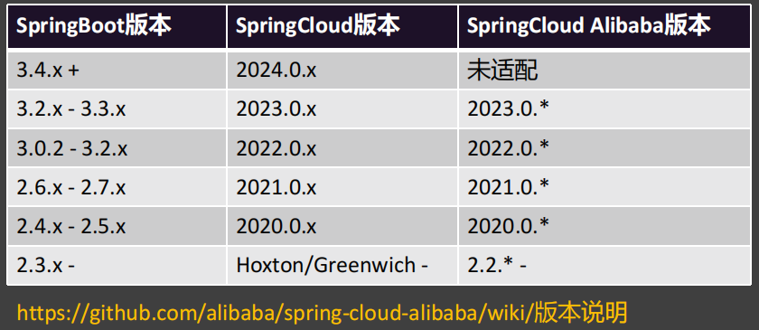
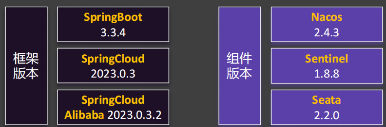
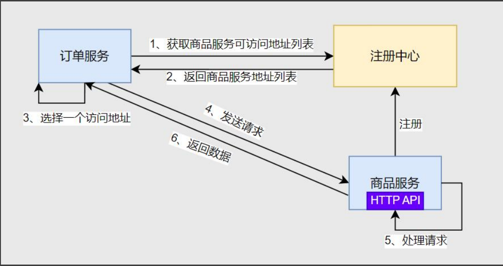
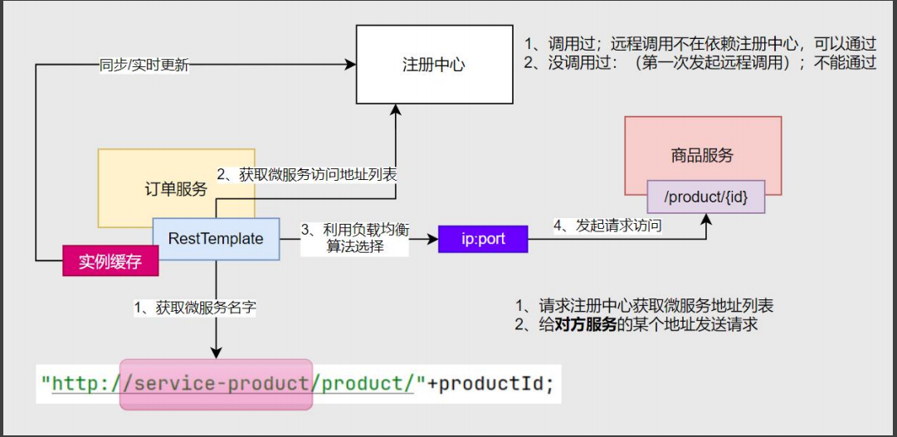

# 2025 spring cloud 微服务学习

项目及系统环境：





# 一、nacos

官方网站：https://nacos.io/docs/latest/quickstart/quick-start/

nacos启动命令：startup.cmd -m standalone

页面访问：localhost:8848/nacos

nacos关闭命令：shutdown.cmd 或者 双击shutdown.cmd运行文件。

## 1.1 服务发现

让nacos能够发现还得在项目中包含nacos的依赖以及配置nacos

pom.xml:

```xml

<dependency>
    <groupId>com.alibaba.cloud</groupId>
    <artifactId>spring-cloud-starter-alibaba-nacos-discovery</artifactId>
</dependency>
```

项目的yml：

```yml
spring:
  cloud:
    nacos:
      discovery:
        server-addr: localhost:8848
```

这时启动项目，在nacos配置页的`服务列表`中就可以看到服务实例了。

想要通过代码获取nacos中心中注册的所有服务实例，可以在`启动类`中添加`@EnableDiscoveryClient`。

| 流程  | 内容        | 核心                     |
|-----|-----------|------------------------|
| 步骤1 | 开启服务发现功能  | @EnableDiscoveryClient |
| 步骤2 | 测试服务发现api | DiscoveryClient        |
| 步骤3 | 测试服务发现api | NacosDiscoveryClient   |

测试代码：

```java
package com.atguigu.test;

import com.alibaba.cloud.nacos.discovery.NacosDiscoveryClient;
import jakarta.annotation.Resource;
import org.junit.jupiter.api.Test;
import org.springframework.beans.factory.annotation.Autowired;
import org.springframework.boot.test.context.SpringBootTest;
import org.springframework.cloud.client.ServiceInstance;
import org.springframework.cloud.client.discovery.DiscoveryClient;


import java.util.List;

@SpringBootTest
public class NacosTest {

    @Resource
    private DiscoveryClient discoveryClient;

    @Resource
    private NacosDiscoveryClient nacosDiscoveryClient;

    @Test
    public void discoveryClientTest() {
        for (String service : discoveryClient.getServices()) {
            System.out.println("service = " + service);

            //获取port
            List<ServiceInstance> instances = discoveryClient.getInstances(service);
            for (ServiceInstance instance : instances) {
                System.out.println("ip = " + instance.getHost() + "port = " + instance.getPort());
            }
        }
    }

    @Test
    public void nacosDiscoveryClientTest() {
        for (String service : nacosDiscoveryClient.getServices()) {
            System.out.println("service = " + service);

            //获取port
            List<ServiceInstance> instances = nacosDiscoveryClient.getInstances(service);
            for (ServiceInstance instant : instances) {
                System.out.println("ip = " + instant.getHost() + " port = " + instant.getPort());
            }
        }
    }
}

```

## 1.2 远程调用

流程：



实现步骤：

| 流程  | 内容         | 核心                                |
|-----|------------|-----------------------------------|
| 步骤1 | 引入负载均衡依赖   | spring-cloud-starter-loadbalancer |
| 步骤2 | 测试负载均衡api  | LoadBalancerClient                |
| 步骤3 | 测试远程调用     | RestTemplate                      |
| 步骤4 | 测试负载均衡远程调用 | @LoadBalancer                     |

代码：
```java


```

**注册中心宕机，远程调用还能成功吗？**



## 1.3 配置中心

步骤：

1、启动nacos

2、引入依赖

```xml
<dependency>
    <groupId>com.alibaba.cloud</groupId>
    <artifactId>spring-cloud-starter-alibaba-nacos-config</artifactId>
</dependency>
```

3、在application.yml中导入在nacos中创建的配置
```yml
spring:
  config:
    import: nacos:service-order.yml
```

4、通过@Value获取到属性值
```java
package com.atguigu.order.property;

import lombok.Data;
import lombok.Getter;
import org.springframework.beans.factory.annotation.Value;
import org.springframework.boot.context.properties.ConfigurationProperties;
import org.springframework.cloud.context.config.annotation.RefreshScope;
import org.springframework.context.annotation.Configuration;

@Configuration
@ConfigurationProperties(prefix = "order")
@Data
//@RefreshScope
public class ServiceOrderProperty {
    //    @Value("${order.timeout}")
    private String timeout;
    //    @Value("${order.day}")
    private String day;

    /**
     * 注意的是@ConfigurationProperties(prefix = "order")与@Value是冲突的
     *  二选一
     *  @ConfigurationProperties(prefix = "order")实现无感刷新
     *  @RefreshScope+@Value实现无感刷新
     */
}

```
**Nacos中的数据集 和 application.properties 有相同的 配置项，哪个生效？**

**先导入优先，外部优先**

# 二、OpenFeign

* 注解驱动：
 * 指定远程地址：@FeignClient
 * 指定请求方式：@GetMapping、@PostMapping、@DeleteMapping...
 * 执行携带数据：@RequestHeader、@RequestBody、@RequestParam
 * 指定结果返回：响应模型

导入依赖：
```xml
<dependency>
    <groupId>org.springframework.cloud</groupId>
    <artifactId>spring-cloud-starter-openfeign</artifactId>
</dependency>
```

**客户端负载均衡与服务端负载均衡区别？**


